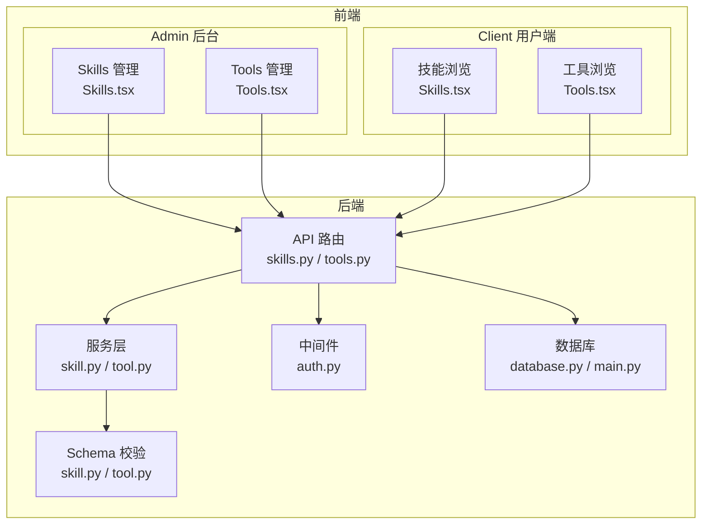
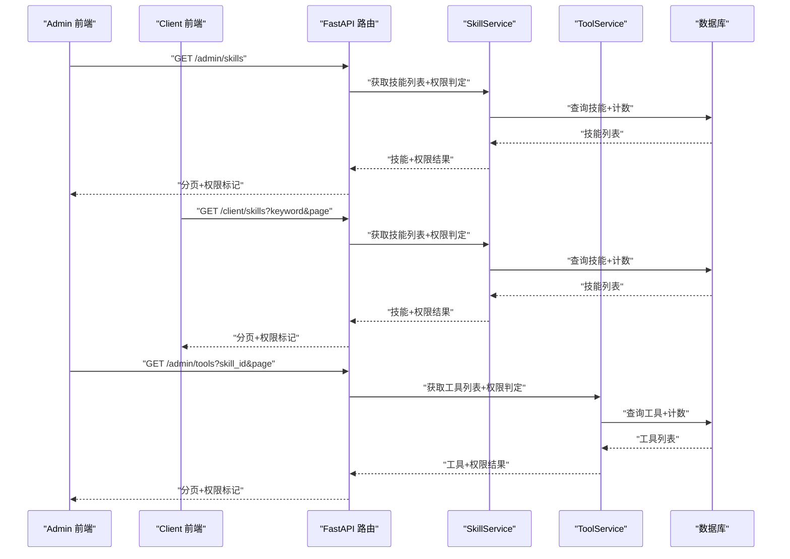
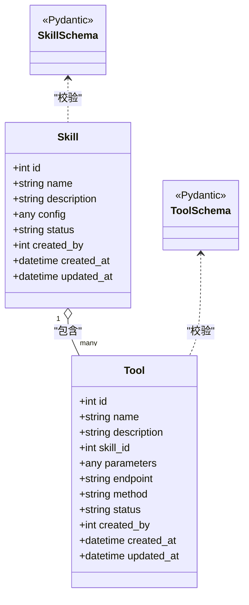
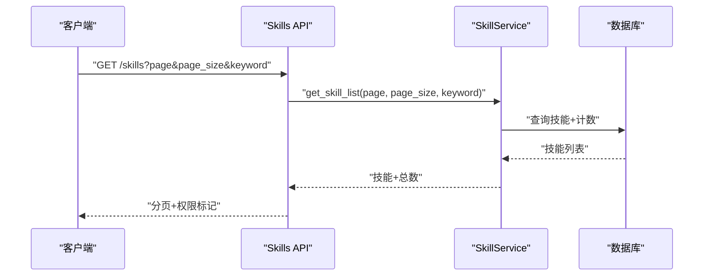
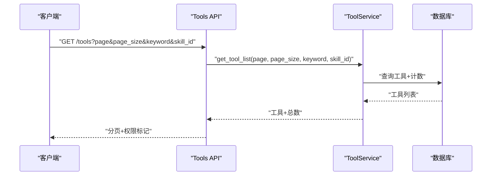
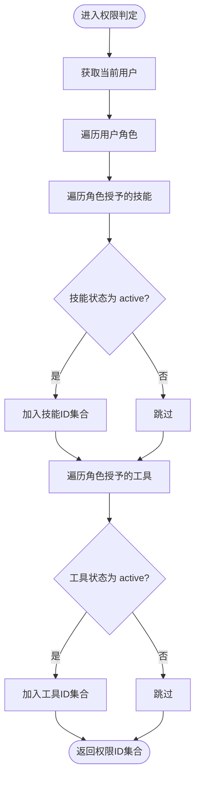
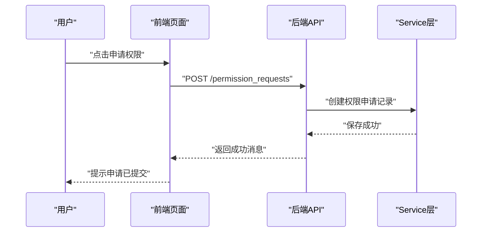
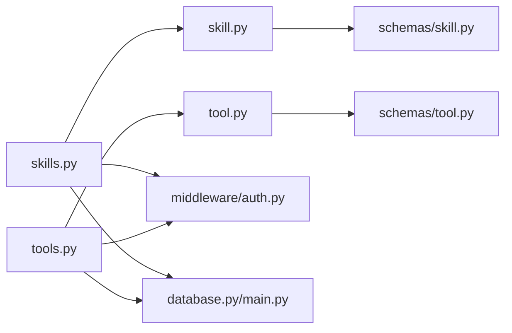

# 技能工具管理

<cite>
**本文引用的文件**
- [backend/app/api/skills.py](file://backend/app/api/skills.py)
- [backend/app/api/tools.py](file://backend/app/api/tools.py)
- [backend/app/schemas/skill.py](file://backend/app/schemas/skill.py)
- [backend/app/schemas/tool.py](file://backend/app/schemas/tool.py)
- [backend/app/services/skill.py](file://backend/app/services/skill.py)
- [backend/app/services/tool.py](file://backend/app/services/tool.py)
- [backend/app/middleware/auth.py](file://backend/app/middleware/auth.py)
- [backend/app/database.py](file://backend/app/database.py)
- [backend/app/main.py](file://backend/app/main.py)
- [frontend/admin/src/pages/Skills.tsx](file://frontend/admin/src/pages/Skills.tsx)
- [frontend/admin/src/pages/Tools.tsx](file://frontend/admin/src/pages/Tools.tsx)
- [frontend/client/src/pages/Skills.tsx](file://frontend/client/src/pages/Skills.tsx)
- [frontend/client/src/pages/Tools.tsx](file://frontend/client/src/pages/Tools.tsx)
</cite>

## 目录
1. [简介](#简介)
2. [项目结构](#项目结构)
3. [核心组件](#核心组件)
4. [架构总览](#架构总览)
5. [详细组件分析](#详细组件分析)
6. [依赖分析](#依赖分析)
7. [性能考虑](#性能考虑)
8. [故障排查指南](#故障排查指南)
9. [结论](#结论)
10. [附录](#附录)

## 简介
本文件面向ToolHub的“技能工具管理”功能，系统性梳理技能与工具的全生命周期管理（创建、编辑、分类、状态管理、版本控制）、工具配置与权限控制、前端界面设计与交互体验，并给出数据模型、API规范、前端组件实现要点及扩展建议（新技能类型、新工具类别、批量与导入导出）。本文所有技术细节均基于仓库现有代码进行归纳总结。

## 项目结构
后端采用FastAPI + SQLAlchemy架构，按职责划分为API路由、Schema校验、Service业务层、Middleware中间件与数据库层；前端分为admin后台与client用户端两个入口，分别提供管理与浏览能力。

图表来源
- [backend/app/api/skills.py:1-86](file://backend/app/api/skills.py#L1-L86)
- [backend/app/api/tools.py:1-69](file://backend/app/api/tools.py#L1-L69)
- [backend/app/services/skill.py:1-92](file://backend/app/services/skill.py#L1-L92)
- [backend/app/services/tool.py:1-104](file://backend/app/services/tool.py#L1-L104)
- [backend/app/middleware/auth.py](file://backend/app/middleware/auth.py)
- [backend/app/database.py](file://backend/app/database.py)
- [backend/app/main.py](file://backend/app/main.py)
- [frontend/admin/src/pages/Skills.tsx:1-77](file://frontend/admin/src/pages/Skills.tsx#L1-L77)
- [frontend/admin/src/pages/Tools.tsx:1-91](file://frontend/admin/src/pages/Tools.tsx#L1-L91)
- [frontend/client/src/pages/Skills.tsx:1-59](file://frontend/client/src/pages/Skills.tsx#L1-L59)
- [frontend/client/src/pages/Tools.tsx:1-70](file://frontend/client/src/pages/Tools.tsx#L1-L70)

章节来源
- [backend/app/api/skills.py:1-86](file://backend/app/api/skills.py#L1-L86)
- [backend/app/api/tools.py:1-69](file://backend/app/api/tools.py#L1-L69)
- [frontend/admin/src/pages/Skills.tsx:1-77](file://frontend/admin/src/pages/Skills.tsx#L1-L77)
- [frontend/admin/src/pages/Tools.tsx:1-91](file://frontend/admin/src/pages/Tools.tsx#L1-L91)
- [frontend/client/src/pages/Skills.tsx:1-59](file://frontend/client/src/pages/Skills.tsx#L1-L59)
- [frontend/client/src/pages/Tools.tsx:1-70](file://frontend/client/src/pages/Tools.tsx#L1-L70)

## 核心组件
- 技能管理
  - 列表查询：支持分页、关键词过滤、返回技能基础信息与权限标记
  - 详情查询：返回技能基本信息与权限标记
  - 工具关联：按技能ID查询其下工具列表与权限标记
- 工具管理
  - 列表查询：支持分页、关键词过滤、按技能筛选、返回工具基础信息与权限标记
  - 详情查询：返回工具基本信息、所属技能名、请求参数与权限标记
- 权限与状态
  - 权限判定：基于用户角色授予的技能/工具集合，仅统计状态为“active”的条目
  - 状态字段：技能与工具均包含状态字段，默认值为“active”，支持停用
- 前端界面
  - Admin端：提供技能与工具的增删改查、分页与弹窗表单
  - Client端：提供技能/工具的浏览、搜索、筛选、权限申请流程

章节来源
- [backend/app/api/skills.py:13-86](file://backend/app/api/skills.py#L13-L86)
- [backend/app/api/tools.py:12-69](file://backend/app/api/tools.py#L12-L69)
- [backend/app/services/skill.py:77-88](file://backend/app/services/skill.py#L77-L88)
- [backend/app/services/tool.py:89-100](file://backend/app/services/tool.py#L89-L100)
- [frontend/admin/src/pages/Skills.tsx:13-39](file://frontend/admin/src/pages/Skills.tsx#L13-L39)
- [frontend/admin/src/pages/Tools.tsx:14-45](file://frontend/admin/src/pages/Tools.tsx#L14-L45)
- [frontend/client/src/pages/Skills.tsx:14-30](file://frontend/client/src/pages/Skills.tsx#L14-L30)
- [frontend/client/src/pages/Tools.tsx:16-37](file://frontend/client/src/pages/Tools.tsx#L16-L37)

## 架构总览
后端采用分层架构：API路由负责参数解析与响应封装，Service层处理业务逻辑与数据库查询，Schema用于输入输出校验，Middleware统一鉴权，数据库通过SQLAlchemy ORM访问。前端通过API适配器调用后端接口，Admin与Client分别渲染不同视图。

图表来源
- [backend/app/api/skills.py:13-86](file://backend/app/api/skills.py#L13-L86)
- [backend/app/api/tools.py:12-69](file://backend/app/api/tools.py#L12-L69)
- [backend/app/services/skill.py:11-31](file://backend/app/services/skill.py#L11-L31)
- [backend/app/services/tool.py:11-34](file://backend/app/services/tool.py#L11-L34)

## 详细组件分析

### 数据模型与Schema
- 技能模型
  - 字段：名称、描述、配置、状态、创建者、创建时间、更新时间
  - 关系：一个技能可包含多个工具
- 工具模型
  - 字段：名称、描述、所属技能ID、请求参数、端点、HTTP方法、状态、创建者、创建时间、更新时间
  - 关系：一个工具属于一个技能
- Schema校验
  - 技能：创建/更新/读取/简要/带权限
  - 工具：创建/更新/读取/简要/带权限

图表来源
- [backend/app/schemas/skill.py:6-31](file://backend/app/schemas/skill.py#L6-L31)
- [backend/app/schemas/tool.py:6-36](file://backend/app/schemas/tool.py#L6-L36)

章节来源
- [backend/app/schemas/skill.py:1-45](file://backend/app/schemas/skill.py#L1-L45)
- [backend/app/schemas/tool.py:1-51](file://backend/app/schemas/tool.py#L1-L51)

### 技能管理API与流程
- 接口清单
  - GET /skills：分页获取技能列表，支持关键词过滤，返回技能基础信息与权限标记
  - GET /skills/{skill_id}：获取技能详情
  - GET /skills/{skill_id}/tools：获取某技能下的工具列表与权限标记
- 处理流程
  - 鉴权：依赖当前用户上下文
  - 查询：Service层执行分页与关键词过滤
  - 权限：根据用户角色计算可访问的技能集合（仅统计状态为“active”的技能）
  - 响应：统一封装为成功响应格式

图表来源
- [backend/app/api/skills.py:13-40](file://backend/app/api/skills.py#L13-L40)
- [backend/app/services/skill.py:11-31](file://backend/app/services/skill.py#L11-L31)

章节来源
- [backend/app/api/skills.py:13-86](file://backend/app/api/skills.py#L13-L86)
- [backend/app/services/skill.py:11-88](file://backend/app/services/skill.py#L11-L88)

### 工具管理API与流程
- 接口清单
  - GET /tools：分页获取工具列表，支持关键词与技能筛选，返回工具基础信息与权限标记
  - GET /tools/{tool_id}：获取工具详情
- 处理流程
  - 鉴权：依赖当前用户上下文
  - 查询：Service层执行分页、关键词与技能ID过滤
  - 权限：根据用户角色计算可访问的工具集合（仅统计状态为“active”的工具）
  - 响应：统一封装为成功响应格式

图表来源
- [backend/app/api/tools.py:12-42](file://backend/app/api/tools.py#L12-L42)
- [backend/app/services/tool.py:11-34](file://backend/app/services/tool.py#L11-L34)

章节来源
- [backend/app/api/tools.py:12-69](file://backend/app/api/tools.py#L12-L69)
- [backend/app/services/tool.py:11-100](file://backend/app/services/tool.py#L11-L100)

### 权限判定与状态管理
- 权限判定
  - 技能权限：用户拥有的角色所授予的技能集合，且技能状态为“active”
  - 工具权限：用户拥有的角色所授予的工具集合，且工具状态为“active”
- 状态管理
  - 技能/工具均包含状态字段，默认“active”，可通过更新接口调整
- 与前端交互
  - Admin端：直接显示状态标签与操作按钮
  - Client端：在技能/工具列表中显示权限状态与“申请权限”入口

图表来源
- [backend/app/services/skill.py:77-88](file://backend/app/services/skill.py#L77-L88)
- [backend/app/services/tool.py:89-100](file://backend/app/services/tool.py#L89-L100)

章节来源
- [backend/app/services/skill.py:77-88](file://backend/app/services/skill.py#L77-L88)
- [backend/app/services/tool.py:89-100](file://backend/app/services/tool.py#L89-L100)

### 前端界面设计与交互
- Admin端
  - Skills管理：分页表格、新增/编辑弹窗、删除确认、状态标签
  - Tools管理：分页表格、新增/编辑弹窗、技能下拉选择、状态标签
- Client端
  - Skills浏览：分页表格、关键词搜索、权限状态、申请权限
  - Tools浏览：分页表格、关键词搜索、按技能筛选、权限状态、申请权限

图表来源
- [frontend/client/src/pages/Skills.tsx:22-30](file://frontend/client/src/pages/Skills.tsx#L22-L30)
- [frontend/client/src/pages/Tools.tsx:29-37](file://frontend/client/src/pages/Tools.tsx#L29-L37)

章节来源
- [frontend/admin/src/pages/Skills.tsx:13-39](file://frontend/admin/src/pages/Skills.tsx#L13-L39)
- [frontend/admin/src/pages/Tools.tsx:14-45](file://frontend/admin/src/pages/Tools.tsx#L14-L45)
- [frontend/client/src/pages/Skills.tsx:14-30](file://frontend/client/src/pages/Skills.tsx#L14-L30)
- [frontend/client/src/pages/Tools.tsx:16-37](file://frontend/client/src/pages/Tools.tsx#L16-L37)

## 依赖分析
- 组件耦合
  - API层仅依赖Service层与中间件，职责清晰
  - Service层依赖数据库会话与Schema，不直接依赖前端
  - 前端通过API适配器与后端解耦
- 外部依赖
  - FastAPI、SQLAlchemy、Pydantic
  - Ant Design React组件库（Admin/Client）

图表来源
- [backend/app/api/skills.py:1-10](file://backend/app/api/skills.py#L1-L10)
- [backend/app/api/tools.py:1-10](file://backend/app/api/tools.py#L1-L10)
- [backend/app/services/skill.py:1-6](file://backend/app/services/skill.py#L1-L6)
- [backend/app/services/tool.py:1-6](file://backend/app/services/tool.py#L1-L6)
- [backend/app/schemas/skill.py:1-4](file://backend/app/schemas/skill.py#L1-L4)
- [backend/app/schemas/tool.py:1-4](file://backend/app/schemas/tool.py#L1-L4)
- [backend/app/middleware/auth.py](file://backend/app/middleware/auth.py)
- [backend/app/database.py](file://backend/app/database.py)
- [backend/app/main.py](file://backend/app/main.py)

章节来源
- [backend/app/api/skills.py:1-10](file://backend/app/api/skills.py#L1-L10)
- [backend/app/api/tools.py:1-10](file://backend/app/api/tools.py#L1-L10)
- [backend/app/services/skill.py:1-6](file://backend/app/services/skill.py#L1-L6)
- [backend/app/services/tool.py:1-6](file://backend/app/services/tool.py#L1-L6)

## 性能考虑
- 分页与过滤
  - 使用偏移量与限制数量进行分页，避免一次性加载大量数据
  - 关键词过滤使用模糊匹配，建议在数据库层面建立索引以提升查询效率
- 权限判定
  - 权限集合通过用户角色一次性计算，避免重复查询
  - 仅统计状态为“active”的条目，减少无效数据参与运算
- 前端渲染
  - 表格列宽与省略策略降低DOM复杂度
  - 搜索与筛选通过参数传递，避免不必要的重渲染

## 故障排查指南
- 常见问题
  - 技能/工具不存在：接口返回空或错误提示，检查ID是否正确
  - 权限不足：列表中权限标记为未授权，需提交权限申请
  - 查询无结果：检查关键词、筛选条件与分页参数
- 定位步骤
  - 查看API响应体中的message字段
  - 检查Service层的异常抛出位置
  - 核对中间件鉴权是否生效

章节来源
- [backend/app/api/skills.py:51-52](file://backend/app/api/skills.py#L51-L52)
- [backend/app/api/tools.py:53-54](file://backend/app/api/tools.py#L53-L54)
- [backend/app/services/skill.py:53-54](file://backend/app/services/skill.py#L53-L54)
- [backend/app/services/tool.py:82-83](file://backend/app/services/tool.py#L82-L83)

## 结论
ToolHub的技能工具管理功能以清晰的分层架构实现，具备完整的技能与工具生命周期管理能力，结合权限判定与前端交互，满足Admin与Client两端的差异化需求。后续可在以下方面持续优化与扩展：引入版本控制机制、完善批量操作与导入导出能力、增强搜索与排序策略、扩展新技能类型与工具类别的配置化方案。

## 附录

### API接口规范（概要）
- 技能
  - GET /skills：分页获取技能列表，支持关键词过滤
  - GET /skills/{skill_id}：获取技能详情
  - GET /skills/{skill_id}/tools：获取技能下的工具列表
- 工具
  - GET /tools：分页获取工具列表，支持关键词与技能筛选
  - GET /tools/{tool_id}：获取工具详情

章节来源
- [backend/app/api/skills.py:13-86](file://backend/app/api/skills.py#L13-L86)
- [backend/app/api/tools.py:12-69](file://backend/app/api/tools.py#L12-L69)

### 扩展建议
- 新技能类型
  - 在Schema与Service层增加对应字段与校验规则
  - 在API层暴露相应接口并更新权限判定逻辑
- 新工具类别
  - 在工具Schema中增加类别字段，配合筛选与展示
- 批量与导入导出
  - 批量：在API层增加批量操作接口，Service层批量处理
  - 导入导出：提供模板与校验，Service层解析与落库