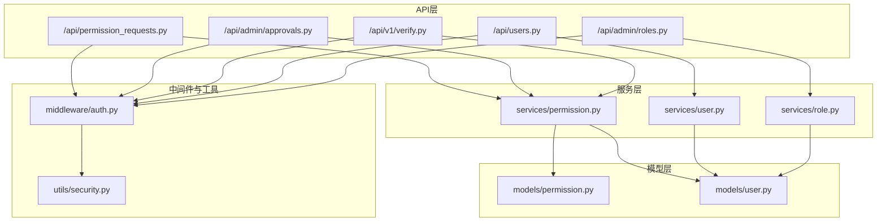
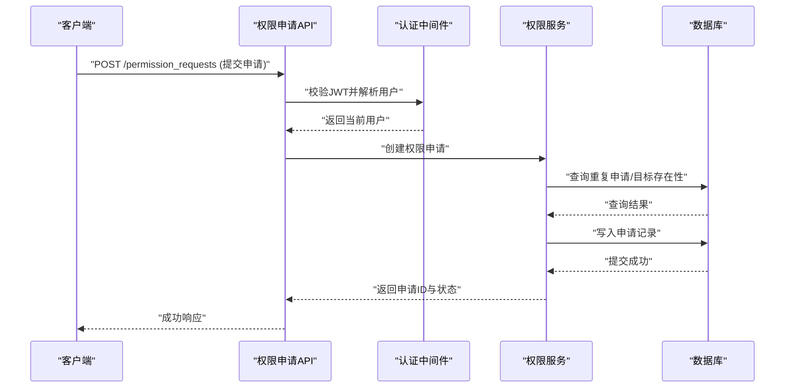
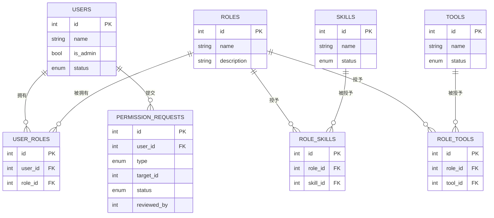
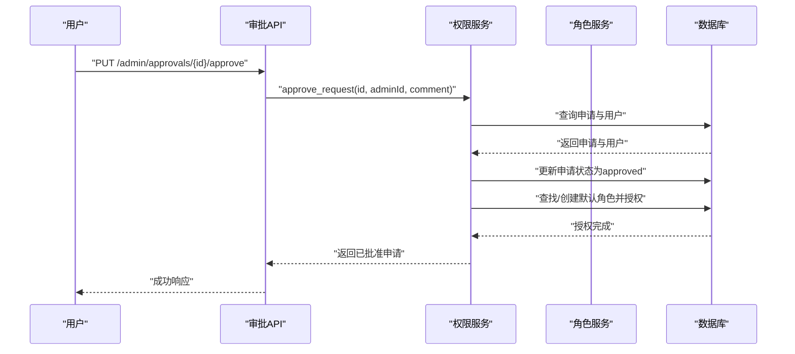
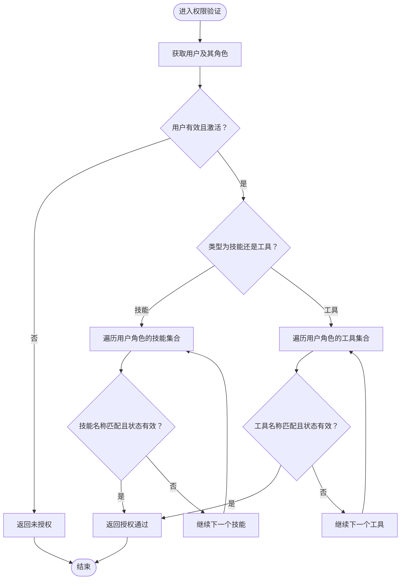
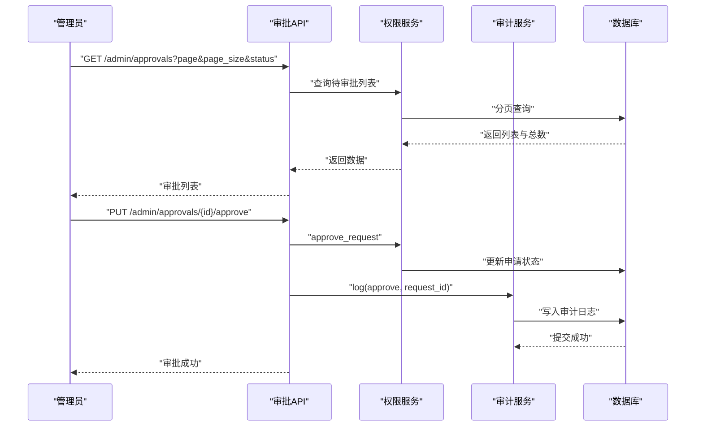
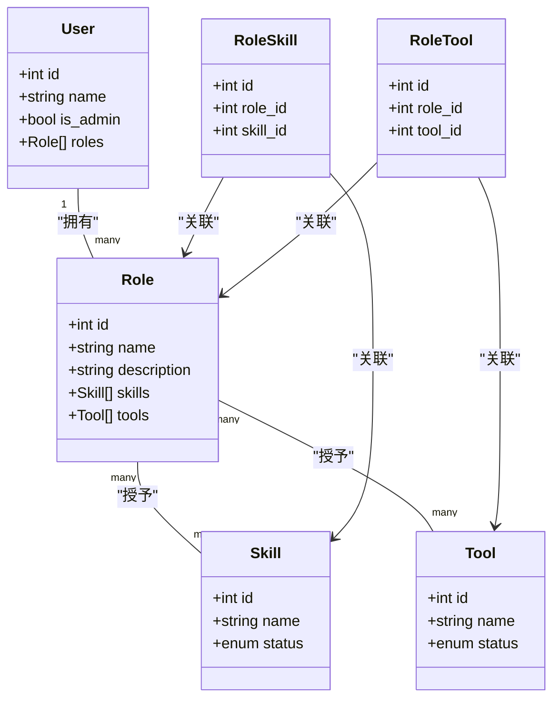
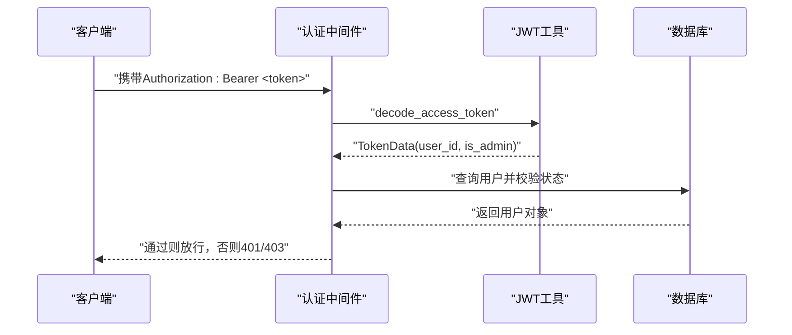
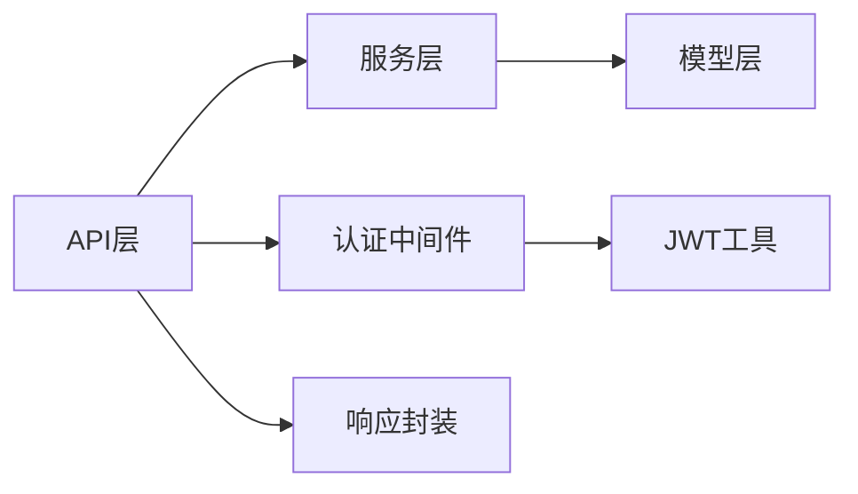

# 权限管理系统

<cite>
**本文档引用的文件**
- [backend/app/models/permission.py](file://backend/app/models/permission.py)
- [backend/app/models/user.py](file://backend/app/models/user.py)
- [backend/app/schemas/permission.py](file://backend/app/schemas/permission.py)
- [backend/app/schemas/role.py](file://backend/app/schemas/role.py)
- [backend/app/services/permission.py](file://backend/app/services/permission.py)
- [backend/app/services/role.py](file://backend/app/services/role.py)
- [backend/app/api/permission_requests.py](file://backend/app/api/permission_requests.py)
- [backend/app/api/admin/approvals.py](file://backend/app/api/admin/approvals.py)
- [backend/app/middleware/auth.py](file://backend/app/middleware/auth.py)
- [backend/app/utils/security.py](file://backend/app/utils/security.py)
- [backend/app/api/v1/verify.py](file://backend/app/api/v1/verify.py)
- [backend/app/services/user.py](file://backend/app/services/user.py)
- [backend/app/api/users.py](file://backend/app/api/users.py)
- [backend/app/api/admin/roles.py](file://backend/app/api/admin/roles.py)
</cite>

## 目录
1. [简介](#简介)
2. [项目结构](#项目结构)
3. [核心组件](#核心组件)
4. [架构总览](#架构总览)
5. [详细组件分析](#详细组件分析)
6. [依赖分析](#依赖分析)
7. [性能考虑](#性能考虑)
8. [故障排除指南](#故障排除指南)
9. [结论](#结论)
10. [附录](#附录)

## 简介
本文件为ToolHub权限管理系统的技术文档，围绕基于RBAC（基于角色的访问控制）的权限架构进行系统化说明。文档涵盖角色定义、权限分配、层级继承等核心概念；深入解释权限申请流程（从用户提交到管理员审批）；介绍权限验证机制（实时权限检查、缓存策略建议、权限过期处理）；说明审批系统（多级审批、批量处理、审批历史追踪）；并提供权限模型的UML图与实际代码示例路径，帮助开发者快速理解与扩展。

## 项目结构
后端采用FastAPI + SQLAlchemy架构，按功能模块分层组织：
- models：数据库实体与关系定义
- schemas：Pydantic数据模型（请求/响应）
- services：业务逻辑封装
- api：REST接口路由
- middleware：认证中间件
- utils：通用工具（如JWT解析）
- 配置与数据库初始化在app目录中统一管理

**图表来源**
- [backend/app/api/permission_requests.py:1-107](file://backend/app/api/permission_requests.py#L1-L107)
- [backend/app/api/admin/approvals.py:1-88](file://backend/app/api/admin/approvals.py#L1-L88)
- [backend/app/api/v1/verify.py:1-41](file://backend/app/api/v1/verify.py#L1-L41)
- [backend/app/api/users.py:1-29](file://backend/app/api/users.py#L1-L29)
- [backend/app/api/admin/roles.py:1-111](file://backend/app/api/admin/roles.py#L1-L111)
- [backend/app/services/permission.py:1-182](file://backend/app/services/permission.py#L1-L182)
- [backend/app/services/user.py:1-86](file://backend/app/services/user.py#L1-L86)
- [backend/app/services/role.py:1-78](file://backend/app/services/role.py#L1-L78)
- [backend/app/models/permission.py:1-28](file://backend/app/models/permission.py#L1-L28)
- [backend/app/models/user.py:1-116](file://backend/app/models/user.py#L1-L116)
- [backend/app/middleware/auth.py:1-45](file://backend/app/middleware/auth.py#L1-L45)
- [backend/app/utils/security.py:1-32](file://backend/app/utils/security.py#L1-L32)

**章节来源**
- [backend/app/api/permission_requests.py:1-107](file://backend/app/api/permission_requests.py#L1-L107)
- [backend/app/api/admin/approvals.py:1-88](file://backend/app/api/admin/approvals.py#L1-L88)
- [backend/app/api/v1/verify.py:1-41](file://backend/app/api/v1/verify.py#L1-L41)
- [backend/app/api/users.py:1-29](file://backend/app/api/users.py#L1-L29)
- [backend/app/api/admin/roles.py:1-111](file://backend/app/api/admin/roles.py#L1-L111)
- [backend/app/services/permission.py:1-182](file://backend/app/services/permission.py#L1-L182)
- [backend/app/services/user.py:1-86](file://backend/app/services/user.py#L1-L86)
- [backend/app/services/role.py:1-78](file://backend/app/services/role.py#L1-L78)
- [backend/app/models/permission.py:1-28](file://backend/app/models/permission.py#L1-L28)
- [backend/app/models/user.py:1-116](file://backend/app/models/user.py#L1-L116)
- [backend/app/middleware/auth.py:1-45](file://backend/app/middleware/auth.py#L1-L45)
- [backend/app/utils/security.py:1-32](file://backend/app/utils/security.py#L1-L32)

## 核心组件
- 用户与角色模型：用户、角色、用户-角色关联、角色-技能关联、角色-工具关联
- 权限申请模型：权限申请记录、状态流转、审批人信息
- 权限服务：申请创建、查询、撤销、审批（通过/拒绝）、权限验证
- 角色服务：角色增删改查、技能/工具授权
- 用户服务：用户权限聚合（基于角色）
- API层：面向用户与管理员的权限申请、审批、验证接口
- 中间件：JWT认证、管理员鉴权

**章节来源**
- [backend/app/models/user.py:23-116](file://backend/app/models/user.py#L23-L116)
- [backend/app/models/permission.py:7-28](file://backend/app/models/permission.py#L7-L28)
- [backend/app/services/permission.py:9-182](file://backend/app/services/permission.py#L9-L182)
- [backend/app/services/role.py:7-78](file://backend/app/services/role.py#L7-L78)
- [backend/app/services/user.py:8-86](file://backend/app/services/user.py#L8-L86)
- [backend/app/api/permission_requests.py:1-107](file://backend/app/api/permission_requests.py#L1-L107)
- [backend/app/api/admin/approvals.py:1-88](file://backend/app/api/admin/approvals.py#L1-L88)
- [backend/app/api/v1/verify.py:1-41](file://backend/app/api/v1/verify.py#L1-L41)
- [backend/app/middleware/auth.py:12-45](file://backend/app/middleware/auth.py#L12-L45)

## 架构总览
系统采用分层架构，API层负责请求接入与响应封装，服务层承载业务逻辑，模型层映射数据库表结构。认证中间件确保接口访问安全，JWT工具负责令牌生成与解析。

**图表来源**
- [backend/app/api/permission_requests.py:13-25](file://backend/app/api/permission_requests.py#L13-L25)
- [backend/app/middleware/auth.py:12-33](file://backend/app/middleware/auth.py#L12-L33)
- [backend/app/services/permission.py:12-44](file://backend/app/services/permission.py#L12-L44)

**章节来源**
- [backend/app/api/permission_requests.py:1-107](file://backend/app/api/permission_requests.py#L1-L107)
- [backend/app/middleware/auth.py:1-45](file://backend/app/middleware/auth.py#L1-L45)
- [backend/app/services/permission.py:1-182](file://backend/app/services/permission.py#L1-L182)

## 详细组件分析

### RBAC权限模型与数据流
- 角色-用户：多对多（用户可拥有多个角色）
- 角色-技能：多对多（角色授予技能访问）
- 角色-工具：多对多（角色授予工具访问）
- 权限申请：用户向系统提交“技能/工具”权限申请，管理员审批后为用户授予相应角色或直接关联

**图表来源**
- [backend/app/models/user.py:23-116](file://backend/app/models/user.py#L23-L116)
- [backend/app/models/permission.py:7-28](file://backend/app/models/permission.py#L7-L28)

**章节来源**
- [backend/app/models/user.py:1-116](file://backend/app/models/user.py#L1-L116)
- [backend/app/models/permission.py:1-28](file://backend/app/models/permission.py#L1-L28)

### 权限申请流程（用户到审批）
- 用户提交申请：限制同一资源的重复“待审批”申请；校验目标存在性
- 管理员审批：支持通过/拒绝，记录审批人、评论与时间
- 权限生效：审批通过后为用户授予对应权限（优先使用已有角色，否则自动创建默认角色）

**图表来源**
- [backend/app/api/admin/approvals.py:58-72](file://backend/app/api/admin/approvals.py#L58-L72)
- [backend/app/services/permission.py:86-128](file://backend/app/services/permission.py#L86-L128)

**章节来源**
- [backend/app/api/admin/approvals.py:1-88](file://backend/app/api/admin/approvals.py#L1-L88)
- [backend/app/services/permission.py:1-182](file://backend/app/services/permission.py#L1-L182)

### 权限验证机制
- 实时权限检查：根据用户角色集合，匹配目标技能或工具名称与状态
- 缓存策略建议：对热点用户权限结果进行短期缓存（如Redis），键名包含用户ID与时间戳，定期刷新
- 权限过期处理：缓存设置TTL，结合审计日志追踪权限变更事件，触发缓存失效

**图表来源**
- [backend/app/services/permission.py:147-164](file://backend/app/services/permission.py#L147-L164)

**章节来源**
- [backend/app/services/permission.py:147-164](file://backend/app/services/permission.py#L147-L164)

### 审批系统实现
- 多级审批：当前实现为管理员直接审批，可扩展为审批策略配置（如按部门/金额/风险等级）
- 批量处理：支持分页查询待审批列表，按状态过滤
- 审批历史追踪：审批操作记录在权限申请记录中，并通过审计服务写入审计日志

**图表来源**
- [backend/app/api/admin/approvals.py:14-55](file://backend/app/api/admin/approvals.py#L14-L55)
- [backend/app/services/permission.py:86-128](file://backend/app/services/permission.py#L86-L128)

**章节来源**
- [backend/app/api/admin/approvals.py:1-88](file://backend/app/api/admin/approvals.py#L1-L88)
- [backend/app/services/permission.py:71-144](file://backend/app/services/permission.py#L71-L144)

### 角色与权限分配
- 角色管理：创建、更新、删除角色；查看角色详情与绑定的技能/工具数量
- 权限分配：为角色批量分配技能或工具ID，内部先清空旧授权再写入新授权
- 用户权限聚合：基于用户角色集合，汇总去重后的技能与工具名称列表

**图表来源**
- [backend/app/models/user.py:42-116](file://backend/app/models/user.py#L42-L116)

**章节来源**
- [backend/app/api/admin/roles.py:1-111](file://backend/app/api/admin/roles.py#L1-L111)
- [backend/app/services/role.py:1-78](file://backend/app/services/role.py#L1-L78)
- [backend/app/services/user.py:66-82](file://backend/app/services/user.py#L66-L82)

### 认证与安全边界
- JWT认证：中间件从请求头提取Bearer Token，解码获取用户ID与管理员标识
- 用户状态校验：仅激活用户可访问，防止冻结账户越权
- 管理员权限：特定管理接口需管理员身份，否则拒绝访问

**图表来源**
- [backend/app/middleware/auth.py:12-33](file://backend/app/middleware/auth.py#L12-L33)
- [backend/app/utils/security.py:20-31](file://backend/app/utils/security.py#L20-L31)

**章节来源**
- [backend/app/middleware/auth.py:1-45](file://backend/app/middleware/auth.py#L1-L45)
- [backend/app/utils/security.py:1-32](file://backend/app/utils/security.py#L1-L32)

## 依赖分析
- 组件耦合：API层依赖服务层；服务层依赖模型层；认证中间件贯穿所有需要鉴权的接口
- 外部依赖：FastAPI（路由与依赖注入）、SQLAlchemy（ORM）、Pydantic（数据校验）、JWALib（JWT）
- 循环依赖：当前结构未发现循环导入，模型与服务分层清晰

**图表来源**
- [backend/app/api/permission_requests.py:1-10](file://backend/app/api/permission_requests.py#L1-L10)
- [backend/app/services/permission.py:1-6](file://backend/app/services/permission.py#L1-L6)
- [backend/app/models/permission.py:1-4](file://backend/app/models/permission.py#L1-L4)
- [backend/app/middleware/auth.py:1-7](file://backend/app/middleware/auth.py#L1-L7)
- [backend/app/utils/security.py:1-5](file://backend/app/utils/security.py#L1-L5)

**章节来源**
- [backend/app/api/permission_requests.py:1-10](file://backend/app/api/permission_requests.py#L1-L10)
- [backend/app/services/permission.py:1-6](file://backend/app/services/permission.py#L1-L6)
- [backend/app/models/permission.py:1-4](file://backend/app/models/permission.py#L1-L4)
- [backend/app/middleware/auth.py:1-7](file://backend/app/middleware/auth.py#L1-L7)
- [backend/app/utils/security.py:1-5](file://backend/app/utils/security.py#L1-L5)

## 性能考虑
- 查询优化：权限验证与审批列表查询应使用索引字段（用户ID、状态、创建时间），避免全表扫描
- 分页策略：审批列表与申请历史默认分页，避免一次性加载大量数据
- 缓存策略：对高频权限查询结果进行短期缓存，结合审计事件触发失效
- 并发控制：审批操作使用数据库事务保证一致性，必要时添加行级锁

## 故障排除指南
- 无效或过期令牌：认证中间件会抛出401错误，检查前端是否正确携带Authorization头与令牌有效期
- 用户状态异常：非激活用户会被拒绝访问，检查用户状态字段
- 权限不足：非管理员访问管理接口将被拒绝，确认用户is_admin标志
- 重复申请：同一资源的“待审批”申请不可重复提交，需等待处理后再试
- 审批状态异常：仅“待审批”状态可被批准或拒绝，检查申请状态

**章节来源**
- [backend/app/middleware/auth.py:18-32](file://backend/app/middleware/auth.py#L18-L32)
- [backend/app/services/permission.py:16-23](file://backend/app/services/permission.py#L16-L23)
- [backend/app/services/permission.py:86-91](file://backend/app/services/permission.py#L86-L91)

## 结论
ToolHub权限管理系统以RBAC为核心，结合申请-审批-验证的闭环流程，实现了灵活可控的权限治理能力。通过清晰的分层架构与完善的接口设计，系统既满足日常权限管理需求，也为后续扩展（如多级审批、权限缓存、审计追踪）提供了良好基础。

## 附录
- 权限验证对外API：用于其他系统或Agent调用，返回允许/拒绝及原因
- 用户权限查询：返回用户当前可使用的技能与工具名称列表

**章节来源**
- [backend/app/api/v1/verify.py:13-41](file://backend/app/api/v1/verify.py#L13-L41)
- [backend/app/api/users.py:12-29](file://backend/app/api/users.py#L12-L29)