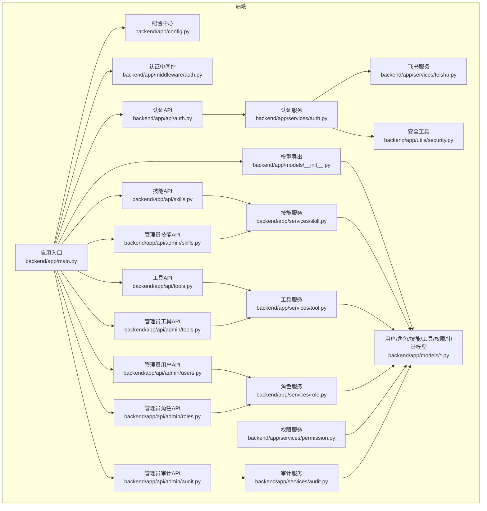
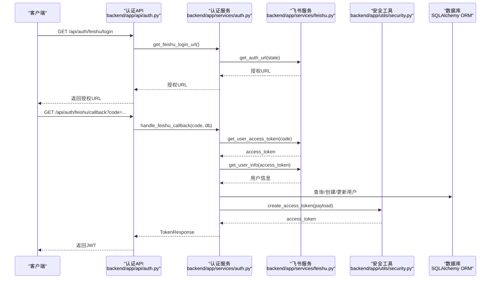
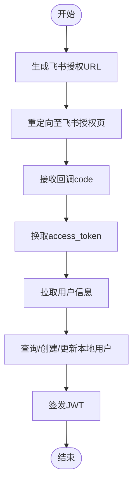
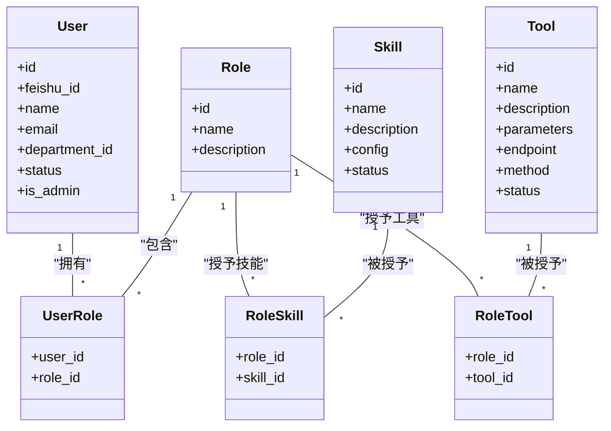
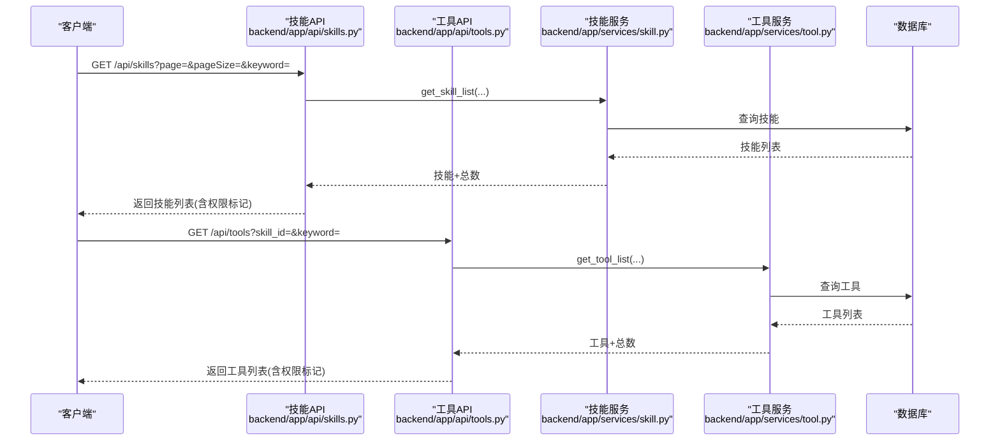
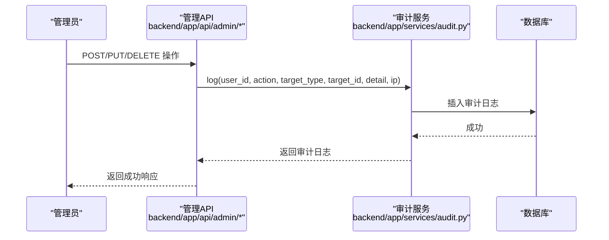
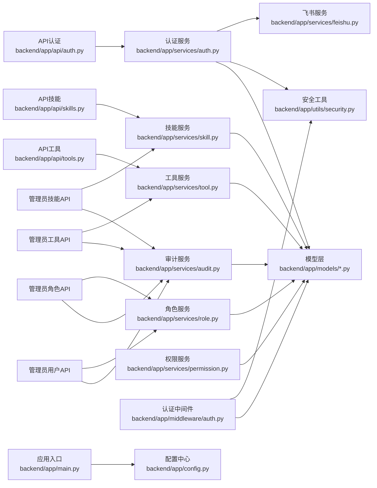

# 核心功能模块

<cite>
**本文引用的文件**
- [backend/app/main.py](file://backend/app/main.py)
- [backend/app/config.py](file://backend/app/config.py)
- [backend/app/middleware/auth.py](file://backend/app/middleware/auth.py)
- [backend/app/api/auth.py](file://backend/app/api/auth.py)
- [backend/app/services/auth.py](file://backend/app/services/auth.py)
- [backend/app/services/feishu.py](file://backend/app/services/feishu.py)
- [backend/app/utils/security.py](file://backend/app/utils/security.py)
- [backend/app/models/__init__.py](file://backend/app/models/__init__.py)
- [backend/app/models/user.py](file://backend/app/models/user.py)
- [backend/app/models/permission.py](file://backend/app/models/permission.py)
- [backend/app/models/audit.py](file://backend/app/models/audit.py)
- [backend/app/api/skills.py](file://backend/app/api/skills.py)
- [backend/app/api/tools.py](file://backend/app/api/tools.py)
- [backend/app/api/admin/skills.py](file://backend/app/api/admin/skills.py)
- [backend/app/api/admin/tools.py](file://backend/app/api/admin/tools.py)
- [backend/app/api/admin/users.py](file://backend/app/api/admin/users.py)
- [backend/app/api/admin/roles.py](file://backend/app/api/admin/roles.py)
- [backend/app/api/admin/audit.py](file://backend/app/api/admin/audit.py)
- [backend/app/services/skill.py](file://backend/app/services/skill.py)
- [backend/app/services/tool.py](file://backend/app/services/tool.py)
- [backend/app/services/role.py](file://backend/app/services/role.py)
- [backend/app/services/permission.py](file://backend/app/services/permission.py)
- [backend/app/services/audit.py](file://backend/app/services/audit.py)
</cite>

## 目录
1. [引言](#引言)
2. [项目结构](#项目结构)
3. [核心组件](#核心组件)
4. [架构总览](#架构总览)
5. [详细组件分析](#详细组件分析)
6. [依赖分析](#依赖分析)
7. [性能考虑](#性能考虑)
8. [故障排查指南](#故障排查指南)
9. [结论](#结论)
10. [附录](#附录)

## 引言
本文件面向ToolHub核心功能模块，系统化阐述用户认证、权限管理、技能工具管理、审计日志等关键子系统的设计原理、实现方式与业务流程。重点说明：
- 用户认证系统如何通过飞书OAuth2实现单点登录（SSO），以及JWT令牌在中间件中的校验机制；
- 权限管理系统如何基于RBAC模型实现精细化权限控制，包括角色、技能、工具三者之间的关联与权限验证；
- 技能工具管理的功能实现，覆盖技能与工具的创建、编辑、状态管理、参数定义与访问控制；
- 审计日志系统如何记录操作行为、追踪权限变更，满足合规性要求。

## 项目结构
后端采用FastAPI框架，按“路由(API) → 中间件 → 服务(Service) → 模型(Model)”分层组织；前端分为管理员后台与普通客户端两套界面。应用入口集中于主程序，统一注册所有路由，并启用CORS跨域支持。

图表来源
- [backend/app/main.py:1-61](file://backend/app/main.py#L1-L61)
- [backend/app/config.py:1-36](file://backend/app/config.py#L1-L36)
- [backend/app/middleware/auth.py:1-45](file://backend/app/middleware/auth.py#L1-L45)
- [backend/app/api/auth.py:1-48](file://backend/app/api/auth.py#L1-L48)
- [backend/app/services/auth.py:1-80](file://backend/app/services/auth.py#L1-L80)
- [backend/app/services/feishu.py](file://backend/app/services/feishu.py)
- [backend/app/utils/security.py](file://backend/app/utils/security.py)
- [backend/app/models/__init__.py:1-17](file://backend/app/models/__init__.py#L1-L17)
- [backend/app/models/user.py:1-116](file://backend/app/models/user.py#L1-L116)
- [backend/app/models/permission.py:1-28](file://backend/app/models/permission.py#L1-L28)
- [backend/app/models/audit.py:1-17](file://backend/app/models/audit.py#L1-L17)
- [backend/app/api/skills.py:1-86](file://backend/app/api/skills.py#L1-L86)
- [backend/app/api/tools.py:1-69](file://backend/app/api/tools.py#L1-L69)
- [backend/app/api/admin/skills.py:1-85](file://backend/app/api/admin/skills.py#L1-L85)
- [backend/app/api/admin/tools.py:1-89](file://backend/app/api/admin/tools.py#L1-L89)
- [backend/app/api/admin/users.py:1-97](file://backend/app/api/admin/users.py#L1-L97)
- [backend/app/api/admin/roles.py:1-111](file://backend/app/api/admin/roles.py#L1-L111)
- [backend/app/api/admin/audit.py](file://backend/app/api/admin/audit.py)
- [backend/app/services/skill.py](file://backend/app/services/skill.py)
- [backend/app/services/tool.py](file://backend/app/services/tool.py)
- [backend/app/services/role.py:1-78](file://backend/app/services/role.py#L1-L78)
- [backend/app/services/permission.py:1-182](file://backend/app/services/permission.py#L1-L182)
- [backend/app/services/audit.py:1-54](file://backend/app/services/audit.py#L1-L54)

章节来源
- [backend/app/main.py:1-61](file://backend/app/main.py#L1-L61)
- [backend/app/config.py:1-36](file://backend/app/config.py#L1-L36)

## 核心组件
- 应用入口与路由注册：集中注册认证、用户、技能、工具、权限请求、管理员相关接口，并暴露健康检查端点。
- 配置中心：集中管理数据库连接、JWT密钥算法、飞书OAuth2参数、CORS白名单等。
- 认证与授权：飞书OAuth2登录、JWT令牌签发与校验、基于用户状态的访问控制、管理员权限强制校验。
- RBAC权限体系：用户-角色-技能-工具多对多关联，权限验证基于用户角色继承的技能/工具集合。
- 技能工具管理：技能与工具的增删改查、状态管理、参数定义、权限映射。
- 审计日志：统一记录用户、角色、技能、工具、权限申请等操作，支持查询过滤。

章节来源
- [backend/app/main.py:9-48](file://backend/app/main.py#L9-L48)
- [backend/app/config.py:5-32](file://backend/app/config.py#L5-L32)
- [backend/app/middleware/auth.py:12-44](file://backend/app/middleware/auth.py#L12-L44)
- [backend/app/models/user.py:23-116](file://backend/app/models/user.py#L23-L116)
- [backend/app/models/permission.py:7-28](file://backend/app/models/permission.py#L7-L28)
- [backend/app/models/audit.py:6-17](file://backend/app/models/audit.py#L6-L17)

## 架构总览
下图展示从客户端到服务层的关键交互路径，包括飞书OAuth2登录流程、JWT鉴权流程、RBAC权限验证与审计日志记录。

图表来源
- [backend/app/api/auth.py:13-33](file://backend/app/api/auth.py#L13-L33)
- [backend/app/services/auth.py:13-76](file://backend/app/services/auth.py#L13-L76)
- [backend/app/services/feishu.py](file://backend/app/services/feishu.py)
- [backend/app/utils/security.py](file://backend/app/utils/security.py)

## 详细组件分析

### 用户认证系统（飞书OAuth2 + JWT）
- 设计原理
  - 借助飞书开放平台进行第三方登录，获取用户授权码后换取用户访问令牌与用户信息；
  - 将飞书用户ID映射为本地用户，同步部门信息，生成JWT用于后续会话；
  - 中间件统一校验JWT有效性与用户状态，拒绝无效或非活跃账户访问。
- 实现要点
  - 配置项：飞书App ID/Secret、回调地址、基础域名；
  - 登录流程：生成授权URL → 回调换取令牌 → 拉取用户信息 → 同步本地用户 → 签发JWT；
  - 中间件：解码JWT → 查询用户 → 校验状态 → 注入当前用户对象。
- 最佳实践
  - 生产环境务必设置安全的JWT密钥与过期时间；
  - 回调地址需与飞书后台配置一致；
  - 建议在网关层开启HTTPS与CORS白名单。

图表来源
- [backend/app/services/auth.py:13-76](file://backend/app/services/auth.py#L13-L76)
- [backend/app/middleware/auth.py:12-33](file://backend/app/middleware/auth.py#L12-L33)

章节来源
- [backend/app/config.py:19-24](file://backend/app/config.py#L19-L24)
- [backend/app/api/auth.py:13-47](file://backend/app/api/auth.py#L13-L47)
- [backend/app/services/auth.py:13-76](file://backend/app/services/auth.py#L13-L76)
- [backend/app/middleware/auth.py:12-33](file://backend/app/middleware/auth.py#L12-L33)

### 权限管理系统（RBAC模型）
- 设计原理
  - 用户-角色-技能-工具四者构成RBAC模型：用户通过角色间接获得技能与工具权限；
  - 权限验证时遍历用户角色所拥有的技能/工具集合，匹配目标名称与状态；
  - 权限申请与审批：用户提交申请 → 管理员审批 → 自动将权限映射到用户角色。
- 数据模型
  - 用户表含状态字段，仅激活用户可访问；
  - 角色-技能、角色-工具为多对多关联表；
  - 权限申请表记录申请类型、目标、状态、审批人与时间。
- 关键流程
  - 权限验证：按用户角色逐级匹配技能/工具名称与状态；
  - 审批通过：若用户无对应角色或已拥有目标，则自动分配到其首个角色或创建默认角色。
- 最佳实践
  - 为每个用户至少保留一个默认角色，避免权限缺失；
  - 审批流程应明确责任人与时限，确保最小权限原则。

图表来源
- [backend/app/models/user.py:23-116](file://backend/app/models/user.py#L23-L116)

章节来源
- [backend/app/models/user.py:23-116](file://backend/app/models/user.py#L23-L116)
- [backend/app/models/permission.py:7-28](file://backend/app/models/permission.py#L7-L28)
- [backend/app/services/permission.py:86-164](file://backend/app/services/permission.py#L86-L164)

### 技能工具管理
- 功能范围
  - 技能：名称、描述、配置、状态、创建人、创建时间；
  - 工具：名称、描述、参数定义、端点、方法、状态、所属技能、创建人。
- 管理能力
  - 列表/详情/搜索/分页；
  - 状态管理（启用/停用）；
  - 参数定义与访问控制（通过RBAC权限决定是否显示/使用）。
- 业务流程
  - 技能维度：列出技能及其工具数量，标注当前用户是否具备权限；
  - 工具维度：按技能筛选工具，标注当前用户是否具备权限；
  - 管理员维度：支持创建/更新/删除技能与工具，并记录审计日志。

图表来源
- [backend/app/api/skills.py:13-86](file://backend/app/api/skills.py#L13-L86)
- [backend/app/api/tools.py:12-69](file://backend/app/api/tools.py#L12-L69)
- [backend/app/services/skill.py](file://backend/app/services/skill.py)
- [backend/app/services/tool.py](file://backend/app/services/tool.py)

章节来源
- [backend/app/api/skills.py:13-86](file://backend/app/api/skills.py#L13-L86)
- [backend/app/api/tools.py:12-69](file://backend/app/api/tools.py#L12-L69)
- [backend/app/api/admin/skills.py:14-85](file://backend/app/api/admin/skills.py#L14-L85)
- [backend/app/api/admin/tools.py:14-89](file://backend/app/api/admin/tools.py#L14-L89)
- [backend/app/models/user.py:65-98](file://backend/app/models/user.py#L65-L98)

### 审计日志系统
- 设计原理
  - 统一的审计日志模型，记录操作人、动作类型、目标类型与ID、详情与IP；
  - 管理端关键操作均触发审计记录，便于合规追溯。
- 实现要点
  - 日志服务提供写入与分页查询接口；
  - 管理API在成功操作后记录相应审计条目。
- 合规建议
  - 保留足够长的日志周期；
  - 对敏感操作（删除、批量变更）增加额外告警。

图表来源
- [backend/app/api/admin/roles.py:44-75](file://backend/app/api/admin/roles.py#L44-L75)
- [backend/app/api/admin/skills.py:50-81](file://backend/app/api/admin/skills.py#L50-L81)
- [backend/app/api/admin/tools.py:54-85](file://backend/app/api/admin/tools.py#L54-L85)
- [backend/app/api/admin/users.py:77-94](file://backend/app/api/admin/users.py#L77-L94)
- [backend/app/services/audit.py:9-30](file://backend/app/services/audit.py#L9-L30)

章节来源
- [backend/app/models/audit.py:6-17](file://backend/app/models/audit.py#L6-L17)
- [backend/app/services/audit.py:9-50](file://backend/app/services/audit.py#L9-L50)
- [backend/app/api/admin/audit.py](file://backend/app/api/admin/audit.py)

## 依赖分析
- 路由到服务：API层仅负责参数解析与响应封装，具体业务逻辑委托给服务层；
- 服务到模型：服务层通过SQLAlchemy ORM访问数据库，读写实体与关联表；
- 中间件到服务：认证中间件依赖安全工具解码JWT并查询用户状态；
- 配置到服务：配置中心集中提供数据库、JWT、飞书等参数，供各模块使用。

图表来源
- [backend/app/main.py:25-42](file://backend/app/main.py#L25-L42)
- [backend/app/api/auth.py:1-48](file://backend/app/api/auth.py#L1-L48)
- [backend/app/services/auth.py:1-80](file://backend/app/services/auth.py#L1-L80)
- [backend/app/services/feishu.py](file://backend/app/services/feishu.py)
- [backend/app/utils/security.py](file://backend/app/utils/security.py)
- [backend/app/api/skills.py:1-86](file://backend/app/api/skills.py#L1-L86)
- [backend/app/api/tools.py:1-69](file://backend/app/api/tools.py#L1-L69)
- [backend/app/api/admin/skills.py:1-85](file://backend/app/api/admin/skills.py#L1-L85)
- [backend/app/api/admin/tools.py:1-89](file://backend/app/api/admin/tools.py#L1-L89)
- [backend/app/api/admin/users.py:1-97](file://backend/app/api/admin/users.py#L1-L97)
- [backend/app/api/admin/roles.py:1-111](file://backend/app/api/admin/roles.py#L1-L111)
- [backend/app/services/permission.py:1-182](file://backend/app/services/permission.py#L1-L182)
- [backend/app/services/skill.py](file://backend/app/services/skill.py)
- [backend/app/services/tool.py](file://backend/app/services/tool.py)
- [backend/app/services/role.py:1-78](file://backend/app/services/role.py#L1-L78)
- [backend/app/services/audit.py:1-54](file://backend/app/services/audit.py#L1-L54)
- [backend/app/middleware/auth.py:1-45](file://backend/app/middleware/auth.py#L1-L45)
- [backend/app/config.py:1-36](file://backend/app/config.py#L1-L36)

章节来源
- [backend/app/main.py:25-42](file://backend/app/main.py#L25-L42)
- [backend/app/middleware/auth.py:12-33](file://backend/app/middleware/auth.py#L12-L33)

## 性能考虑
- 分页与过滤：技能/工具/用户/审计日志均支持分页与条件过滤，避免一次性加载大量数据；
- 缓存策略：可在工具调用前增加权限缓存（基于用户角色与目标名称），减少重复查询；
- 并发控制：权限验证与审计写入均为轻量操作，建议结合连接池与异步I/O优化吞吐；
- 数据库索引：对常用查询字段（如用户状态、技能/工具状态、名称关键字）建立索引以提升查询效率。

## 故障排查指南
- 飞书OAuth2失败
  - 检查回调地址与飞书应用配置是否一致；
  - 确认网络可达性与基础域名配置；
  - 查看服务端错误响应与日志。
- JWT无效或过期
  - 确认前端正确携带Authorization头；
  - 检查JWT密钥与算法配置；
  - 核对用户状态为激活。
- 权限不足
  - 确认用户是否已被分配角色；
  - 检查目标技能/工具状态是否为启用；
  - 审核审批流程是否已完成。
- 审计日志缺失
  - 确认管理端操作是否触发审计记录；
  - 检查数据库连接与事务提交。

章节来源
- [backend/app/api/auth.py:20-27](file://backend/app/api/auth.py#L20-L27)
- [backend/app/middleware/auth.py:16-33](file://backend/app/middleware/auth.py#L16-L33)
- [backend/app/services/permission.py:147-164](file://backend/app/services/permission.py#L147-L164)
- [backend/app/services/audit.py:9-30](file://backend/app/services/audit.py#L9-L30)

## 结论
ToolHub通过清晰的分层架构与RBAC模型实现了从认证到权限控制再到内容管理与审计的完整闭环。飞书OAuth2提供了便捷的单点登录体验，JWT保障了会话安全；RBAC使权限分配灵活可控；审计日志满足合规与追踪需求。建议在生产环境中强化密钥管理、完善审批流程与监控告警，并持续优化查询性能与缓存策略。

## 附录
- 使用示例（路径指引）
  - 获取飞书授权URL：GET /api/auth/feishu/login
  - 处理回调并登录：GET /api/auth/feishu/callback?code=...
  - 获取当前用户信息：GET /api/auth/me
  - 获取技能列表（含权限标记）：GET /api/skills
  - 获取工具列表（含权限标记）：GET /api/tools
  - 管理员创建技能：POST /api/admin/skills
  - 管理员创建工具：POST /api/admin/tools
  - 管理员分配角色权限：PUT /api/admin/roles/{role_id}/skills 或 /{role_id}/tools
  - 管理员查看审计日志：GET /api/admin/audit-logs

章节来源
- [backend/app/api/auth.py:13-47](file://backend/app/api/auth.py#L13-L47)
- [backend/app/api/skills.py:13-86](file://backend/app/api/skills.py#L13-L86)
- [backend/app/api/tools.py:12-69](file://backend/app/api/tools.py#L12-L69)
- [backend/app/api/admin/skills.py:41-85](file://backend/app/api/admin/skills.py#L41-L85)
- [backend/app/api/admin/tools.py:45-89](file://backend/app/api/admin/tools.py#L45-L89)
- [backend/app/api/admin/roles.py:81-111](file://backend/app/api/admin/roles.py#L81-L111)
- [backend/app/api/admin/audit.py](file://backend/app/api/admin/audit.py)