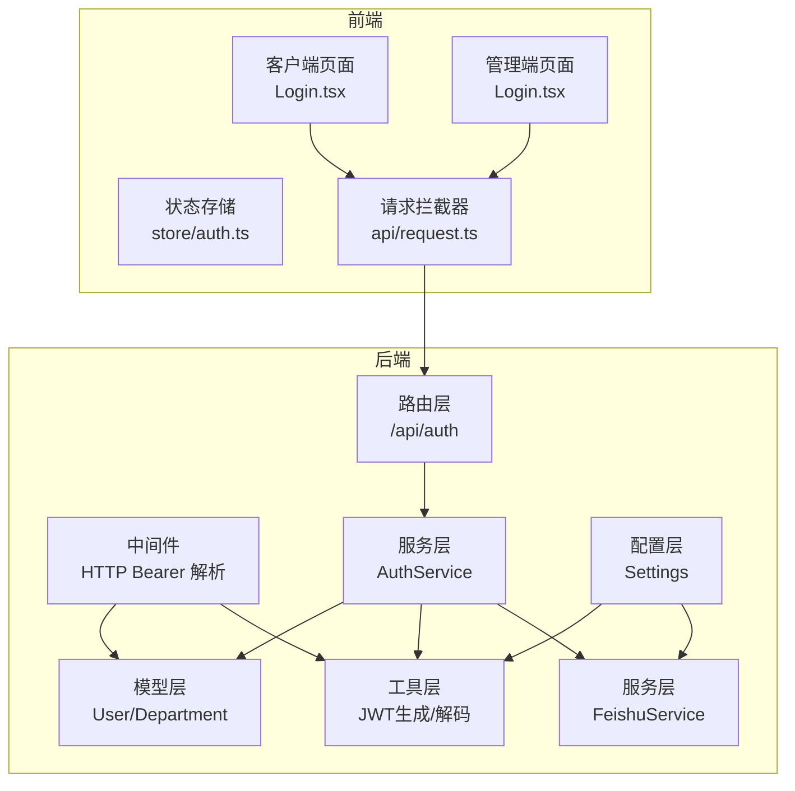
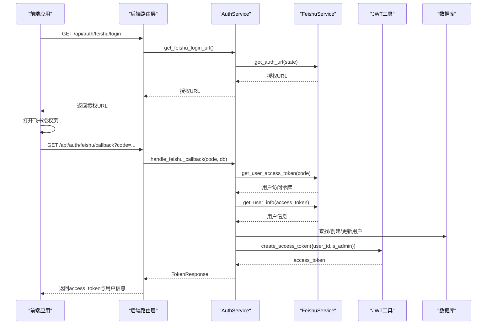
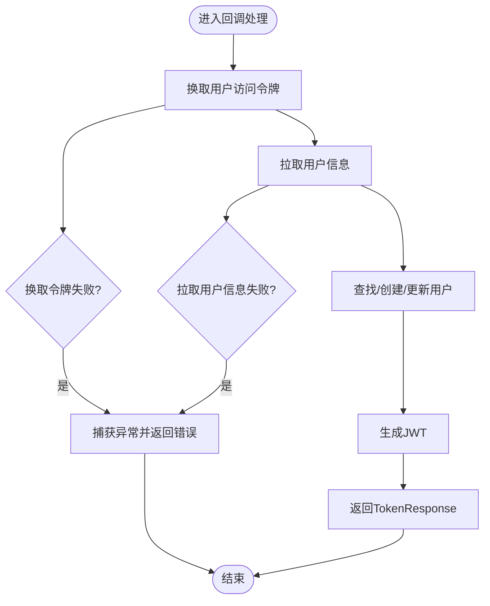
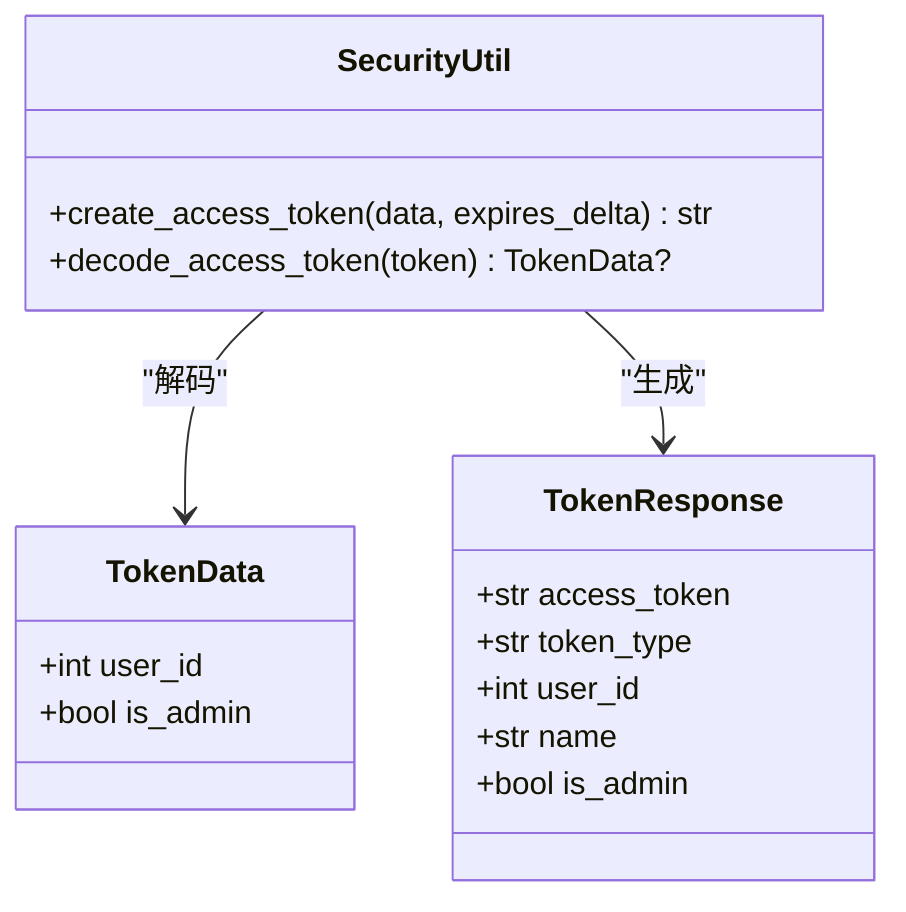
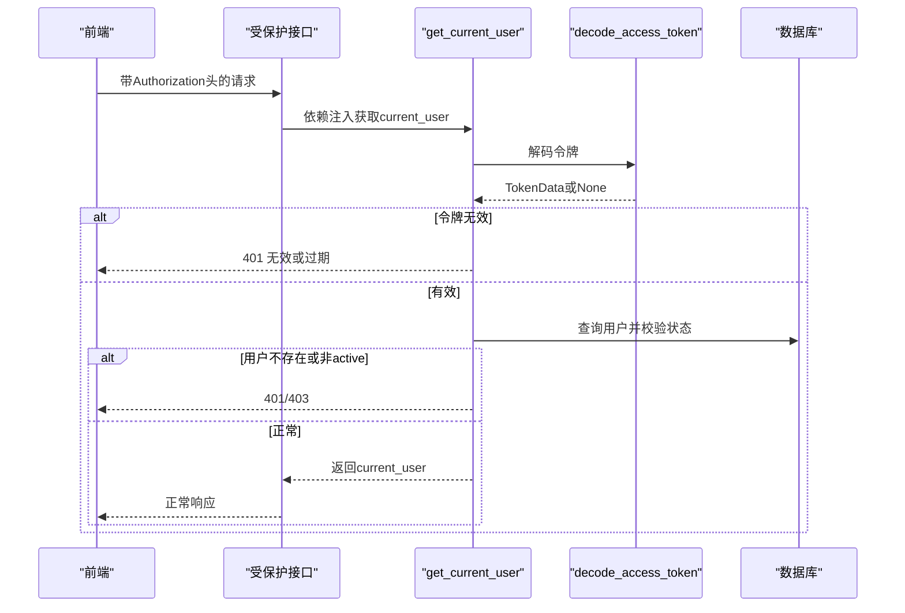
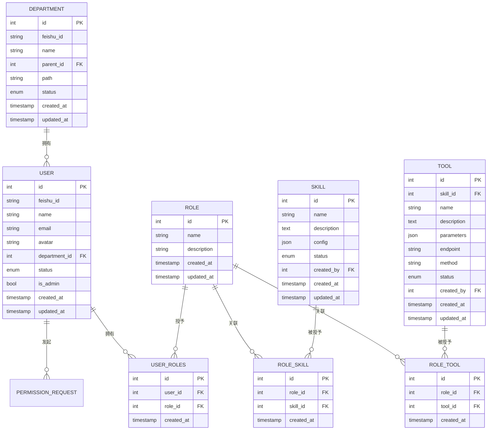
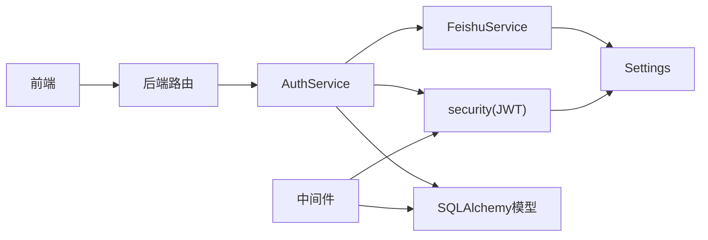

# 用户认证系统

<cite>
**本文引用的文件**
- [backend/app/api/auth.py](file://backend/app/api/auth.py)
- [backend/app/middleware/auth.py](file://backend/app/middleware/auth.py)
- [backend/app/services/auth.py](file://backend/app/services/auth.py)
- [backend/app/services/feishu.py](file://backend/app/services/feishu.py)
- [backend/app/utils/security.py](file://backend/app/utils/security.py)
- [backend/app/schemas/auth.py](file://backend/app/schemas/auth.py)
- [backend/app/models/user.py](file://backend/app/models/user.py)
- [backend/app/config.py](file://backend/app/config.py)
- [backend/app/main.py](file://backend/app/main.py)
- [backend/pyproject.toml](file://backend/pyproject.toml)
- [frontend/client/src/pages/Login.tsx](file://frontend/client/src/pages/Login.tsx)
- [frontend/admin/src/pages/Login.tsx](file://frontend/admin/src/pages/Login.tsx)
- [frontend/client/src/store/auth.ts](file://frontend/client/src/store/auth.ts)
- [frontend/admin/src/store/auth.ts](file://frontend/admin/src/store/auth.ts)
- [frontend/client/src/api/request.ts](file://frontend/client/src/api/request.ts)
</cite>

## 目录
1. [简介](#简介)
2. [项目结构](#项目结构)
3. [核心组件](#核心组件)
4. [架构总览](#架构总览)
5. [详细组件分析](#详细组件分析)
6. [依赖分析](#依赖分析)
7. [性能考虑](#性能考虑)
8. [故障排查指南](#故障排查指南)
9. [结论](#结论)
10. [附录](#附录)

## 简介
本文件面向ToolHub用户认证系统，聚焦飞书OAuth2集成与JWT令牌机制，系统性阐述从授权到回调、用户信息获取、令牌签发与校验、中间件鉴权、用户状态与会话控制、权限缓存策略，以及扩展支持其他认证提供商的实践路径。文档同时提供认证流程时序图、关键代码片段路径与错误处理、安全与性能优化建议。

## 项目结构
后端采用FastAPI + SQLAlchemy架构，认证相关模块分布如下：
- 路由层：/api/auth 提供飞书登录、回调、登出、当前用户信息接口
- 中间件：HTTP Bearer令牌解析与用户鉴权
- 服务层：AuthService封装飞书回调处理与JWT生成；FeishuService封装飞书开放平台API交互
- 工具层：security提供JWT生成与解码
- 模型层：User/Department等实体定义用户与组织关系
- 配置层：Settings集中管理JWT与飞书OAuth2参数
- 前端：客户端与管理端均通过拦截器携带Authorization头，并在401时跳转登录

图表来源
- [backend/app/api/auth.py:1-48](file://backend/app/api/auth.py#L1-L48)
- [backend/app/middleware/auth.py:1-45](file://backend/app/middleware/auth.py#L1-L45)
- [backend/app/services/auth.py:1-80](file://backend/app/services/auth.py#L1-L80)
- [backend/app/services/feishu.py:1-120](file://backend/app/services/feishu.py#L1-L120)
- [backend/app/utils/security.py:1-32](file://backend/app/utils/security.py#L1-L32)
- [backend/app/models/user.py:1-116](file://backend/app/models/user.py#L1-L116)
- [backend/app/config.py:1-42](file://backend/app/config.py#L1-L42)
- [frontend/client/src/pages/Login.tsx:1-52](file://frontend/client/src/pages/Login.tsx#L1-L52)
- [frontend/admin/src/pages/Login.tsx:1-53](file://frontend/admin/src/pages/Login.tsx#L1-L53)
- [frontend/client/src/api/request.ts:1-28](file://frontend/client/src/api/request.ts#L1-L28)

章节来源
- [backend/app/main.py:1-61](file://backend/app/main.py#L1-L61)
- [backend/app/config.py:1-42](file://backend/app/config.py#L1-L42)

## 核心组件
- 飞书OAuth2路由
  - /api/auth/feishu/login：返回飞书授权URL
  - /api/auth/feishu/callback：处理授权码，换取用户访问令牌与用户信息，创建/更新用户并签发JWT
  - /api/auth/logout：前端登出提示（后端不维护会话）
  - /api/auth/me：基于中间件获取当前用户信息
- 认证服务
  - AuthService：封装飞书回调处理、用户查找/创建/更新、JWT签发
  - FeishuService：封装飞书开放平台API（授权URL、tenant_access_token、access_token、用户信息、部门列表）
- 安全工具
  - JWT生成与解码：create_access_token、decode_access_token
- 中间件
  - HTTP Bearer令牌解析与用户鉴权：get_current_user、require_admin
- 数据模型
  - User/Department等实体，包含状态字段与部门关联
- 配置
  - Settings：JWT密钥、算法、过期时间、飞书App ID/Secret、Base URL、Redirect URI等

章节来源
- [backend/app/api/auth.py:13-48](file://backend/app/api/auth.py#L13-L48)
- [backend/app/services/auth.py:9-80](file://backend/app/services/auth.py#L9-L80)
- [backend/app/services/feishu.py:6-120](file://backend/app/services/feishu.py#L6-L120)
- [backend/app/utils/security.py:8-32](file://backend/app/utils/security.py#L8-L32)
- [backend/app/middleware/auth.py:12-45](file://backend/app/middleware/auth.py#L12-L45)
- [backend/app/models/user.py:23-40](file://backend/app/models/user.py#L23-L40)
- [backend/app/config.py:11-42](file://backend/app/config.py#L11-L42)

## 架构总览
认证系统遵循“前端引导飞书授权 -> 后端回调换取令牌 -> 后端拉取用户信息 -> 创建/更新用户 -> 生成JWT -> 前端持久化令牌 -> 请求携带令牌”的闭环。

图表来源
- [backend/app/api/auth.py:13-27](file://backend/app/api/auth.py#L13-L27)
- [backend/app/services/auth.py:16-76](file://backend/app/services/auth.py#L16-L76)
- [backend/app/services/feishu.py:42-69](file://backend/app/services/feishu.py#L42-L69)
- [backend/app/utils/security.py:8-17](file://backend/app/utils/security.py#L8-L17)

## 详细组件分析

### 飞书OAuth2集成
- 授权URL生成
  - FeishuService根据配置拼装授权URL，包含app_id、redirect_uri、response_type=code、state等参数
- 回调处理
  - AuthService先通过授权码换取用户访问令牌，再拉取用户信息，最后完成用户查找/创建/更新
  - 用户信息映射至User实体，含feishu_id、name、email、avatar、department_id等
  - 生成JWT并返回TokenResponse
- 错误处理
  - FeishuService在各API调用失败时抛出异常，上层统一捕获并返回错误响应

图表来源
- [backend/app/services/auth.py:16-76](file://backend/app/services/auth.py#L16-L76)
- [backend/app/services/feishu.py:42-69](file://backend/app/services/feishu.py#L42-L69)

章节来源
- [backend/app/services/feishu.py:15-69](file://backend/app/services/feishu.py#L15-L69)
- [backend/app/services/auth.py:16-76](file://backend/app/services/auth.py#L16-L76)

### JWT令牌生成、验证与刷新
- 生成
  - 使用settings中的JWT_SECRET_KEY、JWT_ALGORITHM与过期时间计算exp，编码载荷生成access_token
- 验证
  - 中间件通过decode_access_token解码令牌，提取user_id与is_admin，若无效则401
- 刷新
  - 当前实现未提供refresh_token机制，建议引入短期access_token与长期refresh_token配合使用，以降低泄露风险

图表来源
- [backend/app/utils/security.py:8-32](file://backend/app/utils/security.py#L8-L32)
- [backend/app/schemas/auth.py:5-19](file://backend/app/schemas/auth.py#L5-L19)

章节来源
- [backend/app/utils/security.py:8-32](file://backend/app/utils/security.py#L8-L32)
- [backend/app/schemas/auth.py:5-19](file://backend/app/schemas/auth.py#L5-L19)
- [backend/app/config.py:20-24](file://backend/app/config.py#L20-L24)

### 中间件与权限控制
- get_current_user
  - 从Authorization头解析Bearer令牌，解码后查询用户，校验状态为active，否则403
- require_admin
  - 在get_current_user基础上进一步校验是否管理员，非管理员403
- 前端拦截器
  - 自动在请求头添加Authorization: Bearer token
  - 收到401自动清理本地token并跳转登录页

图表来源
- [backend/app/middleware/auth.py:12-33](file://backend/app/middleware/auth.py#L12-L33)
- [frontend/client/src/api/request.ts:8-25](file://frontend/client/src/api/request.ts#L8-L25)

章节来源
- [backend/app/middleware/auth.py:12-45](file://backend/app/middleware/auth.py#L12-L45)
- [frontend/client/src/api/request.ts:8-25](file://frontend/client/src/api/request.ts#L8-L25)

### 用户状态管理与会话控制
- 用户状态
  - User实体包含status字段，默认active；中间件在校验时拒绝非active用户
- 会话控制
  - 后端不维护服务端会话，采用无状态JWT；前端负责持久化token并在401时清理
- 权限缓存
  - 当前未实现权限缓存；建议在用户对象中缓存角色/权限集合，结合令牌过期时间做增量刷新

章节来源
- [backend/app/models/user.py:26-35](file://backend/app/models/user.py#L26-L35)
- [backend/app/middleware/auth.py:28-32](file://backend/app/middleware/auth.py#L28-L32)
- [frontend/client/src/store/auth.ts:18-29](file://frontend/client/src/store/auth.ts#L18-L29)

### 数据模型与关系

图表来源
- [backend/app/models/user.py:7-116](file://backend/app/models/user.py#L7-L116)

章节来源
- [backend/app/models/user.py:23-40](file://backend/app/models/user.py#L23-L40)

### 前端集成与用户体验
- 客户端/管理端登录页
  - 调用后端获取飞书授权URL并重定向
  - 回调URL携带code，前端调用后端回调接口，成功后写入localStorage并跳转首页
- 请求拦截器
  - 自动附加Authorization头；收到401清理token并跳转登录

章节来源
- [frontend/client/src/pages/Login.tsx:12-36](file://frontend/client/src/pages/Login.tsx#L12-L36)
- [frontend/admin/src/pages/Login.tsx:12-37](file://frontend/admin/src/pages/Login.tsx#L12-L37)
- [frontend/client/src/api/request.ts:8-25](file://frontend/client/src/api/request.ts#L8-L25)

## 依赖分析
- 外部依赖
  - FastAPI、SQLAlchemy、httpx、python-jose、pydantic-settings等
- 内部模块耦合
  - API路由依赖AuthService；AuthService依赖FeishuService与security；中间件依赖security与models；前端依赖后端API与拦截器

图表来源
- [backend/pyproject.toml:7-20](file://backend/pyproject.toml#L7-L20)
- [backend/app/api/auth.py:1-8](file://backend/app/api/auth.py#L1-L8)
- [backend/app/services/auth.py:1-6](file://backend/app/services/auth.py#L1-L6)
- [backend/app/services/feishu.py:1-3](file://backend/app/services/feishu.py#L1-L3)
- [backend/app/utils/security.py:1-5](file://backend/app/utils/security.py#L1-L5)
- [backend/app/middleware/auth.py:1-7](file://backend/app/middleware/auth.py#L1-L7)
- [backend/app/config.py:11-42](file://backend/app/config.py#L11-L42)

章节来源
- [backend/pyproject.toml:7-20](file://backend/pyproject.toml#L7-L20)

## 性能考虑
- 异步HTTP调用
  - FeishuService使用httpx.AsyncClient，避免阻塞，提升回调处理吞吐
- 令牌过期策略
  - 当前access_token有效期较长，建议缩短并引入refresh_token轮换，减少重复授权成本
- 缓存策略
  - 对飞书tenant_access_token设置短时缓存与失效重试，降低频繁获取开销
- 数据库事务
  - 用户创建/更新使用单次commit，确保一致性；可考虑批量导入部门/用户时合并提交

## 故障排查指南
- 常见错误与定位
  - 飞书授权失败：检查FEISHU_APP_ID、FEISHU_APP_SECRET、FEISHU_REDIRECT_URI配置
  - 回调换取令牌失败：确认回调URL与飞书后台一致，检查网络可达性
  - 令牌无效/过期：核对JWT_SECRET_KEY、JWT_ALGORITHM、过期时间设置
  - 用户状态非active：检查用户状态字段与中间件校验逻辑
- 建议的日志与监控
  - 记录授权URL生成、回调参数、令牌交换、用户信息拉取、JWT生成与解码过程
  - 对401/403场景记录用户ID与IP，便于风控

章节来源
- [backend/app/services/feishu.py:26-40](file://backend/app/services/feishu.py#L26-L40)
- [backend/app/utils/security.py:20-31](file://backend/app/utils/security.py#L20-L31)
- [backend/app/middleware/auth.py:18-32](file://backend/app/middleware/auth.py#L18-L32)
- [backend/app/config.py:25-29](file://backend/app/config.py#L25-L29)

## 结论
ToolHub认证系统以飞书OAuth2为基础，结合JWT实现了前后端分离的无状态认证方案。通过清晰的服务分层与中间件鉴权，系统具备良好的可维护性。建议后续引入refresh_token、权限缓存与更完善的日志监控，以进一步提升安全性与性能。

## 附录

### 扩展支持其他认证提供商
- 设计要点
  - 抽象认证服务接口：定义统一的get_auth_url、get_user_access_token、get_user_info方法
  - 适配不同提供商的授权参数与用户信息字段映射
  - 统一错误处理与重试策略
- 实施步骤
  - 新增ProviderService类，实现上述接口
  - 在AuthService中按配置选择具体ProviderService
  - 在前端登录页增加多提供商入口与回调处理

章节来源
- [backend/app/services/feishu.py:15-69](file://backend/app/services/feishu.py#L15-L69)
- [backend/app/services/auth.py:12-14](file://backend/app/services/auth.py#L12-L14)