# 技术选型说明

<cite>
**本文档引用的文件**
- [backend/pyproject.toml](file://backend/pyproject.toml)
- [frontend/admin/package.json](file://frontend/admin/package.json)
- [frontend/client/package.json](file://frontend/client/package.json)
- [backend/app/main.py](file://backend/app/main.py)
- [backend/app/config.py](file://backend/app/config.py)
- [backend/app/database.py](file://backend/app/database.py)
- [backend/alembic/env.py](file://backend/alembic/env.py)
- [backend/alembic.ini](file://backend/alembic.ini)
- [docker-compose.yml](file://docker-compose.yml)
- [backend/Dockerfile](file://backend/Dockerfile)
- [frontend/admin/Dockerfile](file://frontend/admin/Dockerfile)
- [backend/app/models/user.py](file://backend/app/models/user.py)
- [backend/app/schemas/user.py](file://backend/app/schemas/user.py)
- [backend/app/api/users.py](file://backend/app/api/users.py)
- [backend/app/services/user.py](file://backend/app/services/user.py)
- [backend/app/middleware/auth.py](file://backend/app/middleware/auth.py)
- [frontend/admin/src/store/auth.ts](file://frontend/admin/src/store/auth.ts)
- [frontend/admin/src/api/request.ts](file://frontend/admin/src/api/request.ts)
</cite>

## 目录
1. [引言](#引言)
2. [项目结构](#项目结构)
3. [核心组件](#核心组件)
4. [架构总览](#架构总览)
5. [详细组件分析](#详细组件分析)
6. [依赖关系分析](#依赖关系分析)
7. [性能考量](#性能考量)
8. [故障排除指南](#故障排除指南)
9. [结论](#结论)
10. [附录](#附录)

## 引言
本技术选型说明面向ToolHub项目，系统阐述后端与前端技术栈的选择依据、实现方式与最佳实践。后端采用FastAPI + SQLAlchemy + Pydantic + Alembic，强调异步支持、自动API文档、类型安全与数据库迁移管理；前端采用React 19.0.0 + Ant Design 5.22.0 + Zustand 5.0.0，提供现代化开发体验与企业级UI组件。数据库选用MySQL，并通过Docker容器化部署实现快速交付与可重复性。

## 项目结构
项目采用前后端分离架构，后端使用Python包结构组织，前端分别提供管理端与客户端两套独立应用，均支持Docker容器化部署。整体目录结构清晰，便于团队协作与持续集成。

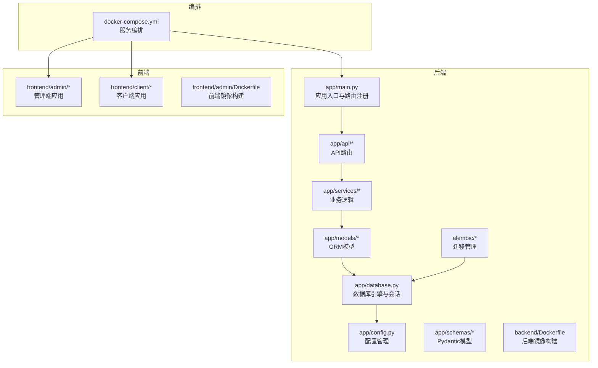

**图表来源**
- [backend/app/main.py:1-61](file://backend/app/main.py#L1-L61)
- [backend/app/config.py:1-42](file://backend/app/config.py#L1-L42)
- [backend/app/database.py:1-25](file://backend/app/database.py#L1-L25)
- [backend/alembic/env.py:1-49](file://backend/alembic/env.py#L1-L49)
- [docker-compose.yml:1-84](file://docker-compose.yml#L1-L84)
- [backend/Dockerfile:1-29](file://backend/Dockerfile#L1-L29)
- [frontend/admin/Dockerfile:1-30](file://frontend/admin/Dockerfile#L1-L30)

**章节来源**
- [backend/app/main.py:1-61](file://backend/app/main.py#L1-L61)
- [docker-compose.yml:1-84](file://docker-compose.yml#L1-L84)

## 核心组件
- 后端技术栈
  - FastAPI：提供异步支持、自动OpenAPI文档、类型驱动的路由与依赖注入。
  - SQLAlchemy：声明式ORM，支持模型定义、关系映射与查询。
  - Pydantic：数据验证与序列化，确保请求/响应数据结构一致。
  - Alembic：数据库迁移管理，支持在线/离线迁移。
- 前端技术栈
  - React 19.0.0：函数式组件与并发特性，提升开发效率与运行性能。
  - Ant Design 5.22.0：企业级UI组件库，统一设计语言与交互规范。
  - Zustand 5.0.0：轻量级状态管理，简化全局状态逻辑。
- 数据库与部署
  - MySQL：成熟稳定的关系型数据库，生态完善，易于运维。
  - Docker：容器化部署，隔离环境、简化依赖、加速交付。

**章节来源**
- [backend/pyproject.toml:1-31](file://backend/pyproject.toml#L1-L31)
- [frontend/admin/package.json:1-29](file://frontend/admin/package.json#L1-L29)
- [frontend/client/package.json:1-29](file://frontend/client/package.json#L1-L29)

## 架构总览
后端通过FastAPI提供REST接口，中间件处理认证与CORS，服务层封装业务逻辑，ORM层负责数据持久化。前端通过Axios发起请求，Zustand管理登录态，Ant Design提供UI组件。Docker Compose编排MySQL、后端、前后端前端服务，形成完整的开发与生产环境。

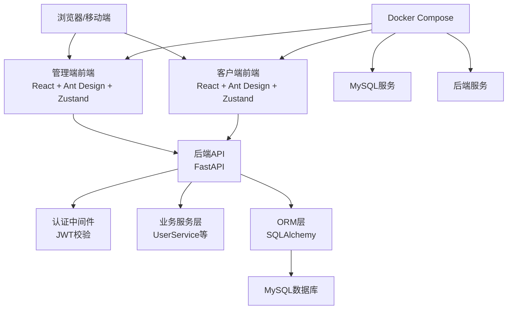

**图表来源**
- [backend/app/main.py:1-61](file://backend/app/main.py#L1-L61)
- [backend/app/middleware/auth.py:1-45](file://backend/app/middleware/auth.py#L1-L45)
- [backend/app/services/user.py:1-86](file://backend/app/services/user.py#L1-L86)
- [backend/app/database.py:1-25](file://backend/app/database.py#L1-L25)
- [docker-compose.yml:1-84](file://docker-compose.yml#L1-L84)

## 详细组件分析

### 后端：FastAPI
- 应用入口与路由注册：集中注册认证、用户、技能、工具、权限申请等路由，并包含管理端与外部验证接口。
- 中间件：启用CORS，允许跨域访问，满足多前端域名需求。
- 健康检查：提供/version与健康状态接口，便于监控与编排。

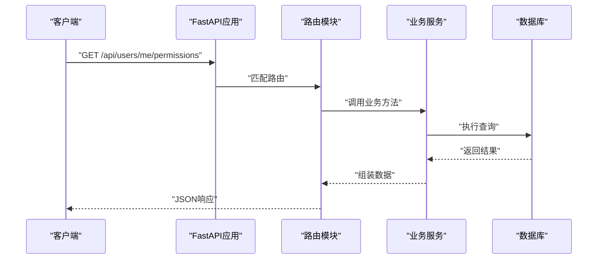

**图表来源**
- [backend/app/main.py:25-42](file://backend/app/main.py#L25-L42)
- [backend/app/api/users.py:1-29](file://backend/app/api/users.py#L1-L29)
- [backend/app/services/user.py:66-82](file://backend/app/services/user.py#L66-L82)

**章节来源**
- [backend/app/main.py:1-61](file://backend/app/main.py#L1-L61)
- [backend/app/api/users.py:1-29](file://backend/app/api/users.py#L1-L29)

### 认证与授权中间件
- HTTP Bearer令牌解析与校验，从Token中提取用户信息并查询用户状态。
- 管理员权限校验，对特定管理接口进行权限拦截。

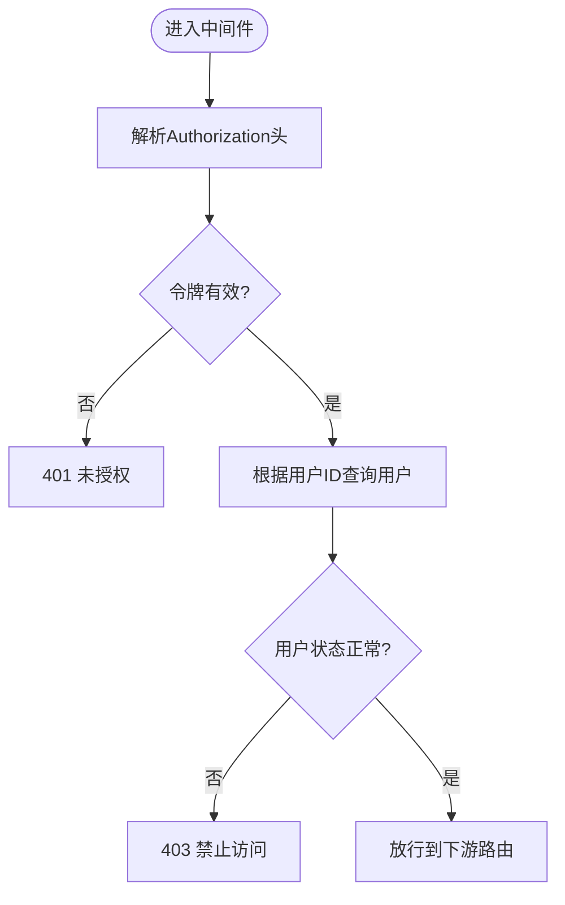

**图表来源**
- [backend/app/middleware/auth.py:12-33](file://backend/app/middleware/auth.py#L12-L33)

**章节来源**
- [backend/app/middleware/auth.py:1-45](file://backend/app/middleware/auth.py#L1-L45)

### 数据持久化：SQLAlchemy
- 引擎配置：基于配置加载数据库URL，开启echo（调试），连接池预热与回收策略。
- 会话管理：提供依赖注入的数据库会话生成器，确保每个请求有独立会话并在结束后关闭。
- 模型定义：涵盖用户、部门、角色、技能、工具及其关联表，支持外键、枚举、JSON字段与级联关系。

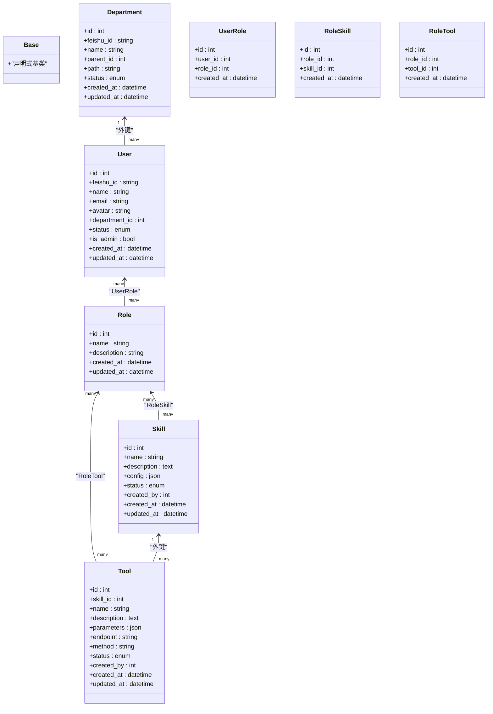

**图表来源**
- [backend/app/models/user.py:7-116](file://backend/app/models/user.py#L7-L116)

**章节来源**
- [backend/app/database.py:1-25](file://backend/app/database.py#L1-L25)
- [backend/app/models/user.py:1-116](file://backend/app/models/user.py#L1-L116)

### 数据验证：Pydantic
- 使用Pydantic模型定义数据结构，支持字段类型约束、默认值与from_attributes转换。
- 在用户相关Schema中，定义基础模型、读取模型与树形结构模型，确保序列化一致性。

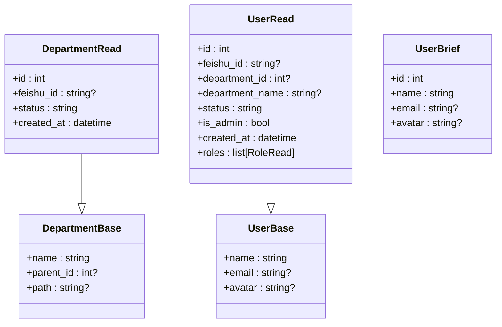

**图表来源**
- [backend/app/schemas/user.py:6-67](file://backend/app/schemas/user.py#L6-L67)

**章节来源**
- [backend/app/schemas/user.py:1-67](file://backend/app/schemas/user.py#L1-L67)

### 业务服务：用户权限计算
- 用户权限由其角色聚合而来，遍历角色关联的技能与工具集合，去重后返回名称列表。
- 提供用户列表查询、详情查询、角色更新与状态更新等方法，封装事务与错误处理。

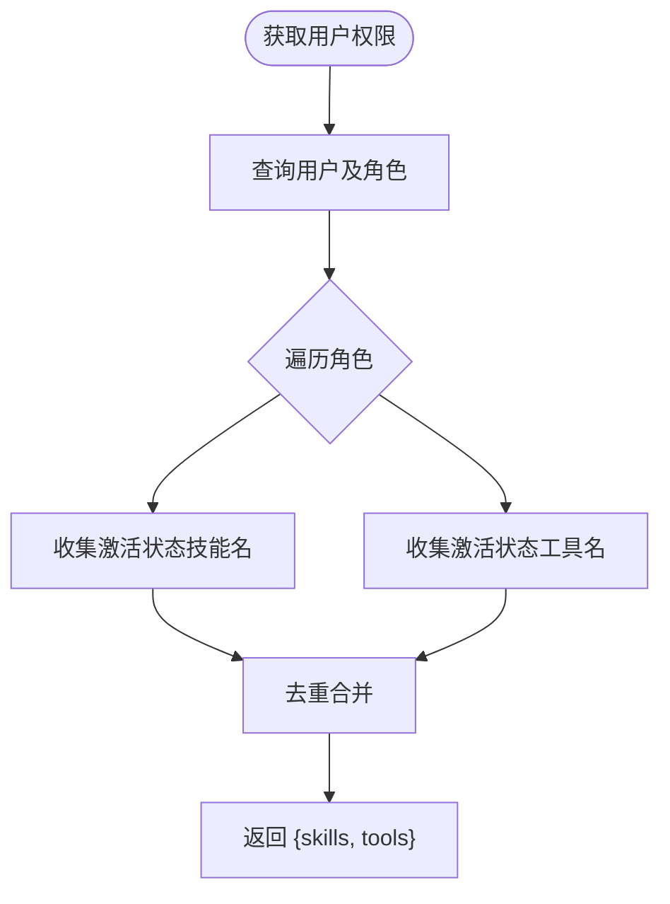

**图表来源**
- [backend/app/services/user.py:66-82](file://backend/app/services/user.py#L66-L82)

**章节来源**
- [backend/app/services/user.py:1-86](file://backend/app/services/user.py#L1-L86)

### 数据库迁移：Alembic
- 配置优先级：环境变量 > 应用配置(.env) > alembic.ini，确保不同环境一致的迁移源。
- 支持在线与离线迁移模式，目标元数据指向Base.metadata，自动发现模型变更。

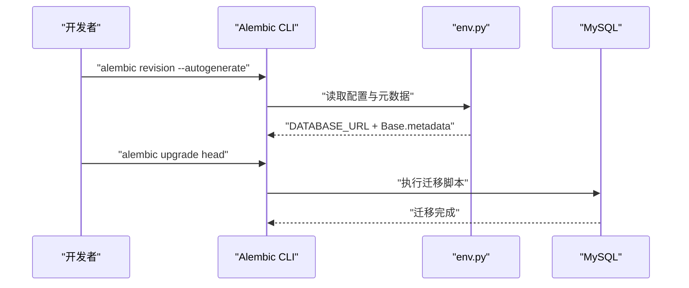

**图表来源**
- [backend/alembic/env.py:11-18](file://backend/alembic/env.py#L11-L18)
- [backend/alembic.ini:1-37](file://backend/alembic.ini#L1-L37)

**章节来源**
- [backend/alembic/env.py:1-49](file://backend/alembic/env.py#L1-L49)
- [backend/alembic.ini:1-37](file://backend/alembic.ini#L1-L37)

### 前端：React + Ant Design + Zustand
- 状态管理：使用Zustand存储token与用户信息，支持本地持久化与登出清理。
- API封装：Axios实例统一设置baseURL与超时，拦截器自动注入Authorization头，处理401跳转登录。
- 组件库：Ant Design提供统一UI风格与高复用组件，适配管理端与客户端场景。

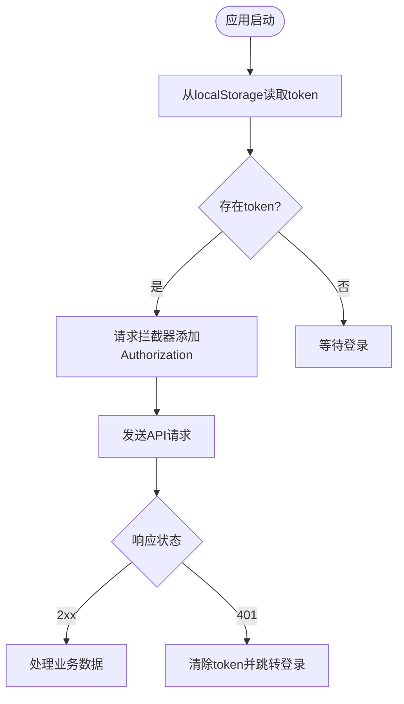

**图表来源**
- [frontend/admin/src/store/auth.ts:18-29](file://frontend/admin/src/store/auth.ts#L18-L29)
- [frontend/admin/src/api/request.ts:8-25](file://frontend/admin/src/api/request.ts#L8-L25)

**章节来源**
- [frontend/admin/src/store/auth.ts:1-30](file://frontend/admin/src/store/auth.ts#L1-L30)
- [frontend/admin/src/api/request.ts:1-28](file://frontend/admin/src/api/request.ts#L1-L28)

### 容器化部署：Docker
- 后端镜像：基于Python 3.13 Slim，使用uv安装依赖，构建阶段执行alembic升级，启动时运行Uvicorn。
- 前端镜像：Node构建产物复制至Nginx，提供静态资源服务，暴露80端口。
- 编排：Compose编排MySQL、后端、管理端与客户端，设置环境变量、端口映射与健康检查。

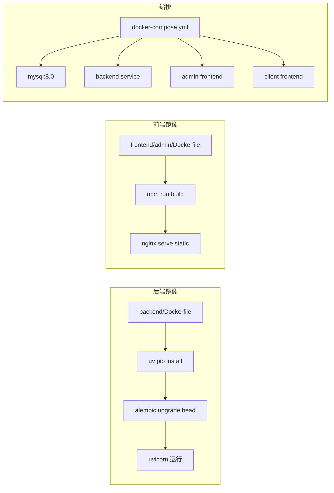

**图表来源**
- [backend/Dockerfile:1-29](file://backend/Dockerfile#L1-L29)
- [frontend/admin/Dockerfile:1-30](file://frontend/admin/Dockerfile#L1-L30)
- [docker-compose.yml:1-84](file://docker-compose.yml#L1-L84)

**章节来源**
- [backend/Dockerfile:1-29](file://backend/Dockerfile#L1-L29)
- [frontend/admin/Dockerfile:1-30](file://frontend/admin/Dockerfile#L1-L30)
- [docker-compose.yml:1-84](file://docker-compose.yml#L1-L84)

## 依赖关系分析
- 后端依赖：FastAPI提供Web框架与自动文档；SQLAlchemy负责ORM；Pydantic保障数据结构；Alembic管理迁移；Cryptography与python-jose用于加密与JWT；PyMySQL提供MySQL驱动。
- 前端依赖：React 19提供组件体系；Ant Design 5提供UI；Zustand管理状态；Axios处理HTTP；Vite/TypeScript提供构建与类型支持。

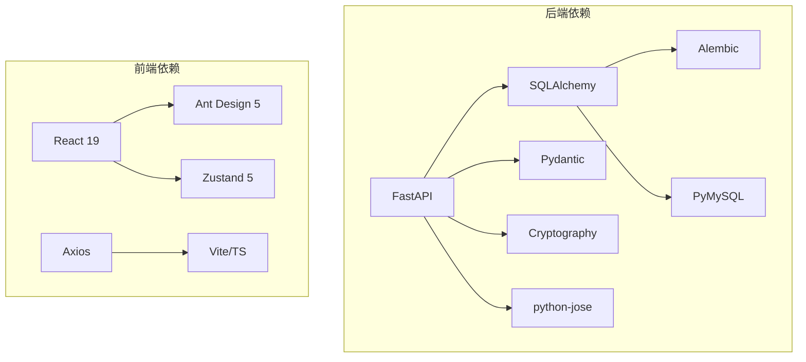

**图表来源**
- [backend/pyproject.toml:7-20](file://backend/pyproject.toml#L7-L20)
- [frontend/admin/package.json:11-27](file://frontend/admin/package.json#L11-L27)
- [frontend/client/package.json:11-27](file://frontend/client/package.json#L11-L27)

**章节来源**
- [backend/pyproject.toml:1-31](file://backend/pyproject.toml#L1-L31)
- [frontend/admin/package.json:1-29](file://frontend/admin/package.json#L1-L29)
- [frontend/client/package.json:1-29](file://frontend/client/package.json#L1-L29)

## 性能考量
- 异步与并发：FastAPI基于Starlette，支持异步路由与高并发I/O，适合高吞吐API场景。
- 数据库连接池：SQLAlchemy连接池预热与回收策略降低连接开销，结合pool_pre_ping提升稳定性。
- 前端构建优化：Vite提供快速冷启动与热更新；生产构建压缩资源，减少首屏加载时间。
- 容器资源：合理设置MySQL与应用容器内存限制，避免资源争用；使用健康检查确保服务可用性。

## 故障排除指南
- 认证失败
  - 现象：401未授权或403禁止访问。
  - 排查：确认Authorization头格式、令牌有效性与用户状态；检查中间件逻辑。
  - 参考
    - [backend/app/middleware/auth.py:12-33](file://backend/app/middleware/auth.py#L12-L33)
- 数据库连接问题
  - 现象：迁移失败或运行时报连接错误。
  - 排查：核对DATABASE_URL、网络连通性与MySQL服务健康状态；检查连接池配置。
  - 参考
    - [backend/app/config.py:17-18](file://backend/app/config.py#L17-L18)
    - [backend/app/database.py:5-10](file://backend/app/database.py#L5-L10)
- 前端鉴权失效
  - 现象：刷新页面后token丢失或401跳转登录。
  - 排查：确认localStorage写入与拦截器注入逻辑；检查后端CORS配置。
  - 参考
    - [frontend/admin/src/store/auth.ts:18-29](file://frontend/admin/src/store/auth.ts#L18-L29)
    - [frontend/admin/src/api/request.ts:8-14](file://frontend/admin/src/api/request.ts#L8-L14)
- 容器启动异常
  - 现象：后端启动即退出或前端无法访问。
  - 排查：查看Compose日志、端口映射与依赖服务健康状态；确认环境变量与卷挂载。
  - 参考
    - [docker-compose.yml:44-46](file://docker-compose.yml#L44-L46)
    - [backend/Dockerfile:27-28](file://backend/Dockerfile#L27-L28)

**章节来源**
- [backend/app/middleware/auth.py:1-45](file://backend/app/middleware/auth.py#L1-L45)
- [backend/app/config.py:1-42](file://backend/app/config.py#L1-L42)
- [backend/app/database.py:1-25](file://backend/app/database.py#L1-L25)
- [frontend/admin/src/store/auth.ts:1-30](file://frontend/admin/src/store/auth.ts#L1-L30)
- [frontend/admin/src/api/request.ts:1-28](file://frontend/admin/src/api/request.ts#L1-L28)
- [docker-compose.yml:1-84](file://docker-compose.yml#L1-L84)
- [backend/Dockerfile:1-29](file://backend/Dockerfile#L1-L29)

## 结论
ToolHub采用的技术栈在现代Web应用中具备良好平衡：后端以FastAPI为核心，结合SQLAlchemy与Pydantic实现高性能与强类型保障；Alembic确保数据库演进可控；前端以React+Ant Design+Zustand提供一致的开发体验与企业级UI。MySQL与Docker进一步提升了可维护性与可移植性。该选型适合中大型团队协作与长期演进。

## 附录
- 技术选型最佳实践建议
  - 后端
    - 使用Pydantic严格定义输入输出，配合FastAPI的依赖注入与类型注解，减少运行时错误。
    - 将业务逻辑下沉至服务层，保持路由简洁，便于测试与复用。
    - 使用Alembic进行版本化迁移，避免直接修改数据库结构。
    - 合理设置CORS白名单，生产环境禁用调试模式。
  - 前端
    - 使用Zustand管理轻量全局状态，复杂场景再引入专用状态库。
    - 统一API封装与拦截器，集中处理鉴权与错误。
    - 组件化设计，遵循Ant Design的设计规范，保证一致性。
  - 数据库
    - 使用枚举与JSON字段表达业务概念，但需注意查询性能与索引设计。
    - 定期备份与监控，生产环境启用只读副本与慢查询分析。
  - 部署
    - 使用Compose进行本地开发，CI/CD流水线自动化构建与发布。
    - 生产环境考虑负载均衡、自动扩缩容与蓝绿部署策略。