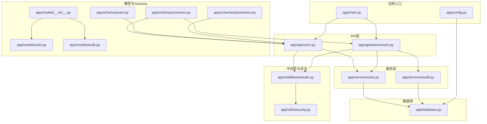
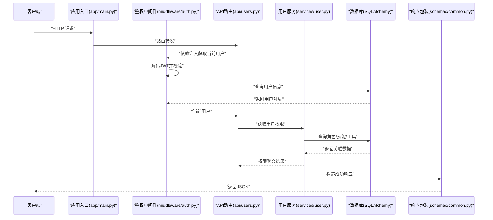
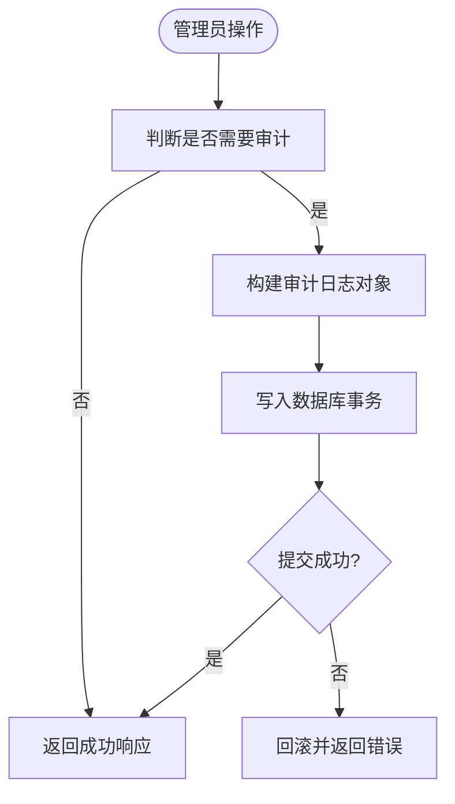
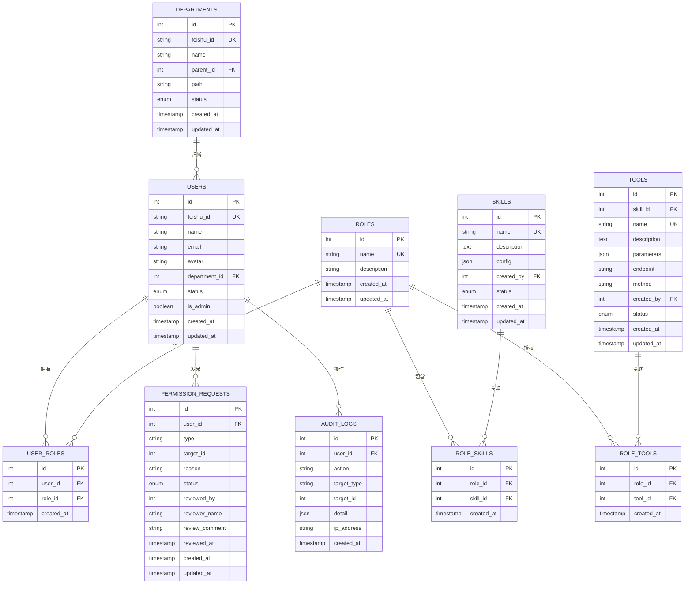
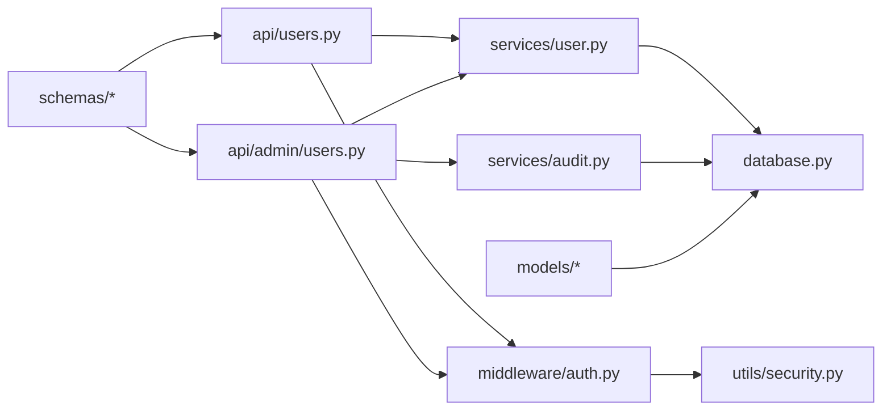

# 数据流架构

<cite>
**本文引用的文件**
- [backend/app/main.py](file://backend/app/main.py)
- [backend/app/config.py](file://backend/app/config.py)
- [backend/app/database.py](file://backend/app/database.py)
- [backend/app/middleware/auth.py](file://backend/app/middleware/auth.py)
- [backend/app/utils/security.py](file://backend/app/utils/security.py)
- [backend/app/models/__init__.py](file://backend/app/models/__init__.py)
- [backend/app/models/user.py](file://backend/app/models/user.py)
- [backend/app/models/audit.py](file://backend/app/models/audit.py)
- [backend/app/schemas/common.py](file://backend/app/schemas/common.py)
- [backend/app/schemas/user.py](file://backend/app/schemas/user.py)
- [backend/app/schemas/permission.py](file://backend/app/schemas/permission.py)
- [backend/app/services/user.py](file://backend/app/services/user.py)
- [backend/app/services/audit.py](file://backend/app/services/audit.py)
- [backend/app/api/users.py](file://backend/app/api/users.py)
- [backend/app/api/admin/users.py](file://backend/app/api/admin/users.py)
</cite>

## 目录
1. [引言](#引言)
2. [项目结构](#项目结构)
3. [核心组件](#核心组件)
4. [架构总览](#架构总览)
5. [详细组件分析](#详细组件分析)
6. [依赖分析](#依赖分析)
7. [性能考虑](#性能考虑)
8. [故障排查指南](#故障排查指南)
9. [结论](#结论)
10. [附录](#附录)

## 引言
本文件面向ToolHub项目的“数据流架构”，系统性梳理从用户请求到数据库持久化的完整链路，覆盖数据验证与转换（Pydantic模型、序列化、类型转换）、数据库连接池与事务、并发控制策略、缓存与同步机制、审计日志的数据流向与记录策略，并给出数据流图与实体关系图，最后总结一致性保障与异常处理机制。

## 项目结构
后端采用FastAPI + SQLAlchemy架构，按功能分层组织：应用入口负责路由注册；中间件负责鉴权；API层负责请求处理与响应封装；服务层负责业务逻辑；模型层负责ORM映射；配置与数据库层负责连接与会话管理。

图表来源
- [backend/app/main.py:9-48](file://backend/app/main.py#L9-L48)
- [backend/app/config.py:11-38](file://backend/app/config.py#L11-L38)
- [backend/app/database.py:1-25](file://backend/app/database.py#L1-L25)
- [backend/app/middleware/auth.py:12-33](file://backend/app/middleware/auth.py#L12-L33)
- [backend/app/utils/security.py:8-31](file://backend/app/utils/security.py#L8-L31)
- [backend/app/api/users.py:12-19](file://backend/app/api/users.py#L12-L19)
- [backend/app/api/admin/users.py:14-39](file://backend/app/api/admin/users.py#L14-L39)
- [backend/app/services/user.py:8-86](file://backend/app/services/user.py#L8-L86)
- [backend/app/services/audit.py:6-54](file://backend/app/services/audit.py#L6-L54)
- [backend/app/models/__init__.py:1-17](file://backend/app/models/__init__.py#L1-L17)
- [backend/app/models/user.py:1-116](file://backend/app/models/user.py#L1-L116)
- [backend/app/models/audit.py:1-17](file://backend/app/models/audit.py#L1-L17)
- [backend/app/schemas/common.py:1-29](file://backend/app/schemas/common.py#L1-L29)
- [backend/app/schemas/user.py:1-67](file://backend/app/schemas/user.py#L1-L67)
- [backend/app/schemas/permission.py:1-56](file://backend/app/schemas/permission.py#L1-L56)

章节来源
- [backend/app/main.py:9-48](file://backend/app/main.py#L9-L48)
- [backend/app/config.py:11-38](file://backend/app/config.py#L11-L38)
- [backend/app/database.py:1-25](file://backend/app/database.py#L1-L25)

## 核心组件
- 应用入口与路由注册：集中注册客户端与管理端API路由，统一CORS配置与健康检查端点。
- 中间件与安全：基于HTTP Bearer Token的鉴权中间件，校验JWT并加载当前用户；管理员权限校验。
- 数据库层：SQLAlchemy引擎与会话工厂，连接池参数与生命周期管理。
- 模型与Schema：用户、角色、技能、工具、权限申请、审计日志等实体模型；Pydantic模型用于请求/响应验证与序列化。
- 服务层：用户服务（查询、角色分配、状态变更、权限聚合）；审计服务（日志写入与查询）。
- API层：对外暴露REST接口，使用通用响应包装器，结合中间件与服务层完成业务闭环。

章节来源
- [backend/app/main.py:9-48](file://backend/app/main.py#L9-L48)
- [backend/app/middleware/auth.py:12-44](file://backend/app/middleware/auth.py#L12-L44)
- [backend/app/utils/security.py:8-31](file://backend/app/utils/security.py#L8-L31)
- [backend/app/database.py:1-25](file://backend/app/database.py#L1-L25)
- [backend/app/models/user.py:1-116](file://backend/app/models/user.py#L1-L116)
- [backend/app/models/audit.py:1-17](file://backend/app/models/audit.py#L1-L17)
- [backend/app/schemas/common.py:17-28](file://backend/app/schemas/common.py#L17-L28)
- [backend/app/services/user.py:8-86](file://backend/app/services/user.py#L8-L86)
- [backend/app/services/audit.py:6-54](file://backend/app/services/audit.py#L6-L54)

## 架构总览
下图展示一次典型“获取我的权限”请求的数据流：客户端发起请求 → 鉴权中间件解析JWT → API路由处理 → 服务层聚合权限 → 返回通用响应格式。

图表来源
- [backend/app/main.py:25-30](file://backend/app/main.py#L25-L30)
- [backend/app/middleware/auth.py:12-33](file://backend/app/middleware/auth.py#L12-L33)
- [backend/app/api/users.py:12-19](file://backend/app/api/users.py#L12-L19)
- [backend/app/services/user.py:66-82](file://backend/app/services/user.py#L66-L82)
- [backend/app/schemas/common.py:23-24](file://backend/app/schemas/common.py#L23-L24)

## 详细组件分析

### 数据验证与转换机制
- Pydantic模型验证：请求体与响应体均以Pydantic模型定义，自动进行字段类型校验、默认值填充与序列化。
  - 通用响应模型：统一返回结构，包含状态码、消息与数据载体。
  - 用户相关模型：用户读取模型、角色更新模型、状态更新模型等，支持from_attributes以兼容ORM对象。
  - 权限相关模型：权限申请、审批动作、权限校验请求/响应等。
- 类型转换与序列化：模型配置from_attributes允许直接从ORM对象序列化；API层对日期等非原生JSON类型进行显式序列化（如ISO时间字符串）。
- 响应封装：所有API返回统一使用success_response/error_response，便于前端一致处理。

章节来源
- [backend/app/schemas/common.py:5-28](file://backend/app/schemas/common.py#L5-L28)
- [backend/app/schemas/user.py:6-67](file://backend/app/schemas/user.py#L6-L67)
- [backend/app/schemas/permission.py:6-56](file://backend/app/schemas/permission.py#L6-L56)
- [backend/app/api/users.py:12-19](file://backend/app/api/users.py#L12-L19)
- [backend/app/api/admin/users.py:14-39](file://backend/app/api/admin/users.py#L14-L39)

### 数据库连接池管理与事务处理
- 连接池参数：启用pool_pre_ping确保连接有效性，pool_recycle设置连接回收周期，echo根据DEBUG输出SQL。
- 会话管理：SessionLocal绑定engine，get_db作为依赖提供者，try/finally确保会话关闭，避免连接泄漏。
- 事务策略：服务层在需要原子性的操作中执行commit，失败时抛出异常；审计日志写入同样在事务内完成。

章节来源
- [backend/app/config.py:17-18](file://backend/app/config.py#L17-L18)
- [backend/app/database.py:5-10](file://backend/app/database.py#L5-L10)
- [backend/app/database.py:19-24](file://backend/app/database.py#L19-L24)
- [backend/app/services/user.py:35-52](file://backend/app/services/user.py#L35-L52)
- [backend/app/services/audit.py:18-30](file://backend/app/services/audit.py#L18-L30)

### 并发控制策略
- 会话隔离：每个请求使用独立的数据库会话，避免跨请求共享状态。
- 写操作串行化：角色分配与状态更新在单个事务中完成，减少并发冲突概率。
- 读写分离建议：当前未实现读写分离，但可通过连接池参数与只读副本策略扩展。

章节来源
- [backend/app/database.py:19-24](file://backend/app/database.py#L19-L24)
- [backend/app/services/user.py:35-52](file://backend/app/services/user.py#L35-L52)

### 缓存策略与数据同步机制
- 当前实现未发现显式的缓存层或分布式缓存集成。
- 可选方案：对热点查询（如用户权限聚合）引入Redis缓存；缓存键按用户ID与目标类型组合；写操作触发失效或延迟双删策略。
- 同步机制：审计日志作为最终一致的异步记录，不参与强一致写路径。

章节来源
- [backend/app/services/audit.py:18-30](file://backend/app/services/audit.py#L18-L30)

### 审计日志的数据流向与记录策略
- 触发点：管理员操作（如分配角色、修改状态）触发审计日志写入。
- 记录内容：操作人、操作类型、目标类型与ID、详细信息（JSON）、IP地址等。
- 查询能力：支持按操作类型、目标类型、用户ID筛选，分页排序。

图表来源
- [backend/app/api/admin/users.py:77-78](file://backend/app/api/admin/users.py#L77-L78)
- [backend/app/api/admin/users.py:93-94](file://backend/app/api/admin/users.py#L93-L94)
- [backend/app/services/audit.py:18-30](file://backend/app/services/audit.py#L18-L30)

章节来源
- [backend/app/api/admin/users.py:67-97](file://backend/app/api/admin/users.py#L67-L97)
- [backend/app/services/audit.py:6-54](file://backend/app/services/audit.py#L6-L54)

### 实体关系图（ERD）
用户、角色、技能、工具及其关联表构成权限体系的核心实体，审计日志记录系统行为。

图表来源
- [backend/app/models/user.py:7-116](file://backend/app/models/user.py#L7-L116)
- [backend/app/models/audit.py:6-17](file://backend/app/models/audit.py#L6-L17)
- [backend/app/models/__init__.py:1-17](file://backend/app/models/__init__.py#L1-L17)

## 依赖分析
- 组件耦合：API层依赖中间件与服务层；服务层依赖数据库会话；模型与Schema相互独立，通过服务层协调。
- 外部依赖：SQLAlchemy ORM、Pydantic、JWTSecurity（jose），配置来源于环境变量。
- 循环依赖：未发现循环导入；Schema对其他模块的向前引用通过model_rebuild解决。

图表来源
- [backend/app/api/users.py:12-19](file://backend/app/api/users.py#L12-L19)
- [backend/app/api/admin/users.py:14-39](file://backend/app/api/admin/users.py#L14-L39)
- [backend/app/services/user.py:8-86](file://backend/app/services/user.py#L8-L86)
- [backend/app/services/audit.py:6-54](file://backend/app/services/audit.py#L6-L54)
- [backend/app/middleware/auth.py:12-33](file://backend/app/middleware/auth.py#L12-L33)
- [backend/app/utils/security.py:8-31](file://backend/app/utils/security.py#L8-L31)
- [backend/app/database.py:1-25](file://backend/app/database.py#L1-L25)
- [backend/app/models/__init__.py:1-17](file://backend/app/models/__init__.py#L1-L17)

章节来源
- [backend/app/api/users.py:12-19](file://backend/app/api/users.py#L12-L19)
- [backend/app/api/admin/users.py:14-39](file://backend/app/api/admin/users.py#L14-L39)
- [backend/app/services/user.py:8-86](file://backend/app/services/user.py#L8-L86)
- [backend/app/services/audit.py:6-54](file://backend/app/services/audit.py#L6-L54)
- [backend/app/middleware/auth.py:12-33](file://backend/app/middleware/auth.py#L12-L33)
- [backend/app/utils/security.py:8-31](file://backend/app/utils/security.py#L8-L31)
- [backend/app/database.py:1-25](file://backend/app/database.py#L1-L25)
- [backend/app/models/__init__.py:1-17](file://backend/app/models/__init__.py#L1-L17)

## 性能考虑
- 连接池优化：合理设置pool_size与pool_recycle，结合pool_pre_ping降低连接失效导致的重试开销。
- 查询优化：分页参数校验（最小页大小、最大页大小），避免一次性返回大量数据；对常用过滤条件建立索引。
- 序列化成本：统一使用from_attributes与轻量级模型，减少重复转换；对日期字段采用ISO字符串避免复杂序列化。
- 缓存策略：对热点读取（如用户权限）引入缓存，写操作时失效或延时删除，降低数据库压力。
- 并发控制：写操作集中在单事务中，避免长事务；对高并发场景可考虑乐观锁或重试策略。

## 故障排查指南
- 鉴权失败：检查JWT签名密钥、算法与过期时间；确认中间件正确解析Bearer Token。
- 数据库连接问题：核对DATABASE_URL、连接池参数；观察pool_recycle与pool_pre_ping效果。
- 事务异常：定位服务层commit之前的异常点，确保异常时不会提交脏数据。
- 审计日志缺失：确认管理员操作是否触发log调用，检查数据库写入是否成功。
- 响应格式异常：检查success_response/error_response使用是否正确，确保data字段类型与Schema一致。

章节来源
- [backend/app/middleware/auth.py:12-33](file://backend/app/middleware/auth.py#L12-L33)
- [backend/app/utils/security.py:20-31](file://backend/app/utils/security.py#L20-L31)
- [backend/app/config.py:17-18](file://backend/app/config.py#L17-L18)
- [backend/app/database.py:5-10](file://backend/app/database.py#L5-L10)
- [backend/app/services/user.py:35-52](file://backend/app/services/user.py#L35-L52)
- [backend/app/api/admin/users.py:77-78](file://backend/app/api/admin/users.py#L77-L78)
- [backend/app/schemas/common.py:23-28](file://backend/app/schemas/common.py#L23-L28)

## 结论
ToolHub的数据流以FastAPI路由为入口，经由鉴权中间件与服务层业务逻辑，最终落至SQLAlchemy持久化层。Pydantic模型贯穿请求/响应验证与序列化，确保数据一致性与可预测性；数据库连接池与事务管理提供了可靠的并发控制基础；审计日志作为异步记录保障了操作可追溯。未来可在缓存与读写分离方面进一步优化性能与扩展性。

## 附录
- 关键流程路径参考
  - 获取我的权限：[backend/app/api/users.py:12-19](file://backend/app/api/users.py#L12-L19) → [backend/app/services/user.py:66-82](file://backend/app/services/user.py#L66-L82)
  - 分配用户角色（含审计）：[backend/app/api/admin/users.py:67-81](file://backend/app/api/admin/users.py#L67-L81) → [backend/app/services/audit.py:18-30](file://backend/app/services/audit.py#L18-L30)
  - 管理员权限校验：[backend/app/middleware/auth.py:36-44](file://backend/app/middleware/auth.py#L36-L44)