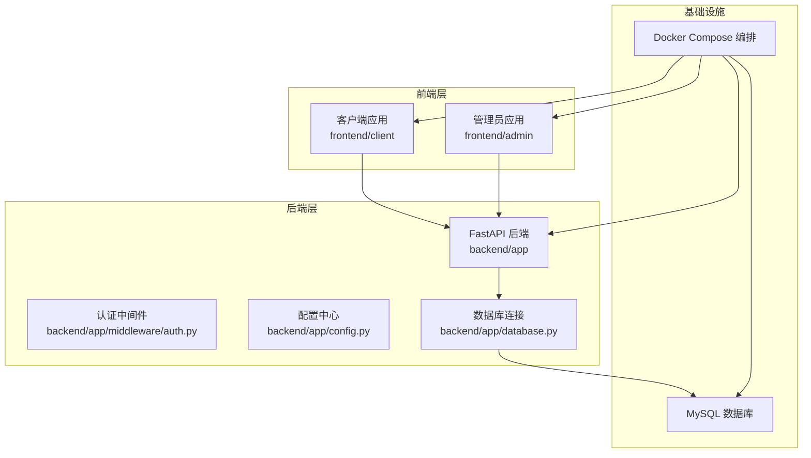
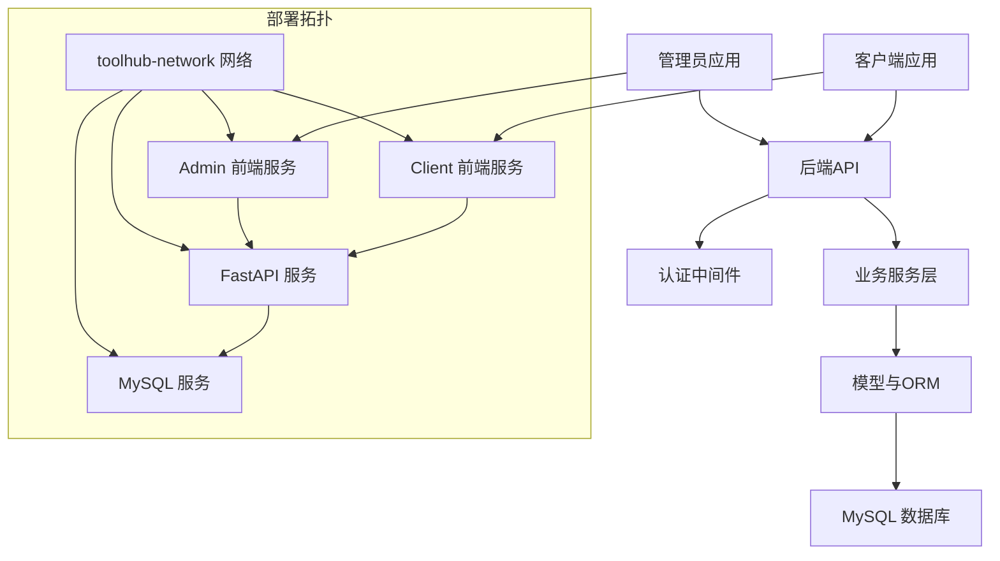
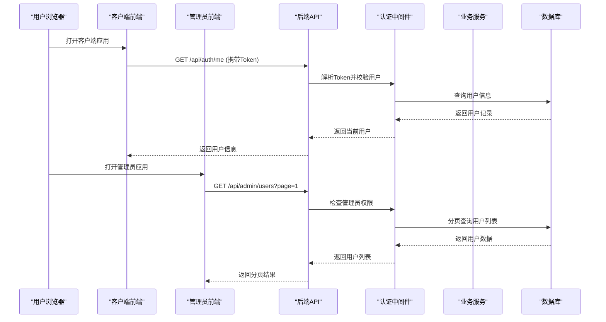
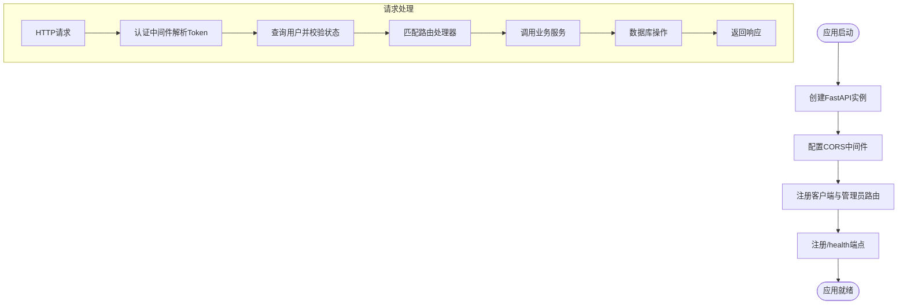
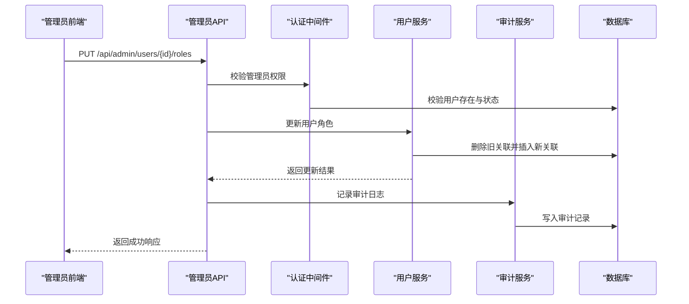
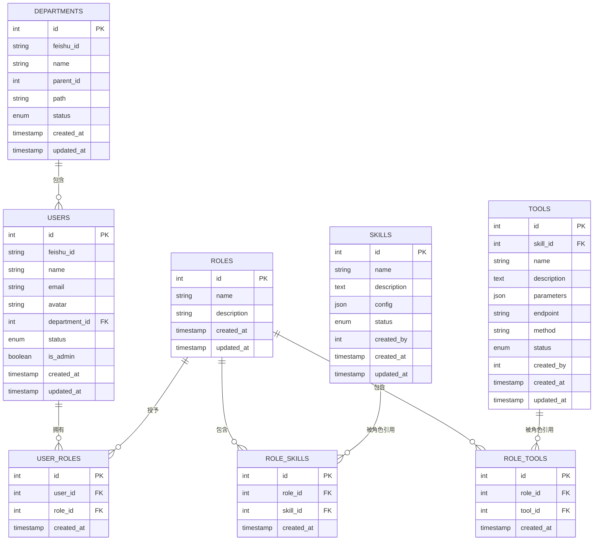
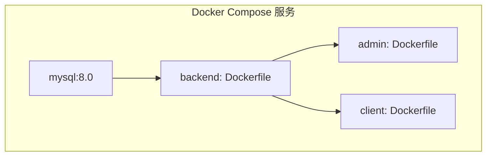
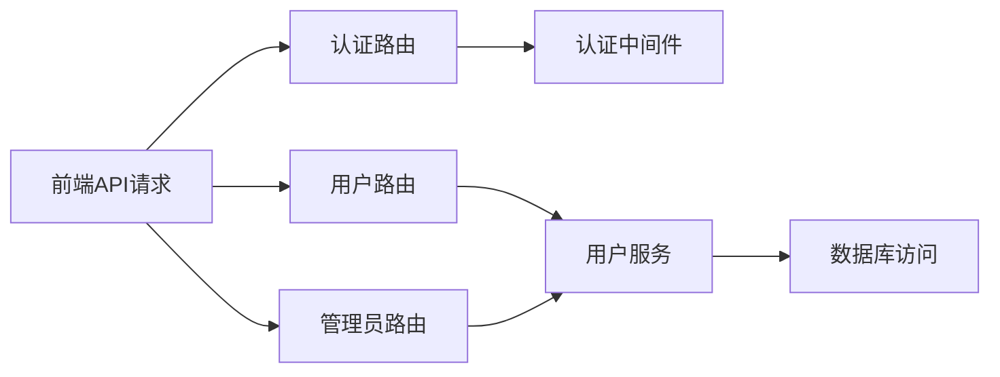

# 整体架构设计

<cite>
**本文档引用的文件**
- [backend/app/main.py](file://backend/app/main.py)
- [backend/app/config.py](file://backend/app/config.py)
- [backend/app/database.py](file://backend/app/database.py)
- [backend/app/middleware/auth.py](file://backend/app/middleware/auth.py)
- [backend/app/api/auth.py](file://backend/app/api/auth.py)
- [backend/app/api/admin/users.py](file://backend/app/api/admin/users.py)
- [backend/app/services/user.py](file://backend/app/services/user.py)
- [backend/app/models/user.py](file://backend/app/models/user.py)
- [frontend/client/src/App.tsx](file://frontend/client/src/App.tsx)
- [frontend/admin/src/App.tsx](file://frontend/admin/src/App.tsx)
- [frontend/client/src/api/request.ts](file://frontend/client/src/api/request.ts)
- [frontend/admin/src/api/request.ts](file://frontend/admin/src/api/request.ts)
- [docker-compose.yml](file://docker-compose.yml)
- [backend/Dockerfile](file://backend/Dockerfile)
- [frontend/client/Dockerfile](file://frontend/client/Dockerfile)
</cite>

## 目录
1. [引言](#引言)
2. [项目结构](#项目结构)
3. [核心组件](#核心组件)
4. [架构总览](#架构总览)
5. [详细组件分析](#详细组件分析)
6. [依赖关系分析](#依赖关系分析)
7. [性能考虑](#性能考虑)
8. [故障排除指南](#故障排除指南)
9. [结论](#结论)
10. [附录](#附录)

## 引言
本文件面向ToolHub项目的整体架构设计，重点阐述前后端分离的实现方式与部署策略，说明FastAPI后端服务的单体架构设计（路由组织、中间件与CORS配置），以及系统的三层架构划分：表现层（前端React应用）、业务逻辑层（FastAPI后端）、数据访问层（数据库）。同时，文档讨论了微服务化设计的考虑因素与当前单体部署策略，并提供系统拓扑图与关键流程时序图，帮助读者快速理解系统交互关系与数据流向。

## 项目结构
ToolHub采用前后端分离的双前端架构：客户端应用（client）与管理员应用（admin）分别独立开发、独立构建与独立部署；后端使用FastAPI提供统一REST API；数据库采用MySQL，通过SQLAlchemy ORM进行访问；容器编排使用Docker Compose，统一管理MySQL、后端、前端（admin与client）服务。

图表来源
- [docker-compose.yml:1-84](file://docker-compose.yml#L1-L84)
- [backend/app/main.py:9-51](file://backend/app/main.py#L9-L51)
- [backend/app/database.py:1-25](file://backend/app/database.py#L1-L25)
- [backend/app/config.py:11-42](file://backend/app/config.py#L11-L42)

章节来源
- [docker-compose.yml:1-84](file://docker-compose.yml#L1-L84)
- [backend/app/main.py:9-51](file://backend/app/main.py#L9-L51)
- [backend/app/config.py:11-42](file://backend/app/config.py#L11-L42)
- [backend/app/database.py:1-25](file://backend/app/database.py#L1-L25)

## 核心组件
- 前端应用（客户端与管理员）
  - 均基于React + Vite构建，使用Axios封装请求，统一设置Authorization头并处理401未授权跳转。
  - 路由控制登录态，未登录自动跳转至登录页。
- 后端服务（FastAPI）
  - 单体应用，集中注册认证、用户、技能、工具、权限申请等路由；同时提供管理员专用路由与外部验证接口。
  - 配置中心集中管理应用名、版本、数据库连接、JWT密钥、飞书OAuth参数与CORS白名单。
  - 中间件负责Token解析、用户校验与管理员权限校验。
  - 数据库连接通过SQLAlchemy引擎与会话工厂管理，支持连接池预检查与回收。
- 数据库（MySQL）
  - 使用SQLAlchemy ORM映射用户、部门、角色、技能、工具等实体及多对多关系表。
- 容器编排（Docker Compose）
  - 统一网络、环境变量注入、健康检查与端口映射，确保服务间稳定通信与可扩展部署。

章节来源
- [frontend/client/src/App.tsx:1-42](file://frontend/client/src/App.tsx#L1-L42)
- [frontend/admin/src/App.tsx:1-44](file://frontend/admin/src/App.tsx#L1-L44)
- [frontend/client/src/api/request.ts:1-28](file://frontend/client/src/api/request.ts#L1-L28)
- [frontend/admin/src/api/request.ts:1-28](file://frontend/admin/src/api/request.ts#L1-L28)
- [backend/app/main.py:9-51](file://backend/app/main.py#L9-L51)
- [backend/app/config.py:11-42](file://backend/app/config.py#L11-L42)
- [backend/app/middleware/auth.py:1-45](file://backend/app/middleware/auth.py#L1-L45)
- [backend/app/database.py:1-25](file://backend/app/database.py#L1-L25)
- [backend/app/models/user.py:1-116](file://backend/app/models/user.py#L1-L116)

## 架构总览
ToolHub采用“双前端 + 单体后端”的分层架构：
- 表现层：客户端与管理员前端分别提供独立UI，共享后端API。
- 业务逻辑层：FastAPI作为统一入口，按功能模块组织路由，中间件统一处理鉴权与权限。
- 数据访问层：MySQL + SQLAlchemy ORM，提供模型定义与查询能力。
- 部署层：Docker Compose统一编排，前后端与数据库解耦部署，便于横向扩展与环境隔离。

图表来源
- [docker-compose.yml:1-84](file://docker-compose.yml#L1-L84)
- [backend/app/main.py:25-42](file://backend/app/main.py#L25-L42)
- [backend/app/middleware/auth.py:12-33](file://backend/app/middleware/auth.py#L12-L33)
- [backend/app/models/user.py:23-39](file://backend/app/models/user.py#L23-L39)

## 详细组件分析

### 前端应用（客户端与管理员）
- 路由与登录态
  - 未登录时仅允许访问登录页，其他路由重定向到登录页。
  - 登录成功后进入主布局，按页面模块渲染。
- 请求拦截与认证
  - Axios实例统一设置基础路径为“/api”，并在请求头中携带Authorization Bearer Token。
  - 对401错误响应，清理本地Token并跳转到登录页。
- 独立部署
  - 客户端与管理员前端分别构建，端口不同，通过反向代理或Docker端口映射对外提供服务。

图表来源
- [frontend/client/src/App.tsx:13-39](file://frontend/client/src/App.tsx#L13-L39)
- [frontend/admin/src/App.tsx:14-41](file://frontend/admin/src/App.tsx#L14-L41)
- [frontend/client/src/api/request.ts:8-25](file://frontend/client/src/api/request.ts#L8-L25)
- [frontend/admin/src/api/request.ts:8-25](file://frontend/admin/src/api/request.ts#L8-L25)
- [backend/app/middleware/auth.py:12-33](file://backend/app/middleware/auth.py#L12-L33)
- [backend/app/api/admin/users.py:14-39](file://backend/app/api/admin/users.py#L14-L39)

章节来源
- [frontend/client/src/App.tsx:1-42](file://frontend/client/src/App.tsx#L1-L42)
- [frontend/admin/src/App.tsx:1-44](file://frontend/admin/src/App.tsx#L1-L44)
- [frontend/client/src/api/request.ts:1-28](file://frontend/client/src/api/request.ts#L1-L28)
- [frontend/admin/src/api/request.ts:1-28](file://frontend/admin/src/api/request.ts#L1-L28)

### 后端服务（FastAPI）
- 应用初始化与CORS
  - 创建FastAPI实例，设置标题、版本与描述。
  - 注册CORS中间件，允许指定源、凭据、方法与头。
- 路由组织
  - 客户端API：认证、用户、技能、工具、权限申请等。
  - 管理员API：用户、角色、技能、工具、审批、部门、审计日志等。
  - 外部验证API：权限验证接口。
- 健康检查
  - 提供/health端点返回运行状态与版本信息。
- 配置中心
  - 集中管理应用名、版本、数据库URL、JWT密钥、飞书OAuth参数与CORS白名单。
- 数据库连接
  - 基于SQLAlchemy创建引擎，启用echo（调试）、pool_pre_ping与pool_recycle。
  - 提供get_db依赖以在请求生命周期内管理会话。
- 认证中间件
  - HTTP Bearer认证，从Token解析用户ID，查询用户并校验状态。
  - 提供require_admin装饰器用于管理员权限校验。

图表来源
- [backend/app/main.py:9-51](file://backend/app/main.py#L9-L51)
- [backend/app/config.py:11-42](file://backend/app/config.py#L11-L42)
- [backend/app/middleware/auth.py:12-44](file://backend/app/middleware/auth.py#L12-L44)
- [backend/app/database.py:5-24](file://backend/app/database.py#L5-L24)

章节来源
- [backend/app/main.py:9-51](file://backend/app/main.py#L9-L51)
- [backend/app/config.py:11-42](file://backend/app/config.py#L11-L42)
- [backend/app/middleware/auth.py:1-45](file://backend/app/middleware/auth.py#L1-L45)
- [backend/app/database.py:1-25](file://backend/app/database.py#L1-L25)

### 管理员API与用户服务
- 管理员API示例：用户列表分页查询、用户详情、角色分配、状态变更。
- 用户服务：提供用户列表、详情、角色更新、状态更新与权限聚合查询。
- 权限审计：在角色与状态变更时记录审计日志。

图表来源
- [backend/app/api/admin/users.py:67-97](file://backend/app/api/admin/users.py#L67-L97)
- [backend/app/services/user.py:35-52](file://backend/app/services/user.py#L35-L52)

章节来源
- [backend/app/api/admin/users.py:1-97](file://backend/app/api/admin/users.py#L1-L97)
- [backend/app/services/user.py:1-86](file://backend/app/services/user.py#L1-L86)

### 数据模型与关系
- 实体关系：用户、部门、角色、技能、工具及其多对多关联表。
- 关键字段：用户状态、角色状态、工具端点与方法、JSON配置等。
- 外键约束：Cascade删除保证数据一致性。

图表来源
- [backend/app/models/user.py:7-116](file://backend/app/models/user.py#L7-L116)

章节来源
- [backend/app/models/user.py:1-116](file://backend/app/models/user.py#L1-L116)

### 部署与容器编排
- Docker Compose
  - MySQL：设置根密码、数据库名、用户与密码，暴露端口并挂载卷。
  - Backend：构建后端镜像，注入数据库URL、JWT、飞书OAuth与CORS配置，等待MySQL健康后再启动。
  - Admin与Client：分别构建前端镜像，暴露80端口，依赖后端服务。
  - 共享网络：toolhub-network桥接所有服务。
- Dockerfile
  - 后端：使用uv安装依赖，执行数据库迁移，启动Uvicorn。
  - 前端：Node构建产物，Nginx静态服务。

图表来源
- [docker-compose.yml:1-84](file://docker-compose.yml#L1-L84)
- [backend/Dockerfile:1-29](file://backend/Dockerfile#L1-L29)
- [frontend/client/Dockerfile:1-30](file://frontend/client/Dockerfile#L1-L30)

章节来源
- [docker-compose.yml:1-84](file://docker-compose.yml#L1-L84)
- [backend/Dockerfile:1-29](file://backend/Dockerfile#L1-L29)
- [frontend/client/Dockerfile:1-30](file://frontend/client/Dockerfile#L1-L30)

## 依赖关系分析
- 组件耦合
  - 前端通过Axios与后端统一API前缀“/api”交互，降低耦合度。
  - 后端路由按功能模块拆分，APIRouter与服务层解耦。
  - 中间件与业务服务通过依赖注入解耦，便于测试与替换。
- 外部依赖
  - 数据库：MySQL + SQLAlchemy。
  - 认证：JWT Token与飞书OAuth2。
  - 前端：React、Ant Design、Axios、Zustand。
- 可能的循环依赖
  - 当前结构清晰，未发现直接循环导入；建议后续微服务化时避免跨服务循环引用。

图表来源
- [backend/app/api/auth.py:13-47](file://backend/app/api/auth.py#L13-L47)
- [backend/app/api/admin/users.py:14-97](file://backend/app/api/admin/users.py#L14-L97)
- [backend/app/middleware/auth.py:12-44](file://backend/app/middleware/auth.py#L12-L44)
- [backend/app/services/user.py:8-86](file://backend/app/services/user.py#L8-L86)

章节来源
- [backend/app/api/auth.py:1-48](file://backend/app/api/auth.py#L1-L48)
- [backend/app/api/admin/users.py:1-97](file://backend/app/api/admin/users.py#L1-L97)
- [backend/app/middleware/auth.py:1-45](file://backend/app/middleware/auth.py#L1-L45)
- [backend/app/services/user.py:1-86](file://backend/app/services/user.py#L1-L86)

## 性能考虑
- 连接池与超时
  - 后端数据库连接启用pool_pre_ping与pool_recycle，减少断连与资源泄漏风险。
  - Axios请求设置合理超时，避免前端长时间阻塞。
- 缓存与分页
  - 列表查询支持分页参数，建议结合Redis缓存热点数据（如技能/工具清单）。
- 并发与异步
  - 后端使用Uvicorn异步服务器，前端请求并发友好。
- 部署优化
  - 前端使用Nginx静态服务，开启Gzip压缩与缓存头。
  - Docker镜像分层构建，减少重复安装依赖。

## 故障排除指南
- 401未授权
  - 现象：前端收到401并跳转登录页。
  - 排查：确认本地Token是否存在、是否过期；后端JWT密钥与算法配置正确。
- CORS跨域失败
  - 现象：浏览器报跨域错误。
  - 排查：核对CORS_ORIGINS配置，确保包含前端开发端口与生产域名。
- 数据库连接异常
  - 现象：后端启动时报连接失败或超时。
  - 排查：确认DATABASE_URL格式、MySQL服务健康、网络可达与账号权限。
- 管理员权限不足
  - 现象：访问管理员接口返回403。
  - 排查：确认用户is_admin标记与Token中的用户ID有效。

章节来源
- [frontend/client/src/api/request.ts:16-25](file://frontend/client/src/api/request.ts#L16-L25)
- [frontend/admin/src/api/request.ts:16-25](file://frontend/admin/src/api/request.ts#L16-L25)
- [backend/app/config.py:31-36](file://backend/app/config.py#L31-L36)
- [backend/app/middleware/auth.py:18-32](file://backend/app/middleware/auth.py#L18-L32)

## 结论
ToolHub当前采用“双前端 + 单体后端 + MySQL”的成熟架构，具备清晰的分层与职责边界，适合中小规模团队快速迭代。随着业务增长，可考虑以下演进方向：
- 微服务化：将用户、权限、审计等模块拆分为独立服务，引入API网关与消息队列。
- 多租户与灰度：在后端增加租户维度与流量切分能力。
- 监控与可观测性：接入APM、日志聚合与指标监控。
- 前端工程化：统一构建脚手架、TypeScript严格模式与组件库规范。

## 附录
- 关键配置项
  - 应用名与版本：APP_NAME、APP_VERSION
  - 数据库URL：DATABASE_URL
  - JWT密钥与算法：JWT_SECRET_KEY、JWT_ALGORITHM
  - 飞书OAuth参数：FEISHU_*系列
  - CORS白名单：CORS_ORIGINS
- 健康检查
  - /health返回状态与版本信息，便于容器编排与运维监控。

章节来源
- [backend/app/config.py:11-42](file://backend/app/config.py#L11-L42)
- [backend/app/main.py:44-46](file://backend/app/main.py#L44-L46)