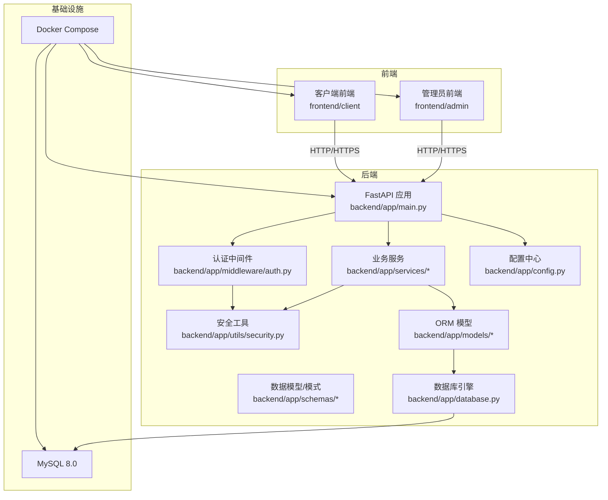
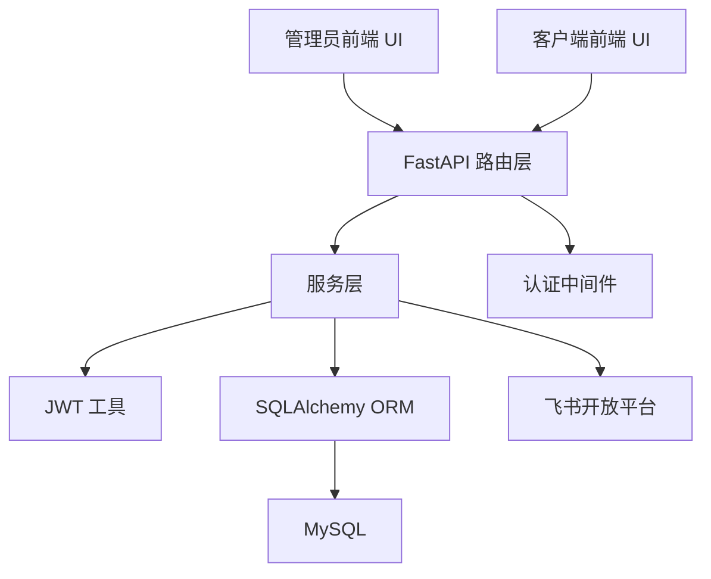
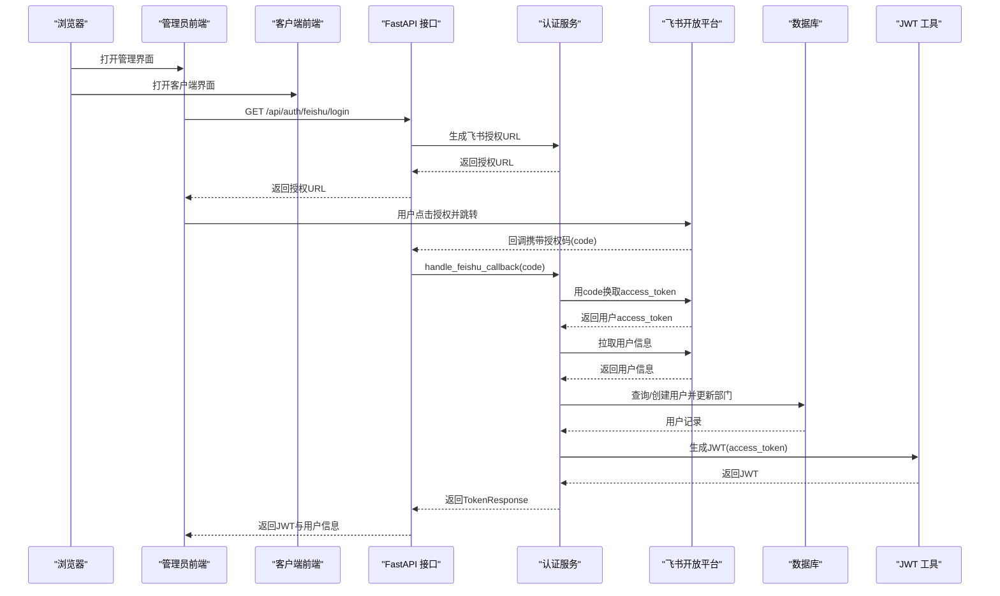
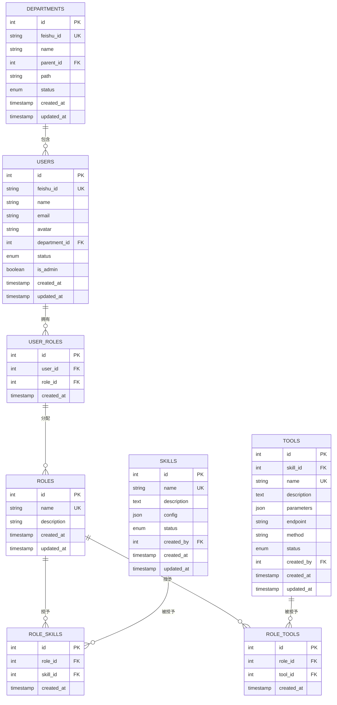
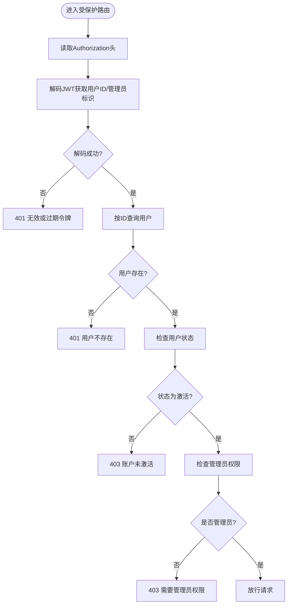
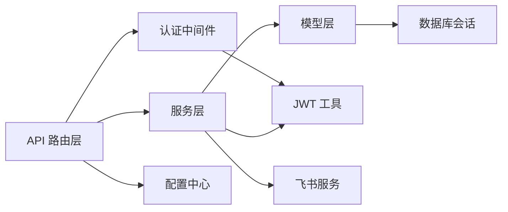

# 系统架构

<cite>
**本文引用的文件**
- [backend/app/main.py](file://backend/app/main.py)
- [backend/docker-compose.yml](file://backend/docker-compose.yml)
- [backend/app/config.py](file://backend/app/config.py)
- [backend/app/database.py](file://backend/app/database.py)
- [backend/app/middleware/auth.py](file://backend/app/middleware/auth.py)
- [backend/app/models/__init__.py](file://backend/app/models/__init__.py)
- [backend/app/models/user.py](file://backend/app/models/user.py)
- [backend/app/schemas/auth.py](file://backend/app/schemas/auth.py)
- [backend/app/utils/security.py](file://backend/app/utils/security.py)
- [backend/app/api/auth.py](file://backend/app/api/auth.py)
- [backend/app/services/auth.py](file://backend/app/services/auth.py)
- [backend/pyproject.toml](file://backend/pyproject.toml)
- [frontend/admin/src/main.tsx](file://frontend/admin/src/main.tsx)
- [frontend/client/src/main.tsx](file://frontend/client/src/main.tsx)
</cite>

## 目录
1. [引言](#引言)
2. [项目结构](#项目结构)
3. [核心组件](#核心组件)
4. [架构总览](#架构总览)
5. [详细组件分析](#详细组件分析)
6. [依赖分析](#依赖分析)
7. [性能考虑](#性能考虑)
8. [故障排查指南](#故障排查指南)
9. [结论](#结论)
10. [附录](#附录)

## 引言
本文件为ToolHub系统的架构文档，聚焦于整体系统设计与实现细节，涵盖前后端分离、微服务化思路、数据流架构、分层设计、认证与权限、飞书OAuth2集成、可扩展性与性能、安全架构等内容。系统采用FastAPI作为后端框架、React作为前端框架、MySQL作为持久化存储，并通过Docker Compose进行容器化编排。

## 项目结构
ToolHub采用前后端分离的多容器部署方式：
- 后端：FastAPI应用，提供REST API，包含认证、用户、技能、工具、权限申请、审计日志等模块；使用SQLAlchemy ORM与MySQL交互；通过中间件实现鉴权与权限控制。
- 前端：两个独立的React应用，分别面向管理员后台与普通客户端，均基于Ant Design与React Router构建。
- 数据库：MySQL 8.0，通过环境变量配置连接参数，支持健康检查与持久化卷。
- 编排：Docker Compose统一管理数据库、后端、管理员前端、客户端前端四类服务。

图表来源
- [backend/docker-compose.yml:1-84](file://backend/docker-compose.yml#L1-L84)
- [backend/app/main.py:1-61](file://backend/app/main.py#L1-L61)
- [backend/app/database.py:1-25](file://backend/app/database.py#L1-L25)
- [backend/app/config.py:1-36](file://backend/app/config.py#L1-L36)

章节来源
- [backend/docker-compose.yml:1-84](file://backend/docker-compose.yml#L1-L84)
- [backend/app/main.py:1-61](file://backend/app/main.py#L1-L61)

## 核心组件
- 应用入口与路由注册：在应用启动时创建FastAPI实例，配置CORS，注册认证、用户、技能、工具、权限申请、管理员相关以及外部验证接口路由，并提供健康检查端点。
- 认证与权限中间件：提供获取当前用户与管理员校验的依赖函数，基于HTTP Bearer Token进行鉴权，查询用户状态与管理员标识。
- 安全工具：封装JWT生成与解码逻辑，支持密钥、算法与过期时间配置。
- 数据模型与ORM：定义用户、部门、角色、技能、工具及关联表，使用SQLAlchemy ORM映射至MySQL。
- 飞书OAuth2服务：封装飞书授权URL生成、回调处理、用户信息获取、用户创建/更新与JWT签发。
- 配置中心：集中管理数据库连接、JWT、飞书OAuth2、CORS等运行时配置。
- 前端入口：两个React应用分别挂载到不同端口，使用Ant Design与React Router组织页面与布局。

章节来源
- [backend/app/main.py:9-48](file://backend/app/main.py#L9-L48)
- [backend/app/middleware/auth.py:12-44](file://backend/app/middleware/auth.py#L12-L44)
- [backend/app/utils/security.py:8-31](file://backend/app/utils/security.py#L8-L31)
- [backend/app/models/user.py:7-116](file://backend/app/models/user.py#L7-L116)
- [backend/app/services/auth.py:9-79](file://backend/app/services/auth.py#L9-L79)
- [backend/app/config.py:5-32](file://backend/app/config.py#L5-L32)
- [frontend/admin/src/main.tsx:1-18](file://frontend/admin/src/main.tsx#L1-L18)
- [frontend/client/src/main.tsx:1-18](file://frontend/client/src/main.tsx#L1-L18)

## 架构总览
系统采用“前端多入口 + 后端单体API + 关系型数据库”的分层架构：
- 表现层：管理员前端与客户端前端，负责UI渲染、路由导航与状态管理。
- 业务逻辑层：后端FastAPI路由与服务层，封装认证、权限、飞书集成、资源管理等业务规则。
- 数据访问层：SQLAlchemy ORM与MySQL，提供数据持久化与事务管理。
- 外部集成：飞书开放平台OAuth2，用于企业级用户身份拉取与授权。

图表来源
- [backend/app/main.py:25-42](file://backend/app/main.py#L25-L42)
- [backend/app/middleware/auth.py:12-44](file://backend/app/middleware/auth.py#L12-L44)
- [backend/app/utils/security.py:8-31](file://backend/app/utils/security.py#L8-L31)
- [backend/app/database.py:1-25](file://backend/app/database.py#L1-L25)
- [backend/app/services/auth.py:13-76](file://backend/app/services/auth.py#L13-L76)

## 详细组件分析

### 认证与权限流程（飞书OAuth2）
该流程覆盖从发起授权到签发JWT并返回用户信息的完整链路，包含错误处理与用户状态校验。

图表来源
- [backend/app/api/auth.py:13-27](file://backend/app/api/auth.py#L13-L27)
- [backend/app/services/auth.py:13-76](file://backend/app/services/auth.py#L13-L76)
- [backend/app/utils/security.py:8-17](file://backend/app/utils/security.py#L8-L17)
- [backend/app/middleware/auth.py:12-33](file://backend/app/middleware/auth.py#L12-L33)

章节来源
- [backend/app/api/auth.py:1-48](file://backend/app/api/auth.py#L1-L48)
- [backend/app/services/auth.py:1-80](file://backend/app/services/auth.py#L1-L80)
- [backend/app/utils/security.py:1-32](file://backend/app/utils/security.py#L1-L32)
- [backend/app/middleware/auth.py:1-45](file://backend/app/middleware/auth.py#L1-L45)

### 数据模型与关系
系统围绕用户、部门、角色、技能、工具建立实体关系，支持多对多与一对多关联，并通过中间表维护角色-技能、角色-工具等关系。

图表来源
- [backend/app/models/user.py:7-116](file://backend/app/models/user.py#L7-L116)
- [backend/app/models/__init__.py:1-17](file://backend/app/models/__init__.py#L1-L17)

章节来源
- [backend/app/models/user.py:1-116](file://backend/app/models/user.py#L1-L116)
- [backend/app/models/__init__.py:1-17](file://backend/app/models/__init__.py#L1-L17)

### 中间件与权限控制
- 当前用户解析：从Authorization头中提取Bearer Token，解码得到用户ID与管理员标识，查询数据库确认用户存在且状态有效。
- 管理员权限：在当前用户基础上进一步校验管理员标识，未满足则拒绝访问。

图表来源
- [backend/app/middleware/auth.py:12-44](file://backend/app/middleware/auth.py#L12-L44)
- [backend/app/utils/security.py:20-31](file://backend/app/utils/security.py#L20-L31)

章节来源
- [backend/app/middleware/auth.py:1-45](file://backend/app/middleware/auth.py#L1-L45)
- [backend/app/utils/security.py:1-32](file://backend/app/utils/security.py#L1-L32)

### 技术选型说明
- FastAPI：异步高性能、自动生成OpenAPI文档、Pydantic集成良好、类型提示完善，适合构建高并发API。
- React：组件化开发体验佳、生态丰富、与TypeScript结合良好，适合快速搭建多端前端。
- MySQL：成熟的关系型数据库，事务与ACID特性完备，适配SQLAlchemy ORM，便于演进与运维。
- Docker Compose：统一编排后端、数据库与前后端前端，简化部署与环境一致性。

章节来源
- [backend/pyproject.toml:7-20](file://backend/pyproject.toml#L7-L20)
- [backend/docker-compose.yml:1-84](file://backend/docker-compose.yml#L1-L84)

## 依赖分析
- 组件内聚：路由层仅负责参数解析与响应封装，业务逻辑集中在服务层；模型层与数据库层解耦，便于测试与替换。
- 组件耦合：服务层依赖模型层与数据库会话；认证中间件依赖安全工具与数据库；API层依赖服务层与中间件。
- 外部依赖：飞书开放平台OAuth2、MySQL驱动、JWT库、CORS中间件等。
- 可能的循环依赖：当前结构以“路由 → 服务 → 模型/数据库”单向依赖为主，未见循环导入迹象。

图表来源
- [backend/app/main.py:25-42](file://backend/app/main.py#L25-L42)
- [backend/app/middleware/auth.py:1-45](file://backend/app/middleware/auth.py#L1-L45)
- [backend/app/utils/security.py:1-32](file://backend/app/utils/security.py#L1-L32)
- [backend/app/database.py:1-25](file://backend/app/database.py#L1-L25)
- [backend/app/config.py:1-36](file://backend/app/config.py#L1-L36)
- [backend/app/services/auth.py:1-80](file://backend/app/services/auth.py#L1-L80)

章节来源
- [backend/app/main.py:1-61](file://backend/app/main.py#L1-L61)
- [backend/app/database.py:1-25](file://backend/app/database.py#L1-L25)
- [backend/app/config.py:1-36](file://backend/app/config.py#L1-L36)

## 性能考虑
- 异步I/O与连接池：FastAPI基于异步，配合SQLAlchemy连接池与pool_pre_ping，减少慢连接与超时问题。
- JWT短路校验：中间件直接解码JWT并快速查询用户，避免重复远程调用。
- 前端静态资源：React应用通过Nginx提供静态文件服务，降低后端压力。
- 缓存策略：当前未见缓存层，可在热点数据（如用户信息、角色-权限映射）引入Redis缓存以提升读性能。
- 数据库索引：建议对常用查询字段（如用户feishu_id、部门feishu_id、角色名等）建立索引，优化JOIN与过滤性能。

## 故障排查指南
- 认证失败
  - 现象：401未授权或403禁止访问。
  - 排查：确认Authorization头格式正确、JWT未过期、用户状态为激活、管理员权限满足要求。
  - 参考：中间件异常分支与JWT解码逻辑。
- 飞书回调异常
  - 现象：回调接口返回错误信息。
  - 排查：检查飞书APP ID/Secret、回调地址配置、网络可达性、数据库写入是否成功。
  - 参考：认证服务回调处理与用户创建/更新流程。
- 数据库连接失败
  - 现象：应用启动或请求时报数据库连接错误。
  - 排查：核对DATABASE_URL、MySQL容器健康状态、网络连通性与凭据。
  - 参考：数据库引擎与Docker Compose配置。
- CORS跨域问题
  - 现象：浏览器报跨域错误。
  - 排查：核对CORS_ORIGINS配置与前端访问域名一致。
  - 参考：应用CORS中间件与配置项。

章节来源
- [backend/app/middleware/auth.py:12-44](file://backend/app/middleware/auth.py#L12-L44)
- [backend/app/services/auth.py:16-27](file://backend/app/services/auth.py#L16-L27)
- [backend/app/database.py:5-10](file://backend/app/database.py#L5-L10)
- [backend/app/config.py:25-30](file://backend/app/config.py#L25-L30)
- [backend/docker-compose.yml:16-22](file://backend/docker-compose.yml#L16-L22)

## 结论
ToolHub采用清晰的前后端分离与分层架构，后端以FastAPI为核心，结合SQLAlchemy与MySQL，提供稳定的数据持久化能力；前端以React为基础，分别服务于管理员与客户端场景；通过飞书OAuth2实现企业级身份集成。整体架构具备良好的可扩展性与可维护性，后续可在缓存、消息队列、微服务拆分等方面继续演进。

## 附录
- 运行与部署
  - 使用Docker Compose一键启动：数据库、后端、管理员前端、客户端前端。
  - 环境变量：数据库连接、JWT密钥与算法、飞书应用参数、CORS白名单等。
- 开发建议
  - 新增API时遵循“路由 → 服务 → 模型/数据库”的分层，保持中间件复用。
  - 对外接口统一返回规范响应结构，便于前端消费与错误处理。
  - 在生产环境替换默认JWT密钥与开启HTTPS，强化传输与存储安全。

章节来源
- [backend/docker-compose.yml:1-84](file://backend/docker-compose.yml#L1-L84)
- [backend/app/config.py:5-32](file://backend/app/config.py#L5-L32)
- [backend/app/main.py:16-23](file://backend/app/main.py#L16-L23)