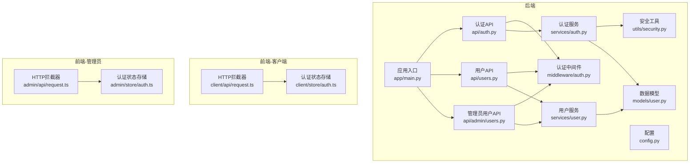
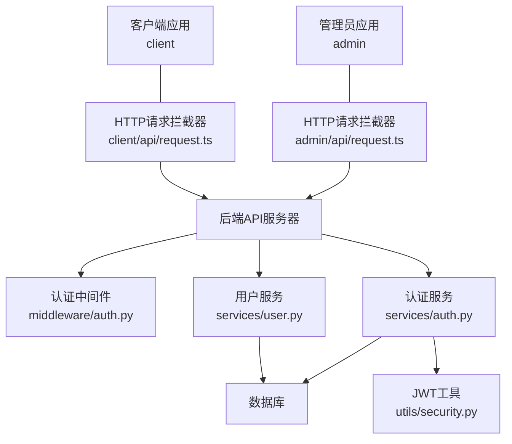
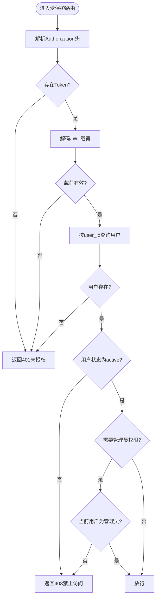
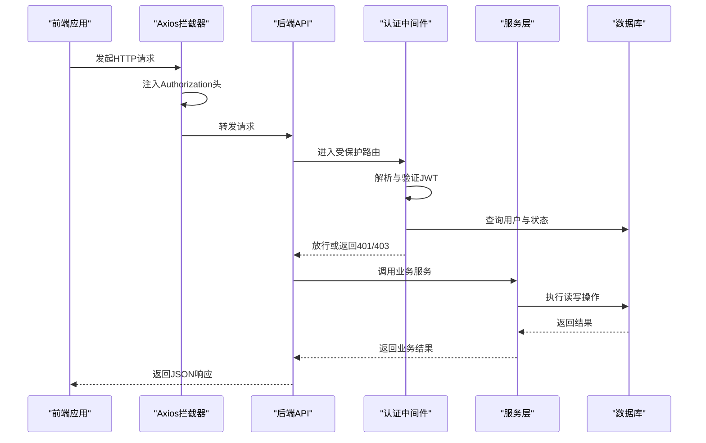
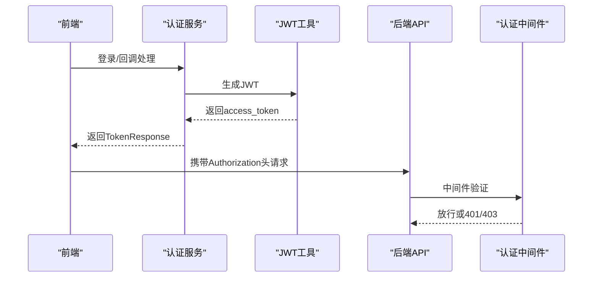
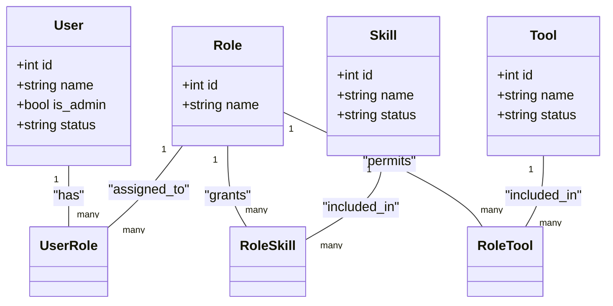
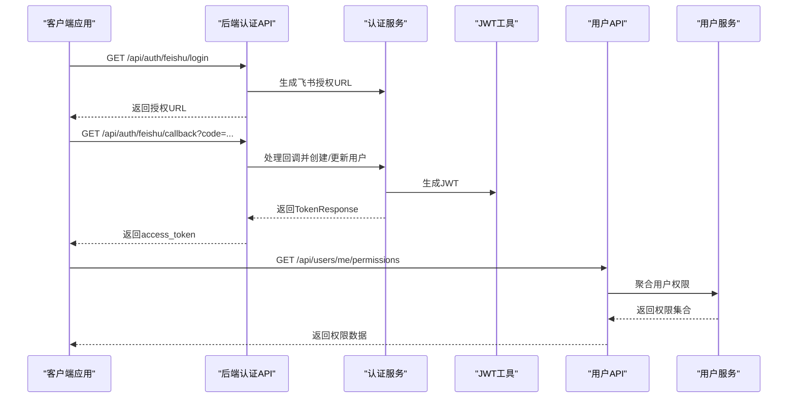
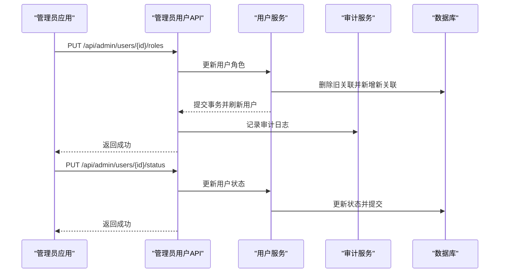
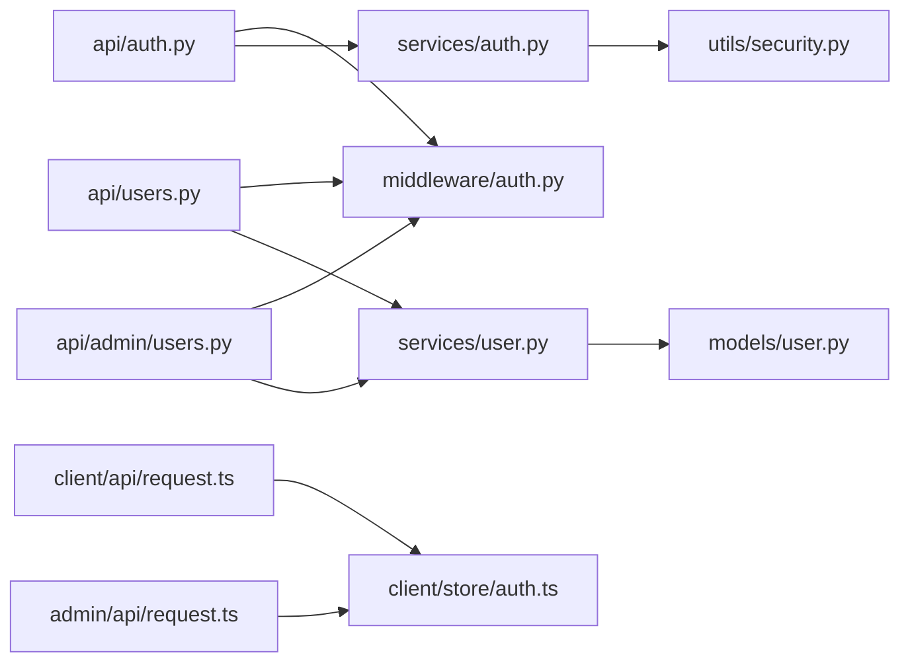

# 组件交互关系

<cite>
**本文引用的文件**
- [backend/app/main.py](file://backend/app/main.py)
- [backend/app/middleware/auth.py](file://backend/app/middleware/auth.py)
- [backend/app/api/auth.py](file://backend/app/api/auth.py)
- [backend/app/utils/security.py](file://backend/app/utils/security.py)
- [backend/app/services/auth.py](file://backend/app/services/auth.py)
- [backend/app/api/users.py](file://backend/app/api/users.py)
- [backend/app/api/admin/users.py](file://backend/app/api/admin/users.py)
- [backend/app/services/user.py](file://backend/app/services/user.py)
- [backend/app/models/user.py](file://backend/app/models/user.py)
- [backend/app/schemas/auth.py](file://backend/app/schemas/auth.py)
- [backend/app/config.py](file://backend/app/config.py)
- [frontend/client/src/store/auth.ts](file://frontend/client/src/store/auth.ts)
- [frontend/admin/src/store/auth.ts](file://frontend/admin/src/store/auth.ts)
- [frontend/client/src/api/request.ts](file://frontend/client/src/api/request.ts)
- [frontend/admin/src/api/request.ts](file://frontend/admin/src/api/request.ts)
</cite>

## 目录
1. [引言](#引言)
2. [项目结构](#项目结构)
3. [核心组件](#核心组件)
4. [架构总览](#架构总览)
5. [详细组件分析](#详细组件分析)
6. [依赖分析](#依赖分析)
7. [性能考虑](#性能考虑)
8. [故障排查指南](#故障排查指南)
9. [结论](#结论)
10. [附录](#附录)

## 引言
本文件面向ToolHub项目的组件交互关系，系统性梳理前后端交互模式、认证与权限中间件、服务层与数据访问层的协作、管理员与客户端应用的功能差异与数据隔离机制，并提供典型用户场景的时序图与交互图，帮助开发者与运维人员快速理解系统运行机制。

## 项目结构
- 后端采用FastAPI框架，按功能模块组织：API路由、中间件、服务层、数据模型、配置与工具。
- 前端分为两个独立应用：客户端应用（client）与管理员应用（admin），分别对应不同的业务域与权限边界。
- 路由注册在应用入口集中完成，区分客户端API与管理员API前缀，便于权限与职责分离。

图表来源
- [backend/app/main.py:9-48](file://backend/app/main.py#L9-L48)
- [backend/app/middleware/auth.py:12-33](file://backend/app/middleware/auth.py#L12-L33)
- [backend/app/api/auth.py:10-58](file://backend/app/api/auth.py#L10-L58)
- [backend/app/api/users.py:1-29](file://backend/app/api/users.py#L1-L29)
- [backend/app/api/admin/users.py:1-97](file://backend/app/api/admin/users.py#L1-L97)
- [backend/app/services/auth.py:10-117](file://backend/app/services/auth.py#L10-L117)
- [backend/app/services/user.py:8-86](file://backend/app/services/user.py#L8-L86)
- [backend/app/utils/security.py:8-32](file://backend/app/utils/security.py#L8-L32)
- [backend/app/models/user.py:23-116](file://backend/app/models/user.py#L23-L116)
- [frontend/client/src/store/auth.ts:18-29](file://frontend/client/src/store/auth.ts#L18-L29)
- [frontend/admin/src/store/auth.ts:18-29](file://frontend/admin/src/store/auth.ts#L18-L29)
- [frontend/client/src/api/request.ts:8-25](file://frontend/client/src/api/request.ts#L8-L25)
- [frontend/admin/src/api/request.ts:8-25](file://frontend/admin/src/api/request.ts#L8-L25)

章节来源
- [backend/app/main.py:9-48](file://backend/app/main.py#L9-L48)

## 核心组件
- 应用入口与路由注册：集中注册客户端API与管理员API，统一CORS配置与健康检查端点。
- 认证中间件：负责从Authorization头解析JWT，解码Token，查询用户并校验状态；提供管理员权限校验装饰器。
- 认证服务：封装飞书OAuth2流程与开发模式登录，生成JWT并返回TokenResponse。
- 用户服务：提供用户列表、详情、角色分配、状态变更与权限聚合等能力。
- 数据模型：定义用户、部门、角色、技能、工具及其关联关系。
- 前端拦截器：自动注入Authorization头，处理401未授权并重定向到登录页。
- 前端状态存储：使用本地存储持久化token与用户信息，支持登出清理。

章节来源
- [backend/app/main.py:9-48](file://backend/app/main.py#L9-L48)
- [backend/app/middleware/auth.py:12-44](file://backend/app/middleware/auth.py#L12-L44)
- [backend/app/services/auth.py:10-117](file://backend/app/services/auth.py#L10-L117)
- [backend/app/services/user.py:8-86](file://backend/app/services/user.py#L8-L86)
- [backend/app/models/user.py:23-116](file://backend/app/models/user.py#L23-L116)
- [frontend/client/src/api/request.ts:8-25](file://frontend/client/src/api/request.ts#L8-L25)
- [frontend/admin/src/api/request.ts:8-25](file://frontend/admin/src/api/request.ts#L8-L25)
- [frontend/client/src/store/auth.ts:18-29](file://frontend/client/src/store/auth.ts#L18-L29)
- [frontend/admin/src/store/auth.ts:18-29](file://frontend/admin/src/store/auth.ts#L18-L29)

## 架构总览
系统采用“前端单页应用 + 后端API”分层架构。前端通过Axios拦截器统一携带JWT，后端通过中间件进行鉴权与权限校验，服务层编排业务逻辑，数据层负责持久化与关系映射。

图表来源
- [frontend/client/src/api/request.ts:3-14](file://frontend/client/src/api/request.ts#L3-L14)
- [frontend/admin/src/api/request.ts:3-14](file://frontend/admin/src/api/request.ts#L3-L14)
- [backend/app/middleware/auth.py:12-33](file://backend/app/middleware/auth.py#L12-L33)
- [backend/app/services/user.py:8-86](file://backend/app/services/user.py#L8-L86)
- [backend/app/services/auth.py:10-117](file://backend/app/services/auth.py#L10-L117)
- [backend/app/utils/security.py:8-32](file://backend/app/utils/security.py#L8-L32)

## 详细组件分析

### 认证与权限中间件
- 令牌解析：从Authorization头中提取Bearer Token，调用JWT解码工具验证签名与载荷。
- 用户查询：根据Token中的user_id查询用户，校验用户状态必须为“active”，否则拒绝访问。
- 管理员校验：提供require_admin装饰器，进一步校验用户是否为管理员，非管理员直接拒绝。
- 错误处理：对无效/过期Token、用户不存在、账户非活跃、权限不足等情况返回标准HTTP状态码。

图表来源
- [backend/app/middleware/auth.py:12-44](file://backend/app/middleware/auth.py#L12-L44)
- [backend/app/utils/security.py:20-32](file://backend/app/utils/security.py#L20-L32)

章节来源
- [backend/app/middleware/auth.py:12-44](file://backend/app/middleware/auth.py#L12-L44)
- [backend/app/utils/security.py:20-32](file://backend/app/utils/security.py#L20-L32)

### 前后端交互与RESTful API调用流程
- 客户端应用与管理员应用均通过Axios实例发起请求，自动在请求头添加Authorization: Bearer <token>。
- 后端路由按模块划分：认证、用户、技能、工具、权限申请、管理员用户、角色、技能、工具、审批、部门、审计日志等。
- 统一响应格式：成功返回success_response，失败返回error_response，前端拦截器对401进行统一处理（清空token并跳转登录页）。

图表来源
- [frontend/client/src/api/request.ts:8-25](file://frontend/client/src/api/request.ts#L8-L25)
- [frontend/admin/src/api/request.ts:8-25](file://frontend/admin/src/api/request.ts#L8-L25)
- [backend/app/middleware/auth.py:12-33](file://backend/app/middleware/auth.py#L12-L33)
- [backend/app/api/auth.py:10-58](file://backend/app/api/auth.py#L10-L58)
- [backend/app/api/users.py:12-29](file://backend/app/api/users.py#L12-L29)
- [backend/app/api/admin/users.py:14-97](file://backend/app/api/admin/users.py#L14-L97)

章节来源
- [frontend/client/src/api/request.ts:8-25](file://frontend/client/src/api/request.ts#L8-L25)
- [frontend/admin/src/api/request.ts:8-25](file://frontend/admin/src/api/request.ts#L8-L25)
- [backend/app/api/auth.py:10-58](file://backend/app/api/auth.py#L10-L58)
- [backend/app/api/users.py:12-29](file://backend/app/api/users.py#L12-L29)
- [backend/app/api/admin/users.py:14-97](file://backend/app/api/admin/users.py#L14-L97)

### JWT令牌传递机制
- 生成：认证服务根据用户信息生成JWT，包含user_id与is_admin字段，默认有效期可配置。
- 传递：前端拦截器在每次请求时自动附加Authorization: Bearer <token>。
- 验证：后端中间件解码JWT，校验签名与过期时间，再根据user_id查询用户并检查状态。
- 失效处理：前端拦截器收到401时清除本地token并跳转登录页。

图表来源
- [backend/app/services/auth.py:67-77](file://backend/app/services/auth.py#L67-L77)
- [backend/app/utils/security.py:8-17](file://backend/app/utils/security.py#L8-L17)
- [frontend/client/src/api/request.ts:8-14](file://frontend/client/src/api/request.ts#L8-L14)
- [backend/app/middleware/auth.py:16-33](file://backend/app/middleware/auth.py#L16-L33)

章节来源
- [backend/app/utils/security.py:8-17](file://backend/app/utils/security.py#L8-L17)
- [backend/app/services/auth.py:67-77](file://backend/app/services/auth.py#L67-L77)
- [frontend/client/src/api/request.ts:8-14](file://frontend/client/src/api/request.ts#L8-L14)
- [backend/app/middleware/auth.py:16-33](file://backend/app/middleware/auth.py#L16-L33)

### 错误处理策略
- 统一响应：后端使用success_response与error_response封装响应体，便于前端一致处理。
- 未授权与禁止访问：401与403由前端拦截器统一处理，清空token并跳转登录页。
- 业务异常：服务层抛出的ValueError等异常在API层捕获并返回error_response，避免泄露内部细节。

章节来源
- [backend/app/api/auth.py:26-37](file://backend/app/api/auth.py#L26-L37)
- [backend/app/api/admin/users.py:79-96](file://backend/app/api/admin/users.py#L79-L96)
- [frontend/client/src/api/request.ts:16-25](file://frontend/client/src/api/request.ts#L16-L25)
- [frontend/admin/src/api/request.ts:16-25](file://frontend/admin/src/api/request.ts#L16-L25)

### 业务服务层与数据访问层交互
- 服务编排：API路由调用服务层，服务层组合数据模型与外部接口（如飞书），执行业务规则。
- 事务管理：服务层在关键写操作处显式commit，确保一致性；读操作保持会话默认行为。
- 数据转换：服务层将ORM对象转换为API响应结构，必要时进行集合去重与过滤。
- 关系映射：通过SQLAlchemy关系定义用户-角色-技能-工具的多对多与一对多关系，支撑权限聚合。

图表来源
- [backend/app/models/user.py:23-116](file://backend/app/models/user.py#L23-L116)

章节来源
- [backend/app/services/user.py:66-82](file://backend/app/services/user.py#L66-L82)
- [backend/app/models/user.py:23-116](file://backend/app/models/user.py#L23-L116)

### 管理员应用与客户端应用的功能差异与数据隔离
- 功能差异：客户端应用聚焦个人权限查询、技能与工具浏览、权限申请；管理员应用聚焦用户管理、角色分配、状态变更、审计日志等管理职能。
- 权限隔离：管理员API通过require_admin装饰器强制管理员身份，客户端API通过get_current_user获取当前用户上下文，二者互不交叉。
- 数据隔离：管理员应用可查看与修改所有用户信息，客户端应用仅能访问自身权限与基本信息；服务层在用户维度进行数据过滤与聚合。

章节来源
- [backend/app/api/admin/users.py:14-97](file://backend/app/api/admin/users.py#L14-L97)
- [backend/app/api/users.py:12-29](file://backend/app/api/users.py#L12-L29)
- [backend/app/middleware/auth.py:36-44](file://backend/app/middleware/auth.py#L36-L44)

### 典型用户场景时序图

#### 场景一：客户端用户登录与权限查询

图表来源
- [backend/app/api/auth.py:13-28](file://backend/app/api/auth.py#L13-L28)
- [backend/app/services/auth.py:18-77](file://backend/app/services/auth.py#L18-L77)
- [backend/app/utils/security.py:8-17](file://backend/app/utils/security.py#L8-L17)
- [backend/app/api/users.py:12-19](file://backend/app/api/users.py#L12-L19)
- [backend/app/services/user.py:66-82](file://backend/app/services/user.py#L66-L82)

#### 场景二：管理员用户管理

图表来源
- [backend/app/api/admin/users.py:67-97](file://backend/app/api/admin/users.py#L67-L97)
- [backend/app/services/user.py:35-63](file://backend/app/services/user.py#L35-L63)

### 异步处理与并发控制
- 异步处理：飞书OAuth2回调通过异步函数处理，认证服务在回调链路中异步调用外部接口以换取用户访问令牌与用户信息。
- 并发控制：服务层在写操作（角色分配、状态更新）中使用显式事务提交，避免并发写导致的数据不一致；查询操作保持默认会话行为。
- 请求拦截：前端Axios拦截器统一处理401错误，保证并发请求下的一致性行为。

章节来源
- [backend/app/services/auth.py:18-25](file://backend/app/services/auth.py#L18-L25)
- [backend/app/services/user.py:42-51](file://backend/app/services/user.py#L42-L51)
- [frontend/client/src/api/request.ts:16-25](file://frontend/client/src/api/request.ts#L16-L25)
- [frontend/admin/src/api/request.ts:16-25](file://frontend/admin/src/api/request.ts#L16-L25)

## 依赖分析
- 组件耦合：API层依赖中间件与服务层；服务层依赖数据模型与安全工具；前端拦截器依赖本地存储。
- 外部依赖：飞书OAuth2接口、JWT编码/解码库、Axios网络库、SQLAlchemy ORM。
- 接口契约：API层统一响应结构，服务层与数据层通过ORM关系解耦，降低耦合度。

图表来源
- [backend/app/api/auth.py:10-58](file://backend/app/api/auth.py#L10-L58)
- [backend/app/api/users.py:1-29](file://backend/app/api/users.py#L1-L29)
- [backend/app/api/admin/users.py:1-97](file://backend/app/api/admin/users.py#L1-L97)
- [backend/app/middleware/auth.py:12-33](file://backend/app/middleware/auth.py#L12-L33)
- [backend/app/services/auth.py:10-117](file://backend/app/services/auth.py#L10-L117)
- [backend/app/services/user.py:8-86](file://backend/app/services/user.py#L8-L86)
- [backend/app/utils/security.py:8-32](file://backend/app/utils/security.py#L8-L32)
- [frontend/client/src/api/request.ts:8-25](file://frontend/client/src/api/request.ts#L8-L25)
- [frontend/admin/src/api/request.ts:8-25](file://frontend/admin/src/api/request.ts#L8-L25)
- [frontend/client/src/store/auth.ts:18-29](file://frontend/client/src/store/auth.ts#L18-L29)
- [frontend/admin/src/store/auth.ts:18-29](file://frontend/admin/src/store/auth.ts#L18-L29)

## 性能考虑
- Token有效期：JWT默认有效期可配置，建议结合业务场景调整，避免频繁重新登录。
- 分页查询：管理员用户列表支持分页与关键词过滤，减少一次性传输数据量。
- 缓存策略：前端可对静态资源与非敏感数据进行缓存；后端可对热点查询结果进行缓存（需评估一致性）。
- 并发写：服务层在角色分配与状态更新时使用事务，避免并发写冲突；建议在高并发场景下引入锁或乐观并发控制。

## 故障排查指南
- 401未授权：检查前端是否正确保存token、拦截器是否注入Authorization头、后端中间件是否正确解析JWT。
- 403禁止访问：确认用户状态为active且管理员权限校验通过。
- 开发模式登录不可用：确认后端DEBUG开关已开启，否则开发模式登录会被拒绝。
- 飞书回调失败：检查飞书App ID/Secret、回调地址与网络连通性，关注服务层回调处理日志。

章节来源
- [frontend/client/src/api/request.ts:16-25](file://frontend/client/src/api/request.ts#L16-L25)
- [backend/app/middleware/auth.py:16-33](file://backend/app/middleware/auth.py#L16-L33)
- [backend/app/services/auth.py:80-84](file://backend/app/services/auth.py#L80-L84)

## 结论
ToolHub通过清晰的前后端分层与模块化设计，实现了认证与权限控制、业务服务编排与数据访问解耦、以及管理员与客户端应用的职责分离。JWT令牌与Axios拦截器提供了统一的安全与通信机制，配合中间件与服务层的错误处理策略，保障了系统的安全性与可用性。建议在生产环境中完善令牌刷新、审计日志与监控告警机制，持续优化性能与并发控制策略。

## 附录
- 配置项说明：应用名、版本、数据库连接、JWT密钥与算法、飞书OAuth2参数、CORS允许源等。
- 前端状态：客户端与管理员应用均使用本地存储保存token与用户信息，支持登出清理。

章节来源
- [backend/app/config.py:11-42](file://backend/app/config.py#L11-L42)
- [frontend/client/src/store/auth.ts:18-29](file://frontend/client/src/store/auth.ts#L18-L29)
- [frontend/admin/src/store/auth.ts:18-29](file://frontend/admin/src/store/auth.ts#L18-L29)