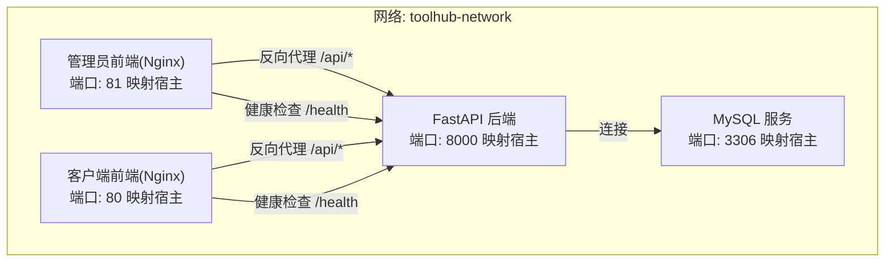
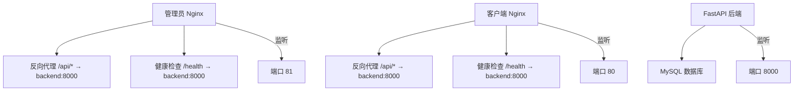
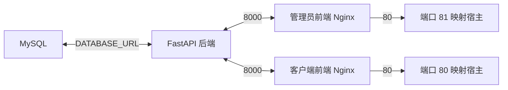

# 容器化部署

<cite>
**本文引用的文件**
- [docker-compose.yml](file://docker-compose.yml)
- [backend/Dockerfile](file://backend/Dockerfile)
- [frontend/admin/Dockerfile](file://frontend/admin/Dockerfile)
- [frontend/client/Dockerfile](file://frontend/client/Dockerfile)
- [backend/pyproject.toml](file://backend/pyproject.toml)
- [backend/app/config.py](file://backend/app/config.py)
- [backend/app/main.py](file://backend/app/main.py)
- [backend/alembic.ini](file://backend/alembic.ini)
- [frontend/admin/nginx.conf](file://frontend/admin/nginx.conf)
- [frontend/client/nginx.conf](file://frontend/client/nginx.conf)
- [backend/.dockerignore](file://backend/.dockerignore)
</cite>

## 目录
1. [简介](#简介)
2. [项目结构](#项目结构)
3. [核心组件](#核心组件)
4. [架构总览](#架构总览)
5. [详细组件分析](#详细组件分析)
6. [依赖关系分析](#依赖关系分析)
7. [性能与可维护性建议](#性能与可维护性建议)
8. [故障排查指南](#故障排查指南)
9. [结论](#结论)
10. [附录](#附录)

## 简介
本文件面向ToolHub项目的容器化部署，围绕Docker Compose编排配置进行系统说明，覆盖MySQL数据库、FastAPI后端、管理员前端与客户端前端四个服务的定义；详述环境变量、端口映射、数据卷与健康检查；给出Dockerfile构建流程与多阶段优化思路；解释网络与容器间通信；并提供本地开发与生产环境的差异化部署策略、容器重启策略与故障恢复机制。

## 项目结构
ToolHub采用多服务编排：后端使用Python+FastAPI，前端使用React+Vite，通过Nginx提供静态资源与反向代理；数据库使用MySQL 8.0。所有服务通过自定义bridge网络互联，并持久化MySQL数据。

图表来源
- [docker-compose.yml:1-84](file://docker-compose.yml#L1-L84)
- [frontend/admin/nginx.conf:18-30](file://frontend/admin/nginx.conf#L18-L30)
- [frontend/client/nginx.conf:18-30](file://frontend/client/nginx.conf#L18-L30)

章节来源
- [docker-compose.yml:1-84](file://docker-compose.yml#L1-L84)

## 核心组件
- MySQL数据库
  - 镜像: mysql:8.0
  - 数据持久化: 卷 mysql_data
  - 健康检查: 使用 mysqladmin ping
  - 端口映射: 默认宿主3306
  - 环境变量: ROOT密码、数据库名、用户与密码
- FastAPI后端
  - 构建: 基于Python 3.13 slim，使用uv安装依赖
  - 运行: 先执行数据库迁移，再启动Uvicorn服务
  - 环境变量: 数据库URL、JWT密钥与算法、飞书OAuth参数、CORS白名单、调试开关
  - 端口映射: 默认宿主8000
  - 依赖: SQLAlchemy、Alembic、PyMySQL、FastAPI、Uvicorn等
- 管理员前端
  - 构建: 多阶段Node构建产物，Nginx提供静态服务
  - 反代: 将 /api* 转发到后端8000端口，/health转发到后端健康检查
  - 端口映射: 默认宿主81
- 客户端前端
  - 构建: 多阶段Node构建产物，Nginx提供静态服务
  - 反代: 将 /api* 转发到后端8000端口，/health转发到后端健康检查
  - 端口映射: 默认宿主80

章节来源
- [docker-compose.yml:3-22](file://docker-compose.yml#L3-L22)
- [docker-compose.yml:24-48](file://docker-compose.yml#L24-L48)
- [docker-compose.yml:50-76](file://docker-compose.yml#L50-L76)
- [backend/Dockerfile:1-29](file://backend/Dockerfile#L1-L29)
- [frontend/admin/Dockerfile:1-30](file://frontend/admin/Dockerfile#L1-L30)
- [frontend/client/Dockerfile:1-30](file://frontend/client/Dockerfile#L1-L30)
- [backend/pyproject.toml:1-31](file://backend/pyproject.toml#L1-L31)

## 架构总览
下图展示容器间的请求流与依赖关系：管理员与客户端前端均通过Nginx反向代理访问后端API；后端连接MySQL数据库；各服务加入同一bridge网络以实现服务发现与通信。

图表来源
- [docker-compose.yml:1-84](file://docker-compose.yml#L1-L84)
- [frontend/admin/nginx.conf:18-30](file://frontend/admin/nginx.conf#L18-L30)
- [frontend/client/nginx.conf:18-30](file://frontend/client/nginx.conf#L18-L30)

## 详细组件分析

### 数据库服务(MySQL)
- 镜像与版本: mysql:8.0
- 持久化: 卷 mysql_data 挂载至 /var/lib/mysql
- 健康检查: CMD mysqladmin ping -h localhost，间隔10秒，超时5秒，重试5次
- 端口映射: ${MYSQL_PORT:-3306}:3306
- 环境变量: ROOT密码、数据库名、用户与密码
- 重启策略: unless-stopped

章节来源
- [docker-compose.yml:3-22](file://docker-compose.yml#L3-L22)

### 后端服务(FastAPI)
- 构建方式: 基于Python 3.13 slim镜像，使用uv安装依赖
- 依赖安装: 通过pyproject.toml声明，使用uv pip install --system --no-cache -e .
- 运行流程: 先执行alembic升级到最新版本，再启动Uvicorn监听0.0.0.0:8000
- 环境变量:
  - DATABASE_URL: 使用mysql服务域名与默认端口拼接
  - JWT_SECRET_KEY/ALGORITHM/ACCESS_TOKEN_EXPIRE_MINUTES: 认证配置
  - FEISHU_*: 飞书OAuth参数
  - CORS_ORIGINS: 前端域名白名单
  - DEBUG: 调试开关
- 端口映射: ${BACKEND_PORT:-8000}:8000
- 依赖关系: 依赖MySQL健康就绪后再启动
- 重启策略: unless-stopped

章节来源
- [docker-compose.yml:24-48](file://docker-compose.yml#L24-L48)
- [backend/Dockerfile:1-29](file://backend/Dockerfile#L1-L29)
- [backend/pyproject.toml:7-20](file://backend/pyproject.toml#L7-L20)
- [backend/app/config.py:11-38](file://backend/app/config.py#L11-L38)
- [backend/app/main.py:44-46](file://backend/app/main.py#L44-L46)

### 管理员前端服务
- 构建: 多阶段Node构建，Nginx提供静态资源
- 反向代理: /api* 转发到 backend:8000，/health 转发到 backend:8000/health
- SPA路由: try_files 回退到 index.html
- 端口映射: ${ADMIN_PORT:-81}:80
- 依赖关系: 依赖后端服务可用

章节来源
- [docker-compose.yml:50-62](file://docker-compose.yml#L50-L62)
- [frontend/admin/Dockerfile:1-30](file://frontend/admin/Dockerfile#L1-L30)
- [frontend/admin/nginx.conf:18-30](file://frontend/admin/nginx.conf#L18-L30)

### 客户端前端服务
- 构建: 多阶段Node构建，Nginx提供静态资源
- 反向代理: /api* 转发到 backend:8000，/health 转发到 backend:8000/health
- SPA路由: try_files 回退到 index.html
- 端口映射: ${CLIENT_PORT:-80}:80
- 依赖关系: 依赖后端服务可用

章节来源
- [docker-compose.yml:64-76](file://docker-compose.yml#L64-L76)
- [frontend/client/Dockerfile:1-30](file://frontend/client/Dockerfile#L1-L30)
- [frontend/client/nginx.conf:18-30](file://frontend/client/nginx.conf#L18-L30)

### 网络与容器间通信
- 自定义bridge网络: toolhub-network
- 服务发现: 前端通过 backend:8000 访问后端API
- 健康检查: 前端通过 /health 转发到后端健康端点

章节来源
- [docker-compose.yml:81-84](file://docker-compose.yml#L81-L84)
- [frontend/admin/nginx.conf:27-30](file://frontend/admin/nginx.conf#L27-L30)
- [frontend/client/nginx.conf:27-30](file://frontend/client/nginx.conf#L27-L30)
- [backend/app/main.py:44-46](file://backend/app/main.py#L44-L46)

### 数据库迁移与初始化
- 迁移工具: Alembic
- 运行时机: 后端容器启动前先执行升级到最新版本
- 配置来源: alembic.ini 中的脚本位置与默认URL

章节来源
- [backend/Dockerfile:27-29](file://backend/Dockerfile#L27-L29)
- [backend/alembic.ini:1-4](file://backend/alembic.ini#L1-L4)

### Dockerfile构建流程与优化
- 后端(Dockerfile)
  - 使用uv加速依赖安装，避免pip缓存
  - 安装MySQL客户端系统依赖，便于运行期连接
  - 多阶段构建: 先复制项目文件，再安装依赖，最后运行
- 前端(Dockerfile)
  - 多阶段: Node构建产物，Nginx直接提供静态文件
  - 使用nginx.conf定制SPA路由与反向代理
- .dockerignore
  - 排除Python与Node相关缓存、虚拟环境与构建产物，减少镜像体积

章节来源
- [backend/Dockerfile:1-29](file://backend/Dockerfile#L1-L29)
- [frontend/admin/Dockerfile:1-30](file://frontend/admin/Dockerfile#L1-L30)
- [frontend/client/Dockerfile:1-30](file://frontend/client/Dockerfile#L1-L30)
- [backend/.dockerignore:1-13](file://backend/.dockerignore#L1-L13)

### 环境变量与配置加载
- 后端配置类: 通过pydantic-settings从 .env 加载键值，支持默认值
- 关键键值:
  - DATABASE_URL: 由Compose注入，指向mysql服务
  - JWT_*: 认证安全参数
  - FEISHU_*: 飞书OAuth集成参数
  - CORS_ORIGINS: 前端域名白名单
  - DEBUG: 开发/调试模式
- 健康检查端点: /health 返回状态与版本信息

章节来源
- [backend/app/config.py:11-38](file://backend/app/config.py#L11-L38)
- [backend/app/main.py:44-46](file://backend/app/main.py#L44-L46)
- [docker-compose.yml:31-41](file://docker-compose.yml#L31-L41)

### 端口映射与暴露
- MySQL: 3306（可由环境变量覆盖）
- 后端: 8000（可由环境变量覆盖）
- 管理端前端: 81（可由环境变量覆盖）
- 客户端前端: 80（可由环境变量覆盖）

章节来源
- [docker-compose.yml:12-13](file://docker-compose.yml#L12-L13)
- [docker-compose.yml:42-43](file://docker-compose.yml#L42-L43)
- [docker-compose.yml:57-58](file://docker-compose.yml#L57-L58)
- [docker-compose.yml:71-72](file://docker-compose.yml#L71-L72)

### 健康检查机制
- 数据库: mysqladmin ping
- 后端: /health
- 前端: 通过反代访问后端 /health

章节来源
- [docker-compose.yml:16-20](file://docker-compose.yml#L16-L20)
- [frontend/admin/nginx.conf:27-30](file://frontend/admin/nginx.conf#L27-L30)
- [frontend/client/nginx.conf:27-30](file://frontend/client/nginx.conf#L27-L30)
- [backend/app/main.py:44-46](file://backend/app/main.py#L44-L46)

## 依赖关系分析
- 服务耦合
  - 后端依赖数据库健康就绪
  - 前端依赖后端可用
- 外部依赖
  - 后端依赖MySQL驱动与ORM生态
  - 前端依赖Nginx与静态资源
- 网络依赖
  - 通过自定义bridge网络实现服务发现

图表来源
- [docker-compose.yml:31-46](file://docker-compose.yml#L31-L46)
- [frontend/admin/nginx.conf:18-25](file://frontend/admin/nginx.conf#L18-L25)
- [frontend/client/nginx.conf:18-25](file://frontend/client/nginx.conf#L18-L25)

章节来源
- [docker-compose.yml:1-84](file://docker-compose.yml#L1-L84)

## 性能与可维护性建议
- 依赖安装优化
  - 使用uv替代pip，提升安装速度与确定性
  - 在Dockerfile中禁用pip缓存，减少镜像体积
- 构建缓存利用
  - 将pyproject.toml与源码分层复制，充分利用Docker层缓存
- 运行时配置
  - 生产环境开启DEBUG=false，关闭开发特性
  - 使用强JWT密钥与HTTPS反向代理
- 健康检查与可观测性
  - 结合/health端点与Compose健康检查，配合日志采集
- 数据持久化
  - 使用命名卷管理MySQL数据，避免绑定挂载带来的权限问题

[本节为通用建议，不直接分析具体文件]

## 故障排查指南
- 数据库无法启动或连接失败
  - 检查环境变量是否正确注入
  - 查看健康检查输出与容器日志
  - 确认卷权限与数据目录存在
- 后端启动即退出
  - 检查数据库迁移是否成功
  - 核对DATABASE_URL与网络连通性
  - 查看依赖安装与端口占用
- 前端无法访问API
  - 检查Nginx反向代理配置
  - 确认后端/health可达
  - 核对CORS_ORIGINS与跨域设置
- 容器频繁重启
  - 检查restart策略与健康检查配置
  - 关注错误日志中的致命异常

章节来源
- [docker-compose.yml:16-20](file://docker-compose.yml#L16-L20)
- [backend/Dockerfile:27-29](file://backend/Dockerfile#L27-L29)
- [frontend/admin/nginx.conf:18-30](file://frontend/admin/nginx.conf#L18-L30)
- [frontend/client/nginx.conf:18-30](file://frontend/client/nginx.conf#L18-L30)

## 结论
本部署方案通过Docker Compose将MySQL、FastAPI后端与两个前端服务整合在同一网络内，借助Nginx实现静态资源与API反向代理，结合健康检查与数据卷保障稳定性。生产环境建议固定端口映射、启用HTTPS、强化认证与CORS配置，并引入日志与监控体系。

[本节为总结性内容，不直接分析具体文件]

## 附录

### 本地开发 vs 生产环境差异
- 本地开发
  - 使用默认端口映射与调试模式
  - 前端开发服务器可通过宿主端口访问
  - 数据库与后端可快速迭代
- 生产环境
  - 固定端口映射，避免冲突
  - 关闭DEBUG，启用强密钥与HTTPS
  - 使用独立网络与命名卷，确保数据持久化

[本节为概念性内容，不直接分析具体文件]

### 容器重启策略与故障恢复
- 重启策略: unless-stopped
- 健康检查: 数据库与后端健康检查
- 恢复机制: 依赖Compose自动重启与健康检查判定

章节来源
- [docker-compose.yml:6-6](file://docker-compose.yml#L6-L6)
- [docker-compose.yml:16-20](file://docker-compose.yml#L16-L20)
- [docker-compose.yml:30-30](file://docker-compose.yml#L30-L30)
- [docker-compose.yml:56-56](file://docker-compose.yml#L56-L56)
- [docker-compose.yml:70-70](file://docker-compose.yml#L70-L70)