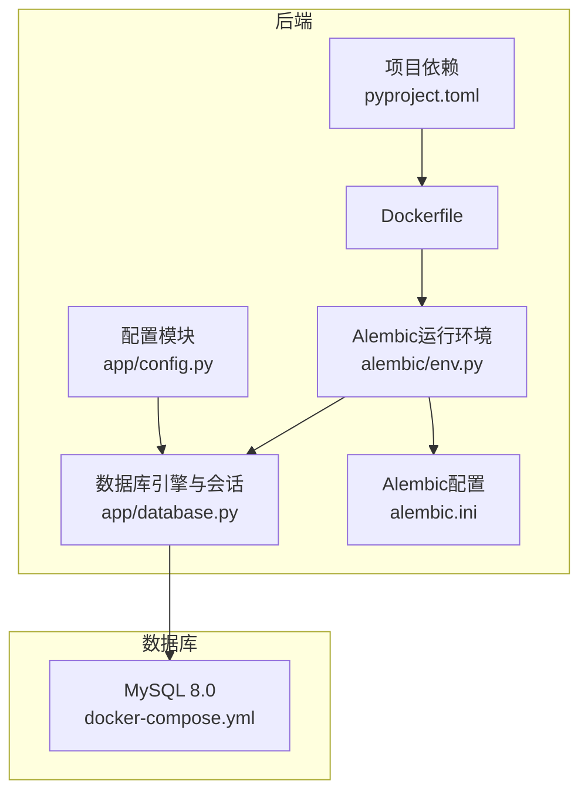
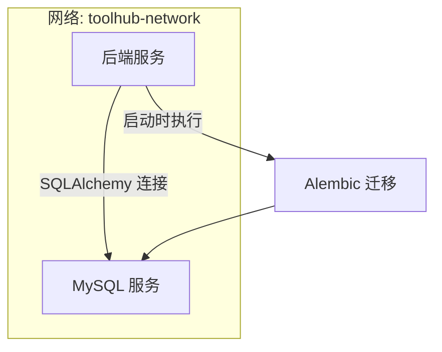
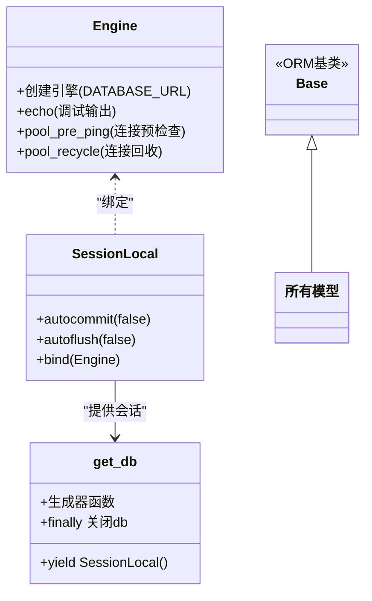
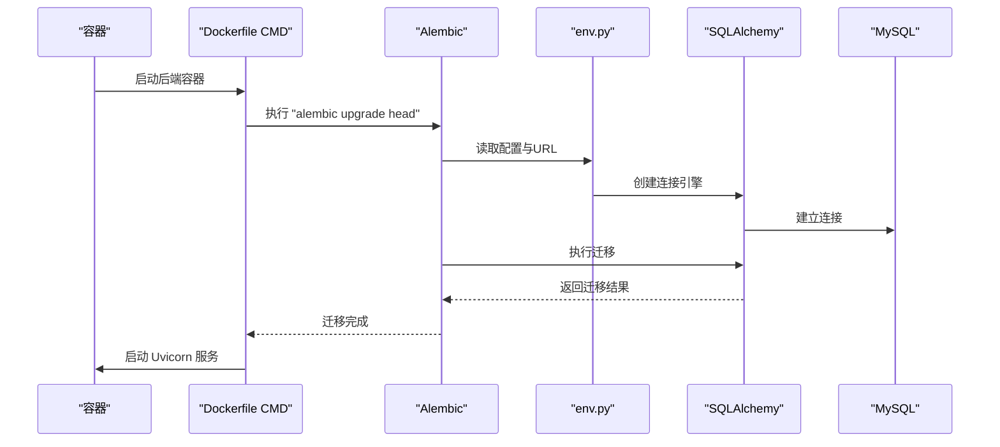
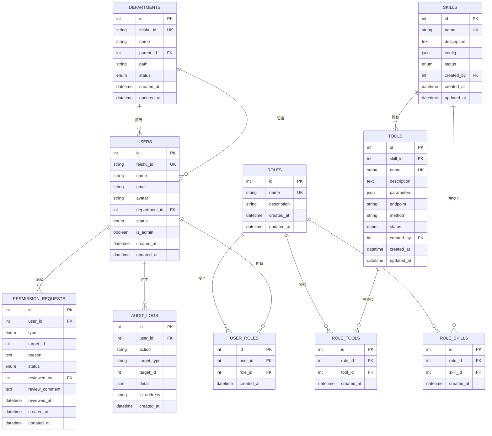
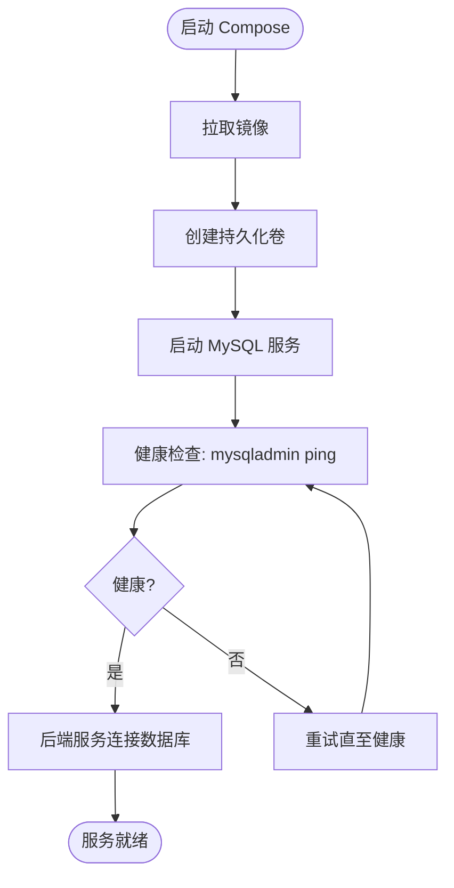
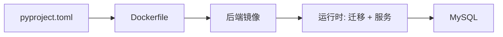

# 数据库管理

<cite>
**本文引用的文件**
- [backend/app/database.py](file://backend/app/database.py)
- [backend/app/config.py](file://backend/app/config.py)
- [backend/alembic/env.py](file://backend/alembic/env.py)
- [backend/alembic.ini](file://backend/alembic.ini)
- [backend/Dockerfile](file://backend/Dockerfile)
- [docker-compose.yml](file://docker-compose.yml)
- [backend/pyproject.toml](file://backend/pyproject.toml)
- [backend/app/models/user.py](file://backend/app/models/user.py)
- [backend/app/models/permission.py](file://backend/app/models/permission.py)
- [backend/app/models/audit.py](file://backend/app/models/audit.py)
</cite>

## 目录
1. [简介](#简介)
2. [项目结构](#项目结构)
3. [核心组件](#核心组件)
4. [架构总览](#架构总览)
5. [详细组件分析](#详细组件分析)
6. [依赖分析](#依赖分析)
7. [性能考虑](#性能考虑)
8. [故障排查指南](#故障排查指南)
9. [结论](#结论)
10. [附录](#附录)

## 简介
本文件面向ToolHub项目的数据库管理与运维，围绕以下主题展开：MySQL数据库部署与配置（含容器化部署）、Alembic迁移管理（版本控制、迁移脚本编写、回滚策略）、数据库性能优化（索引设计、查询优化、连接池配置）、数据备份与恢复（全量/增量/灾难恢复）、数据库监控指标（连接数、查询性能、存储空间）、以及数据库安全配置（用户权限、访问控制、数据加密）。  
当前仓库采用SQLAlchemy ORM与Alembic进行数据库建模与迁移，使用Docker Compose编排MySQL与后端服务；迁移执行在容器启动时自动完成。

## 项目结构
ToolHub后端通过SQLAlchemy连接MySQL，Alembic负责迁移；Docker Compose统一编排数据库与应用；依赖通过pyproject.toml声明，Dockerfile中安装系统依赖与Python包，并在启动时执行迁移。

**图表来源**
- [backend/app/config.py:11-42](file://backend/app/config.py#L11-L42)
- [backend/app/database.py:1-25](file://backend/app/database.py#L1-L25)
- [backend/alembic/env.py:1-49](file://backend/alembic/env.py#L1-L49)
- [backend/alembic.ini:1-37](file://backend/alembic.ini#L1-L37)
- [backend/Dockerfile:1-29](file://backend/Dockerfile#L1-L29)
- [docker-compose.yml:1-84](file://docker-compose.yml#L1-L84)

**章节来源**
- [backend/app/config.py:11-42](file://backend/app/config.py#L11-L42)
- [backend/app/database.py:1-25](file://backend/app/database.py#L1-L25)
- [backend/alembic/env.py:1-49](file://backend/alembic/env.py#L1-L49)
- [backend/alembic.ini:1-37](file://backend/alembic.ini#L1-L37)
- [backend/Dockerfile:1-29](file://backend/Dockerfile#L1-L29)
- [docker-compose.yml:1-84](file://docker-compose.yml#L1-L84)

## 核心组件
- 数据库引擎与会话：通过SQLAlchemy创建连接引擎与会话工厂，启用连接预检查与回收，支持依赖注入式数据库会话。
- 配置中心：集中管理DATABASE_URL等数据库相关配置，支持从.env文件加载。
- Alembic迁移：在离线/在线模式下运行迁移，支持自动发现模型以生成迁移脚本。
- 容器化编排：MySQL服务通过Compose管理，后端服务在启动时执行迁移并提供API服务。

**章节来源**
- [backend/app/database.py:1-25](file://backend/app/database.py#L1-L25)
- [backend/app/config.py:11-42](file://backend/app/config.py#L11-L42)
- [backend/alembic/env.py:1-49](file://backend/alembic/env.py#L1-L49)
- [backend/alembic.ini:1-37](file://backend/alembic.ini#L1-L37)
- [docker-compose.yml:1-84](file://docker-compose.yml#L1-L84)

## 架构总览
后端通过SQLAlchemy ORM访问MySQL，Alembic在启动阶段执行迁移，确保数据库结构与代码一致。Docker Compose将MySQL与后端服务置于同一网络，后端服务依赖数据库健康状态。

**图表来源**
- [docker-compose.yml:1-84](file://docker-compose.yml#L1-L84)
- [backend/Dockerfile:27-29](file://backend/Dockerfile#L27-L29)
- [backend/alembic/env.py:33-48](file://backend/alembic/env.py#L33-L48)

## 详细组件分析

### 数据库连接与会话管理
- 引擎配置要点：基于设置中的DATABASE_URL创建引擎，开启echo（调试），启用pool_pre_ping与pool_recycle以提升连接稳定性。
- 会话工厂：非自动提交与刷新，绑定到引擎；提供依赖注入式的get_db生成器，确保请求生命周期内正确关闭连接。
- 基类：ORM基类用于所有模型继承。

**图表来源**
- [backend/app/database.py:1-25](file://backend/app/database.py#L1-L25)

**章节来源**
- [backend/app/database.py:1-25](file://backend/app/database.py#L1-L25)

### 配置与环境变量
- 配置项：DATABASE_URL用于指定MySQL连接字符串；DEBUG控制SQL日志输出；JWT与CORS等其他配置不影响数据库。
- 加载机制：通过BaseSettings从.env文件加载，路径定位在backend根目录。
- 环境变量覆盖：Docker Compose通过环境变量向后端注入DATABASE_URL，实现运行时可配置。

**章节来源**
- [backend/app/config.py:11-42](file://backend/app/config.py#L11-L42)
- [docker-compose.yml:31-41](file://docker-compose.yml#L31-L41)

### Alembic迁移管理
- 运行模式：离线与在线两种模式，均通过env.py入口配置。
- URL优先级：优先使用环境变量DATABASE_URL，其次使用settings.DATABASE_URL，最终回退到alembic.ini中的默认值。
- 模型发现：导入所有模型以支持autogenerate功能。
- 启动执行：Dockerfile在启动命令中先执行alembic upgrade head，再启动Uvicorn服务。

**图表来源**
- [backend/Dockerfile:27-29](file://backend/Dockerfile#L27-L29)
- [backend/alembic/env.py:11-13](file://backend/alembic/env.py#L11-L13)
- [backend/alembic/env.py:33-48](file://backend/alembic/env.py#L33-L48)
- [backend/alembic.ini:2-3](file://backend/alembic.ini#L2-L3)

**章节来源**
- [backend/alembic/env.py:1-49](file://backend/alembic/env.py#L1-L49)
- [backend/alembic.ini:1-37](file://backend/alembic.ini#L1-L37)
- [backend/Dockerfile:27-29](file://backend/Dockerfile#L27-L29)

### 数据模型与索引设计
- 用户与部门：用户表与部门表存在外键关联，用户与部门字段均建立索引以支持常用查询。
- 角色、技能、工具：多对多关系通过中间表维护，外键约束采用级联删除保证数据一致性。
- 权限申请与审计：申请状态与操作类型使用枚举，审计日志记录JSON详情与IP地址，便于追踪与分析。

**图表来源**
- [backend/app/models/user.py:1-116](file://backend/app/models/user.py#L1-L116)
- [backend/app/models/permission.py:1-28](file://backend/app/models/permission.py#L1-L28)
- [backend/app/models/audit.py:1-17](file://backend/app/models/audit.py#L1-L17)

**章节来源**
- [backend/app/models/user.py:1-116](file://backend/app/models/user.py#L1-L116)
- [backend/app/models/permission.py:1-28](file://backend/app/models/permission.py#L1-L28)
- [backend/app/models/audit.py:1-17](file://backend/app/models/audit.py#L1-L17)

### MySQL部署与配置
- 容器化部署：MySQL 8.0镜像，持久化卷挂载/var/lib/mysql，健康检查使用mysqladmin ping。
- 环境变量：ROOT密码、数据库名、普通用户与密码通过环境变量注入。
- 网络与端口：暴露3306端口映射至宿主机，默认网络toolhub-network。
- 后端连接：后端通过DATABASE_URL连接mysql服务，使用pymysql驱动。

**图表来源**
- [docker-compose.yml:1-84](file://docker-compose.yml#L1-L84)

**章节来源**
- [docker-compose.yml:1-84](file://docker-compose.yml#L1-L84)

### 备份与恢复策略
- 全量备份：建议使用mysqldump或Percona XtraBackup进行逻辑/物理全备，结合定时任务与归档。
- 增量备份：基于binlog的增量备份，配合二进制日志轮转与清理策略。
- 灾难恢复：制定RTO/RPO目标，准备恢复演练流程，验证备份可用性与恢复时间。
- 当前仓库未包含具体备份脚本或策略，请结合上述最佳实践在生产环境中落地。

[本节为通用运维指导，不直接分析具体文件]

### 性能优化
- 索引设计：依据模型中的索引字段（如唯一索引与外键字段）进行查询优化；避免过度索引导致写入开销增加。
- 查询优化：使用SQLAlchemy ORM时关注N+1查询问题，合理使用select joined/eager load；对高频查询添加复合索引。
- 连接池配置：已启用pool_pre_ping与pool_recycle，建议根据并发与延迟调整连接池大小与超时参数。

**章节来源**
- [backend/app/database.py:5-10](file://backend/app/database.py#L5-L10)
- [backend/app/models/user.py:11,31,60,104](file://backend/app/models/user.py#L11,L31,L60,L104)

### 监控指标
- 连接数：监控活跃连接、排队连接与最大连接数，防止连接池耗尽。
- 查询性能：慢查询日志、查询执行计划与索引使用率分析。
- 存储空间：表大小、索引大小、日志文件与归档空间占用。
- 建议：结合Prometheus/Grafana或MySQL自带监控工具进行可视化展示。

[本节为通用运维指导，不直接分析具体文件]

### 安全配置
- 用户权限：为应用使用专用数据库用户，最小权限原则；禁止使用root用于应用连接。
- 访问控制：限制数据库监听地址与来源IP；启用SSL/TLS加密传输。
- 密码与密钥：使用强密码与密钥轮换；敏感配置通过环境变量注入。
- 数据加密：启用TDE（表空间加密）与binlog加密（如需）；传输层使用SSL。

[本节为通用运维指导，不直接分析具体文件]

## 依赖分析
- 依赖来源：pyproject.toml声明FastAPI、SQLAlchemy、Alembic、PyMySQL等核心依赖。
- Dockerfile安装系统依赖（如libmysqlclient开发包）并使用uv安装Python依赖。
- 运行时：Dockerfile在启动命令中先执行alembic迁移，再启动Uvicorn服务。

**图表来源**
- [backend/pyproject.toml:7-20](file://backend/pyproject.toml#L7-L20)
- [backend/Dockerfile:10-22](file://backend/Dockerfile#L10-L22)
- [backend/Dockerfile:27-29](file://backend/Dockerfile#L27-L29)

**章节来源**
- [backend/pyproject.toml:1-31](file://backend/pyproject.toml#L1-L31)
- [backend/Dockerfile:1-29](file://backend/Dockerfile#L1-L29)

## 性能考虑
- 连接池：已启用pre_ping与recycle，建议结合业务并发调整池大小与超时。
- 索引：遵循模型中的索引设计，避免重复与冗余索引。
- 查询：使用ORM时注意批量操作与懒加载策略，减少不必要的JOIN。
- 缓存：对热点数据与只读数据引入缓存层，降低数据库压力。

[本节提供一般性建议，不直接分析具体文件]

## 故障排查指南
- 连接失败：检查DATABASE_URL格式与网络连通性；确认MySQL服务健康。
- 迁移失败：查看Alembic日志与错误堆栈；核对模型变更与版本号。
- 性能问题：启用SQL日志（DEBUG）观察慢查询；分析索引使用情况。
- 容器启动卡住：确认MySQL健康检查通过后再启动后端服务。

**章节来源**
- [backend/app/config.py:15-18](file://backend/app/config.py#L15-L18)
- [backend/alembic/env.py:21-30](file://backend/alembic/env.py#L21-L30)
- [docker-compose.yml:44-46](file://docker-compose.yml#L44-L46)

## 结论
ToolHub当前采用容器化MySQL与SQLAlchemy/Alembic的组合，实现了简洁可靠的数据库接入与迁移能力。建议在生产环境中补充完善的备份策略、监控体系与安全加固措施，并结合业务特性持续优化索引与查询性能。

## 附录
- 迁移命令参考（在容器内执行）
  - 查看当前版本：alembic current
  - 生成迁移：alembic revision --autogenerate -m "描述"
  - 应用迁移：alembic upgrade head
  - 回滚迁移：alembic downgrade -1 或指定版本
- 常用SQLAlchemy配置要点
  - echo：仅在调试环境开启
  - pool_pre_ping：自动检测失效连接
  - pool_recycle：定期回收连接，避免长时间占用

[本节为通用参考，不直接分析具体文件]