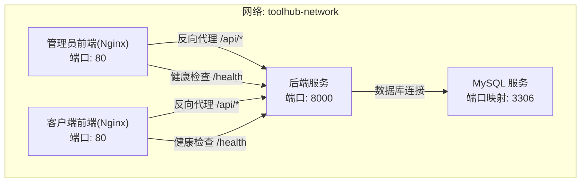
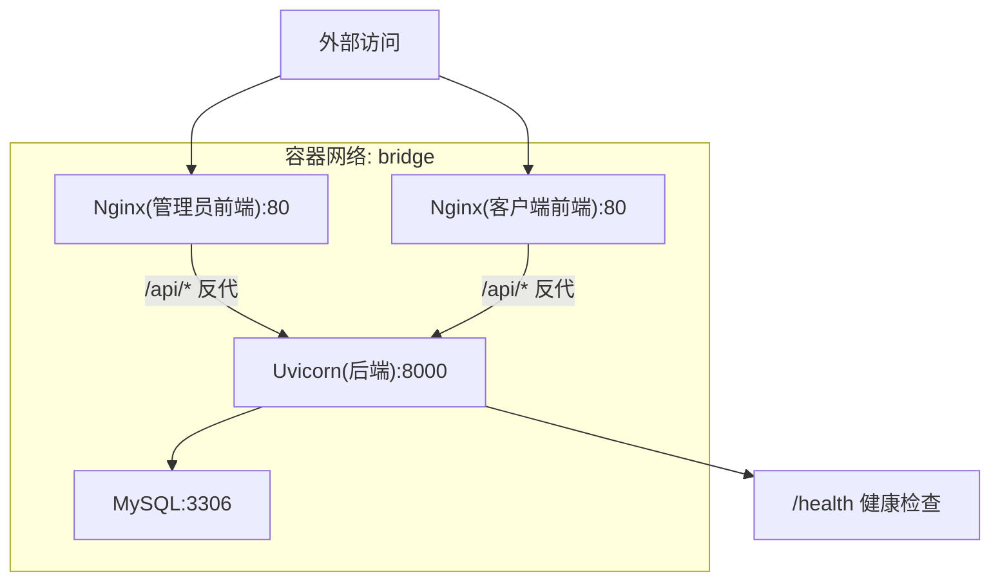
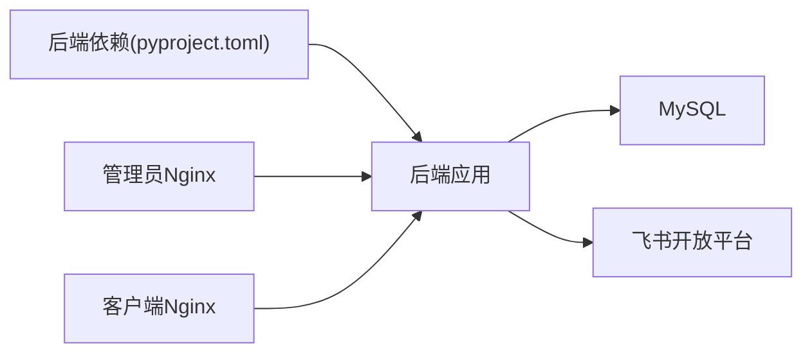
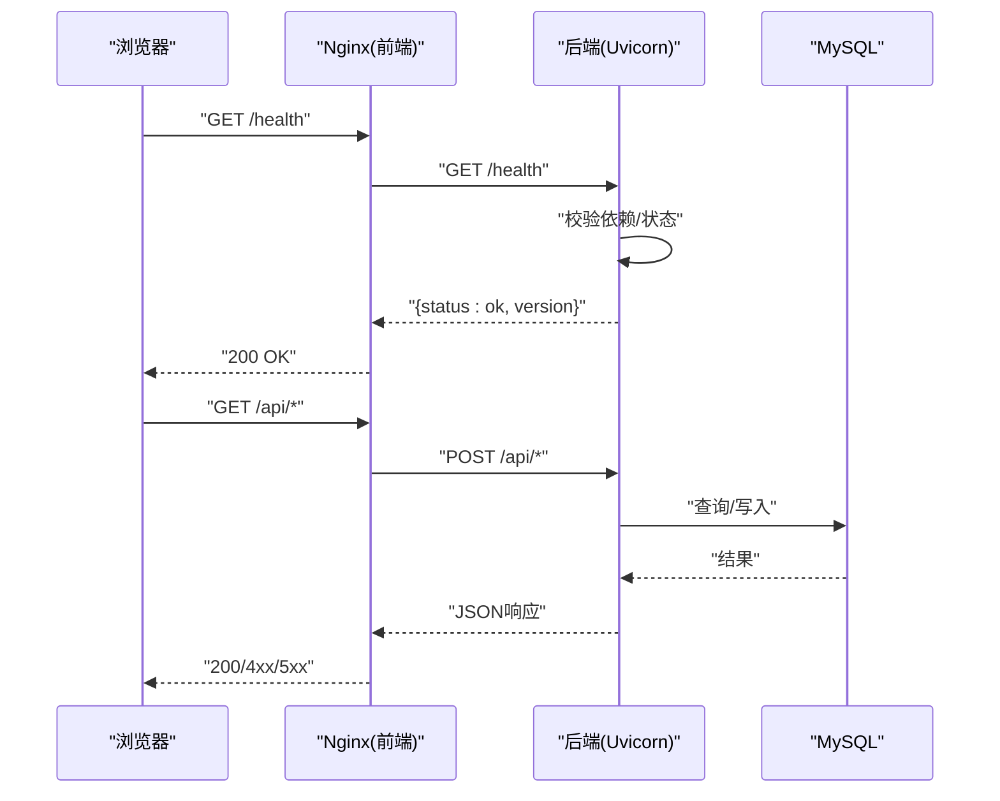

# 生产环境配置

<cite>
**本文引用的文件**
- [docker-compose.yml](file://docker-compose.yml)
- [backend/app/config.py](file://backend/app/config.py)
- [backend/app/main.py](file://backend/app/main.py)
- [backend/app/database.py](file://backend/app/database.py)
- [backend/app/middleware/auth.py](file://backend/app/middleware/auth.py)
- [backend/app/services/feishu.py](file://backend/app/services/feishu.py)
- [backend/Dockerfile](file://backend/Dockerfile)
- [frontend/admin/Dockerfile](file://frontend/admin/Dockerfile)
- [frontend/client/Dockerfile](file://frontend/client/Dockerfile)
- [frontend/admin/nginx.conf](file://frontend/admin/nginx.conf)
- [frontend/client/nginx.conf](file://frontend/client/nginx.conf)
- [backend/pyproject.toml](file://backend/pyproject.toml)
</cite>

## 目录
1. [简介](#简介)
2. [项目结构](#项目结构)
3. [核心组件](#核心组件)
4. [架构总览](#架构总览)
5. [详细组件分析](#详细组件分析)
6. [依赖关系分析](#依赖关系分析)
7. [性能考量](#性能考量)
8. [故障排查指南](#故障排查指南)
9. [结论](#结论)
10. [附录](#附录)

## 简介
本文件面向ToolHub项目的生产环境部署与运维，围绕以下目标展开：  
- 明确生产部署架构（含Nginx反向代理、健康检查、容器网络）  
- 提供环境变量配置最佳实践（数据库、JWT、飞书应用）  
- 给出容器编排的生产级建议（资源限制、健康检查、自动重启策略）  
- 规划日志收集与管理（容器日志聚合、应用日志轮转）  
- 总结安全加固要点（网络安全、访问控制、数据加密）

## 项目结构
ToolHub采用前后端分离的多容器架构，后端使用FastAPI+MySQL，前端使用React+Vite构建并通过Nginx提供静态资源与反向代理。Compose编排包含MySQL、后端、管理员前端、客户端前端四个服务，并通过自定义bridge网络互通。

图表来源
- [docker-compose.yml:1-84](file://docker-compose.yml#L1-L84)
- [frontend/admin/nginx.conf:18-30](file://frontend/admin/nginx.conf#L18-L30)
- [frontend/client/nginx.conf:18-30](file://frontend/client/nginx.conf#L18-L30)
- [backend/app/main.py:44-46](file://backend/app/main.py#L44-L46)

章节来源
- [docker-compose.yml:1-84](file://docker-compose.yml#L1-L84)

## 核心组件
- 数据库层：MySQL 8.0，持久化卷，健康检查，生产环境需开启备份与只读副本策略
- 后端层：FastAPI应用，提供认证、权限、技能、工具、审计等API；内置/health健康接口
- 前端层：管理员与客户端两套前端，均以Nginx提供静态资源与反向代理
- 反向代理：Nginx统一暴露80端口，将/api/请求转发至后端8000端口，SPA路由回退到index.html
- 配置体系：后端Settings从.env加载，支持运行时环境变量覆盖；前端通过构建时注入或Nginx配置

章节来源
- [backend/app/config.py:11-42](file://backend/app/config.py#L11-L42)
- [backend/app/main.py:9-48](file://backend/app/main.py#L9-L48)
- [frontend/admin/nginx.conf:1-38](file://frontend/admin/nginx.conf#L1-L38)
- [frontend/client/nginx.conf:1-38](file://frontend/client/nginx.conf#L1-L38)

## 架构总览
生产部署建议采用“单机多容器”或“Kubernetes集群”两种形态。下图展示单机形态下的服务交互与流量路径：

图表来源
- [docker-compose.yml:24-76](file://docker-compose.yml#L24-L76)
- [frontend/admin/nginx.conf:18-30](file://frontend/admin/nginx.conf#L18-L30)
- [frontend/client/nginx.conf:18-30](file://frontend/client/nginx.conf#L18-L30)
- [backend/app/main.py:44-46](file://backend/app/main.py#L44-L46)

## 详细组件分析

### Nginx反向代理与静态资源
- 管理端与客户端前端共享Nginx镜像与配置，监听80端口，根目录指向构建产物
- 关键点：
  - SPA路由回退：location / 使用try_files回退到index.html
  - API反向代理：location /api/ 将请求转发至backend:8000/api/
  - 健康检查：location /health 转发至backend:8000/health
  - 静态资源缓存：对JS/CSS/字体/图标等设置一年缓存与immutable标志
  - Gzip压缩：启用gzip并指定常见类型最小长度256字节

章节来源
- [frontend/admin/nginx.conf:1-38](file://frontend/admin/nginx.conf#L1-L38)
- [frontend/client/nginx.conf:1-38](file://frontend/client/nginx.conf#L1-L38)

### SSL/TLS与域名
- 当前配置未包含SSL证书与HTTPS重定向
- 生产建议：
  - 使用Let’s Encrypt自动化证书（certbot或acme.sh）
  - 在Nginx中配置443端口监听与证书路径
  - 强制HTTP到HTTPS重定向
  - 启用TLS 1.3、禁用弱密码套件与过时协议

[本节为通用建议，不直接分析具体文件]

### 负载均衡策略
- 单实例部署：无需LB
- 多实例部署：可选方案
  - Nginx作为四层/七层LB（需自定义上游与健康检查）
  - Kubernetes Service + Ingress（推荐）
  - 外部LB（如云厂商SLB/NLB）+后端服务发现

[本节为通用建议，不直接分析具体文件]

### 环境变量配置最佳实践
- 数据库连接
  - 使用DATABASE_URL统一连接串，包含主机名、端口、用户名、密码、数据库名
  - 生产环境务必使用独立账号与强密码，避免root权限
  - 连接池参数：pool_pre_ping=true，pool_recycle=3600，echo根据调试需求开启
- JWT密钥
  - 设置JWT_SECRET_KEY为足够强度的随机字符串，算法建议使用HS256或更安全的RS256（需公私钥）
  - 不同环境使用不同密钥，避免跨环境令牌互认
- 飞书应用配置
  - FEISHU_APP_ID、FEISHU_APP_SECRET必须在生产环境配置
  - FEISHU_REDIRECT_URI应指向生产域名的回调地址
  - FEISHU_BASE_URL保持默认即可
- CORS与调试
  - CORS_ORIGINS按需收敛，仅允许受信域名
  - DEBUG在生产关闭，避免泄露敏感信息

章节来源
- [backend/app/config.py:17-38](file://backend/app/config.py#L17-L38)
- [backend/app/database.py:5-10](file://backend/app/database.py#L5-L10)
- [backend/app/services/feishu.py:9-14](file://backend/app/services/feishu.py#L9-L14)
- [docker-compose.yml:31-41](file://docker-compose.yml#L31-L41)

### 容器编排的生产级配置
- 自动重启策略：unless-stopped（服务异常退出时自动重启）
- 健康检查：
  - MySQL：使用内置healthcheck，ping检测
  - 后端：/health接口返回状态与版本
- 资源限制（建议）
  - CPU/内存配额，避免资源争抢
  - 为Nginx设置较小资源，后端适当提升
- 存储与持久化
  - MySQL数据卷挂载到持久化存储
  - 日志目录挂载到宿主机或集中存储
- 网络隔离
  - 使用自定义bridge网络，限制容器间直接通信
  - 仅暴露必要端口（前端80、数据库3306、后端8000）

章节来源
- [docker-compose.yml:6-22](file://docker-compose.yml#L6-L22)
- [backend/app/main.py:44-46](file://backend/app/main.py#L44-L46)

### 日志收集与管理
- 容器日志
  - 使用Docker日志驱动（json-file）并配置max-size与max-file轮转
  - 推荐接入集中式日志系统（如ELK/EFK、Loki+Grafana）
- 应用日志
  - 后端使用标准输出，由容器运行时采集
  - 前端Nginx访问/错误日志可通过挂载卷或sidecar采集
- 建议
  - 对敏感字段脱敏（如数据库密码、JWT密钥）
  - 按服务与级别分桶，便于检索与告警

[本节为通用建议，不直接分析具体文件]

### 安全加固措施
- 网络安全
  - 仅暴露必要端口；数据库与后端置于内网或专用子网
  - 使用防火墙/安全组限制入站访问
- 访问控制
  - 后端启用CORS白名单，避免通配符
  - JWT令牌短期有效，结合刷新令牌策略
  - 管理员接口增加鉴权与审计
- 数据加密
  - 传输：启用TLS 1.3；静止：数据库启用加密存储（TDE）
  - 密钥管理：使用密钥管理服务（KMS）或Vault，定期轮换
- 其他
  - 定期扫描镜像与依赖漏洞
  - 最小权限原则：容器非root运行，只读文件系统

[本节为通用建议，不直接分析具体文件]

## 依赖关系分析
- 后端依赖
  - FastAPI、SQLAlchemy、Alembic、Pydantic Settings、HTTPX、Passlib等
  - 运行时通过Uvicorn启动，迁移脚本先于服务启动
- 前端依赖
  - React、Ant Design、Axios、Zustand等
  - 构建产物由Nginx提供静态服务
- 服务依赖
  - 后端依赖MySQL健康可用
  - 前端依赖后端API可达与健康

图表来源
- [backend/pyproject.toml:7-20](file://backend/pyproject.toml#L7-L20)
- [backend/Dockerfile:21-28](file://backend/Dockerfile#L21-L28)
- [frontend/admin/Dockerfile:15-29](file://frontend/admin/Dockerfile#L15-L29)
- [frontend/client/Dockerfile:15-29](file://frontend/client/Dockerfile#L15-L29)

章节来源
- [backend/pyproject.toml:1-31](file://backend/pyproject.toml#L1-L31)
- [backend/Dockerfile:1-29](file://backend/Dockerfile#L1-L29)
- [frontend/admin/Dockerfile:1-30](file://frontend/admin/Dockerfile#L1-L30)
- [frontend/client/Dockerfile:1-30](file://frontend/client/Dockerfile#L1-L30)

## 性能考量
- 连接池与超时
  - pool_pre_ping=true确保连接有效性，pool_recycle合理回收
  - SQL查询与索引优化，避免长事务
- 反向代理
  - 启用Gzip与静态资源缓存，减少带宽与CPU
  - 限制请求体大小，防止慢读攻击
- 应用层
  - 并发模型：Uvicorn基于异步IO，注意阻塞操作
  - 缓存：热点数据使用Redis（建议新增），减少DB压力
- 资源规划
  - 根据QPS与响应时间估算CPU/内存，预留缓冲

章节来源
- [backend/app/database.py:5-10](file://backend/app/database.py#L5-L10)
- [frontend/admin/nginx.conf:8-11](file://frontend/admin/nginx.conf#L8-L11)
- [frontend/admin/nginx.conf:32-36](file://frontend/admin/nginx.conf#L32-L36)

## 故障排查指南
- 健康检查
  - 前端通过Nginx /health代理到后端/health，若失败检查后端日志与依赖服务
- 数据库连通性
  - 检查DATABASE_URL格式与凭据；确认MySQL健康检查通过
- 飞书集成
  - 核对FEISHU_APP_ID/FEISHU_APP_SECRET与回调地址；查看飞石服务日志
- 权限与认证
  - 核对JWT密钥与算法；检查CORS白名单是否包含当前域名
- 日志定位
  - 查看容器日志与Nginx访问/错误日志；关注异常堆栈与4xx/5xx

章节来源
- [backend/app/main.py:44-46](file://backend/app/main.py#L44-L46)
- [backend/app/middleware/auth.py:12-33](file://backend/app/middleware/auth.py#L12-L33)
- [backend/app/services/feishu.py:26-57](file://backend/app/services/feishu.py#L26-L57)

## 结论
本文基于现有代码与配置，给出了ToolHub生产环境的部署与运维建议。建议在现有基础上补充SSL/TLS、负载均衡、资源限制、日志与密钥管理等生产要素，并持续进行安全扫描与性能调优。

## 附录

### 关键流程：健康检查与反向代理序列

图表来源
- [frontend/admin/nginx.conf:27-30](file://frontend/admin/nginx.conf#L27-L30)
- [frontend/client/nginx.conf:27-30](file://frontend/client/nginx.conf#L27-L30)
- [backend/app/main.py:44-46](file://backend/app/main.py#L44-L46)