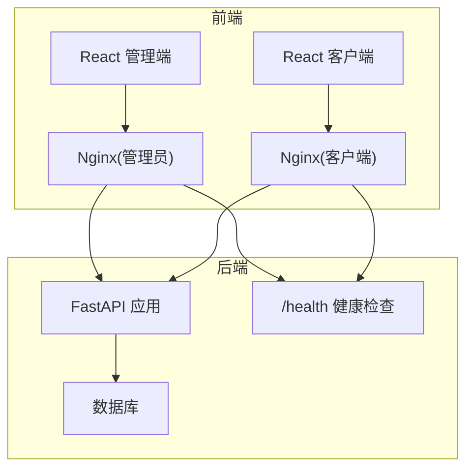
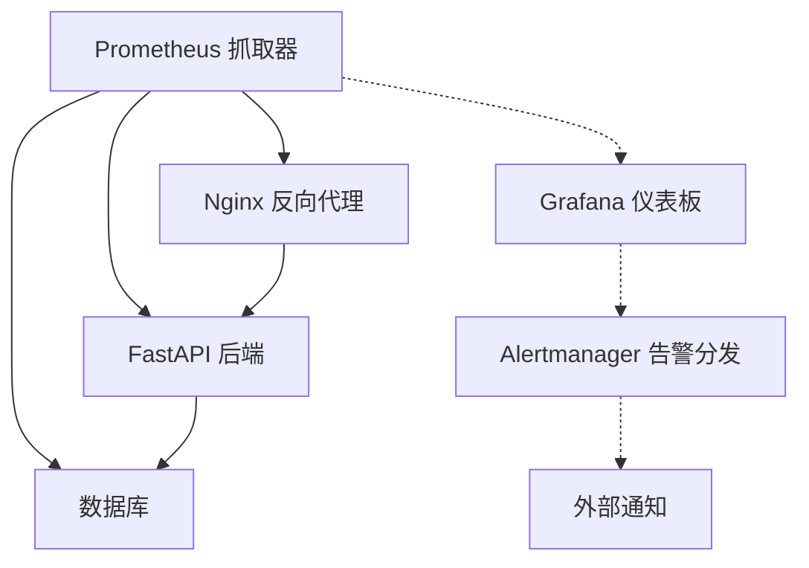
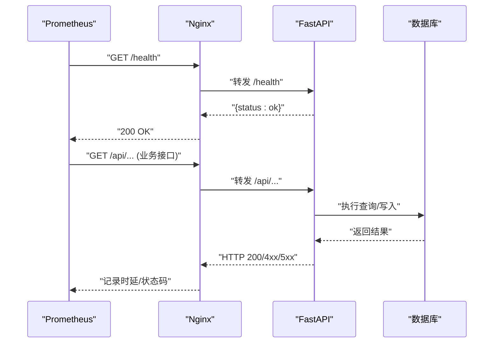
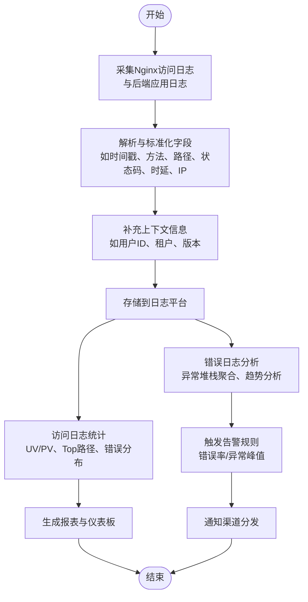
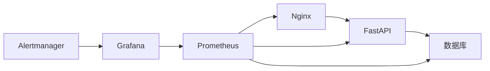

# 监控告警

<cite>
**本文引用的文件**
- [backend/app/main.py](file://backend/app/main.py)
- [backend/app/api/admin/audit.py](file://backend/app/api/admin/audit.py)
- [backend/app/services/audit.py](file://backend/app/services/audit.py)
- [backend/alembic.ini](file://backend/alembic.ini)
- [frontend/admin/nginx.conf](file://frontend/admin/nginx.conf)
- [frontend/client/nginx.conf](file://frontend/client/nginx.conf)
- [docker-compose.yml](file://docker-compose.yml)
- [backend/pyproject.toml](file://backend/pyproject.toml)
- [backend/Dockerfile](file://backend/Dockerfile)
- [frontend/admin/Dockerfile](file://frontend/admin/Dockerfile)
- [frontend/client/Dockerfile](file://frontend/client/Dockerfile)
</cite>

## 目录
1. [简介](#简介)
2. [项目结构](#项目结构)
3. [核心组件](#核心组件)
4. [架构总览](#架构总览)
5. [详细组件分析](#详细组件分析)
6. [依赖关系分析](#依赖关系分析)
7. [性能与容量规划](#性能与容量规划)
8. [故障排查指南](#故障排查指南)
9. [结论](#结论)
10. [附录](#附录)

## 简介
本文件面向ToolHub项目的监控与告警建设，围绕以下目标展开：  
- 应用监控：FastAPI应用性能监控、API响应时间、错误率统计  
- 基础设施监控：CPU、内存、磁盘、网络使用情况  
- 日志监控与分析：应用日志收集、错误日志分析、访问日志统计  
- 告警机制：阈值设置、告警规则、通知渠道  
- 监控仪表板：Grafana面板、Prometheus指标、自定义报表  
- 故障排查流程：问题定位、根因分析、解决方案  
- 性能基准测试与容量规划建议  

当前代码库未内置Prometheus指标暴露或统一日志采集链路，因此本方案以“可扩展”方式给出实施建议，并结合现有健康检查端点与Nginx代理配置进行落地。

## 项目结构
ToolHub采用前后端分离架构，后端基于FastAPI，前端分别提供管理员与普通用户的管理界面与客户端界面；二者均通过Nginx作为反向代理与静态资源服务，容器化部署由Compose编排。

图示来源
- [frontend/admin/nginx.conf:1-37](file://frontend/admin/nginx.conf#L1-L37)
- [frontend/client/nginx.conf:1-37](file://frontend/client/nginx.conf#L1-L37)
- [backend/app/main.py:44-46](file://backend/app/main.py#L44-L46)

章节来源
- [frontend/admin/nginx.conf:1-37](file://frontend/admin/nginx.conf#L1-L37)
- [frontend/client/nginx.conf:1-37](file://frontend/client/nginx.conf#L1-L37)
- [backend/app/main.py:44-46](file://backend/app/main.py#L44-L46)

## 核心组件
- 健康检查端点：后端提供统一健康检查接口，便于外部监控系统探测实例存活状态。  
- 审计日志：后端提供审计日志记录与查询能力，可用于追踪关键操作与异常行为。  
- 反向代理：Nginx负责静态资源、路由转发与健康检查代理，便于统一接入监控与告警。  
- 容器与编排：Dockerfile与Compose用于容器化部署，便于在Kubernetes等平台集成Prometheus Operator或类似方案。

章节来源
- [backend/app/main.py:44-46](file://backend/app/main.py#L44-L46)
- [backend/app/api/admin/audit.py:1-36](file://backend/app/api/admin/audit.py#L1-L36)
- [backend/app/services/audit.py:1-53](file://backend/app/services/audit.py#L1-L53)
- [frontend/admin/nginx.conf:18-30](file://frontend/admin/nginx.conf#L18-L30)
- [frontend/client/nginx.conf:18-30](file://frontend/client/nginx.conf#L18-L30)

## 架构总览
下图展示监控与告警在ToolHub中的位置与交互关系：  
- Prometheus抓取后端/容器指标与Nginx访问日志  
- Grafana可视化与告警规则配置  
- Alertmanager分发通知（邮件/IM等）  
- Nginx代理健康检查与API请求，便于统一观测

图示来源
- [backend/app/main.py:44-46](file://backend/app/main.py#L44-L46)
- [frontend/admin/nginx.conf:18-30](file://frontend/admin/nginx.conf#L18-L30)
- [frontend/client/nginx.conf:18-30](file://frontend/client/nginx.conf#L18-L30)

## 详细组件分析

### 应用监控：FastAPI性能与API可观测性
- 健康检查：后端提供统一健康检查端点，便于Prometheus定时探测实例状态。  
- 访问链路：Nginx代理API请求与健康检查，便于统一采集访问日志与延迟指标。  
- 潜在增强：可在FastAPI中集成中间件或装饰器，埋点请求耗时、状态码分布、异常次数等指标，供Prometheus抓取。

图示来源
- [backend/app/main.py:44-46](file://backend/app/main.py#L44-L46)
- [frontend/admin/nginx.conf:18-30](file://frontend/admin/nginx.conf#L18-L30)
- [frontend/client/nginx.conf:18-30](file://frontend/client/nginx.conf#L18-L30)

章节来源
- [backend/app/main.py:44-46](file://backend/app/main.py#L44-L46)
- [frontend/admin/nginx.conf:18-30](file://frontend/admin/nginx.conf#L18-L30)
- [frontend/client/nginx.conf:18-30](file://frontend/client/nginx.conf#L18-L30)

### 基础设施监控：CPU、内存、磁盘、网络
- 容器层：通过Prometheus Node Exporter或容器监控方案采集后端容器所在主机的CPU/内存/磁盘/网络指标。  
- 数据库层：对MySQL/MariaDB进行独立监控，关注连接数、慢查询、缓冲池命中率等。  
- Nginx层：采集请求速率、响应时间、状态码分布、连接数等指标，辅助定位前端到后端的瓶颈。

章节来源
- [docker-compose.yml](file://docker-compose.yml)
- [backend/Dockerfile](file://backend/Dockerfile)
- [frontend/admin/Dockerfile](file://frontend/admin/Dockerfile)
- [frontend/client/Dockerfile](file://frontend/client/Dockerfile)

### 日志监控与分析
- 审计日志：后端提供审计日志服务与查询接口，可用于追踪关键操作与异常行为，支持按操作类型、目标类型、用户ID过滤。  
- 访问日志：Nginx已开启gzip压缩与SPA路由回退，建议启用访问日志并统一采集至日志平台（如ELK/Vector/Fluent Bit），以便进行错误日志分析与访问统计。  
- 错误日志：后端Alembic配置展示了日志级别控制方式，可参考该模式在生产环境统一后端日志级别与输出格式。

图示来源
- [backend/app/api/admin/audit.py:1-36](file://backend/app/api/admin/audit.py#L1-L36)
- [backend/app/services/audit.py:1-53](file://backend/app/services/audit.py#L1-L53)
- [backend/alembic.ini:14-36](file://backend/alembic.ini#L14-L36)
- [frontend/admin/nginx.conf:8-16](file://frontend/admin/nginx.conf#L8-L16)
- [frontend/client/nginx.conf:8-16](file://frontend/client/nginx.conf#L8-L16)

章节来源
- [backend/app/api/admin/audit.py:1-36](file://backend/app/api/admin/audit.py#L1-L36)
- [backend/app/services/audit.py:1-53](file://backend/app/services/audit.py#L1-L53)
- [backend/alembic.ini:14-36](file://backend/alembic.ini#L14-L36)
- [frontend/admin/nginx.conf:8-16](file://frontend/admin/nginx.conf#L8-L16)
- [frontend/client/nginx.conf:8-16](file://frontend/client/nginx.conf#L8-L16)

### 告警机制：阈值、规则与通知
- 阈值建议
  - 健康检查失败率：连续失败比例超过阈值触发告警  
  - API错误率：5xx错误占比超过阈值触发告警  
  - API延迟：P95/P99延迟超过阈值触发告警  
  - CPU/内存/磁盘：使用率或剩余空间低于阈值触发告警  
  - Nginx连接数：超过阈值触发告警  
- 告警规则示例（PromQL思路）
  - 健康检查失败：count_over_time((up == 0)[5m:]) > 0  
  - 5xx错误率：rate(http_requests_total{status=~"^5..$"}[5m]) / rate(http_requests_total[5m]) > 0.05  
  - 延迟P99：histogram_quantile(0.99, sum by(le) (rate(http_request_duration_bucket[5m]))) > T  
  - 资源使用：node_cpu_seconds_total、container_memory_usage_bytes、node_filesystem_avail_bytes 等  
- 通知渠道：邮件、IM机器人、PagerDuty等，由Alertmanager统一管理

章节来源
- [backend/app/main.py:44-46](file://backend/app/main.py#L44-L46)
- [frontend/admin/nginx.conf:18-30](file://frontend/admin/nginx.conf#L18-L30)
- [frontend/client/nginx.conf:18-30](file://frontend/client/nginx.conf#L18-L30)

### 监控仪表板配置：Grafana + Prometheus
- 推荐面板
  - 实例健康：存活探针、重启次数、启动耗时  
  - API指标：QPS、错误率、P95/P99延迟、状态码分布  
  - 资源指标：CPU使用率、内存使用、磁盘IO、网络IO  
  - Nginx指标：请求速率、连接状态、上游后端健康  
  - 日志分析：错误TopN、异常趋势、访问热力图  
- 自定义报表：基于审计日志统计关键操作频次、异常操作占比等

章节来源
- [backend/app/api/admin/audit.py:1-36](file://backend/app/api/admin/audit.py#L1-L36)
- [backend/app/services/audit.py:1-53](file://backend/app/services/audit.py#L1-L53)

## 依赖关系分析
- 组件耦合
  - Nginx与后端通过反向代理耦合，需确保健康检查与API路由一致  
  - 审计日志服务与数据库ORM耦合，查询接口依赖分页参数与过滤条件  
- 外部依赖
  - Prometheus与Grafana：用于指标采集与可视化  
  - Alertmanager：用于告警收敛与通知  
  - 日志平台：用于日志采集与分析  
- 潜在风险
  - 缺少统一指标暴露：建议在FastAPI中增加指标中间件  
  - 日志分散：建议统一采集与标准化字段

图示来源
- [frontend/admin/nginx.conf:18-30](file://frontend/admin/nginx.conf#L18-L30)
- [frontend/client/nginx.conf:18-30](file://frontend/client/nginx.conf#L18-L30)
- [backend/app/main.py:44-46](file://backend/app/main.py#L44-L46)

章节来源
- [frontend/admin/nginx.conf:18-30](file://frontend/admin/nginx.conf#L18-L30)
- [frontend/client/nginx.conf:18-30](file://frontend/client/nginx.conf#L18-L30)
- [backend/app/main.py:44-46](file://backend/app/main.py#L44-L46)

## 性能与容量规划
- 基准测试建议
  - 使用压测工具对关键API进行并发与延迟测试，记录P50/P95/P99  
  - 对Nginx与后端进行分层压测，识别瓶颈（网络/IO/CPU/数据库）  
  - 基于审计日志与访问日志统计峰值QPS与热点路径  
- 容量规划
  - 依据压测结果与历史流量，确定实例副本数与资源配额  
  - 为数据库设置读写分离与缓存策略，降低单点压力  
  - 为Nginx与后端配置限流与熔断，保障稳定性

[本节为通用指导，不直接分析具体文件]

## 故障排查指南
- 快速定位
  - 通过健康检查端点确认实例存活与版本信息  
  - 查看Nginx访问日志，定位异常请求路径与状态码  
  - 检查后端错误日志与审计日志，确认关键操作与异常堆栈  
- 根因分析
  - 若延迟升高：结合API指标与数据库慢查询日志分析  
  - 若错误增多：结合错误日志与审计日志定位操作范围  
  - 若资源紧张：结合节点与容器指标定位CPU/内存/磁盘瓶颈  
- 解决方案
  - 优化热点接口与SQL查询  
  - 扩容实例或调整限流策略  
  - 升级数据库索引与配置

章节来源
- [backend/app/main.py:44-46](file://backend/app/main.py#L44-L46)
- [backend/app/api/admin/audit.py:1-36](file://backend/app/api/admin/audit.py#L1-L36)
- [backend/app/services/audit.py:1-53](file://backend/app/services/audit.py#L1-L53)
- [frontend/admin/nginx.conf:18-30](file://frontend/admin/nginx.conf#L18-L30)
- [frontend/client/nginx.conf:18-30](file://frontend/client/nginx.conf#L18-L30)

## 结论
本方案在现有代码库基础上，提出一套可扩展的监控与告警体系：以健康检查与Nginx代理为入口，结合审计日志与访问日志，配合Prometheus/Grafana/Alertmanager实现全链路可观测与自动化告警。后续可通过在FastAPI中引入指标中间件与统一日志采集，进一步提升可观测性与告警精度。

[本节为总结性内容，不直接分析具体文件]

## 附录
- 关键端点与配置参考
  - 健康检查：/health  
  - 审计日志查询：/api/admin/audit-logs  
  - Nginx代理：/api/ 与 /health 路由  
- 建议新增
  - 在FastAPI中增加指标中间件与日志中间件  
  - 在Nginx中启用访问日志并统一采集  
  - 在Prometheus中配置Alertmanager与Grafana数据源

章节来源
- [backend/app/main.py:44-46](file://backend/app/main.py#L44-L46)
- [backend/app/api/admin/audit.py:1-36](file://backend/app/api/admin/audit.py#L1-L36)
- [frontend/admin/nginx.conf:18-30](file://frontend/admin/nginx.conf#L18-L30)
- [frontend/client/nginx.conf:18-30](file://frontend/client/nginx.conf#L18-L30)