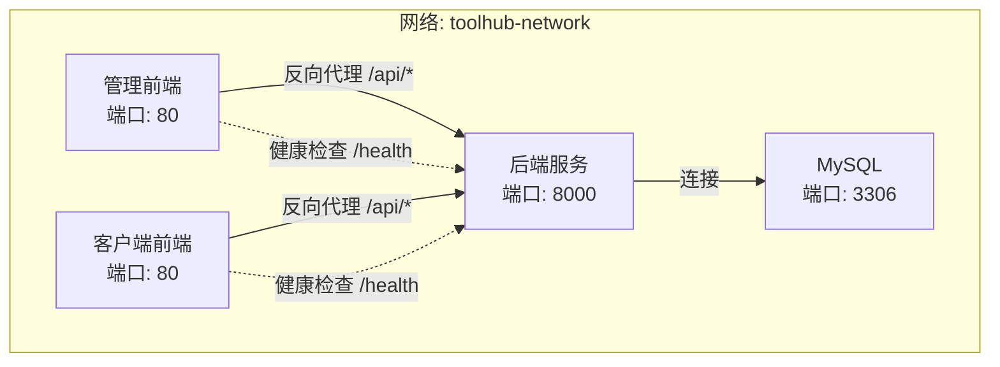
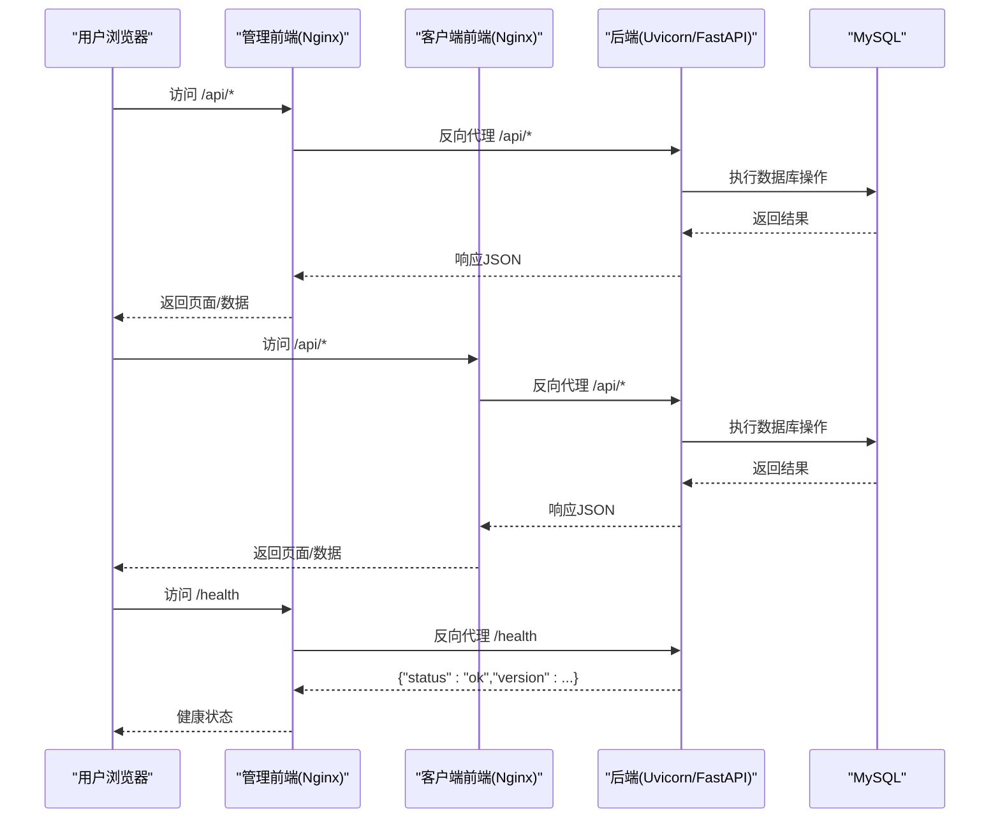
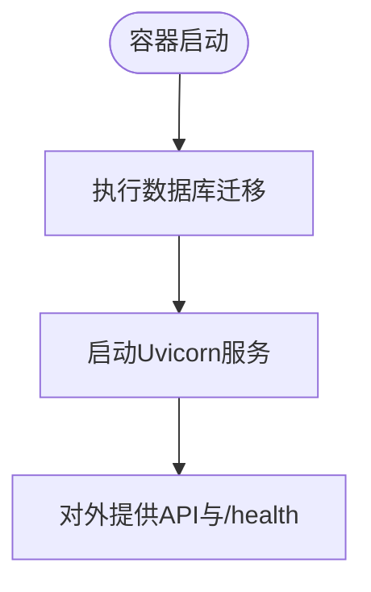
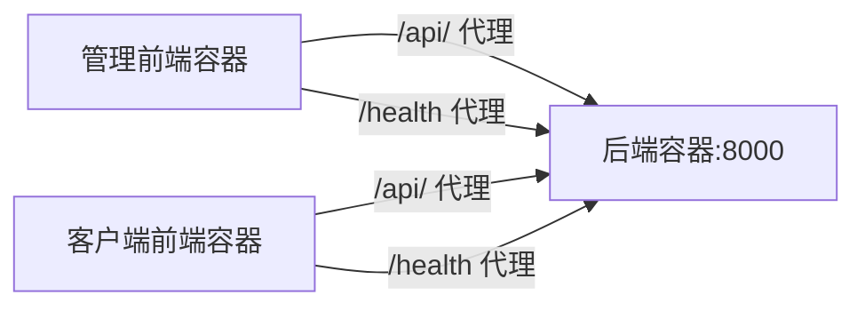
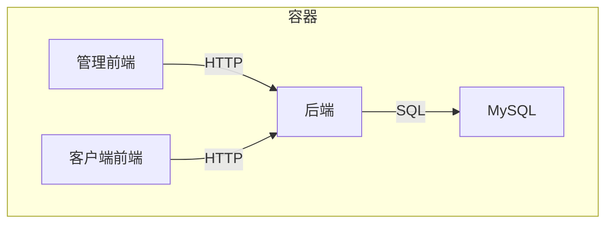

# 部署与运维

<cite>
**本文引用的文件**
- [docker-compose.yml](file://docker-compose.yml)
- [backend/Dockerfile](file://backend/Dockerfile)
- [frontend/admin/Dockerfile](file://frontend/admin/Dockerfile)
- [frontend/client/Dockerfile](file://frontend/client/Dockerfile)
- [backend/pyproject.toml](file://backend/pyproject.toml)
- [backend/app/config.py](file://backend/app/config.py)
- [backend/app/main.py](file://backend/app/main.py)
- [backend/alembic.ini](file://backend/alembic.ini)
- [frontend/admin/nginx.conf](file://frontend/admin/nginx.conf)
- [frontend/client/nginx.conf](file://frontend/client/nginx.conf)
- [frontend/admin/package.json](file://frontend/admin/package.json)
- [frontend/client/package.json](file://frontend/client/package.json)
</cite>

## 目录
1. [简介](#简介)
2. [项目结构](#项目结构)
3. [核心组件](#核心组件)
4. [架构总览](#架构总览)
5. [详细组件分析](#详细组件分析)
6. [依赖关系分析](#依赖关系分析)
7. [性能考虑](#性能考虑)
8. [故障排查指南](#故障排查指南)
9. [结论](#结论)
10. [附录](#附录)

## 简介
本文件面向ToolHub项目的部署与运维团队，提供从容器化到生产级最佳实践的完整指南。内容涵盖：Docker镜像构建与编排、网络与数据持久化、环境配置与敏感信息保护、数据库部署与维护、监控与告警、日志管理、故障排查、性能优化以及自动化部署与CI/CD建议。

## 项目结构
ToolHub采用前后端分离的多服务架构，通过Docker Compose进行统一编排，包含：
- MySQL数据库（8.0）
- 后端FastAPI服务（Python 3.13，使用uv进行依赖安装）
- 前端管理端与客户端（React + Vite，Nginx静态托管）

图表来源
- [docker-compose.yml:1-84](file://docker-compose.yml#L1-L84)
- [frontend/admin/nginx.conf:18-30](file://frontend/admin/nginx.conf#L18-L30)
- [frontend/client/nginx.conf:18-30](file://frontend/client/nginx.conf#L18-L30)

章节来源
- [docker-compose.yml:1-84](file://docker-compose.yml#L1-L84)

## 核心组件
- 数据库层：MySQL 8.0，使用卷进行数据持久化，健康检查确保可用性。
- 应用层：FastAPI后端，启动时自动执行数据库迁移，提供REST API与健康检查端点。
- 前端层：管理端与客户端分别打包至独立Nginx容器，统一反向代理后端API与健康检查。

章节来源
- [backend/Dockerfile:1-29](file://backend/Dockerfile#L1-L29)
- [frontend/admin/Dockerfile:1-30](file://frontend/admin/Dockerfile#L1-L30)
- [frontend/client/Dockerfile:1-30](file://frontend/client/Dockerfile#L1-L30)
- [backend/app/main.py:44-46](file://backend/app/main.py#L44-L46)

## 架构总览
下图展示容器间交互与流量走向，包括API请求转发、健康检查与静态资源访问。

图表来源
- [frontend/admin/nginx.conf:18-30](file://frontend/admin/nginx.conf#L18-L30)
- [frontend/client/nginx.conf:18-30](file://frontend/client/nginx.conf#L18-L30)
- [backend/app/main.py:44-46](file://backend/app/main.py#L44-L46)

## 详细组件分析

### 数据库层（MySQL）
- 镜像与版本：官方MySQL 8.0。
- 端口映射：默认宿主端口可配置，默认容器端口3306。
- 卷：使用命名卷mysql_data实现数据持久化。
- 健康检查：基于mysqladmin ping，间隔与重试次数已配置。
- 环境变量：支持根密码、数据库名、普通用户及密码的环境注入。

章节来源
- [docker-compose.yml:3-22](file://docker-compose.yml#L3-L22)

### 后端服务（FastAPI）
- 运行时：Python 3.13，使用uv进行依赖安装与运行。
- 系统依赖：安装MySQL客户端开发包以支持数据库驱动。
- 启动流程：先执行数据库迁移，再启动Uvicorn服务监听8000端口。
- 环境变量：通过Compose注入数据库连接串、JWT密钥、Feishu集成参数、CORS白名单、调试开关等。
- 健康检查：提供/health端点返回版本与状态信息。

图表来源
- [backend/Dockerfile:27-28](file://backend/Dockerfile#L27-L28)
- [backend/app/main.py:44-46](file://backend/app/main.py#L44-L46)

章节来源
- [backend/Dockerfile:1-29](file://backend/Dockerfile#L1-L29)
- [backend/pyproject.toml:1-31](file://backend/pyproject.toml#L1-L31)
- [docker-compose.yml:24-48](file://docker-compose.yml#L24-L48)
- [backend/app/main.py:44-46](file://backend/app/main.py#L44-L46)

### 前端层（管理端与客户端）
- 构建方式：Node 20 Alpine作为构建镜像，产物拷贝至Nginx Alpine。
- Nginx配置：启用gzip压缩、SPA路由回退、静态资源缓存；对/api/进行反向代理至后端8000端口；对/health进行反向代理。
- 端口暴露：前端容器均暴露80端口，由宿主机端口映射控制对外访问。

图表来源
- [frontend/admin/Dockerfile:1-30](file://frontend/admin/Dockerfile#L1-L30)
- [frontend/client/Dockerfile:1-30](file://frontend/client/Dockerfile#L1-L30)
- [frontend/admin/nginx.conf:18-36](file://frontend/admin/nginx.conf#L18-L36)
- [frontend/client/nginx.conf:18-36](file://frontend/client/nginx.conf#L18-L36)

章节来源
- [frontend/admin/Dockerfile:1-30](file://frontend/admin/Dockerfile#L1-L30)
- [frontend/client/Dockerfile:1-30](file://frontend/client/Dockerfile#L1-L30)
- [frontend/admin/nginx.conf:1-38](file://frontend/admin/nginx.conf#L1-L38)
- [frontend/client/nginx.conf:1-38](file://frontend/client/nginx.conf#L1-L38)

### 配置与环境管理
- 后端配置模型：使用Pydantic Settings加载.env文件，支持应用名、版本、数据库URL、JWT、飞书OAuth、CORS等配置项。
- 环境变量注入：Compose中集中注入数据库、JWT、飞书、CORS、调试等变量，并在容器内生效。
- 敏感信息保护：建议使用外部密钥管理或Secrets机制替换硬编码值，避免提交至版本库。

章节来源
- [backend/app/config.py:11-38](file://backend/app/config.py#L11-L38)
- [docker-compose.yml:31-41](file://docker-compose.yml#L31-L41)

### 数据库迁移与初始化
- 迁移工具：Alembic，随容器启动自动升级到最新版本。
- 配置文件：alembic.ini定义日志级别与SQLAlchemy URL模板，实际URL由后端环境变量注入。

章节来源
- [backend/Dockerfile:27-28](file://backend/Dockerfile#L27-L28)
- [backend/alembic.ini:1-37](file://backend/alembic.ini#L1-L37)

## 依赖关系分析
- 组件耦合：前端通过Nginx反向代理访问后端；后端依赖MySQL；三者位于同一Docker网络，便于服务发现。
- 外部依赖：后端依赖MySQL驱动与ORM生态；前端依赖React/Vite/ANTD等；Nginx用于静态资源与反向代理。

图表来源
- [docker-compose.yml:1-84](file://docker-compose.yml#L1-L84)

章节来源
- [docker-compose.yml:1-84](file://docker-compose.yml#L1-L84)

## 性能考虑
- 前端静态资源：Nginx开启gzip与长缓存，减少带宽与提升首屏速度。
- API代理：Nginx统一入口，便于限流、压缩与缓存策略落地。
- 后端启动：容器启动即执行迁移，确保Schema一致性，避免运行期失败。
- 数据库：使用命名卷持久化，结合备份策略保障高可用。

章节来源
- [frontend/admin/nginx.conf:8-11](file://frontend/admin/nginx.conf#L8-L11)
- [frontend/admin/nginx.conf:32-36](file://frontend/admin/nginx.conf#L32-L36)
- [frontend/client/nginx.conf:8-11](file://frontend/client/nginx.conf#L8-L11)
- [frontend/client/nginx.conf:32-36](file://frontend/client/nginx.conf#L32-L36)
- [backend/Dockerfile:27-28](file://backend/Dockerfile#L27-L28)

## 故障排查指南
- 健康检查
  - 后端/health：确认容器已就绪且服务正常。
  - MySQL健康：Compose内置健康检查，关注重启与重试次数。
- 日志定位
  - 后端：查看容器标准输出与日志；关注迁移阶段与启动日志。
  - 前端：Nginx访问/错误日志，定位代理与静态资源问题。
- 网络连通
  - 确认容器在同一网络；后端能否解析MySQL主机名；端口映射是否冲突。
- 数据库
  - 检查卷挂载与权限；确认初始化数据与迁移是否成功。

章节来源
- [docker-compose.yml:16-20](file://docker-compose.yml#L16-L20)
- [backend/app/main.py:44-46](file://backend/app/main.py#L44-L46)

## 结论
ToolHub提供了清晰的容器化架构与编排方案，具备良好的扩展性与可运维性。建议在生产环境中进一步完善安全、监控与自动化能力，以满足高可用与合规要求。

## 附录

### A. 生产环境部署最佳实践清单
- 反向代理与SSL
  - 使用Nginx或边缘负载均衡器统一接入，启用HTTPS与强制跳转。
  - 证书管理：推荐ACME自动签发与续期。
- 负载均衡
  - 后端多副本部署，配合健康检查与会话亲和策略。
- 环境变量与密钥
  - 使用Secrets或KMS管理敏感信息，避免明文注入。
- 网络与安全
  - 将数据库置于隔离子网；限制入站访问；启用WAF与DDoS防护。
- 数据持久化与备份
  - MySQL使用持久卷；制定定期备份与恢复演练计划。
- 监控与告警
  - 应用：/health与业务指标Prometheus Exporter。
  - 数据库：慢查询、连接数、表空间与复制延迟监控。
  - 系统：CPU、内存、磁盘与网络IO。
- 日志管理
  - 前端：Nginx访问/错误日志聚合；后端结构化日志与采样。
  - 集中存储：ELK/EFK或Loki+Grafana。
- 自动化与CI/CD
  - 构建：多阶段Dockerfile，最小镜像体积。
  - 测试：单元测试、集成测试、端到端测试。
  - 发布：蓝绿/金丝雀发布，回滚策略。
  - 安全扫描：镜像漏洞扫描与依赖审计。

### B. 关键配置参考路径
- Compose编排与网络/卷/健康检查
  - [docker-compose.yml:1-84](file://docker-compose.yml#L1-L84)
- 后端镜像构建与启动
  - [backend/Dockerfile:1-29](file://backend/Dockerfile#L1-L29)
  - [backend/pyproject.toml:1-31](file://backend/pyproject.toml#L1-L31)
- 前端镜像构建与Nginx代理
  - [frontend/admin/Dockerfile:1-30](file://frontend/admin/Dockerfile#L1-L30)
  - [frontend/client/Dockerfile:1-30](file://frontend/client/Dockerfile#L1-L30)
  - [frontend/admin/nginx.conf:1-38](file://frontend/admin/nginx.conf#L1-L38)
  - [frontend/client/nginx.conf:1-38](file://frontend/client/nginx.conf#L1-L38)
- 后端配置与环境变量
  - [backend/app/config.py:11-38](file://backend/app/config.py#L11-L38)
  - [docker-compose.yml:31-41](file://docker-compose.yml#L31-L41)
- 数据库迁移
  - [backend/Dockerfile:27-28](file://backend/Dockerfile#L27-L28)
  - [backend/alembic.ini:1-37](file://backend/alembic.ini#L1-L37)