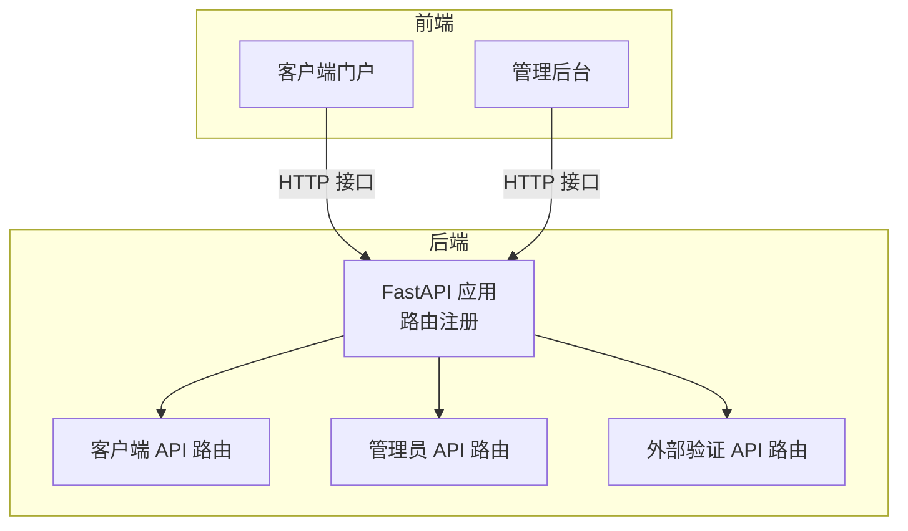
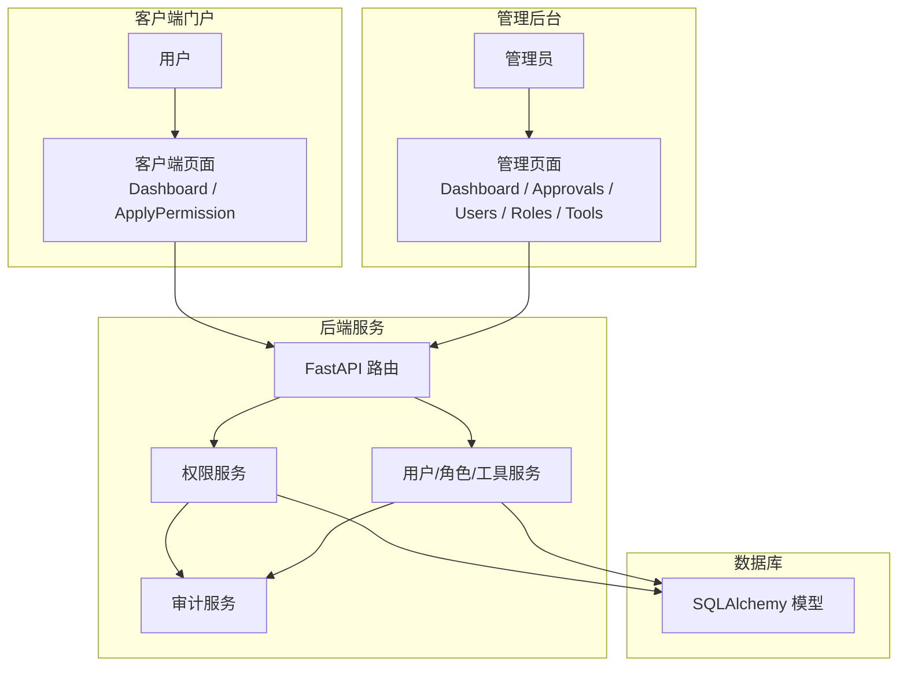
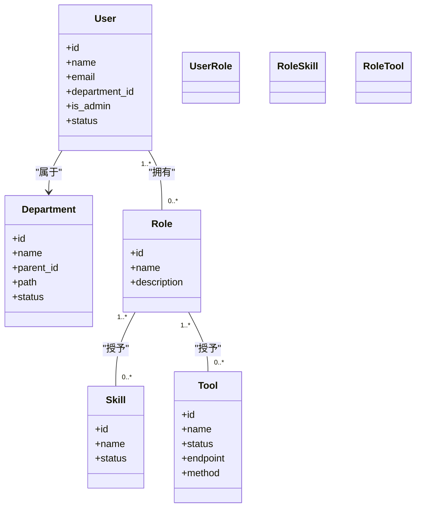
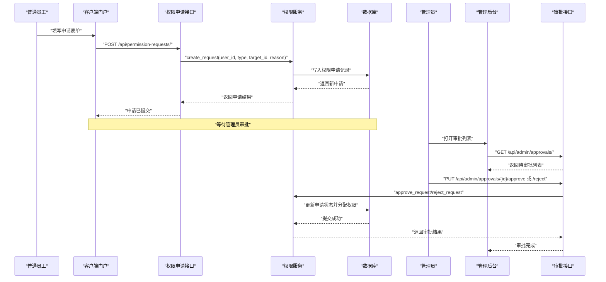
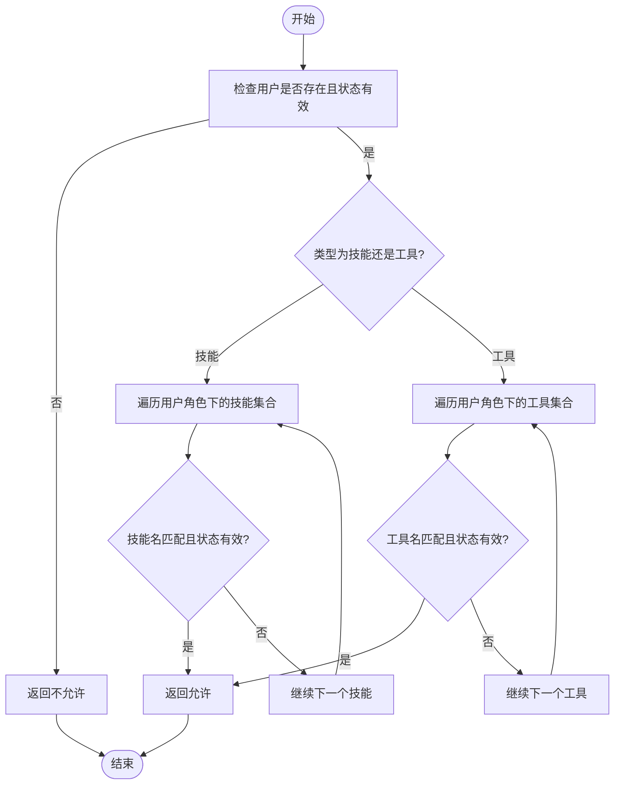
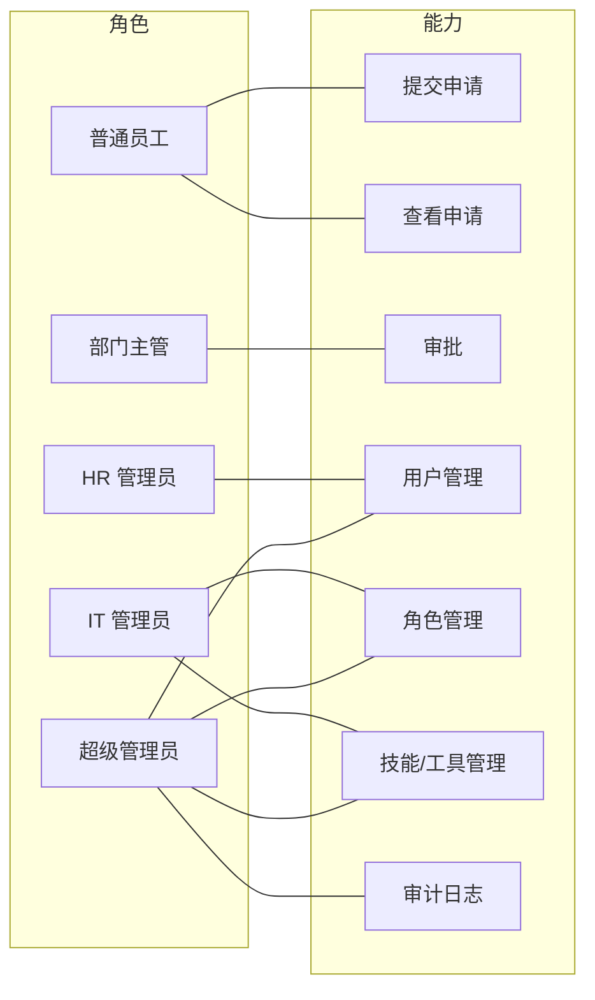

# 应用场景

<cite>
**本文引用的文件**
- [backend/app/main.py](file://backend/app/main.py)
- [backend/app/models/user.py](file://backend/app/models/user.py)
- [backend/app/models/permission.py](file://backend/app/models/permission.py)
- [backend/app/schemas/role.py](file://backend/app/schemas/role.py)
- [backend/app/schemas/tool.py](file://backend/app/schemas/tool.py)
- [backend/app/api/admin/roles.py](file://backend/app/api/admin/roles.py)
- [backend/app/api/admin/tools.py](file://backend/app/api/admin/tools.py)
- [backend/app/api/admin/users.py](file://backend/app/api/admin/users.py)
- [backend/app/api/admin/approvals.py](file://backend/app/api/admin/approvals.py)
- [backend/app/api/permission_requests.py](file://backend/app/api/permission_requests.py)
- [backend/app/services/permission.py](file://backend/app/services/permission.py)
- [frontend/client/src/pages/Dashboard.tsx](file://frontend/client/src/pages/Dashboard.tsx)
- [frontend/client/src/pages/ApplyPermission.tsx](file://frontend/client/src/pages/ApplyPermission.tsx)
- [frontend/admin/src/pages/Dashboard.tsx](file://frontend/admin/src/pages/Dashboard.tsx)
- [frontend/admin/src/pages/Approvals.tsx](file://frontend/admin/src/pages/Approvals.tsx)
</cite>

## 目录
1. [引言](#引言)
2. [项目结构](#项目结构)
3. [核心组件](#核心组件)
4. [架构总览](#架构总览)
5. [详细组件分析](#详细组件分析)
6. [依赖分析](#依赖分析)
7. [性能考虑](#性能考虑)
8. [故障排查指南](#故障排查指南)
9. [结论](#结论)
10. [附录](#附录)

## 引言
ToolHub 是一个面向企业级的“AI 技能与工具权限管理系统”，通过“技能-工具-角色-用户”的分层模型，实现对 AI 工具使用的统一编目、权限申请与审批、权限验证与审计。系统同时提供两类前端界面：面向普通用户的客户端门户，以及面向管理员的后台管理门户。其核心价值在于：
- 避免 AI 工具滥用：以“最小权限”和“按需审批”为核心策略，限制未授权访问。
- 确保数据安全合规：通过权限验证接口与审计日志，保障访问行为可追溯。
- 提高权限管理效率：集中化管理技能与工具清单，自动化角色映射与默认角色创建。
- 降低人工管理成本：标准化流程与可视化界面，减少重复审批与手工维护。

## 项目结构
后端采用 FastAPI 构建，路由分为两部分：
- 客户端 API：认证、用户信息、技能、工具、权限申请等。
- 管理员 API：用户、角色、技能、工具、审批、部门、审计日志等。
前端分为两个 SPA：
- 客户端门户：用户自助查看、申请权限、查看我的申请。
- 管理后台：管理员仪表盘、审批管理、用户与资源管理。

图表来源
- [backend/app/main.py:25-42](file://backend/app/main.py#L25-L42)

章节来源
- [backend/app/main.py:1-61](file://backend/app/main.py#L1-L61)

## 核心组件
- 数据模型
  - 用户、部门、角色、技能、工具、权限申请等核心实体，支持多对多关系（角色-技能、角色-工具、用户-角色）。
- 权限服务
  - 统一处理权限申请、审批、取消、查询与权限验证；在审批通过时自动为用户分配相应技能或工具到其角色中。
- 前端页面
  - 客户端门户：仪表盘概览、权限申请表单、我的申请列表。
  - 管理后台：仪表盘概览、审批列表与操作、用户与资源管理入口。

章节来源
- [backend/app/models/user.py:23-116](file://backend/app/models/user.py#L23-L116)
- [backend/app/models/permission.py:7-28](file://backend/app/models/permission.py#L7-L28)
- [backend/app/services/permission.py:9-182](file://backend/app/services/permission.py#L9-L182)
- [frontend/client/src/pages/Dashboard.tsx:1-50](file://frontend/client/src/pages/Dashboard.tsx#L1-L50)
- [frontend/client/src/pages/ApplyPermission.tsx:1-71](file://frontend/client/src/pages/ApplyPermission.tsx#L1-L71)
- [frontend/admin/src/pages/Dashboard.tsx:1-51](file://frontend/admin/src/pages/Dashboard.tsx#L1-L51)
- [frontend/admin/src/pages/Approvals.tsx:1-77](file://frontend/admin/src/pages/Approvals.tsx#L1-L77)

## 架构总览
系统采用“前后端分离 + 后端 API 分层”的架构：
- 客户端门户负责普通员工自助申请与查看结果；
- 管理后台负责审批、用户与资源管理；
- 权限验证通过独立的外部验证接口供第三方系统调用；
- 所有变更均记录审计日志，便于合规与追踪。

图表来源
- [backend/app/main.py:25-42](file://backend/app/main.py#L25-L42)
- [backend/app/api/admin/approvals.py:14-55](file://backend/app/api/admin/approvals.py#L14-L55)
- [backend/app/api/admin/users.py:14-39](file://backend/app/api/admin/users.py#L14-L39)
- [backend/app/api/admin/roles.py:14-32](file://backend/app/api/admin/roles.py#L14-L32)
- [backend/app/api/admin/tools.py:14-42](file://backend/app/api/admin/tools.py#L14-L42)
- [backend/app/api/permission_requests.py:13-59](file://backend/app/api/permission_requests.py#L13-L59)
- [backend/app/services/permission.py:9-182](file://backend/app/services/permission.py#L9-L182)

## 详细组件分析

### 角色与权限模型
系统通过“角色-技能-工具-用户”四层关系实现权限控制：
- 角色绑定多个技能与工具；
- 用户通过角色间接获得权限；
- 权限申请成功后，系统会将目标技能或工具添加到用户的角色中（若用户无角色则创建默认角色）。

图表来源
- [backend/app/models/user.py:23-116](file://backend/app/models/user.py#L23-L116)

章节来源
- [backend/app/models/user.py:23-116](file://backend/app/models/user.py#L23-L116)
- [backend/app/schemas/role.py:6-43](file://backend/app/schemas/role.py#L6-L43)
- [backend/app/schemas/tool.py:6-51](file://backend/app/schemas/tool.py#L6-L51)

### 权限申请与审批流程
普通员工提交权限申请，管理员进行审批。审批通过后，系统自动将目标技能或工具分配到用户的角色中，从而完成权限生效。

图表来源
- [backend/app/api/permission_requests.py:13-24](file://backend/app/api/permission_requests.py#L13-L24)
- [backend/app/api/admin/approvals.py:58-87](file://backend/app/api/admin/approvals.py#L58-L87)
- [backend/app/services/permission.py:12-43](file://backend/app/services/permission.py#L12-L43)
- [backend/app/services/permission.py:85-144](file://backend/app/services/permission.py#L85-L144)

章节来源
- [backend/app/api/permission_requests.py:13-107](file://backend/app/api/permission_requests.py#L13-L107)
- [backend/app/api/admin/approvals.py:14-88](file://backend/app/api/admin/approvals.py#L14-L88)
- [backend/app/services/permission.py:9-182](file://backend/app/services/permission.py#L9-L182)

### 权限验证流程
第三方系统可通过外部验证接口校验用户对某技能或工具的访问权限。系统会根据用户所拥有的角色及其技能/工具列表进行匹配，并返回允许与否的结果及原因。

图表来源
- [backend/app/services/permission.py:146-164](file://backend/app/services/permission.py#L146-L164)

章节来源
- [backend/app/services/permission.py:146-164](file://backend/app/services/permission.py#L146-L164)

### 管理员能力与职责
- 用户管理：查看/编辑用户角色、状态。
- 角色管理：创建/更新/删除角色，为角色分配技能与工具。
- 工具管理：创建/更新/删除工具，支持分页与筛选。
- 审批管理：查看待审批列表，执行通过/拒绝操作。
- 审计日志：所有关键操作均有审计记录，便于合规与追踪。

章节来源
- [backend/app/api/admin/users.py:14-97](file://backend/app/api/admin/users.py#L14-L97)
- [backend/app/api/admin/roles.py:14-111](file://backend/app/api/admin/roles.py#L14-L111)
- [backend/app/api/admin/tools.py:14-89](file://backend/app/api/admin/tools.py#L14-L89)
- [backend/app/api/admin/approvals.py:14-88](file://backend/app/api/admin/approvals.py#L14-L88)

## 依赖分析
- 路由与中间件
  - 后端应用在启动时注册客户端 API、管理员 API 与外部验证 API，并启用 CORS。
- 前端与后端交互
  - 客户端门户与管理后台通过 HTTP 接口与后端通信，分别调用权限申请、审批、用户与资源管理等接口。
- 数据一致性
  - 权限服务在审批通过时自动为用户分配技能或工具到其角色中，必要时创建默认角色，保证权限生效与一致性。

章节来源
- [backend/app/main.py:25-42](file://backend/app/main.py#L25-L42)
- [frontend/client/src/pages/Dashboard.tsx:10-28](file://frontend/client/src/pages/Dashboard.tsx#L10-L28)
- [frontend/admin/src/pages/Dashboard.tsx:10-28](file://frontend/admin/src/pages/Dashboard.tsx#L10-L28)
- [backend/app/services/permission.py:98-127](file://backend/app/services/permission.py#L98-L127)

## 性能考虑
- 分页与筛选：管理员侧工具与审批列表均支持分页与筛选，避免一次性加载过多数据。
- 并发与幂等：权限申请接口在创建前检查是否存在未完成的同类申请，避免重复提交。
- 默认角色策略：当用户首次获得某技能/工具权限但无角色时，系统自动为其创建默认角色，减少后续复杂度。
- 前端并发请求：客户端门户在仪表盘初始化时并行拉取权限与资源总量，提升首屏速度。

章节来源
- [backend/app/api/admin/tools.py:14-42](file://backend/app/api/admin/tools.py#L14-L42)
- [backend/app/api/admin/approvals.py:14-55](file://backend/app/api/admin/approvals.py#L14-L55)
- [backend/app/api/permission_requests.py:13-24](file://backend/app/api/permission_requests.py#L13-L24)
- [backend/app/services/permission.py:167-178](file://backend/app/services/permission.py#L167-L178)
- [frontend/client/src/pages/Dashboard.tsx:10-28](file://frontend/client/src/pages/Dashboard.tsx#L10-L28)

## 故障排查指南
- 无法提交权限申请
  - 可能原因：存在同类型未完成的申请；目标技能/工具不存在。
  - 处理建议：先取消或等待现有申请完成；确认目标资源状态为“有效”。
- 审批状态异常
  - 可能原因：仅未完成的申请可被审批；审批后系统会自动分配权限。
  - 处理建议：检查申请状态；确认用户角色中已包含目标技能/工具。
- 权限验证失败
  - 可能原因：用户不存在或状态无效；用户角色中不包含目标技能/工具；目标技能/工具状态无效。
  - 处理建议：确认用户状态；检查角色-技能/工具映射；核对目标资源状态。

章节来源
- [backend/app/api/permission_requests.py:13-24](file://backend/app/api/permission_requests.py#L13-L24)
- [backend/app/services/permission.py:12-43](file://backend/app/services/permission.py#L12-L43)
- [backend/app/services/permission.py:85-144](file://backend/app/services/permission.py#L85-L144)
- [backend/app/services/permission.py:146-164](file://backend/app/services/permission.py#L146-L164)

## 结论
ToolHub 通过清晰的权限模型与标准化流程，为企业提供了可控、可审计、易扩展的 AI 工具权限管理体系。它既满足了科技公司对工具池的精细化管理需求，也能为金融机构与咨询公司提供合规与效率兼顾的解决方案。建议在实施过程中结合组织的治理策略，完善角色与资源清单，持续优化审批流程与权限验证策略。

## 附录

### 典型应用场景与业务流程

- 科技公司：AI 工具池管理
  - 场景要点：集中编目技能与工具，按项目/团队划分角色，员工按需申请，管理员统一审批。
  - 关键流程：员工提交申请 → 管理员审批 → 自动分配权限 → 外部系统权限验证。
  - 最佳实践：建立“默认角色+临时角色”的混合策略，定期清理无效角色与工具。

- 金融机构：合规性控制
  - 场景要点：敏感工具仅限特定角色访问，审批与审计必须留痕。
  - 关键流程：申请 → 多级审批 → 审计日志 → 访问验证。
  - 最佳实践：为高风险工具设置强制审批与时限控制，定期导出审计报告。

- 咨询公司：项目权限管理
  - 场景要点：项目周期内动态调整权限，项目结束后回收权限。
  - 关键流程：项目启动 → 创建项目角色 → 成员加入 → 项目结束 → 角色解绑。
  - 最佳实践：使用“项目临时角色”与“默认角色”组合，避免长期权限遗留。

- 教育机构：实验工具授权
  - 场景要点：教学与科研实验工具分级授权，学生与教师权限区分。
  - 关键流程：课程/课题申请 → 导师审批 → 学生授权 → 实验期满回收。
  - 最佳实践：按课程或实验室维度建立角色模板，批量授权与回收。

### 角色与权限对照表（示例）

- 普通员工
  - 能力：查看可用技能/工具、提交权限申请、查看申请状态。
  - 限制：不可越权审批、不可修改他人角色与状态。
- 部门主管
  - 能力：审批本部门员工的权限申请、查看部门成员权限概览。
  - 限制：不可跨部门管理、不可修改系统全局配置。
- HR/人事管理员
  - 能力：查看/更新用户状态、分配用户角色、查看用户列表。
  - 限制：不可越权修改其他管理员权限。
- IT 管理员
  - 能力：创建/更新/删除技能与工具、管理角色、查看审计日志。
  - 限制：不可越权修改超级管理员权限。
- 超级管理员
  - 能力：系统级管控、角色与资源全量管理、审计日志全量查看。
  - 限制：需遵循最小权限原则，避免滥用。

### 权限矩阵图（示例）

