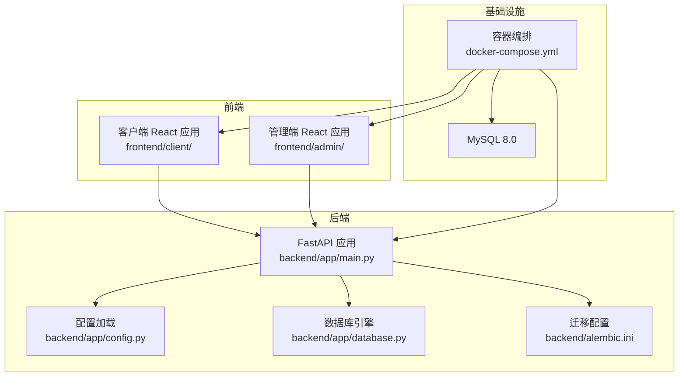
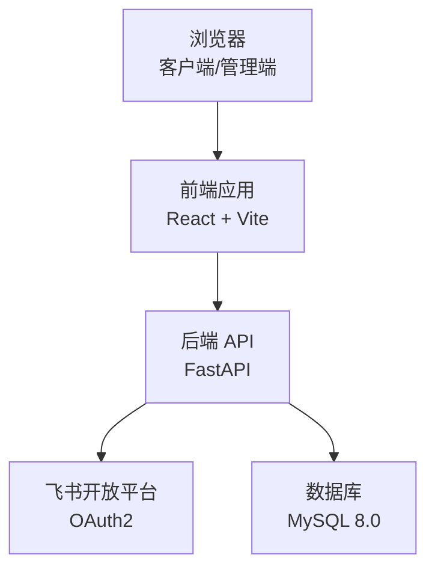
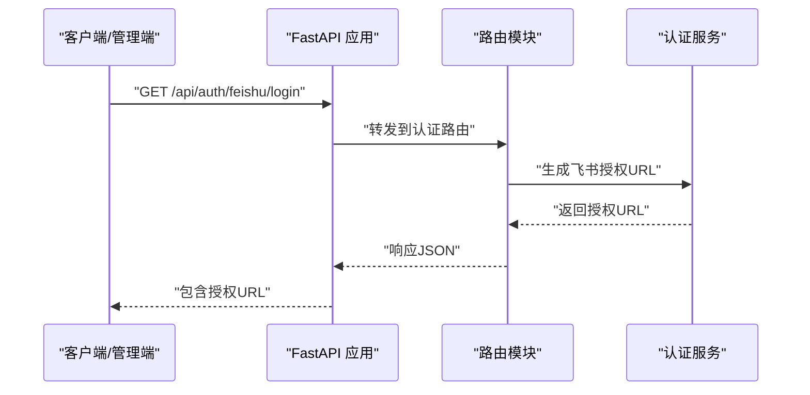
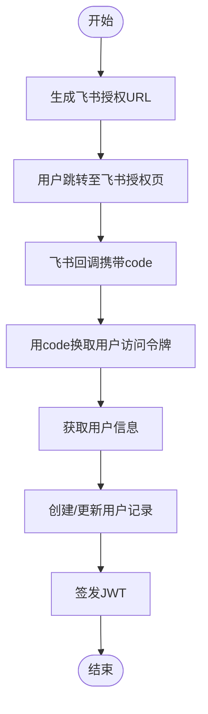
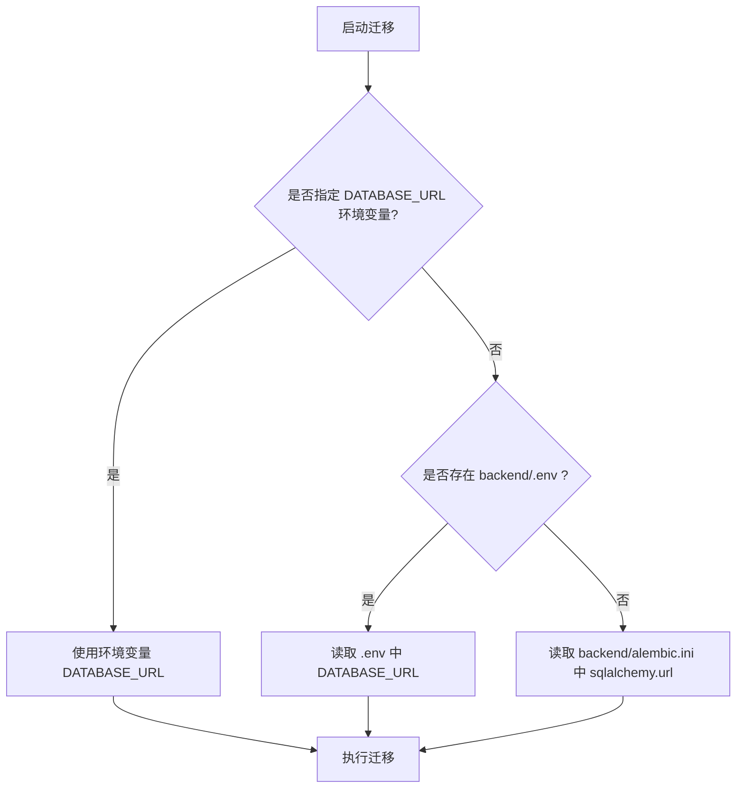
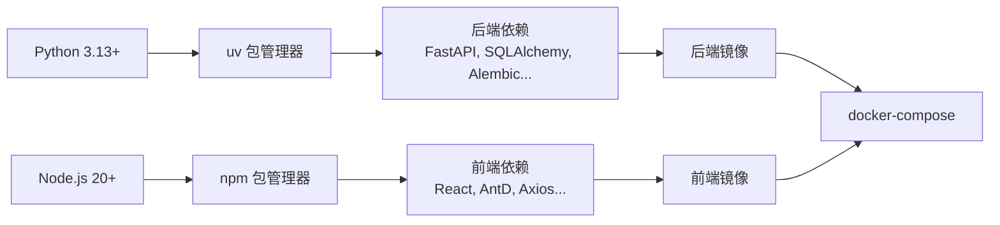

# 快速开始

<cite>
**本文引用的文件**
- [README.md](file://README.md)
- [docker-compose.yml](file://docker-compose.yml)
- [backend/pyproject.toml](file://backend/pyproject.toml)
- [backend/Dockerfile](file://backend/Dockerfile)
- [backend/app/config.py](file://backend/app/config.py)
- [backend/app/main.py](file://backend/app/main.py)
- [backend/app/api/auth.py](file://backend/app/api/auth.py)
- [backend/app/services/auth.py](file://backend/app/services/auth.py)
- [backend/app/services/feishu.py](file://backend/app/services/feishu.py)
- [backend/alembic.ini](file://backend/alembic.ini)
- [backend/alembic/env.py](file://backend/alembic/env.py)
- [frontend/admin/package.json](file://frontend/admin/package.json)
- [frontend/admin/Dockerfile](file://frontend/admin/Dockerfile)
- [frontend/client/package.json](file://frontend/client/package.json)
- [frontend/client/Dockerfile](file://frontend/client/Dockerfile)
</cite>

## 目录
1. [简介](#简介)
2. [项目结构](#项目结构)
3. [核心组件](#核心组件)
4. [架构总览](#架构总览)
5. [详细组件分析](#详细组件分析)
6. [依赖分析](#依赖分析)
7. [性能考虑](#性能考虑)
8. [故障排除指南](#故障排除指南)
9. [结论](#结论)
10. [附录](#附录)

## 简介
本指南面向首次接触 ToolHub 项目的开发者，帮助你在最短时间内完成从环境准备到本地开发再到容器化部署的全流程。内容覆盖：
- 环境准备：Python 3.13+、Node.js 20+、MySQL 8.0+、uv 包管理器、Docker 与 docker-compose
- 本地开发：后端依赖安装、数据库创建与迁移、环境变量配置、服务启动
- 容器化部署：环境变量配置、镜像构建、容器启动、服务访问验证
- 飞书应用配置：在飞书开放平台创建应用、配置 OAuth2 权限、设置回调地址、获取 App ID 与 Secret
- 常见问题与故障排除
- 完整命令行示例与配置文件模板路径

## 项目结构
ToolHub 采用前后端分离与容器化部署的组织方式：
- 后端使用 FastAPI + SQLAlchemy 2.0 + Alembic 迁移，位于 backend/
- 前端包含客户端 client/ 与管理端 admin/，均基于 React 19 + TypeScript
- 使用 docker-compose 进行服务编排，包含 MySQL、后端、客户端、管理端四个服务
- uv 作为 Python 包管理器，配合 Dockerfile 实现高效构建

图表来源
- [backend/app/main.py:1-61](file://backend/app/main.py#L1-L61)
- [backend/app/config.py:11-42](file://backend/app/config.py#L11-L42)
- [docker-compose.yml:1-84](file://docker-compose.yml#L1-L84)

章节来源
- [README.md:65-164](file://README.md#L65-L164)
- [docker-compose.yml:1-84](file://docker-compose.yml#L1-L84)

## 核心组件
- 后端应用入口与路由注册：负责初始化 FastAPI 应用、CORS 中间件、各模块路由挂载与健康检查端点
- 配置系统：基于 pydantic-settings 的 Settings 类，支持从 backend/.env 加载环境变量
- 飞书认证服务：封装飞书 OAuth2 授权 URL 生成、回调处理、用户信息获取与 JWT 令牌签发
- 数据库迁移：Alembic 配置与 env.py 动态读取 DATABASE_URL，支持离线与在线迁移
- 前端应用：客户端与管理端分别提供独立的开发与构建流程

章节来源
- [backend/app/main.py:9-51](file://backend/app/main.py#L9-L51)
- [backend/app/config.py:11-42](file://backend/app/config.py#L11-L42)
- [backend/app/api/auth.py:13-38](file://backend/app/api/auth.py#L13-L38)
- [backend/app/services/auth.py:10-116](file://backend/app/services/auth.py#L10-L116)
- [backend/alembic/env.py:11-48](file://backend/alembic/env.py#L11-L48)

## 架构总览
下图展示了 ToolHub 的整体运行时架构：浏览器通过客户端或管理端访问后端 API；后端连接 MySQL 存储数据；认证模块对接飞书 OAuth2 完成用户身份验证。

图表来源
- [README.md:5-31](file://README.md#L5-L31)
- [backend/app/api/auth.py:13-38](file://backend/app/api/auth.py#L13-L38)
- [backend/app/services/feishu.py:6-38](file://backend/app/services/feishu.py#L6-L38)
- [backend/app/main.py:25-42](file://backend/app/main.py#L25-L42)

## 详细组件分析

### 后端应用与路由
- 应用初始化：创建 FastAPI 实例，设置标题、版本与描述
- CORS 配置：允许来自前端开发端口与生产暴露端口的跨域请求
- 路由挂载：包括认证、用户、技能、工具、权限申请、管理端 API 以及对外验证 API
- 健康检查：提供 /health 端点返回应用状态与版本

图表来源
- [backend/app/main.py:25-42](file://backend/app/main.py#L25-L42)
- [backend/app/api/auth.py:13-17](file://backend/app/api/auth.py#L13-L17)
- [backend/app/services/auth.py:14](file://backend/app/services/auth.py#L14)

章节来源
- [backend/app/main.py:9-51](file://backend/app/main.py#L9-L51)
- [backend/app/api/auth.py:13-38](file://backend/app/api/auth.py#L13-L38)

### 飞书认证流程
- 授权 URL 生成：根据配置中的 App ID、回调地址与基础域名拼接授权链接
- 回调处理：使用 code 换取用户访问令牌，拉取用户信息，创建或更新用户记录，并签发 JWT
- 开发模式登录：在 DEBUG 模式下支持快速登录，便于本地调试

图表来源
- [backend/app/services/feishu.py:15-38](file://backend/app/services/feishu.py#L15-L38)
- [backend/app/services/auth.py:18-77](file://backend/app/services/auth.py#L18-L77)

章节来源
- [backend/app/services/feishu.py:6-38](file://backend/app/services/feishu.py#L6-L38)
- [backend/app/services/auth.py:10-116](file://backend/app/services/auth.py#L10-L116)

### 数据库迁移与配置
- Alembic 配置：默认读取 backend/alembic.ini 中的 sqlalchemy.url
- 环境变量优先级：env.py 会优先使用 DATABASE_URL 环境变量，其次使用 .env 中的配置，最后回退到 alembic.ini
- 运行方式：支持离线与在线两种迁移模式

图表来源
- [backend/alembic/env.py:11-13](file://backend/alembic/env.py#L11-L13)
- [backend/alembic.ini:3](file://backend/alembic.ini#L3)
- [backend/app/config.py:18](file://backend/app/config.py#L18)

章节来源
- [backend/alembic/env.py:21-48](file://backend/alembic/env.py#L21-L48)
- [backend/alembic.ini:1-37](file://backend/alembic.ini#L1-L37)
- [backend/app/config.py:17-18](file://backend/app/config.py#L17-L18)

### 前端应用与构建
- 客户端与管理端：均使用 React 19 + TypeScript，开发端口分别为 5173 与 5174
- 构建流程：先安装依赖，再进行构建，最终由 Nginx 提供静态资源服务
- Dockerfile：共享同一套前端构建流程，分别暴露 80 端口供反向代理使用

章节来源
- [frontend/client/package.json:6-10](file://frontend/client/package.json#L6-L10)
- [frontend/admin/package.json:6-10](file://frontend/admin/package.json#L6-L10)
- [frontend/client/Dockerfile:1-30](file://frontend/client/Dockerfile#L1-L30)
- [frontend/admin/Dockerfile:1-30](file://frontend/admin/Dockerfile#L1-L30)

## 依赖分析
- 后端依赖：FastAPI、SQLAlchemy、Alembic、PyMySQL、Pydantic、Pydantic-Settings、Cryptography、HTTPX、python-multipart 等
- 前端依赖：React、Ant Design、Axios、Zustand、Day.js 等
- 容器化：后端使用 uv 安装依赖，前端使用 npm 安装依赖并构建静态资源

图表来源
- [backend/pyproject.toml:7-20](file://backend/pyproject.toml#L7-L20)
- [frontend/client/package.json:11-27](file://frontend/client/package.json#L11-L27)
- [frontend/admin/package.json:11-27](file://frontend/admin/package.json#L11-L27)
- [backend/Dockerfile:7-22](file://backend/Dockerfile#L7-L22)
- [frontend/client/Dockerfile:10](file://frontend/client/Dockerfile#L10)
- [frontend/admin/Dockerfile:10](file://frontend/admin/Dockerfile#L10)

章节来源
- [backend/pyproject.toml:1-31](file://backend/pyproject.toml#L1-L31)
- [frontend/client/package.json:1-29](file://frontend/client/package.json#L1-L29)
- [frontend/admin/package.json:1-29](file://frontend/admin/package.json#L1-L29)

## 性能考虑
- 后端镜像构建：使用 uv 安装依赖，减少缓存与体积，提升构建速度
- 前端镜像构建：分阶段构建，仅将 Nginx 运行时镜像用于最终容器，减小镜像体积
- 数据库连接：建议在生产环境中使用连接池与合适的超时参数，避免阻塞
- CORS 配置：仅允许必要的来源，降低跨域风险

## 故障排除指南
- 无法连接数据库
  - 检查 DATABASE_URL 是否正确，确认 MySQL 服务已启动且端口映射正常
  - 若使用 docker-compose，请确认网络连通性与卷挂载
- 飞书回调失败
  - 确认 FEISHU_APP_ID、FEISHU_APP_SECRET、FEISHU_REDIRECT_URI 配置正确
  - 检查回调地址与飞书应用中配置一致
- JWT 签发异常
  - 确认 JWT_SECRET_KEY 已设置为足够强度的随机字符串
- 前端无法访问后端 API
  - 检查 CORS_ORIGINS 是否包含前端访问地址
- 开发模式登录不可用
  - 确认 DEBUG 设置为 True，否则开发模式登录会被禁用

章节来源
- [backend/app/config.py:20-36](file://backend/app/config.py#L20-L36)
- [backend/app/services/auth.py:80-83](file://backend/app/services/auth.py#L80-L83)
- [docker-compose.yml:31-41](file://docker-compose.yml#L31-L41)

## 结论
通过本指南，你可以在本地快速搭建 ToolHub 的开发与运行环境，并完成容器化部署。建议在生产环境中进一步完善安全配置（如 HTTPS、强密码策略、最小权限原则）与监控告警体系。

## 附录

### 环境准备与安装
- Python 3.13+
- Node.js 20+
- MySQL 8.0+
- uv 包管理器
- Docker 与 docker-compose

章节来源
- [README.md:219-226](file://README.md#L219-L226)

### 本地开发环境搭建
- 后端依赖安装（uv workspace）
  - 在项目根目录执行依赖安装
- 配置环境变量
  - 复制示例文件并编辑实际配置
- 创建数据库
  - 使用 MySQL 客户端创建数据库
- 执行数据库迁移
  - 切换到 backend 目录执行迁移
- 启动后端服务
  - 使用 Uvicorn 启动应用

章节来源
- [README.md:227-248](file://README.md#L227-L248)

### 前端开发环境搭建
- 客户端前端
  - 切换到 frontend/client，安装依赖并启动开发服务器
- 管理端前端
  - 切换到 frontend/admin，安装依赖并启动开发服务器

章节来源
- [README.md:250-264](file://README.md#L250-L264)
- [frontend/client/package.json:6-10](file://frontend/client/package.json#L6-L10)
- [frontend/admin/package.json:6-10](file://frontend/admin/package.json#L6-L10)

### Docker 容器化部署
- 配置环境变量
  - 复制示例文件并填写飞书 App ID/Secret、JWT 密钥等
- 一键启动
  - 使用 docker-compose 启动全部服务
- 服务访问
  - 客户端：http://localhost:80
  - 管理端：http://localhost:81
  - 后端 API：http://localhost:8000
  - API 文档：http://localhost:8000/docs

章节来源
- [README.md:266-281](file://README.md#L266-L281)
- [docker-compose.yml:1-84](file://docker-compose.yml#L1-L84)

### 飞书应用配置
- 在飞书开放平台创建企业自建应用
- 开启“网页应用”能力，配置重定向 URL 为客户端回调地址
- 添加通讯录权限（如部门与用户 ID）
- 将 App ID 与 App Secret 填入 .env 配置

章节来源
- [README.md:283-289](file://README.md#L283-L289)

### 环境变量参考
- DATABASE_URL：MySQL 连接字符串
- JWT_SECRET_KEY：JWT 签名密钥
- JWT_ACCESS_TOKEN_EXPIRE_MINUTES：Token 有效期（分钟）
- FEISHU_APP_ID：飞书应用 App ID
- FEISHU_APP_SECRET：飞书应用 App Secret
- FEISHU_REDIRECT_URI：飞书回调地址
- CORS_ORIGINS：允许的跨域来源

章节来源
- [README.md:290-301](file://README.md#L290-L301)
- [backend/app/config.py:17-36](file://backend/app/config.py#L17-L36)

### 命令行示例与配置文件模板路径
- 后端依赖安装：在项目根目录执行
- 环境变量模板：backend/.env.example
- 项目根环境变量模板：.env.example
- 后端迁移配置：backend/alembic.ini
- 后端迁移入口：backend/alembic/env.py
- 后端 Dockerfile：backend/Dockerfile
- 前端 Dockerfile（客户端）：frontend/client/Dockerfile
- 前端 Dockerfile（管理端）：frontend/admin/Dockerfile
- 前端 package.json（客户端）：frontend/client/package.json
- 前端 package.json（管理端）：frontend/admin/package.json

章节来源
- [README.md:235-237](file://README.md#L235-L237)
- [backend/alembic.ini:1-37](file://backend/alembic.ini#L1-L37)
- [backend/alembic/env.py:11-13](file://backend/alembic/env.py#L11-L13)
- [backend/Dockerfile:1-29](file://backend/Dockerfile#L1-L29)
- [frontend/client/Dockerfile:1-30](file://frontend/client/Dockerfile#L1-L30)
- [frontend/admin/Dockerfile:1-30](file://frontend/admin/Dockerfile#L1-L30)
- [frontend/client/package.json:1-29](file://frontend/client/package.json#L1-L29)
- [frontend/admin/package.json:1-29](file://frontend/admin/package.json#L1-L29)