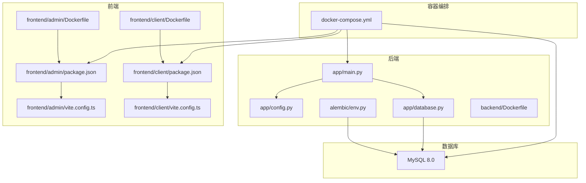
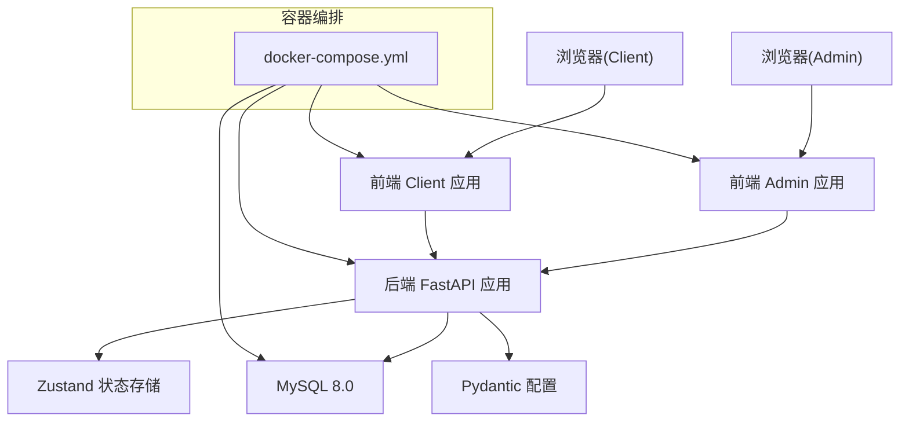
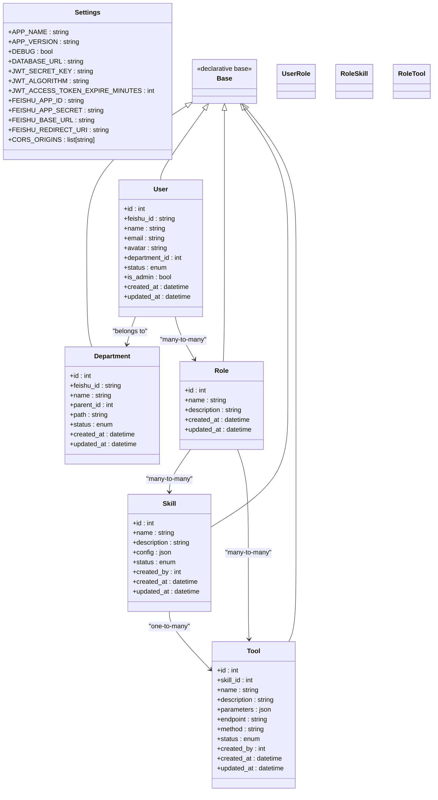
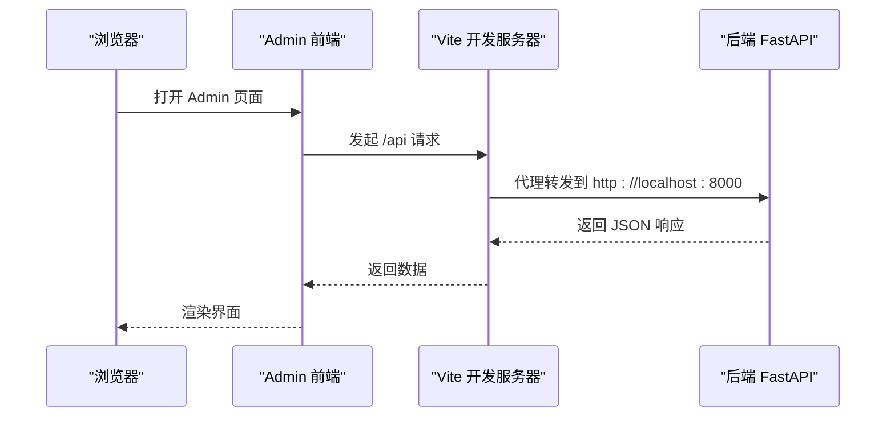
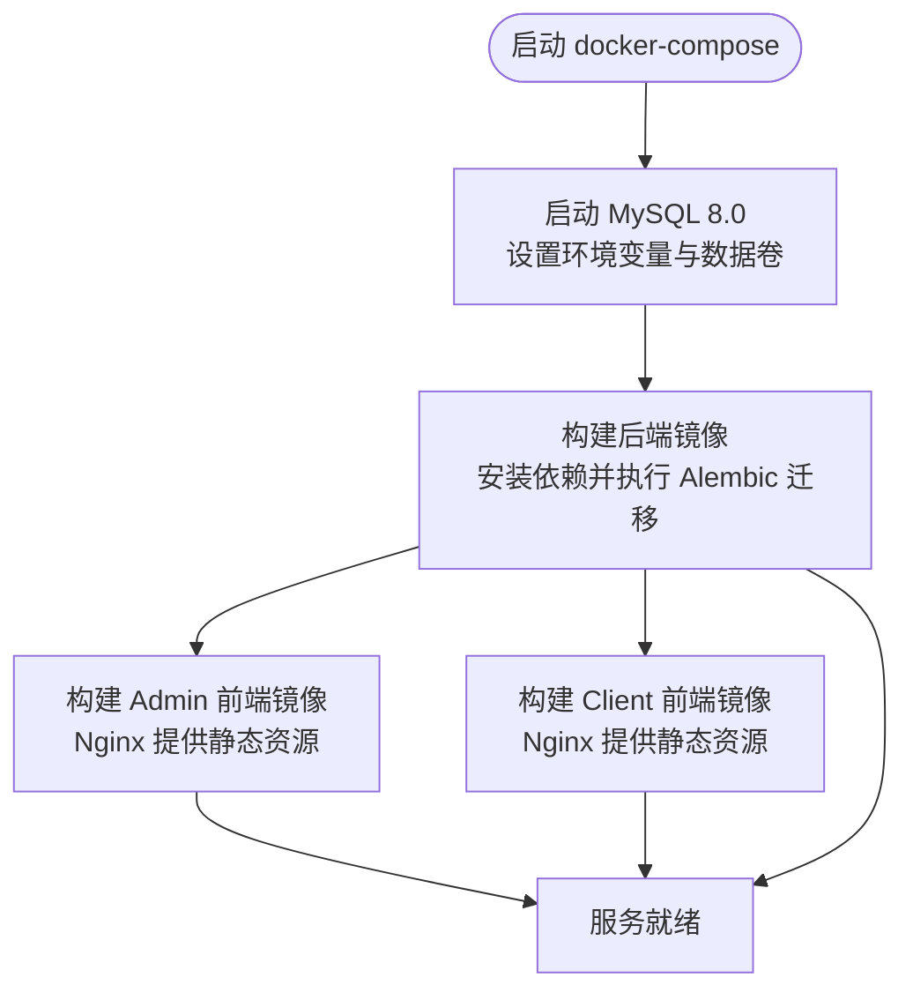
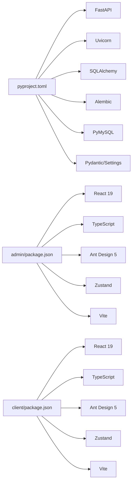

# 技术栈

<cite>
**本文引用的文件**
- [backend/pyproject.toml](file://backend/pyproject.toml)
- [backend/Dockerfile](file://backend/Dockerfile)
- [backend/app/main.py](file://backend/app/main.py)
- [backend/app/config.py](file://backend/app/config.py)
- [backend/app/database.py](file://backend/app/database.py)
- [backend/app/api/auth.py](file://backend/app/api/auth.py)
- [backend/app/models/user.py](file://backend/app/models/user.py)
- [backend/app/schemas/user.py](file://backend/app/schemas/user.py)
- [backend/alembic/env.py](file://backend/alembic/env.py)
- [frontend/admin/package.json](file://frontend/admin/package.json)
- [frontend/client/package.json](file://frontend/client/package.json)
- [frontend/admin/Dockerfile](file://frontend/admin/Dockerfile)
- [frontend/client/Dockerfile](file://frontend/client/Dockerfile)
- [frontend/admin/vite.config.ts](file://frontend/admin/vite.config.ts)
- [frontend/client/vite.config.ts](file://frontend/client/vite.config.ts)
- [frontend/admin/src/store/auth.ts](file://frontend/admin/src/store/auth.ts)
- [docker-compose.yml](file://docker-compose.yml)
</cite>

## 目录
1. [引言](#引言)
2. [项目结构](#项目结构)
3. [核心组件](#核心组件)
4. [架构总览](#架构总览)
5. [详细组件分析](#详细组件分析)
6. [依赖分析](#依赖分析)
7. [性能考虑](#性能考虑)
8. [故障排查指南](#故障排查指南)
9. [结论](#结论)
10. [附录](#附录)

## 引言
本文件系统性介绍 ToolHub 的技术栈与选型理由，覆盖后端（FastAPI、SQLAlchemy 2.0、Alembic、MySQL 8.0）、前端（React 19、TypeScript、Ant Design 5、Zustand、Vite），以及容器化部署（Docker、docker-compose）。我们将从架构设计、数据流、处理逻辑、集成点、错误处理与性能特征等维度展开，并提供技术栈对比表、版本兼容性与升级路径建议。

## 项目结构
ToolHub 采用前后端分离的双仓库式结构：后端使用 Python 3.13、FastAPI、SQLAlchemy 2.0 与 Alembic；前端提供 admin 与 client 两套应用，共享 React 19、TypeScript、Ant Design 5、Zustand 与 Vite 配置。容器化通过 docker-compose 编排 MySQL 8.0、后端服务与两个前端应用。

图表来源
- [docker-compose.yml:1-84](file://docker-compose.yml#L1-L84)
- [backend/app/main.py:1-61](file://backend/app/main.py#L1-L61)
- [backend/app/config.py:1-42](file://backend/app/config.py#L1-L42)
- [backend/app/database.py:1-25](file://backend/app/database.py#L1-L25)
- [backend/alembic/env.py:1-49](file://backend/alembic/env.py#L1-L49)
- [frontend/admin/package.json:1-29](file://frontend/admin/package.json#L1-L29)
- [frontend/client/package.json:1-29](file://frontend/client/package.json#L1-L29)
- [frontend/admin/vite.config.ts:1-15](file://frontend/admin/vite.config.ts#L1-L15)
- [frontend/client/vite.config.ts:1-15](file://frontend/client/vite.config.ts#L1-L15)
- [frontend/admin/Dockerfile:1-30](file://frontend/admin/Dockerfile#L1-L30)
- [frontend/client/Dockerfile:1-30](file://frontend/client/Dockerfile#L1-L30)
- [backend/Dockerfile:1-29](file://backend/Dockerfile#L1-L29)

章节来源
- [docker-compose.yml:1-84](file://docker-compose.yml#L1-L84)
- [backend/app/main.py:1-61](file://backend/app/main.py#L1-L61)
- [backend/app/config.py:1-42](file://backend/app/config.py#L1-L42)
- [backend/app/database.py:1-25](file://backend/app/database.py#L1-L25)
- [backend/alembic/env.py:1-49](file://backend/alembic/env.py#L1-L49)
- [frontend/admin/package.json:1-29](file://frontend/admin/package.json#L1-L29)
- [frontend/client/package.json:1-29](file://frontend/client/package.json#L1-L29)
- [frontend/admin/vite.config.ts:1-15](file://frontend/admin/vite.config.ts#L1-L15)
- [frontend/client/vite.config.ts:1-15](file://frontend/client/vite.config.ts#L1-L15)
- [frontend/admin/Dockerfile:1-30](file://frontend/admin/Dockerfile#L1-L30)
- [frontend/client/Dockerfile:1-30](file://frontend/client/Dockerfile#L1-L30)
- [backend/Dockerfile:1-29](file://backend/Dockerfile#L1-L29)

## 核心组件
- 后端框架与运行时
  - FastAPI：提供高性能异步 Web 框架，内置 OpenAPI/Swagger 文档、Pydantic 数据校验与依赖注入。
  - Uvicorn：ASGI 服务器，支持热重载与生产部署。
  - Pydantic/Settings：配置与请求响应模型的强类型保障。
- 数据层
  - SQLAlchemy 2.0：声明式 ORM、会话管理、连接池与方言适配。
  - Alembic：数据库迁移工具，支持在线/离线迁移与自动发现模型。
  - MySQL 8.0：关系型数据库，提供安全认证、窗口函数、CTE 等现代特性。
- 前端框架与工具链
  - React 19：并发渲染、新 Hooks 与 Suspense 改进。
  - TypeScript：静态类型检查，提升可维护性与协作效率。
  - Ant Design 5：企业级 UI 组件库，提供丰富的业务组件与主题定制。
  - Zustand：极简状态管理，适合小型到中型应用的状态共享。
  - Vite：快速开发与构建工具，提供热更新与模块联邦能力。
- 容器化与编排
  - Docker：后端使用 uv 安装依赖，前端基于 Node 构建、Nginx 运行。
  - docker-compose：统一编排 MySQL、后端、admin 与 client 前端服务。

章节来源
- [backend/pyproject.toml:1-31](file://backend/pyproject.toml#L1-L31)
- [backend/app/main.py:1-61](file://backend/app/main.py#L1-L61)
- [backend/app/config.py:1-42](file://backend/app/config.py#L1-L42)
- [backend/app/database.py:1-25](file://backend/app/database.py#L1-L25)
- [backend/alembic/env.py:1-49](file://backend/alembic/env.py#L1-L49)
- [frontend/admin/package.json:1-29](file://frontend/admin/package.json#L1-L29)
- [frontend/client/package.json:1-29](file://frontend/client/package.json#L1-L29)
- [frontend/admin/vite.config.ts:1-15](file://frontend/admin/vite.config.ts#L1-L15)
- [frontend/client/vite.config.ts:1-15](file://frontend/client/vite.config.ts#L1-L15)
- [frontend/admin/Dockerfile:1-30](file://frontend/admin/Dockerfile#L1-L30)
- [frontend/client/Dockerfile:1-30](file://frontend/client/Dockerfile#L1-L30)
- [backend/Dockerfile:1-29](file://backend/Dockerfile#L1-L29)
- [docker-compose.yml:1-84](file://docker-compose.yml#L1-L84)

## 架构总览
下图展示了 ToolHub 的端到端架构：浏览器通过前端应用访问后端 API，后端通过 SQLAlchemy 访问 MySQL，Alembic 负责数据库版本治理；docker-compose 将所有组件编排在同一网络内。

图表来源
- [docker-compose.yml:1-84](file://docker-compose.yml#L1-L84)
- [backend/app/main.py:1-61](file://backend/app/main.py#L1-L61)
- [backend/app/config.py:1-42](file://backend/app/config.py#L1-L42)
- [backend/app/database.py:1-25](file://backend/app/database.py#L1-L25)
- [frontend/admin/src/store/auth.ts:1-30](file://frontend/admin/src/store/auth.ts#L1-L30)
- [frontend/admin/vite.config.ts:1-15](file://frontend/admin/vite.config.ts#L1-L15)
- [frontend/client/vite.config.ts:1-15](file://frontend/client/vite.config.ts#L1-L15)

## 详细组件分析

### 后端技术栈：FastAPI + SQLAlchemy 2.0 + Alembic + MySQL 8.0
- FastAPI
  - 特性：自动生成 OpenAPI 文档、依赖注入、Pydantic 自动校验与序列化、CORS 中间件、路由分层清晰。
  - 入口与路由：应用在入口函数中注册认证、用户、技能、工具、权限申请等客户端路由，以及管理端路由与外部验证路由。
  - 配置：通过 Pydantic Settings 加载 .env，支持数据库连接、JWT、飞书 OAuth、CORS 等。
- SQLAlchemy 2.0
  - 连接与会话：使用引擎与会话工厂，开启 pool_pre_ping 与 recycle 提升连接稳定性。
  - 模型：定义部门、用户、角色、技能、工具及其关联表，使用枚举与 JSON 字段表达复杂业务。
  - 类型安全：配合 Pydantic Schema 实现请求/响应模型与数据库模型的双向映射。
- Alembic
  - 环境：读取 DATABASE_URL 优先级高于 .env 与 alembic.ini，支持在线/离线迁移。
  - 使用：Docker 后端启动时自动执行迁移至最新版本。
- MySQL 8.0
  - docker-compose 中以官方镜像运行，设置 root 密码、数据库名、用户与密码，暴露端口并持久化数据卷。
  - 连接：后端通过 mysql+pymysql 方言连接，支持 UTF-8、字符集与索引优化。

图表来源
- [backend/app/config.py:1-42](file://backend/app/config.py#L1-L42)
- [backend/app/database.py:1-25](file://backend/app/database.py#L1-L25)
- [backend/app/models/user.py:1-116](file://backend/app/models/user.py#L1-L116)

章节来源
- [backend/app/main.py:1-61](file://backend/app/main.py#L1-L61)
- [backend/app/config.py:1-42](file://backend/app/config.py#L1-L42)
- [backend/app/database.py:1-25](file://backend/app/database.py#L1-L25)
- [backend/app/models/user.py:1-116](file://backend/app/models/user.py#L1-L116)
- [backend/alembic/env.py:1-49](file://backend/alembic/env.py#L1-L49)
- [backend/Dockerfile:1-29](file://backend/Dockerfile#L1-L29)
- [docker-compose.yml:1-84](file://docker-compose.yml#L1-L84)

### 前端技术栈：React 19 + TypeScript + Ant Design 5 + Zustand + Vite
- React 19
  - 使用最新并发渲染能力，结合 Suspense 与新 Hooks 提升用户体验与开发效率。
- TypeScript
  - 在页面、组件、API 请求与状态存储中广泛使用类型定义，降低运行时错误风险。
- Ant Design 5
  - 提供统一的设计语言与组件生态，覆盖布局、表单、表格、弹窗、图标等常用场景。
- Zustand
  - 极简状态管理，仅在认证相关场景使用，避免过度工程化。
- Vite
  - 开发模式热更新，构建阶段进行代码分割与 Tree Shaking；代理后端 /api 请求，便于联调。

图表来源
- [frontend/admin/vite.config.ts:1-15](file://frontend/admin/vite.config.ts#L1-L15)
- [frontend/client/vite.config.ts:1-15](file://frontend/client/vite.config.ts#L1-L15)
- [backend/app/main.py:1-61](file://backend/app/main.py#L1-L61)

章节来源
- [frontend/admin/package.json:1-29](file://frontend/admin/package.json#L1-L29)
- [frontend/client/package.json:1-29](file://frontend/client/package.json#L1-L29)
- [frontend/admin/vite.config.ts:1-15](file://frontend/admin/vite.config.ts#L1-L15)
- [frontend/client/vite.config.ts:1-15](file://frontend/client/vite.config.ts#L1-L15)
- [frontend/admin/src/store/auth.ts:1-30](file://frontend/admin/src/store/auth.ts#L1-L30)

### 容器化与部署：Docker 与 docker-compose
- 后端
  - 基于 Python 3.13-slim，使用 uv 安装依赖，预装 gcc 与 MySQL 客户端库，构建完成后执行 Alembic 升级并启动 Uvicorn。
- 前端
  - 多阶段构建：Node 20 Alpine 安装依赖与打包，Nginx Alpine 提供静态资源服务，复制 Nginx 配置文件。
- 编排
  - docker-compose 将 MySQL、后端、admin 与 client 四个服务编排在同一桥接网络，设置健康检查、端口映射与环境变量，确保依赖顺序与可用性。

图表来源
- [docker-compose.yml:1-84](file://docker-compose.yml#L1-L84)
- [backend/Dockerfile:1-29](file://backend/Dockerfile#L1-L29)
- [frontend/admin/Dockerfile:1-30](file://frontend/admin/Dockerfile#L1-L30)
- [frontend/client/Dockerfile:1-30](file://frontend/client/Dockerfile#L1-L30)

章节来源
- [docker-compose.yml:1-84](file://docker-compose.yml#L1-L84)
- [backend/Dockerfile:1-29](file://backend/Dockerfile#L1-L29)
- [frontend/admin/Dockerfile:1-30](file://frontend/admin/Dockerfile#L1-L30)
- [frontend/client/Dockerfile:1-30](file://frontend/client/Dockerfile#L1-L30)

## 依赖分析
- 后端依赖
  - FastAPI、Uvicorn、SQLAlchemy、Alembic、PyMySQL、Pydantic、Pydantic Settings、Cryptography、HTTPX、python-multipart 等。
  - 通过 pyproject.toml 管理依赖与构建系统，使用 hatchling 作为构建后端。
- 前端依赖
  - React 19、React DOM、React Router、Ant Design 5、Axios、Day.js、Zustand、TypeScript、Vite、@vitejs/plugin-react 等。
  - 两套前端共享依赖，分别独立构建与运行。

图表来源
- [backend/pyproject.toml:1-31](file://backend/pyproject.toml#L1-L31)
- [frontend/admin/package.json:1-29](file://frontend/admin/package.json#L1-L29)
- [frontend/client/package.json:1-29](file://frontend/client/package.json#L1-L29)

章节来源
- [backend/pyproject.toml:1-31](file://backend/pyproject.toml#L1-L31)
- [frontend/admin/package.json:1-29](file://frontend/admin/package.json#L1-L29)
- [frontend/client/package.json:1-29](file://frontend/client/package.json#L1-L29)

## 性能考虑
- 后端
  - 异步 FastAPI + Uvicorn：高并发 I/O 场景表现优异；建议合理拆分路由与中间件，避免阻塞操作。
  - SQLAlchemy 连接池：启用 pool_pre_ping 与 recycle，减少断连与重建成本。
  - Alembic 迁移：在容器启动阶段完成，避免运行时迁移带来的冷启动延迟。
- 前端
  - Vite 开发体验：热更新与按需加载；生产构建进行 Tree Shaking 与代码分割。
  - Ant Design 5：按需引入组件与样式，减少首屏体积。
  - Zustand：轻量状态管理，避免全局订阅导致的重渲染。
- 数据库
  - MySQL 8.0：启用 utf8mb4、合理索引与查询优化；对高频字段建立索引，避免全表扫描。

## 故障排查指南
- 后端
  - 数据库连接失败：检查 DATABASE_URL、网络连通性与 MySQL 健康状态。
  - 迁移失败：确认 Alembic 配置优先级与目标元数据一致，必要时手动执行迁移命令。
  - CORS 问题：核对 CORS_ORIGINS 是否包含前端访问地址。
- 前端
  - 代理无效：确认 Vite 代理配置指向后端地址，且后端已启动。
  - 状态异常：检查本地存储 token 与 Zustand 状态同步情况。
- 容器化
  - 服务未就绪：查看 docker-compose 健康检查与日志输出，确认依赖顺序。
  - 端口冲突：调整映射端口或停止占用进程。

章节来源
- [backend/app/config.py:1-42](file://backend/app/config.py#L1-L42)
- [backend/alembic/env.py:1-49](file://backend/alembic/env.py#L1-L49)
- [frontend/admin/vite.config.ts:1-15](file://frontend/admin/vite.config.ts#L1-L15)
- [frontend/client/vite.config.ts:1-15](file://frontend/client/vite.config.ts#L1-L15)
- [docker-compose.yml:1-84](file://docker-compose.yml#L1-L84)

## 结论
ToolHub 的技术栈围绕“高性能后端 + 现代化前端 + 可演进数据库 + 容器化编排”展开。后端以 FastAPI 与 SQLAlchemy 2.0 为核心，具备强类型与异步能力；前端以 React 19 与 Ant Design 5 为基础，辅以 TypeScript 与 Zustand 提升开发效率与可维护性；数据库采用 MySQL 8.0 并通过 Alembic 实现可追溯的版本管理；容器化通过 Docker 与 docker-compose 实现一键部署与扩展。

## 附录

### 技术栈对比表（与传统方案）
- 后端
  - 传统：Flask + SQLAlchemy 1.x + Flask-Migrate + MySQL 5.7
  - ToolHub：FastAPI + SQLAlchemy 2.0 + Alembic + MySQL 8.0
  - 差异与优势：异步 I/O、更强的类型系统、自动生成文档、更完善的 ORM 语法糖、更易维护的迁移策略。
- 前端
  - 传统：Create React App + Antd 4 + Redux/Zustand
  - ToolHub：Vite + React 19 + Antd 5 + Zustand + TypeScript
  - 差异与优势：更快的开发体验、更好的并发渲染、更严格的类型约束、更简洁的状态管理。
- 数据库
  - 传统：MySQL 5.7 + 手工迁移
  - ToolHub：MySQL 8.0 + Alembic
  - 差异与优势：更丰富的 SQL 能力、更强的安全与性能、自动化迁移与版本控制。
- 部署
  - 传统：裸机/虚拟机 + Nginx + Gunicorn
  - ToolHub：Docker + docker-compose
  - 差异与优势：环境一致性、快速扩缩容、服务编排与健康检查。

### 版本兼容性与升级路径建议
- Python 与后端
  - 当前：Python 3.13、FastAPI >= 0.115、SQLAlchemy >= 2.0、Alembic >= 1.14、PyMySQL >= 1.1、Pydantic >= 2、Pydantic Settings >= 2。
  - 升级建议：遵循语义化版本，先升级 FastAPI 与 SQLAlchemy，再升级 Alembic；Pydantic 2.x 与 1.x 不兼容，需同步迁移模型与校验逻辑。
- 前端
  - 当前：React 19、TypeScript ~5.7、Ant Design 5、Zustand 5、Vite 6。
  - 升级建议：保持主版本一致，逐步升级插件与依赖；注意 React 19 的新行为与 Hooks 变化。
- 数据库
  - 当前：MySQL 8.0。
  - 升级建议：关注字符集与索引变更；生产环境迁移前做好备份与灰度验证。
- 容器化
  - 当前：Python 3.13-slim、Node 20-alpine、Nginx alpine。
  - 升级建议：镜像基底版本与依赖版本同步更新，多阶段构建保持最小镜像体积。