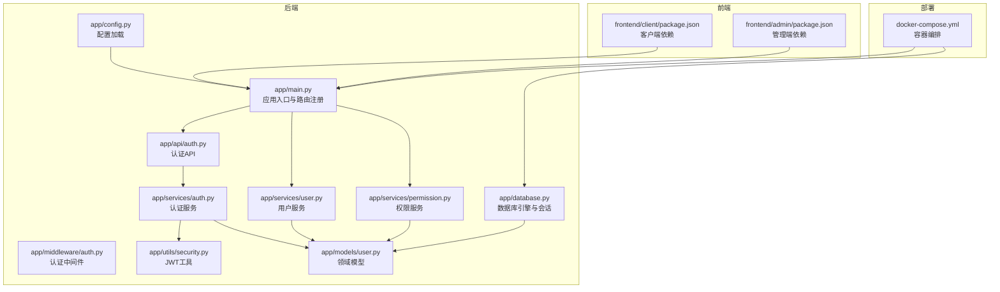
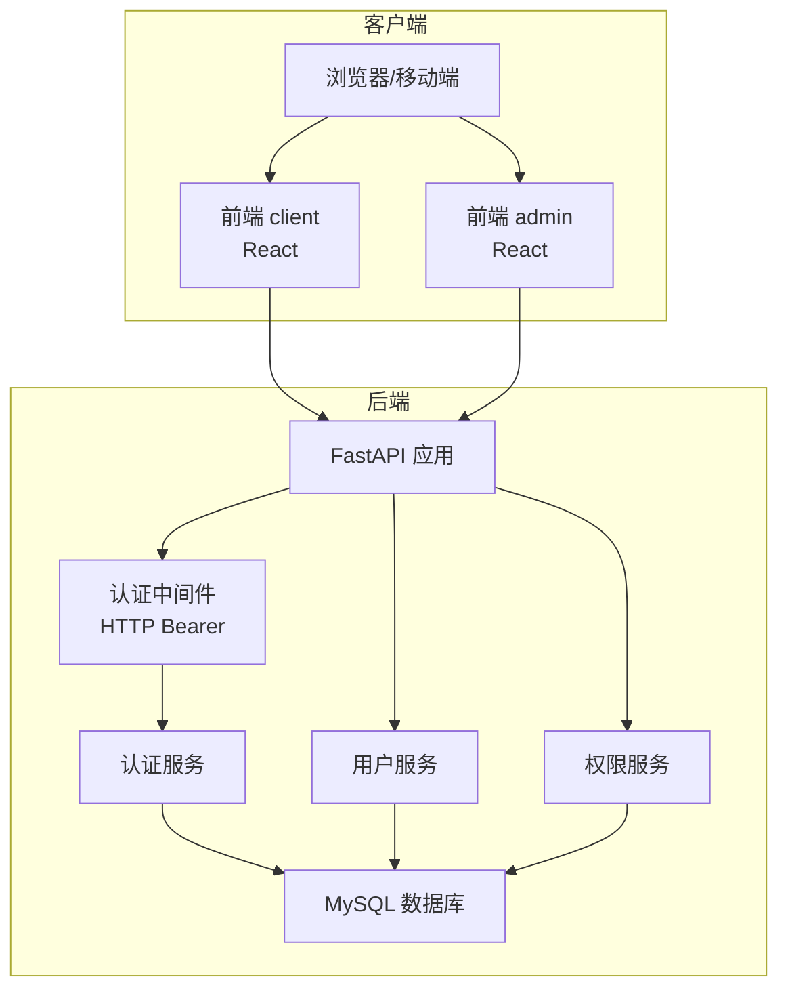
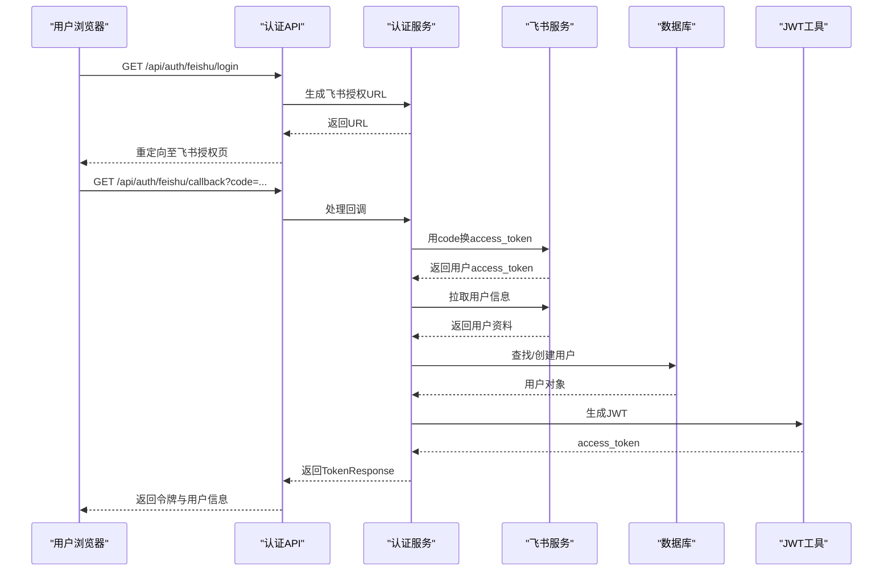
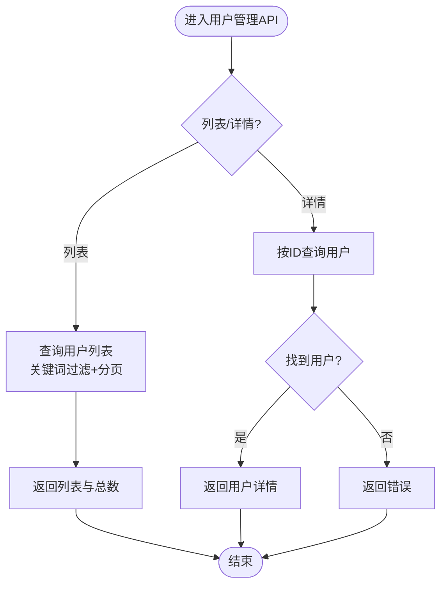
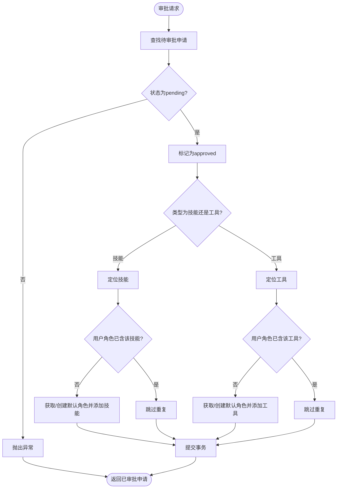
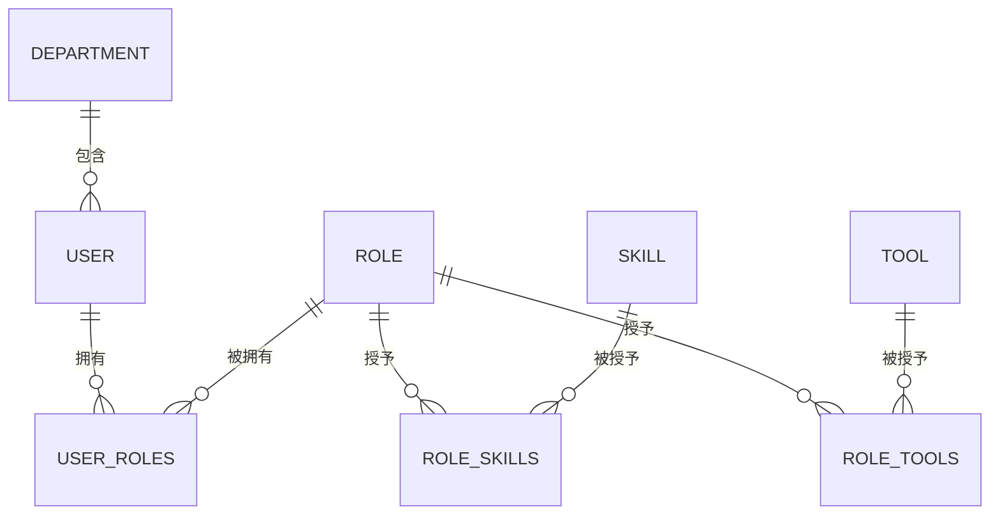
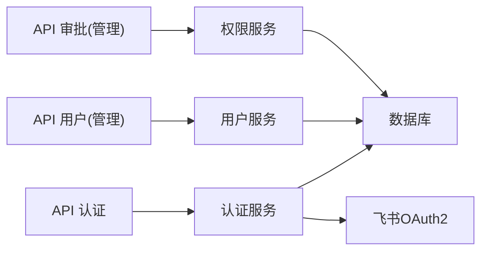
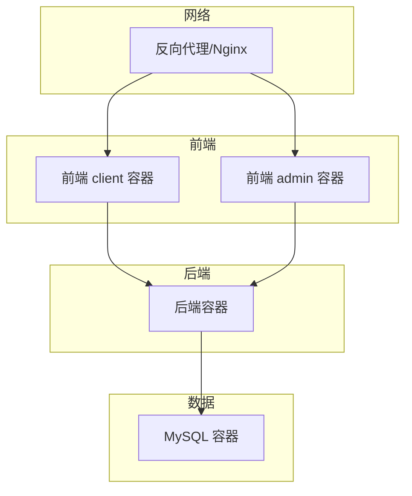

# 架构设计

<cite>
**本文引用的文件**
- [backend/app/main.py](file://backend/app/main.py)
- [backend/app/config.py](file://backend/app/config.py)
- [backend/app/database.py](file://backend/app/database.py)
- [backend/pyproject.toml](file://backend/pyproject.toml)
- [backend/app/api/auth.py](file://backend/app/api/auth.py)
- [backend/app/middleware/auth.py](file://backend/app/middleware/auth.py)
- [backend/app/utils/security.py](file://backend/app/utils/security.py)
- [backend/app/services/auth.py](file://backend/app/services/auth.py)
- [backend/app/models/user.py](file://backend/app/models/user.py)
- [backend/app/services/user.py](file://backend/app/services/user.py)
- [backend/app/services/permission.py](file://backend/app/services/permission.py)
- [backend/app/api/admin/users.py](file://backend/app/api/admin/users.py)
- [backend/app/api/admin/approvals.py](file://backend/app/api/admin/approvals.py)
- [frontend/client/package.json](file://frontend/client/package.json)
- [frontend/admin/package.json](file://frontend/admin/package.json)
- [docker-compose.yml](file://docker-compose.yml)
</cite>

## 目录
1. [引言](#引言)
2. [项目结构](#项目结构)
3. [核心组件](#核心组件)
4. [架构总览](#架构总览)
5. [详细组件分析](#详细组件分析)
6. [依赖分析](#依赖分析)
7. [性能考虑](#性能考虑)
8. [故障排查指南](#故障排查指南)
9. [结论](#结论)
10. [附录](#附录)

## 引言
本文件为 ToolHub 项目的架构设计文档，面向技术与非技术读者，系统阐述项目的整体架构模式、技术选型、模块划分、数据与控制流、可扩展性、性能与安全机制，并提供部署架构图与生产环境配置建议。ToolHub 是一个围绕“AI 技能与工具权限管理”的系统，采用前后端分离、微服务化理念（以单体容器化服务形式呈现）、分层架构（API 层、服务层、数据访问层），并以 FastAPI + SQLAlchemy + React 为核心技术栈。

## 项目结构
ToolHub 的工程采用前后端分离的目录组织方式：
- 后端（Python/FastAPI）位于 backend/，包含 API 路由、中间件、模型、服务、工具与配置。
- 前端（React）分为两套应用：client（普通用户侧）与 admin（管理后台侧），分别位于 frontend/client 与 frontend/admin。
- 部署使用 docker-compose 管理多容器编排，包含 MySQL、后端、管理端前端与客户端前端。

**图表来源**
- [backend/app/main.py:9-48](file://backend/app/main.py#L9-L48)
- [backend/app/config.py:11-38](file://backend/app/config.py#L11-L38)
- [backend/app/database.py:1-25](file://backend/app/database.py#L1-L25)
- [backend/app/api/auth.py:1-58](file://backend/app/api/auth.py#L1-L58)
- [backend/app/middleware/auth.py:1-45](file://backend/app/middleware/auth.py#L1-L45)
- [backend/app/utils/security.py:1-32](file://backend/app/utils/security.py#L1-L32)
- [backend/app/services/auth.py:1-117](file://backend/app/services/auth.py#L1-L117)
- [backend/app/models/user.py:1-116](file://backend/app/models/user.py#L1-L116)
- [backend/app/services/user.py:1-86](file://backend/app/services/user.py#L1-L86)
- [backend/app/services/permission.py:1-182](file://backend/app/services/permission.py#L1-L182)
- [frontend/client/package.json:1-29](file://frontend/client/package.json#L1-L29)
- [frontend/admin/package.json:1-29](file://frontend/admin/package.json#L1-L29)
- [docker-compose.yml:1-84](file://docker-compose.yml#L1-L84)

**章节来源**
- [backend/app/main.py:9-48](file://backend/app/main.py#L9-L48)
- [docker-compose.yml:1-84](file://docker-compose.yml#L1-L84)

## 核心组件
- 应用入口与路由注册：在应用入口中集中注册认证、用户、技能、工具、权限申请等 API 路由，并暴露健康检查端点。
- 配置中心：统一读取 .env 并提供应用名、版本、数据库连接、JWT、飞书 OAuth2、CORS 等配置。
- 数据库层：基于 SQLAlchemy 2.x，提供引擎、会话工厂与 ORM 基类，支持连接池预检与回收。
- 认证与授权：基于 JWT 的无状态认证，结合 HTTP Bearer 中间件校验；提供管理员权限强制校验。
- 服务层：封装业务逻辑，包括用户管理、权限申请与审批、飞书 OAuth2 回调处理、权限验证等。
- 前端应用：client 与 admin 分别面向普通用户与管理员，使用 React + Ant Design + Zustand 状态管理。

**章节来源**
- [backend/app/main.py:9-48](file://backend/app/main.py#L9-L48)
- [backend/app/config.py:11-38](file://backend/app/config.py#L11-L38)
- [backend/app/database.py:1-25](file://backend/app/database.py#L1-L25)
- [backend/app/middleware/auth.py:1-45](file://backend/app/middleware/auth.py#L1-L45)
- [backend/app/utils/security.py:1-32](file://backend/app/utils/security.py#L1-L32)
- [backend/app/services/auth.py:1-117](file://backend/app/services/auth.py#L1-L117)
- [backend/app/services/user.py:1-86](file://backend/app/services/user.py#L1-L86)
- [backend/app/services/permission.py:1-182](file://backend/app/services/permission.py#L1-L182)
- [frontend/client/package.json:1-29](file://frontend/client/package.json#L1-L29)
- [frontend/admin/package.json:1-29](file://frontend/admin/package.json#L1-L29)

## 架构总览
ToolHub 采用“前后端分离 + 单体容器化”的微服务化理念：后端以 FastAPI 提供 REST API，前端 client 与 admin 分离部署，数据库使用 MySQL。认证采用飞书 OAuth2 与本地开发模式，权限模型通过角色-技能-工具三层关系实现。

**图表来源**
- [backend/app/main.py:25-42](file://backend/app/main.py#L25-L42)
- [backend/app/middleware/auth.py:12-33](file://backend/app/middleware/auth.py#L12-L33)
- [backend/app/services/auth.py:10-77](file://backend/app/services/auth.py#L10-L77)
- [backend/app/services/user.py:8-82](file://backend/app/services/user.py#L8-L82)
- [backend/app/services/permission.py:9-164](file://backend/app/services/permission.py#L9-L164)
- [backend/app/database.py:1-25](file://backend/app/database.py#L1-L25)

## 详细组件分析

### 认证模块
- 功能要点
  - 飞书 OAuth2 登录：生成授权 URL，回调处理换取用户信息并创建/更新用户，签发 JWT。
  - 开发模式登录：在 DEBUG 模式下快速登录，便于本地联调。
  - 当前用户信息：通过中间件解析 JWT，查询用户并校验状态。
- 关键流程（飞书回调）

**图表来源**
- [backend/app/api/auth.py:13-27](file://backend/app/api/auth.py#L13-L27)
- [backend/app/services/auth.py:18-77](file://backend/app/services/auth.py#L18-L77)
- [backend/app/utils/security.py:8-17](file://backend/app/utils/security.py#L8-L17)
- [backend/app/models/user.py:23-40](file://backend/app/models/user.py#L23-L40)

**章节来源**
- [backend/app/api/auth.py:1-58](file://backend/app/api/auth.py#L1-L58)
- [backend/app/services/auth.py:1-117](file://backend/app/services/auth.py#L1-L117)
- [backend/app/middleware/auth.py:12-33](file://backend/app/middleware/auth.py#L12-L33)
- [backend/app/utils/security.py:1-32](file://backend/app/utils/security.py#L1-L32)
- [backend/app/models/user.py:1-116](file://backend/app/models/user.py#L1-L116)

### 用户管理模块
- 功能要点
  - 用户列表与搜索：支持关键词过滤与分页。
  - 用户详情：返回基本信息与角色列表。
  - 角色分配：替换用户角色集合。
  - 状态变更：禁用/启用用户。
- 权限派生：通过用户-角色-技能/工具三层关系计算用户可用的技能与工具集合。

**图表来源**
- [backend/app/api/admin/users.py:14-64](file://backend/app/api/admin/users.py#L14-L64)
- [backend/app/services/user.py:12-32](file://backend/app/services/user.py#L12-L32)

**章节来源**
- [backend/app/api/admin/users.py:1-97](file://backend/app/api/admin/users.py#L1-L97)
- [backend/app/services/user.py:1-86](file://backend/app/services/user.py#L1-L86)

### 权限控制模块
- 功能要点
  - 权限申请：同一资源同一用户仅允许存在一个待审批申请。
  - 我的申请：分页查询个人申请记录。
  - 取消申请：仅待审批可取消。
  - 审批：支持通过/拒绝，通过时自动为用户分配对应技能/工具（通过默认角色桥接）。
  - 权限验证：根据用户角色集合判断是否允许访问某技能/工具。
- 关键流程（审批通过）

**图表来源**
- [backend/app/services/permission.py:86-128](file://backend/app/services/permission.py#L86-L128)

**章节来源**
- [backend/app/services/permission.py:1-182](file://backend/app/services/permission.py#L1-L182)
- [backend/app/api/admin/approvals.py:1-88](file://backend/app/api/admin/approvals.py#L1-L88)

### 技能工具管理模块
- 设计要点
  - 技能与工具为树形关系：技能包含多个工具，工具可被多个角色共享。
  - 角色-技能、角色-工具为多对多关系，通过中间表维护。
- 访问控制
  - 用户权限来源于其角色集合，系统通过角色-技能/工具映射进行权限判定。

**图表来源**
- [backend/app/models/user.py:23-116](file://backend/app/models/user.py#L23-L116)

**章节来源**
- [backend/app/models/user.py:1-116](file://backend/app/models/user.py#L1-L116)

### 审批流程模块
- 功能要点
  - 列表展示：支持按状态筛选、分页排序。
  - 审批动作：批准/拒绝，记录审批人、时间与意见。
  - 审计日志：审批动作写入审计日志以便追溯。
- 与权限模块联动
  - 审批通过后自动为用户分配相应角色-技能/工具关系。

**章节来源**
- [backend/app/api/admin/approvals.py:1-88](file://backend/app/api/admin/approvals.py#L1-L88)
- [backend/app/services/permission.py:86-128](file://backend/app/services/permission.py#L86-L128)

### 审计日志模块
- 设计要点
  - 审批与用户管理的关键操作均触发审计日志记录，便于合规与追踪。
- 实现位置
  - 在相关 API 中调用审计服务进行日志落库。

**章节来源**
- [backend/app/api/admin/users.py:77-93](file://backend/app/api/admin/users.py#L77-L93)
- [backend/app/api/admin/approvals.py:68-84](file://backend/app/api/admin/approvals.py#L68-L84)

## 依赖分析
- 技术栈与版本
  - 后端：FastAPI、SQLAlchemy、Alembic、PyMySQL、Pydantic、Pydantic Settings、cryptography、python-jose、passlib、httpx、python-multipart。
  - 前端：React 19、Ant Design 5、Axios、Zustand、Day.js、Vite、TypeScript。
- 组件耦合
  - API 层仅依赖服务层接口，服务层依赖模型与配置，模型依赖数据库引擎。
  - 中间件与工具层提供横切能力（认证、安全），不直接依赖业务模型。
- 外部依赖
  - 飞书 OAuth2 接口用于用户身份拉取与授权。
  - MySQL 作为持久化存储。

**图表来源**
- [backend/app/api/auth.py:1-58](file://backend/app/api/auth.py#L1-L58)
- [backend/app/api/admin/users.py:1-97](file://backend/app/api/admin/users.py#L1-L97)
- [backend/app/api/admin/approvals.py:1-88](file://backend/app/api/admin/approvals.py#L1-L88)
- [backend/app/services/auth.py:1-117](file://backend/app/services/auth.py#L1-L117)
- [backend/app/services/user.py:1-86](file://backend/app/services/user.py#L1-L86)
- [backend/app/services/permission.py:1-182](file://backend/app/services/permission.py#L1-L182)

**章节来源**
- [backend/pyproject.toml:7-20](file://backend/pyproject.toml#L7-L20)
- [frontend/client/package.json:11-27](file://frontend/client/package.json#L11-L27)
- [frontend/admin/package.json:11-27](file://frontend/admin/package.json#L11-L27)

## 性能考虑
- 连接池与超时
  - 数据库连接池启用 pre_ping 与回收策略，降低连接失效导致的失败率。
- 查询优化
  - 列表接口支持分页与关键词过滤，避免一次性加载全量数据。
  - 权限验证采用集合去重与早期退出，减少循环开销。
- 缓存建议
  - 对热点权限判定结果可在网关或服务层引入短期缓存（建议 Redis）。
- 并发与异步
  - FastAPI 基于异步 IO，适合高并发短请求场景；长耗时任务建议异步队列（如 Celery/RQ）与消息队列解耦。
- 前端性能
  - React 组件按需加载与懒加载页面，Ant Design 按需引入样式，减少首屏体积。

## 故障排查指南
- 健康检查
  - 后端提供 /health 健康探针，返回状态与版本信息，便于容器编排与负载均衡。
- 认证问题
  - 检查 JWT 密钥、算法与过期时间配置；确认中间件正确解析 Bearer Token。
  - 飞书回调失败时，优先检查回调地址、App ID/Secret 与网络可达性。
- 数据库问题
  - 核对 DATABASE_URL、账号密码与网络连通；关注连接池回收与 pre_ping 设置。
- 权限异常
  - 确认用户角色-技能/工具映射是否正确；审批通过后是否成功写入默认角色。
- 前端跨域
  - 检查 CORS_ORIGINS 是否包含前端开发端口与生产域名。

**章节来源**
- [backend/app/main.py:44-46](file://backend/app/main.py#L44-L46)
- [backend/app/config.py:31-36](file://backend/app/config.py#L31-L36)
- [backend/app/middleware/auth.py:12-33](file://backend/app/middleware/auth.py#L12-L33)
- [backend/app/database.py:5-10](file://backend/app/database.py#L5-L10)

## 结论
ToolHub 以 FastAPI + SQLAlchemy + React 为核心，构建了清晰的前后端分离与微服务化（容器化单体）架构。通过角色-技能-工具三层权限模型与审批流程，实现了对 AI 技能与工具使用的精细化管控。配合飞书 OAuth2 与 JWT 无状态认证，系统具备良好的可扩展性与安全性。建议在生产环境中引入缓存、异步任务与可观测性体系，持续提升稳定性与性能。

## 附录

### 部署架构图

**图表来源**
- [docker-compose.yml:1-84](file://docker-compose.yml#L1-L84)

### 生产环境配置建议
- 安全
  - 强制 HTTPS 与安全响应头；限制 CORS 源为生产域名；定期轮换 JWT 密钥。
- 性能
  - 启用连接池与连接复用；开启数据库索引与查询优化；引入 Redis 缓存热点数据。
- 可靠性
  - 健康检查与自愈重启策略；数据库主从与备份；日志与指标采集。
- 扩展
  - 将审批与权限验证拆分为独立微服务；引入消息队列异步处理长任务；CDN 加速静态资源。