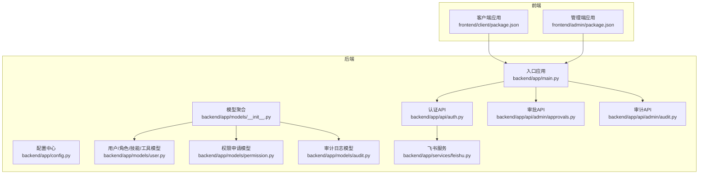
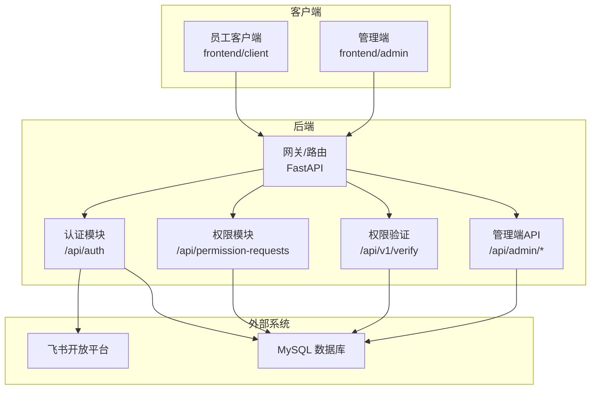
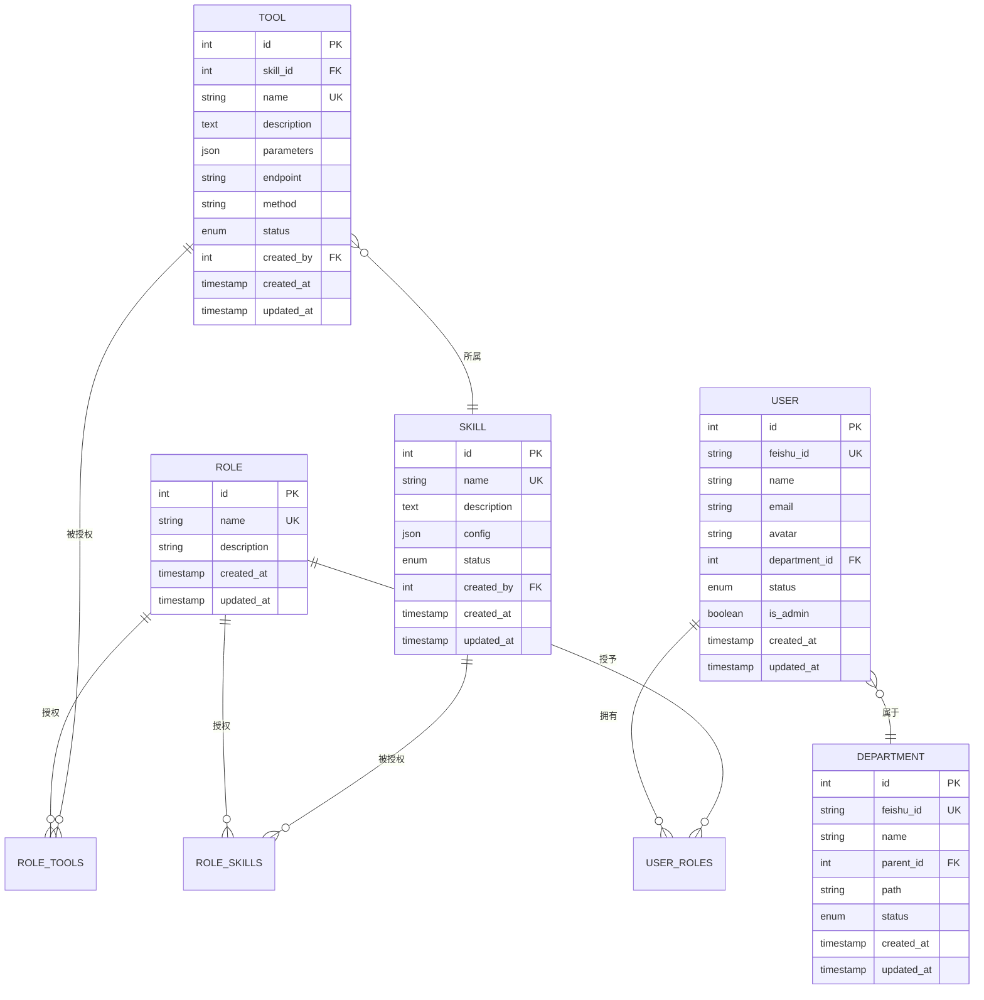
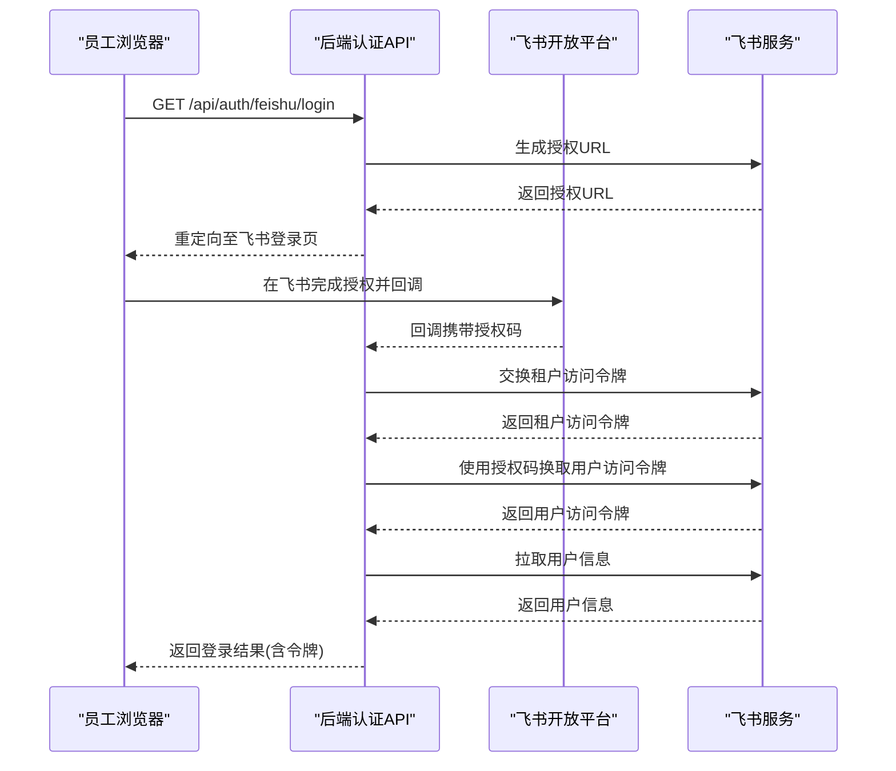
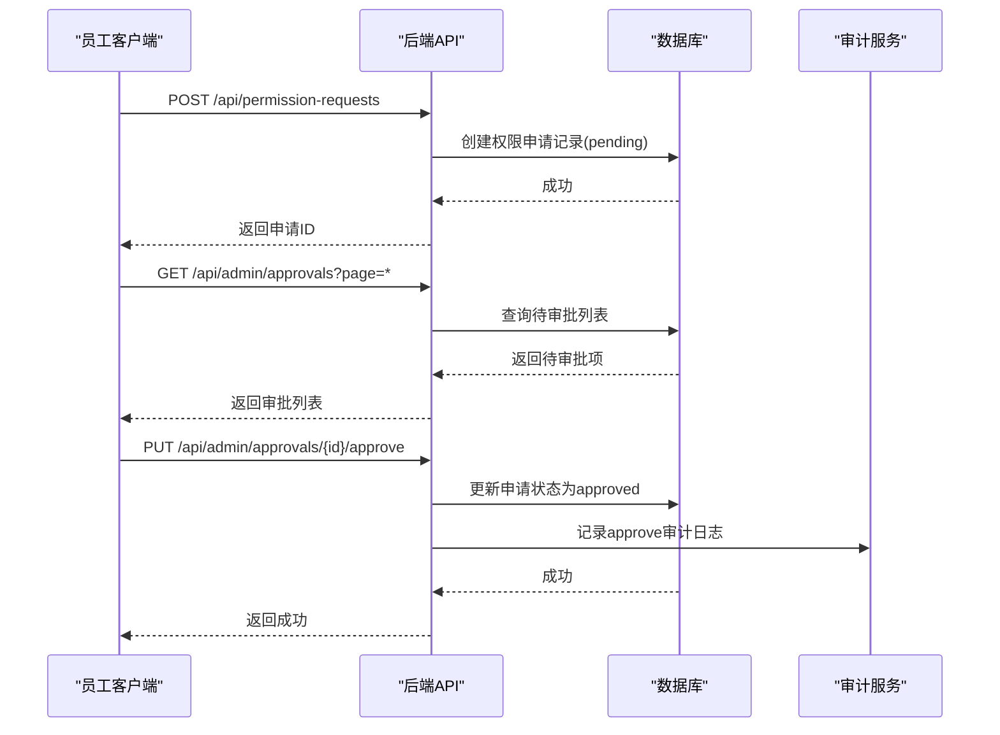
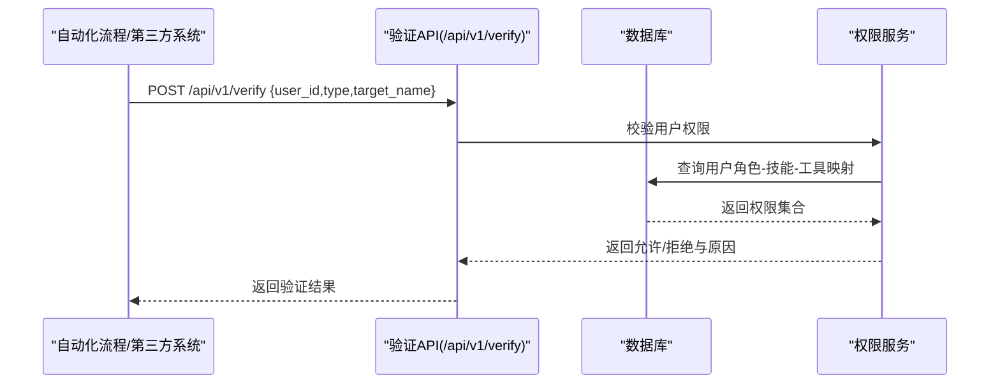
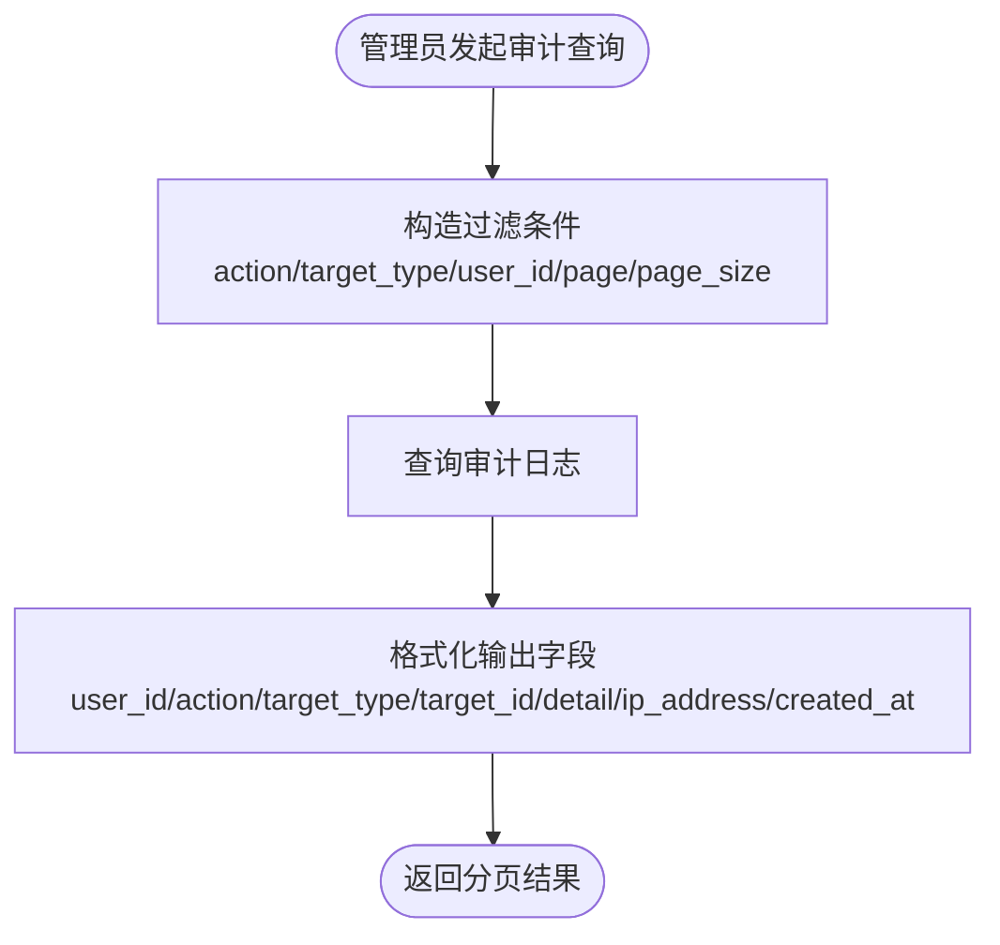
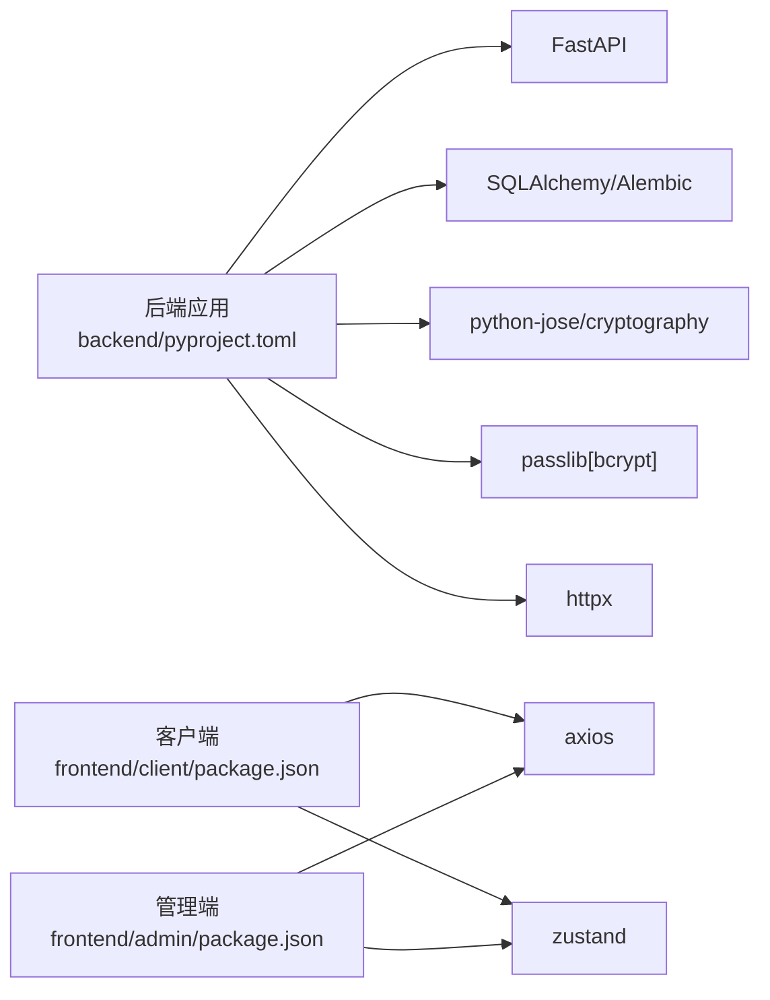

# 系统介绍

<cite>
**本文引用的文件**
- [backend/app/main.py](file://backend/app/main.py)
- [backend/app/config.py](file://backend/app/config.py)
- [backend/pyproject.toml](file://backend/pyproject.toml)
- [backend/app/models/__init__.py](file://backend/app/models/__init__.py)
- [backend/app/models/user.py](file://backend/app/models/user.py)
- [backend/app/models/permission.py](file://backend/app/models/permission.py)
- [backend/app/models/audit.py](file://backend/app/models/audit.py)
- [backend/app/schemas/permission.py](file://backend/app/schemas/permission.py)
- [backend/app/schemas/user.py](file://backend/app/schemas/user.py)
- [backend/app/api/auth.py](file://backend/app/api/auth.py)
- [backend/app/services/feishu.py](file://backend/app/services/feishu.py)
- [backend/app/api/admin/approvals.py](file://backend/app/api/admin/approvals.py)
- [backend/app/api/admin/audit.py](file://backend/app/api/admin/audit.py)
- [frontend/client/package.json](file://frontend/client/package.json)
- [frontend/admin/package.json](file://frontend/admin/package.json)
</cite>

## 目录
1. [引言](#引言)
2. [项目结构](#项目结构)
3. [核心组件](#核心组件)
4. [架构总览](#架构总览)
5. [详细组件分析](#详细组件分析)
6. [依赖分析](#依赖分析)
7. [性能考虑](#性能考虑)
8. [故障排查指南](#故障排查指南)
9. [结论](#结论)
10. [附录](#附录)

## 引言
ToolHub 是一个面向企业的 AI 技能与工具权限管理平台，旨在应对 AI 技术快速发展的挑战，通过精细化的权限控制保障企业内部对 AI 工具的安全使用。系统围绕“角色驱动的访问控制”和“基于飞书的统一身份认证”，构建了从“权限申请—审批—验证—审计”的闭环流程，覆盖不同岗位员工对 AI 工具的差异化访问需求、智能体自动化调用的权限边界，以及多部门协作中的权限协调机制。

在企业数字化转型中，AI 工具的使用涉及数据安全、合规风险与资源治理等多重考量。ToolHub 提供：
- 统一的身份来源与单点登录体验（飞书 OAuth2）
- 基于 RBAC 的细粒度权限模型（角色、技能、工具三层关系）
- 权限申请与审批流程，支持跨部门协同
- 实时权限验证接口，保障自动化调用安全
- 全链路审计日志，满足合规与风控要求

## 项目结构
后端采用 FastAPI 构建，按功能域划分 API 路由与服务层；前端包含两个独立应用：客户端（面向普通员工）与管理端（面向管理员）。数据库模型与 Pydantic 数据模型分别位于 backend/app/models 与 backend/app/schemas，配置集中于 backend/app/config.py。

**图表来源**
- [backend/app/main.py:1-61](file://backend/app/main.py#L1-L61)
- [backend/app/config.py:11-42](file://backend/app/config.py#L11-L42)
- [backend/app/models/__init__.py:1-17](file://backend/app/models/__init__.py#L1-L17)
- [backend/app/models/user.py:1-116](file://backend/app/models/user.py#L1-L116)
- [backend/app/models/permission.py:1-28](file://backend/app/models/permission.py#L1-L28)
- [backend/app/models/audit.py:1-17](file://backend/app/models/audit.py#L1-L17)
- [backend/app/api/auth.py:1-48](file://backend/app/api/auth.py#L1-L48)
- [backend/app/services/feishu.py:1-120](file://backend/app/services/feishu.py#L1-L120)
- [backend/app/api/admin/approvals.py:1-88](file://backend/app/api/admin/approvals.py#L1-L88)
- [backend/app/api/admin/audit.py:1-37](file://backend/app/api/admin/audit.py#L1-L37)
- [frontend/client/package.json:1-29](file://frontend/client/package.json#L1-L29)
- [frontend/admin/package.json:1-29](file://frontend/admin/package.json#L1-L29)

**章节来源**
- [backend/app/main.py:9-48](file://backend/app/main.py#L9-L48)
- [backend/app/config.py:11-42](file://backend/app/config.py#L11-L42)
- [backend/app/models/__init__.py:1-17](file://backend/app/models/__init__.py#L1-L17)
- [frontend/client/package.json:1-29](file://frontend/client/package.json#L1-L29)
- [frontend/admin/package.json:1-29](file://frontend/admin/package.json#L1-L29)

## 核心组件
- 应用入口与路由注册：负责初始化 FastAPI 应用、CORS 配置，并挂载客户端与管理端 API 路由，同时提供健康检查端点。
- 配置中心：集中管理应用名、版本、数据库连接、JWT 密钥算法、飞书 OAuth2 参数、CORS 白名单等。
- 数据模型：以 SQLAlchemy 定义用户、部门、角色、技能、工具、权限申请、审计日志等实体及其关系。
- 认证与会话：提供飞书 OAuth2 登录、回调处理、登出与当前用户查询。
- 飞书服务：封装飞书开放平台 API，用于获取授权 URL、租户访问令牌、用户访问令牌、用户信息及组织架构。
- 管理端 API：审批列表与操作（通过/拒绝）、审计日志查询。
- 前端应用：客户端面向员工自助查看技能与工具、提交权限申请、查看我的申请；管理端面向管理员进行用户/角色/技能/工具/部门/审批/审计管理。

**章节来源**
- [backend/app/main.py:9-48](file://backend/app/main.py#L9-L48)
- [backend/app/config.py:11-42](file://backend/app/config.py#L11-L42)
- [backend/app/models/user.py:7-116](file://backend/app/models/user.py#L7-L116)
- [backend/app/models/permission.py:7-28](file://backend/app/models/permission.py#L7-L28)
- [backend/app/models/audit.py:6-17](file://backend/app/models/audit.py#L6-L17)
- [backend/app/api/auth.py:13-47](file://backend/app/api/auth.py#L13-L47)
- [backend/app/services/feishu.py:6-120](file://backend/app/services/feishu.py#L6-L120)
- [backend/app/api/admin/approvals.py:14-87](file://backend/app/api/admin/approvals.py#L14-L87)
- [backend/app/api/admin/audit.py:12-36](file://backend/app/api/admin/audit.py#L12-L36)

## 架构总览
系统采用前后端分离架构，后端提供 RESTful API，前端通过 Axios 进行请求交互。认证采用飞书 OAuth2，结合 JWT 令牌进行会话管理。权限验证通过独立的 v1 接口对外提供，便于第三方系统或自动化流程调用。

**图表来源**
- [backend/app/main.py:25-42](file://backend/app/main.py#L25-L42)
- [backend/app/api/auth.py:13-47](file://backend/app/api/auth.py#L13-L47)
- [backend/app/api/admin/approvals.py:14-87](file://backend/app/api/admin/approvals.py#L14-L87)
- [backend/app/api/admin/audit.py:12-36](file://backend/app/api/admin/audit.py#L12-L36)
- [backend/app/services/feishu.py:15-69](file://backend/app/services/feishu.py#L15-L69)

## 详细组件分析

### RBAC 权限模型与数据模型
系统采用三层关系：角色（Role）-技能（Skill）-工具（Tool），并通过中间表建立多对多关联，形成可组合的权限矩阵。用户通过角色间接获得技能与工具的访问权，支持跨部门、跨层级的灵活授权。

- 用户与部门：用户属于部门，支持树形组织结构与状态管理。
- 角色与用户：多对多关系，通过中间表 USER_ROLES 关联。
- 角色与技能/工具：多对多关系，通过中间表 ROLE_SKILLS 与 ROLE_TOOLS 关联。
- 技能与工具：一对多关系，工具隶属于技能，便于按能力维度进行权限编排。

**图表来源**
- [backend/app/models/user.py:7-116](file://backend/app/models/user.py#L7-L116)

**章节来源**
- [backend/app/models/user.py:7-116](file://backend/app/models/user.py#L7-L116)

### 飞书 OAuth2 集成与统一认证
系统通过飞书 OAuth2 实现统一身份认证与组织架构同步。流程包括：
- 获取飞书授权 URL
- 处理回调，换取用户访问令牌与用户信息
- 将飞书用户映射到系统用户，建立会话

**图表来源**
- [backend/app/api/auth.py:13-27](file://backend/app/api/auth.py#L13-L27)
- [backend/app/services/feishu.py:15-69](file://backend/app/services/feishu.py#L15-L69)

**章节来源**
- [backend/app/api/auth.py:13-47](file://backend/app/api/auth.py#L13-L47)
- [backend/app/services/feishu.py:6-120](file://backend/app/services/feishu.py#L6-L120)
- [backend/app/config.py:25-30](file://backend/app/config.py#L25-L30)

### 权限申请与审批流程
员工可通过客户端提交“技能/工具”权限申请，管理员在管理端进行审批。系统记录审批状态与操作日志，支持分页查询与条件筛选。

**图表来源**
- [backend/app/api/admin/approvals.py:14-87](file://backend/app/api/admin/approvals.py#L14-L87)
- [backend/app/models/permission.py:7-28](file://backend/app/models/permission.py#L7-L28)
- [backend/app/models/audit.py:6-17](file://backend/app/models/audit.py#L6-L17)

**章节来源**
- [backend/app/api/admin/approvals.py:14-87](file://backend/app/api/admin/approvals.py#L14-L87)
- [backend/app/models/permission.py:7-28](file://backend/app/models/permission.py#L7-L28)
- [backend/app/models/audit.py:6-17](file://backend/app/models/audit.py#L6-L17)

### 权限验证与自动化调用边界
系统提供独立的权限验证接口，第三方系统或自动化流程可调用该接口判断某用户对特定技能或工具是否具备访问权限。验证结果包含允许与否及原因，便于上层系统进行策略决策。

**图表来源**
- [backend/app/schemas/permission.py:35-49](file://backend/app/schemas/permission.py#L35-L49)
- [backend/app/main.py:41-42](file://backend/app/main.py#L41-L42)

**章节来源**
- [backend/app/schemas/permission.py:35-49](file://backend/app/schemas/permission.py#L35-L49)
- [backend/app/main.py:41-42](file://backend/app/main.py#L41-L42)

### 审计日志与合规追踪
系统对关键操作进行审计记录，包括用户增删改、角色/技能/工具变更、权限申请审批、登录等。管理员可按动作类型、目标类型、用户 ID 等条件查询审计日志，满足合规与风控要求。

**图表来源**
- [backend/app/api/admin/audit.py:12-36](file://backend/app/api/admin/audit.py#L12-L36)
- [backend/app/models/audit.py:6-17](file://backend/app/models/audit.py#L6-L17)

**章节来源**
- [backend/app/api/admin/audit.py:12-36](file://backend/app/api/admin/audit.py#L12-L36)
- [backend/app/models/audit.py:6-17](file://backend/app/models/audit.py#L6-L17)

## 依赖分析
- 后端框架与工具：FastAPI、SQLAlchemy、Alembic、Pydantic、Pydantic Settings、HTTPX、Cryptography、Passlib 等。
- 前端框架与工具：React、Ant Design、Axios、Zustand、Day.js 等。
- 部署与运行：Docker Compose、Uvicorn。

**图表来源**
- [backend/pyproject.toml:7-20](file://backend/pyproject.toml#L7-L20)
- [frontend/client/package.json:11-27](file://frontend/client/package.json#L11-L27)
- [frontend/admin/package.json:11-27](file://frontend/admin/package.json#L11-L27)

**章节来源**
- [backend/pyproject.toml:1-31](file://backend/pyproject.toml#L1-L31)
- [frontend/client/package.json:1-29](file://frontend/client/package.json#L1-L29)
- [frontend/admin/package.json:1-29](file://frontend/admin/package.json#L1-L29)

## 性能考虑
- 数据库连接与事务：建议在生产环境使用连接池与读写分离，避免长事务阻塞。
- 缓存策略：对常用权限映射与用户角色缓存，减少频繁查询。
- 分页与索引：审计日志与审批列表需合理分页与建立必要索引，提升查询性能。
- 异步与并发：飞书 API 调用使用异步 HTTP 客户端，注意并发上限与超时设置。
- 前端状态管理：使用轻量状态库（如 Zustand）管理用户会话与权限状态，避免重复渲染。

## 故障排查指南
- 飞书回调失败：检查回调地址、App ID/Secret、租户访问令牌获取是否成功。
- 权限申请状态异常：确认审批流程是否正确更新状态，数据库外键约束是否生效。
- 审计日志缺失：核对审计服务是否正常记录，数据库写入是否成功。
- 健康检查：访问后端健康端点，确认服务可用性与版本信息。

**章节来源**
- [backend/app/api/auth.py:20-27](file://backend/app/api/auth.py#L20-L27)
- [backend/app/services/feishu.py:26-57](file://backend/app/services/feishu.py#L26-L57)
- [backend/app/api/admin/approvals.py:67-71](file://backend/app/api/admin/approvals.py#L67-L71)
- [backend/app/main.py:44-46](file://backend/app/main.py#L44-L46)

## 结论
ToolHub 通过 RBAC 权限模型、飞书 OAuth2 统一认证、完善的审批与审计机制，为企业提供了可落地的 AI 工具权限治理方案。它既满足了不同岗位员工的差异化访问需求，也兼顾了智能体自动化调用的权限边界与多部门协作的权限协调，是企业实现 AI 工具安全、合规、高效使用的基础设施。

## 附录
- 目标用户群体：企业 IT 部门、HR 部门、技术团队、合规与风控人员。
- 适用场景：企业内 AI 工具目录管理、权限申请与审批、自动化调用权限校验、跨部门权限协调与审计追踪。