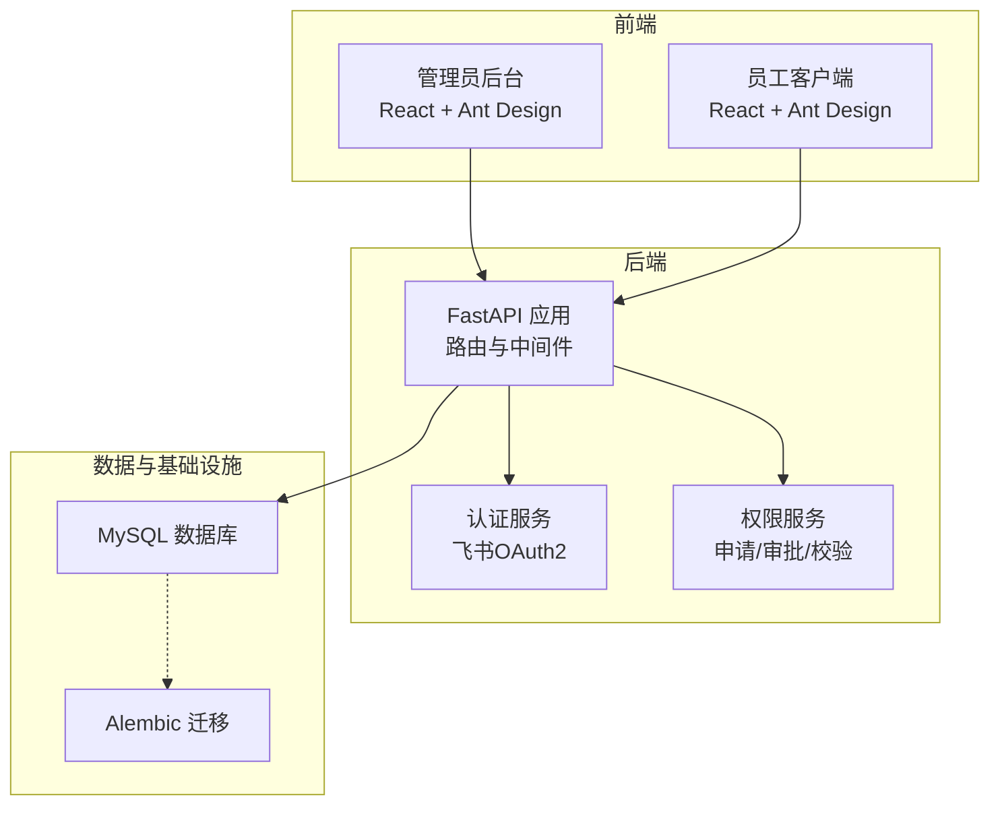
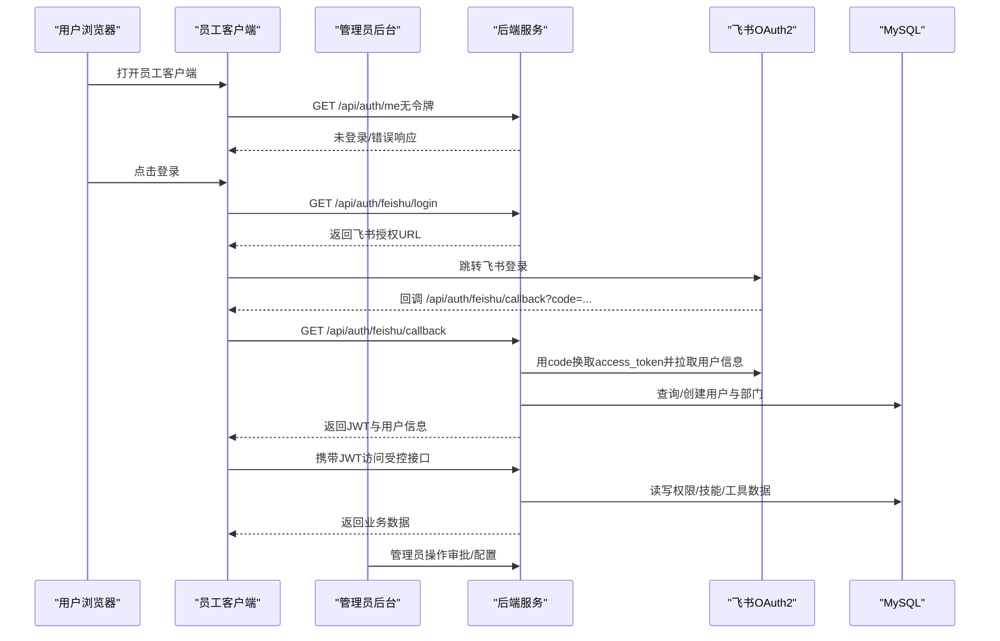
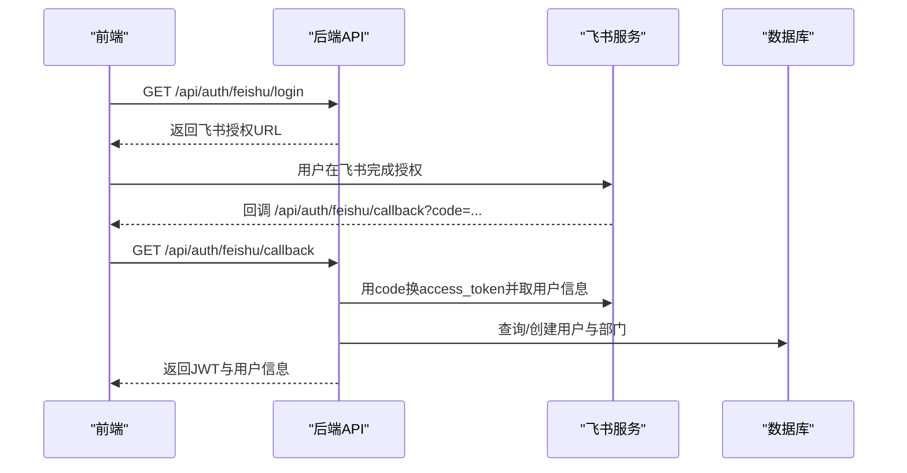
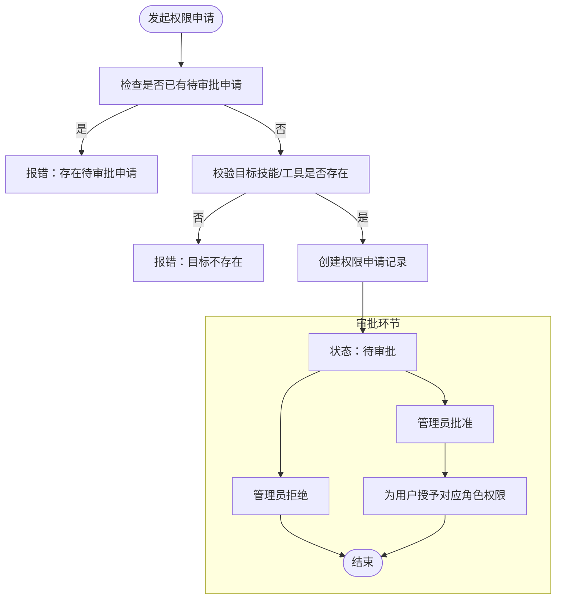
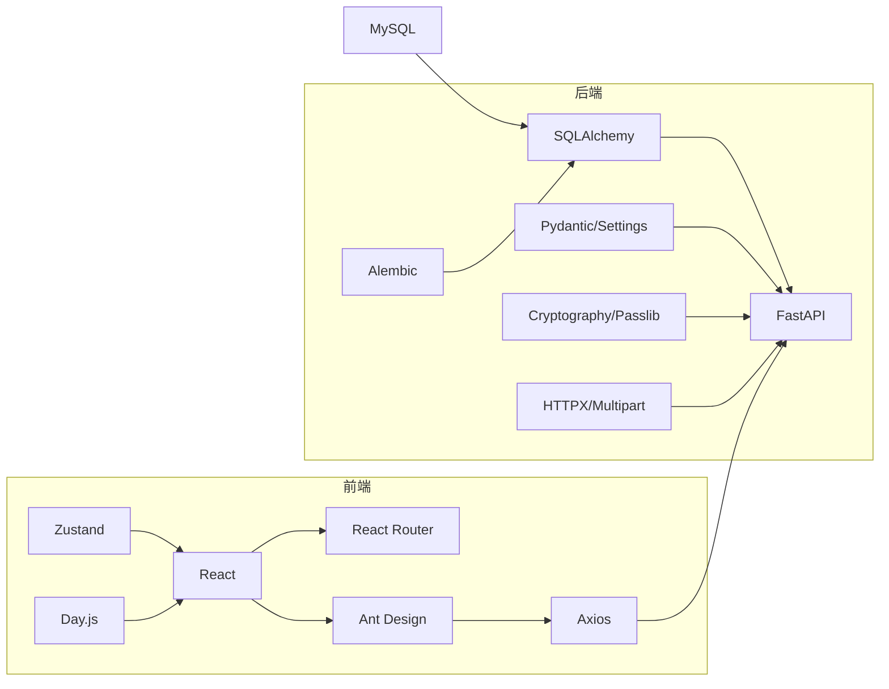
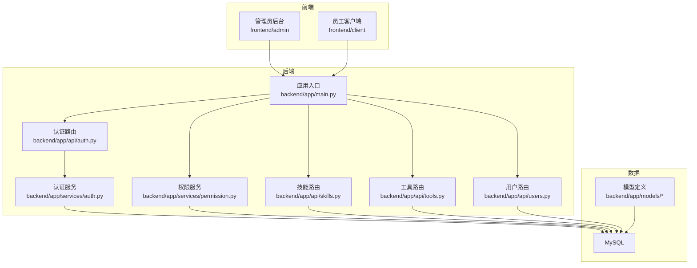

# 项目概述

<cite>
**本文引用的文件**
- [backend/pyproject.toml](file://backend/pyproject.toml)
- [frontend/admin/package.json](file://frontend/admin/package.json)
- [frontend/client/package.json](file://frontend/client/package.json)
- [backend/app/main.py](file://backend/app/main.py)
- [backend/app/config.py](file://backend/app/config.py)
- [backend/app/models/__init__.py](file://backend/app/models/__init__.py)
- [backend/app/models/user.py](file://backend/app/models/user.py)
- [backend/app/models/permission.py](file://backend/app/models/permission.py)
- [backend/app/api/auth.py](file://backend/app/api/auth.py)
- [backend/app/services/auth.py](file://backend/app/services/auth.py)
- [backend/app/api/skills.py](file://backend/app/api/skills.py)
- [backend/app/api/tools.py](file://backend/app/api/tools.py)
- [backend/app/api/users.py](file://backend/app/api/users.py)
- [backend/app/services/permission.py](file://backend/app/services/permission.py)
- [frontend/admin/src/App.tsx](file://frontend/admin/src/App.tsx)
- [frontend/client/src/App.tsx](file://frontend/client/src/App.tsx)
- [docker-compose.yml](file://docker-compose.yml)
- [main.py](file://main.py)
</cite>

## 目录
1. [引言](#引言)
2. [项目结构](#项目结构)
3. [核心组件](#核心组件)
4. [架构总览](#架构总览)
5. [详细组件分析](#详细组件分析)
6. [依赖关系分析](#依赖关系分析)
7. [性能考虑](#性能考虑)
8. [故障排查指南](#故障排查指南)
9. [结论](#结论)
10. [附录](#附录)

## 引言
ToolHub 是面向企业级的 AI 技能与工具权限管理系统，旨在支撑企业在 AI 时代的数字化转型。系统通过 RBAC 权限模型，对“技能”和“工具”进行精细化权限控制，确保不同角色的人员仅能访问其授权范围内的 AI 能力，从而在提升组织协作效率的同时，降低安全风险与误用成本。

本系统强调“前后端分离 + 微服务化”的设计思路：后端采用 FastAPI 提供高性能 API；前端分为“管理员后台”和“员工客户端”，分别满足管理与使用场景；数据库采用 MySQL，并通过 Alembic 管理迁移；系统支持飞书 OAuth2 登录，便于与企业组织体系打通。

## 项目结构
项目采用分层清晰的双端架构：
- 后端（Python/FastAPI）：负责业务逻辑、权限校验、数据持久化与外部系统集成。
- 前端（React/Vite）：分为管理员后台与员工客户端两个独立应用，分别提供管理与自助服务能力。
- 配置与部署：通过 docker-compose 编排数据库、后端服务与两个前端应用，统一网络与环境变量。

图表来源
- [backend/app/main.py:1-61](file://backend/app/main.py#L1-L61)
- [backend/app/api/auth.py:1-48](file://backend/app/api/auth.py#L1-L48)
- [backend/app/services/permission.py:1-182](file://backend/app/services/permission.py#L1-L182)
- [docker-compose.yml:1-84](file://docker-compose.yml#L1-L84)

章节来源
- [backend/app/main.py:1-61](file://backend/app/main.py#L1-L61)
- [frontend/admin/src/App.tsx:1-44](file://frontend/admin/src/App.tsx#L1-L44)
- [frontend/client/src/App.tsx:1-42](file://frontend/client/src/App.tsx#L1-L42)
- [docker-compose.yml:1-84](file://docker-compose.yml#L1-L84)

## 核心组件
- 认证与会话
  - 飞书 OAuth2 授权登录，自动同步用户与部门信息，签发 JWT 令牌。
  - 提供“当前用户信息”查询接口，用于前端侧展示与权限判断。
- 权限管理
  - 支持“技能”和“工具”两类资源的权限申请、审批与校验。
  - 基于角色的权限继承，审批通过后自动为用户授予相应技能或工具访问权。
- 资源管理
  - 技能与工具的增删改查、状态管理与分页查询。
  - 工具具备可配置的参数定义与调用端点，便于统一接入与治理。
- 审计与合规
  - 记录权限申请与审批过程，支持审计日志查询，满足合规要求。

章节来源
- [backend/app/api/auth.py:1-48](file://backend/app/api/auth.py#L1-L48)
- [backend/app/services/auth.py:1-80](file://backend/app/services/auth.py#L1-L80)
- [backend/app/api/skills.py:1-86](file://backend/app/api/skills.py#L1-L86)
- [backend/app/api/tools.py:1-69](file://backend/app/api/tools.py#L1-L69)
- [backend/app/api/users.py:1-29](file://backend/app/api/users.py#L1-L29)
- [backend/app/services/permission.py:1-182](file://backend/app/services/permission.py#L1-L182)

## 架构总览
系统采用“单体后端 + 双前端 + 统一数据库”的架构，后端通过 FastAPI 提供 RESTful API，前端通过 Axios 发起请求并使用状态管理库维护登录态与全局状态。认证流程基于飞书 OAuth2，登录成功后返回 JWT，前端在后续请求中携带该令牌。

图表来源
- [backend/app/api/auth.py:13-48](file://backend/app/api/auth.py#L13-L48)
- [backend/app/services/auth.py:16-76](file://backend/app/services/auth.py#L16-L76)
- [backend/app/main.py:25-42](file://backend/app/main.py#L25-L42)
- [frontend/client/src/App.tsx:13-38](file://frontend/client/src/App.tsx#L13-L38)

## 详细组件分析

### 数据模型与权限关系
系统围绕“用户—角色—技能—工具”构建权限矩阵，支持多对多关系与继承传播，确保权限的可组合性与可审计性。

```mermaid
erDiagram
DEPARTMENTS {
int id PK
string feishu_id UK
string name
int parent_id FK
string path
enum status
timestamp created_at
timestamp updated_at
}
USERS {
int id PK
string feishu_id UK
string name
string email
string avatar
int department_id FK
enum status
boolean is_admin
timestamp created_at
timestamp updated_at
}
ROLES {
int id PK
string name UK
string description
timestamp created_at
timestamp updated_at
}
USER_ROLES {
int id PK
int user_id FK
int role_id FK
timestamp created_at
}
SKILLS {
int id PK
string name UK
text description
json config
enum status
int created_by FK
timestamp created_at
timestamp updated_at
}
ROLE_SKILLS {
int id PK
int role_id FK
int skill_id FK
timestamp created_at
}
TOOLS {
int id PK
int skill_id FK
string name UK
text description
json parameters
string endpoint
string method
enum status
int created_by FK
timestamp created_at
timestamp updated_at
}
ROLE_TOOLS {
int id PK
int role_id FK
int tool_id FK
timestamp created_at
}
PERMISSION_REQUESTS {
int id PK
int user_id FK
enum type
int target_id
text reason
enum status
int reviewed_by FK
text review_comment
timestamp reviewed_at
timestamp created_at
timestamp updated_at
}
AUDIT_LOGS {
int id PK
int operator_id FK
string action
json details
timestamp created_at
}
USERS ||--o{ USER_ROLES : "拥有"
ROLES ||--o{ USER_ROLES : "授予"
ROLES ||--o{ ROLE_SKILLS : "包含"
SKILLS ||--o{ ROLE_SKILLS : "被角色关联"
SKILLS ||--o{ TOOLS : "包含"
ROLES ||--o{ ROLE_TOOLS : "授予"
TOOLS ||--o{ ROLE_TOOLS : "被角色关联"
USERS ||--o{ PERMISSION_REQUESTS : "提交"
ROLES ||--o{ PERMISSION_REQUESTS : "审批"
```

图表来源
- [backend/app/models/user.py:7-116](file://backend/app/models/user.py#L7-L116)
- [backend/app/models/permission.py:7-28](file://backend/app/models/permission.py#L7-L28)
- [backend/app/models/__init__.py:1-17](file://backend/app/models/__init__.py#L1-L17)

章节来源
- [backend/app/models/user.py:7-116](file://backend/app/models/user.py#L7-L116)
- [backend/app/models/permission.py:7-28](file://backend/app/models/permission.py#L7-L28)
- [backend/app/models/__init__.py:1-17](file://backend/app/models/__init__.py#L1-L17)

### 认证与会话流程
- 飞书登录：后端生成授权 URL，前端引导用户跳转；回调时用 code 换取 access_token 并拉取用户信息，随后在本地数据库中查找或创建用户记录，最后签发 JWT 返回给前端。
- 会话保持：前端在后续请求中携带 JWT，后端通过中间件解析并注入当前用户对象。

图表来源
- [backend/app/api/auth.py:13-27](file://backend/app/api/auth.py#L13-L27)
- [backend/app/services/auth.py:16-76](file://backend/app/services/auth.py#L16-L76)

章节来源
- [backend/app/api/auth.py:13-48](file://backend/app/api/auth.py#L13-L48)
- [backend/app/services/auth.py:16-76](file://backend/app/services/auth.py#L16-L76)

### 权限申请与审批流程
- 申请：用户提交“技能/工具”权限申请，系统检查重复与目标有效性。
- 审批：管理员查看待审批列表，批准后为用户授予相应角色权限；拒绝则记录原因。
- 校验：外部系统可通过专用接口校验用户对某技能/工具的访问权限。

图表来源
- [backend/app/services/permission.py:12-144](file://backend/app/services/permission.py#L12-L144)

章节来源
- [backend/app/services/permission.py:12-144](file://backend/app/services/permission.py#L12-L144)

### 技术栈与选型说明
- 后端框架：FastAPI
  - 优点：自动生成 OpenAPI 文档、类型安全、异步支持、高性能。
  - 适用性：适合构建高并发、强类型约束的企业级 API。
- 数据库与 ORM：SQLAlchemy + Alembic
  - 优点：成熟的 ORM 生态、迁移管理完善、与 Python 类型系统契合。
- 数据库：MySQL
  - 优点：稳定可靠、生态成熟、易于运维与扩展。
- 前端：React + Vite
  - 优点：组件化开发、热更新、TypeScript 支持良好。
- UI 框架：Ant Design
  - 优点：企业级设计语言、组件丰富、国际化支持好。
- 认证：JWT + 飞书 OAuth2
  - 优点：无状态、跨域友好、与企业组织系统对接便捷。
- 部署：Docker Compose
  - 优点：一键编排、环境隔离、便于 CI/CD 与弹性扩展。

章节来源
- [backend/pyproject.toml:7-20](file://backend/pyproject.toml#L7-L20)
- [frontend/admin/package.json:11-27](file://frontend/admin/package.json#L11-L27)
- [frontend/client/package.json:11-27](file://frontend/client/package.json#L11-L27)
- [docker-compose.yml:1-84](file://docker-compose.yml#L1-L84)

## 依赖关系分析
- 后端依赖
  - FastAPI、SQLAlchemy、Pydantic、Pydantic Settings、HTTPX、Cryptography、Passlib 等，构成高性能、类型安全、安全可靠的后端基础。
- 前端依赖
  - React、React Router、Ant Design、Axios、Zustand、Day.js 等，提供现代化的交互体验与状态管理。
- 运行时依赖
  - MySQL 作为主存储；JWT 用于会话；飞书开放平台用于身份源集成。

图表来源
- [backend/pyproject.toml:7-20](file://backend/pyproject.toml#L7-L20)
- [frontend/admin/package.json:11-27](file://frontend/admin/package.json#L11-L27)
- [frontend/client/package.json:11-27](file://frontend/client/package.json#L11-L27)

章节来源
- [backend/pyproject.toml:7-20](file://backend/pyproject.toml#L7-L20)
- [frontend/admin/package.json:11-27](file://frontend/admin/package.json#L11-L27)
- [frontend/client/package.json:11-27](file://frontend/client/package.json#L11-L27)

## 性能考虑
- API 层
  - 使用分页查询与条件过滤，避免一次性加载大量数据。
  - 对常用字段建立索引（如用户与部门的唯一标识），减少查询耗时。
- 数据层
  - 合理使用关系查询与预加载，避免 N+1 查询问题。
  - 对频繁变更的表启用合适的事务隔离级别，保证一致性与并发性能。
- 前端层
  - 使用状态管理库缓存用户权限与常用数据，减少重复请求。
  - 图标与组件按需加载，优化首屏渲染。
- 运维层
  - 通过容器编排实现水平扩展与弹性伸缩，结合健康检查保障可用性。

## 故障排查指南
- 登录失败
  - 检查飞书回调地址与应用配置是否一致；确认后端环境变量中飞书 App ID/Secret 是否正确；查看后端日志中 OAuth2 流程的异常信息。
- 权限未生效
  - 确认审批流程已完成且用户已获得对应角色；检查角色与技能/工具的关联是否正确；使用权限校验接口验证当前用户对目标资源的访问能力。
- 数据不一致
  - 使用 Alembic 检查迁移是否执行成功；核对数据库中用户、角色、技能、工具的状态与关系。
- 前端无法访问
  - 检查 CORS 配置与后端允许的来源列表；确认前端代理或反向代理未拦截请求；验证 JWT 是否过期。

章节来源
- [backend/app/config.py:19-30](file://backend/app/config.py#L19-L30)
- [backend/app/services/permission.py:147-164](file://backend/app/services/permission.py#L147-L164)

## 结论
ToolHub 通过 RBAC 权限模型与前后端分离架构，为企业提供了可控、可观测、可扩展的 AI 技能与工具治理体系。依托飞书 OAuth2 与 JWT 会话机制，系统实现了与企业组织的无缝衔接；借助 FastAPI 的高性能与 React 的现代化前端体验，兼顾了开发效率与用户体验。未来可在权限自动化推荐、策略即代码、审计可视化等方面持续演进。

## 附录

### 系统架构图（映射实际文件）

图表来源
- [backend/app/main.py:9-48](file://backend/app/main.py#L9-L48)
- [backend/app/api/auth.py:1-48](file://backend/app/api/auth.py#L1-L48)
- [backend/app/services/auth.py:1-80](file://backend/app/services/auth.py#L1-L80)
- [backend/app/services/permission.py:1-182](file://backend/app/services/permission.py#L1-L182)
- [backend/app/api/skills.py:1-86](file://backend/app/api/skills.py#L1-L86)
- [backend/app/api/tools.py:1-69](file://backend/app/api/tools.py#L1-L69)
- [backend/app/api/users.py:1-29](file://backend/app/api/users.py#L1-L29)
- [backend/app/models/__init__.py:1-17](file://backend/app/models/__init__.py#L1-L17)

### 技术栈对比（与主流方案的取舍）
- 与 Spring Boot/Java 生态对比
  - 快速开发与类型安全：Python/FastAPI 在 API 开发上更简洁，类型注解与 Pydantic 提供强约束。
  - 异步与并发：Python 异步生态在 I/O 密集场景表现优异，适合高并发 API。
- 与 Django 对比
  - 更轻量的 Web 框架：FastAPI 专注于 API，无需模板引擎与 CSRF 中间件，部署更灵活。
- 与传统 PHP/Node.js 对比
  - 类型系统与运行时性能：Python 的类型系统与成熟的 ORM 生态更适合企业级长期维护。
- 与 Vue/Next.js 对比
  - React 生态与 TypeScript 支持更好，适合大型前端团队协作与复杂状态管理。

章节来源
- [backend/pyproject.toml:7-20](file://backend/pyproject.toml#L7-L20)
- [frontend/admin/package.json:11-27](file://frontend/admin/package.json#L11-L27)
- [frontend/client/package.json:11-27](file://frontend/client/package.json#L11-L27)